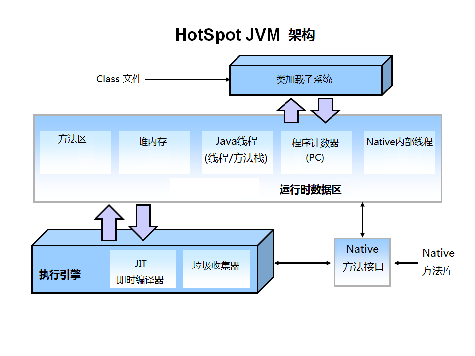

#### 一、JVM运行时数据区【人们常说的JVM内存，内存管理机制（分配/回收）】： 

##### 1.程序计数器：
###### 注意：程序计数器是唯一一个不会出现OutOfMemoryError的内存区域，它的生命周期随着线程的创建而创建，随着线程的结束而死亡。
在汇编语言中，也称为CPU的寄存器。它保存的是程序当前执行的指令的地址，当CPU需要执行指令时，需要从程序计数器中得到当前需要执行的指令所在存储单元的地址，然后根据得到的地址获取到指令，在得到指令之后，程序计数器便自动加1或者根据转移指针得到下一条指令的地址，如此循环，直至执行完所有的指令。

多线程并发执行时，一个时间点一个CPU的内核只会执行一条线程中的指令，为了能够使得每个线程都在线程切换后能够恢复在切换之前的程序执行位置，每个线程都需要有自己独立的程序计数器，并且不能互相被干扰，否则就会影响到程序的正常执行次序。所以说，程序计数器是每个线程私有的。

#####  2.栈：
 栈是Java方法执行的内存模型。Java栈中存放的是一个个的栈帧，每个栈帧对应一个被调用的方法，包括局部变量表、基本数据类型的值。当线程执行一个方法时，当前执行的方法所对应的栈帧必定位于Java栈的顶部，然后出栈，这导致递归方法的时候容易导致栈内存溢出的现象。 
由于每个线程正在执行的方法可能不同，因此每个线程都会有一个自己的Java栈，互不干扰。 

##### 3.本地方法栈：
本地方法栈与Java栈的作用和原理非常相似。区别只不过是Java栈是为执行Java方法服务的，而本地方法栈则是为执行本地方法（Native Method）服务的。 
在JVM规范中，并没有对本地方发展的具体实现方法以及数据结构作强制规定 

##### 4.堆：
Java中的堆是用来存储对象特有属性以及数组（当然，数组引用是存放在Java栈中的）。只不过和C语言中的不同，在Java中，程序员基本不用去关心空间释放的问题，Java的垃圾回收机制会自动进行处理。因此这部分空间也是Java垃圾收集器管理的主要区域。 
另外，堆是被所有线程共享的，在JVM中只有一个堆。

##### 5.方法区：
方法区在JVM中也是一个非常重要的区域，它与堆一样，是被线程共享的区域。在方法区中，存储了每个类的信息（包括类的名称、方法信息、字段信息）、静态变量、常量以及编译器编译后的代码等。在JVM规范中，没有强制要求方法区必须实现垃圾回收。
很多人习惯将方法区称为“永久代”，是因为HotSpot虚拟机以永久代来实现方法区，从而JVM的垃圾收集器可以像管理堆区一样管理这部分区域，从而不需要专门为这部分设计垃圾回收机制。不过自从JDK7之后，Hotspot虚拟机便将运行时常量池从永久代移除了。

---

#### 二、GC：

堆内存：JVM垃圾回收器管理的主要区域，此内存区域的唯一目的就是存放对象实例，几乎所有的对象实例以及数组都在这里分配内存。一般采用分代垃圾收集算法，年轻代和年老代属于堆内存（可通过配置JVM参数调优）。

- 年轻代细分为Eden,Survivor1和Survivor2。Eden存储刚创建的对象，当Eden内存满时触发Minor GC，只清除Eden区域，没有被回收的对象会在S1和S2之间来回copy，达到一定次数后进入年老代（Old Gen）
- 年老代满时触发Full GC，同时清除年轻代和年老代。

###### 注意：永久代（Perm）在JDK8之前使用的是堆内存空间，不属于堆内存，有虚拟机直接分配，但可以通过-XX:PermSize -XX:MaxPermSize 等参数调整其大小。

---

#### 三、JVM的内存模型扩展：
> 主内存主要包括方法区和堆。
> 
> 每个线程都有一个工作内存，包括两个部分，一个是属于该线程私有的栈和对主存部分变量拷贝的寄存器(包括程序计数器PC和cup工作的高速缓存区)。

1.所有的变量都存储在主内存中，对于所有线程都是共享的。

2.每条线程都有自己的工作内存，工作内存中保存的是主存中某些变量的拷贝，线程对变量的所有操作都必须在工作内存中进行，完成操作以后才会同步给主内存

3.线程之间无法直接访问对方的工作内存中的变量，线程间变量的传递均需要通过主内存来完成。

###### 注意：至于i++是否线程安全，肯定不是安全的。线程对变量的操作都在各自的栈内存中进行，首先是不可见的。即使用volatil将变量可见，所有线程直接从主内存中读写，也会引起并发问题，所以还得对i++代码块加同步方法锁

---

#### 四、场景问题
假如线上经常出现卡死，无响应，这种情况往往是是stop-the-world。原因可能是GC时间过长，GC次数频繁，也可能出现了死锁。使用JVM自带的工具jstack或者jConsle检查线程和内存信息，定位问题，一般都需要在远程服务系统的启动参数增加JMX监控配置。对相应代码进行优化（如使用线程池，设置更大连接池，解决死锁），或者JVM启动参数调优

##### *JVM参数调优*
举例几个调优的方案

1.针对JVM堆的设置，一般可以通过-Xms -Xmx限定其最小、最大值，为了防止垃圾收集器在最小、最大之间收缩堆而产生额外的时间，我们通常把最大、最小设置为相同的值

2.年轻代和年老代将根据默认的比例（1：2）分配堆内存

3.在配置较好的机器上（比如多核、大内存），可以为年老代选择并行收集算法： -XX:+UseParallelOldGC ，默认为Serial收集

4.线程堆栈的设置：每个线程默认会开启1M的堆栈，用于存放栈帧、调用参数、局部变量等，对大多数应用而言这个默认值太了，一般256K就足用。理论上，在内存不变的情况下，减少每个线程的堆栈，可以产生更多的线程，但这实际上还受限于操作系统。

---

#### 五、volatile
##### 两大特性：

1. 保证变量在线程之间的可见性。可见性的保证是基于CPU的内存屏障指令，被JSR-133抽象为happens-before原则。
1. 阻止编译时和运行时的指令重排。编译时JVM编译器遵循内存屏障的约束，运行时依靠CPU屏障指令来阻止重排。

##### 指令重排
    指令重排是指JVM在编译Java代码的时候，或者CPU在执行JVM字节码的时候，对现有的指令顺序
    进行重新排序。
    
    指令重排的目的是为了在不改变程序执行结果的前提下，优化程序的运行效率。需要注意的是，
    这里所说的不改变执行结果，指的是不改变单线程下的程序执行结果。