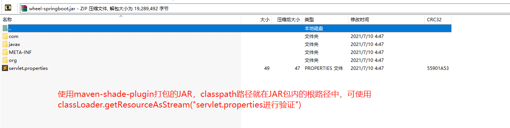
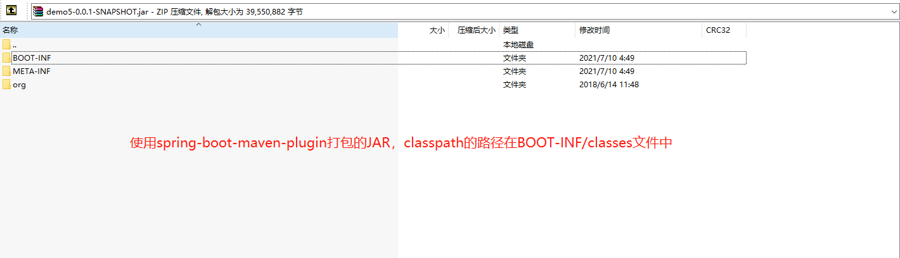

以下为个人见解

**使用IDEA工具进行本地编译时**

`classpath`的路径取决于项目的构建工具，是`gradle`还是`maven`。

- `gradle`得到的classpath路径为`/build/classes`
- `maven`得到的classpath路径为`/target/classes`

**当项目集成为一个文件包时，如JAR、WAR文件**

`classpath`的路径取决于打包的插件

- `maven-shade-plugin`得到的classpath即为JAR包里的根路径，可通过classLoader.getResource进行验证

- `spring-boot-maven-plugin`得到的classpath在JAR包的BOOT-INF/classes中，可通过classLoader.getResource进行验证

