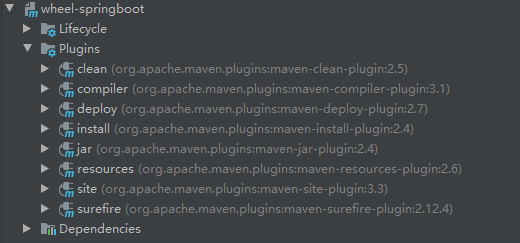
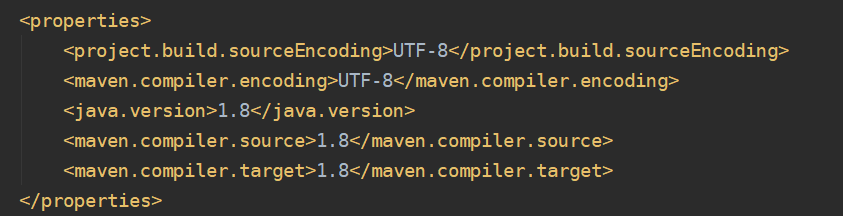
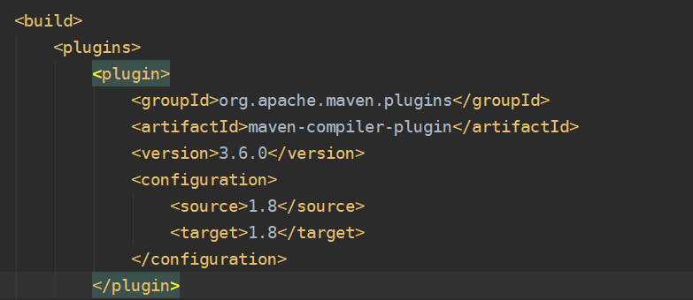

[toc]

## 一、Maven构建时的生命周期

maven默认的生命周期包括以下阶段（有关生命周期阶段的完整列表，请参阅[生命周期参考](https://maven.apache.org/guides/introduction/introduction-to-the-lifecycle.html#Lifecycle_Reference)）：

- `validate`  -  验证项目是否正确并且所有必要的信息都可用
- `compile `   -  编译项目的源代码
- `test`   - 使用合适的单元测试框架测试编译的源代码。这些测试不应该要求打包或部署代码
- `package` - 将编译后的代码打包成可分发的格式，例如 JAR。
- `verify`  -  对集成测试的结果进行任何检查，以确保满足质量标准
- `install`  -  将包安装到本地仓库中，作为本地其他项目的依赖项
- `deploy`  -  在构建环境中完成，将最终包复制到远程仓库以与其他开发人员和项目共享。

默认的生命周期按顺序执行以上所有阶段。首先验证项目，然后编译源代码，测试运行这些源代码，打包二进制文件（例如 jar），针对该项目运行集成测试包，验证集成测试，将经过验证的包安装到本地存储库，然后将安装的包部署到远程仓库。

## 二、Maven插件

[详情查看官网文档](https://maven.apache.org/plugins/index.html#)

Maven 本质上是一个插件执行框架，所有的工作都是由插件完成的。maven插件分为构建和报告插件：

- **Build plugins（构建插件）**在构建期间执行，配置在POM文件的`<build/>`标签中
- **Reporting plugins（报告插件）**将在站点生成期间执行，配置在POM文件的`<reporting/>`标签中。因为报告插件的结果是生成站点的一部分，所以报告插件应该国际化和本地化。详情查看官网[插件本地化](https://maven.apache.org/plugins/localization.html)

### 1.Maven默认的核心插件



如图所示这些插件无需配置，为maven默认核心插件。若需要对相关属性进行修改可在<properties>标签中修改，也可在<build><plugins>中进行覆盖。





### 2.常用的打包插件

**制定打包文件的名称**

在<build>标签中使用finalName制定 JAR文件名称

```xml
<build>
      <finalName>p-test-tool</finalName>
</build>
```

**maven-shade-plugin**

将Java项目以及项目依赖的第三方包打包到一个 JAR文件

`mainClass` -指定程序入口main方法所在的类

`AppendingTransformer` - 聚合多个项目中，用于合并全路径相同的文件

```xml
<plugin>
    <groupId>org.apache.maven.plugins</groupId>
    <artifactId>maven-shade-plugin</artifactId>
    <version>1.4</version>
    <executions>
        <execution>
            <phase>package</phase>
            <goals>
                <goal>shade</goal>
            </goals>
            <configuration>
                <filters>
                    <filter>
                        <artifact>*:*</artifact>
                        <excludes>
                            <exclude>META-INF/*.SF</exclude>
                            <exclude>META-INF/*.DSA</exclude>
                            <exclude>META-INF/*.RSA</exclude>
                        </excludes>
                    </filter>
                </filters>
                <transformers>
                    <transformer implementation="org.apache.maven.plugins.shade.resource.ManifestResourceTransformer">
                        <!-- 程序入口main方法所在的类 -->
                        <mainClass>com.tangdi.MyApplication</mainClass>
                    </transformer>
                    <!-- 合并META-INF/spring.handlers -->
                    <transformer implementation="org.apache.maven.plugins.shade.resource.AppendingTransformer">
                        <resource>META-INF/spring.handlers</resource>
                    </transformer>
                    <!-- 合并META-INF/spring.schemas -->
                    <transformer implementation="org.apache.maven.plugins.shade.resource.AppendingTransformer">
                        <resource>META-INF/spring.schemas</resource>
                    </transformer>
                </transformers>
            </configuration>
        </execution>
    </executions>
</plugin>
```

**maven-war-plugin**

```xml
<build>
    <plugins>
        <plugin>
            <groupId>org.springframework.boot</groupId>
            <artifactId>spring-boot-maven-plugin</artifactId>
        </plugin>
        <plugin>
            <groupId>org.apache.maven.plugins</groupId>
            <artifactId>maven-war-plugin</artifactId>
            <configuration>
                <warSourceExcludes>src/main/resources/**</warSourceExcludes>
                <warName>LoginProject</warName>
            </configuration>
        </plugin>
    </plugins>
</build>
```


### 3.项目编译插件

目前默认`source`设置为`1.6`，默认`target`设置为`1.6`，与运行 Maven 的 JDK 无关

```xml
<plugin>
    <groupId>org.apache.maven.plugins</groupId>
    <artifactId>maven-compiler-plugin</artifactId>
    <version>3.6.0</version>
    <configuration>
        <source>1.8</source>
        <target>1.8</target>
    </configuration>
</plugin>
```

### 4.web服务插件

可用于远程部署Java Web项目

```xml
<plugin>
    <groupId>org.apache.tomcat.maven</groupId>
    <artifactId>tomcat7-maven-plugin</artifactId>
    <version>2.2</version>
    <configuration>
        <port>8080</port>
        <path>/</path>
        <url>http://59.110.162.178:8080/manager/text</url>
        <username>linjinbin</username>
        <password>linjinbin</password>
    </configuration>
</plugin>
```

