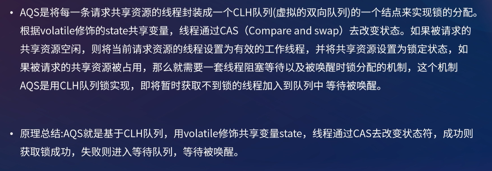
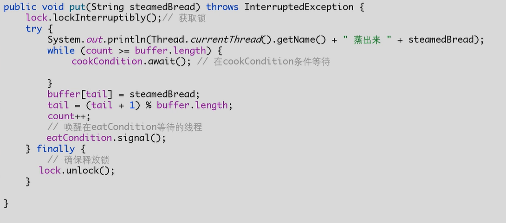
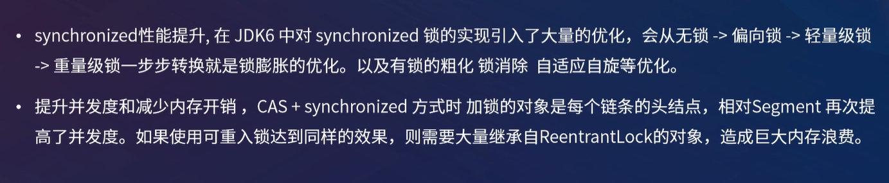

[toc]

## 1. AQS（AbstractQueuedSynchronizer）

**AQS抽象队列同步器**，是**JUC包中的规范锁机制的抽象类**，维护了一个**共享资源 state 和一个 FIFO 的CLH等待队列**，底层利用了 **CAS 机制来保证操作的原子性**

#### 原理

- state为volatile修饰，保证可见性
- 当state为0时，表示未被锁定

#### 实现AQS的类

#### 如何使用AQS自定义锁

#### ReentrantLock原理

默认为非公平锁

#### CountDownLatch原理

#### ConditionObject原理

当调用**Condition.await**的时候，将**当前线程封装到Node中，放到条件队列（单向链表）**，并且**线程状态设置为Condition.waitStatus**。通过signal唤醒的时候，就将**条件队列中的一个头部节点转到CLH等待队列中**

我们可以创建多个Condition，按照不同的Condition将不同条件的线程进行阻塞和唤醒。

## 2. 阻塞队列-BLQ

常见实现类为**FIFO（ArrayBlockingQueue、LinkedBlockingQueue）** 和 **优先级出队PriorityBlockingQueue**

常用方法如下，**比Queue接口多了阻塞的方法**

- **put：若队列满，则阻塞直到队列有空位可存，然后存（存）**
- offer：如果队列可以容纳，则返回true，否则返回false（存）

- **take：若队列空，则阻塞直到队列有数据，然后取（取）**
- pool：若队列空，则返回null（取）

#### ArrayBlockingQueue

- 1个**数组**对象 + **1个reentrantLock锁** + **2个Condition条件**
  - **入队和出队使用同一把锁**，所以入队和出队无法被并发执行
  - 使用**两个Condition，防止读写线程互相唤醒**
- 数组必须指定大小，**无法扩容**
- 由于出队和入队由同一个锁控制，所以**count队列元素个数可以使用 int 非原子类型**

#### LinkedBlockingQueue 

- **单向链表** + **2个ReentrantLock锁** + **2个Condition条件**
  - **提供了并发度，入队和出队各由1把锁控制**，所以可以并发进行入队和出队
  - 两个Condition，防止读写线程互相唤醒
- 该单链表最大容量可以是Int最大值
- **count为队列的元素个数，使用AtomicInteger原子类型**，由于**出队和入队由不同锁控制**，**所以count必须保证原子性**

#### PriorityBlockingQueue

- 与ArrayBlockingQueue类似，区别在于使用数组**实现一个最小堆，堆顶优先出队**
- 没有notfull条件，即**队列满不会阻塞，而是扩容**

#### 自定义阻塞队列

##### 1. 使用synchronized、wait、和notifyAll实现

##### 2. 使用ReetrantLock（AQS-CLH同步队列）实现，这也是ArrayBlockingQueue的实现方式

## 3. ConcurrentHashMap

##### 实现原理

**JDK 7**

**JDK 8** 

##### JDK7 和 JDK8 的ConcurrentHashMap的区别

##### get方法需要加锁吗？为什么?

不需要，因为Entry节点和Value变量都是被volatile修饰的，保证了变量可见性，修改后能被立即可见

##### 不支持key或value为null的原因？

key不能为null仅仅可能是作者不喜欢key为null

value不能为null，是因为一旦 `get(key) == null` 时，在多线程的环境下很难确定是key为null 还是 value为null

##### 迭代器是强一致性还是弱一致性？

弱一致性，未遍历到的地方若被修改，迭代器遍历出来则也会更改。而HashMap的迭代器的数据是在迭代器生成那一刻的数据，当同时有线程修改数据，则遍历出来的还是就数据。

