[toc]

## 1. AQS（AbstractQueuedSynchronizer）

**AQS抽象队列同步器**，是**JUC包中的规范锁机制的抽象类**，维护了一个**共享资源 state 和一个 FIFO 的CLH等待队列**，底层利用了 **CAS 机制来保证共享变量操作的原子性**

#### 原理


```java
public abstract class AbstractQueuedSynchronizer extends AbstractOwnableSynchronizer implements java.io.Serializable {
    
    // 以下为双向链表的首尾结点，代表入口等待队列
    private transient volatile Node head;
    private transient volatile Node tail;
    
    // 共享变量 state
    private volatile int state;
    
    
    
    // cas 获取 / 释放 state，保证线程安全地获取锁
    protected final boolean compareAndSetState(int expect, int update) {
        // See below for intrinsics setup to support this
        return unsafe.compareAndSwapInt(this,stateOffset, expect, update);
    }
    // ...
}
```

- state为volatile修饰，保证可见性
- 当state为0时，表示未被锁定


#### 基于AQS的类

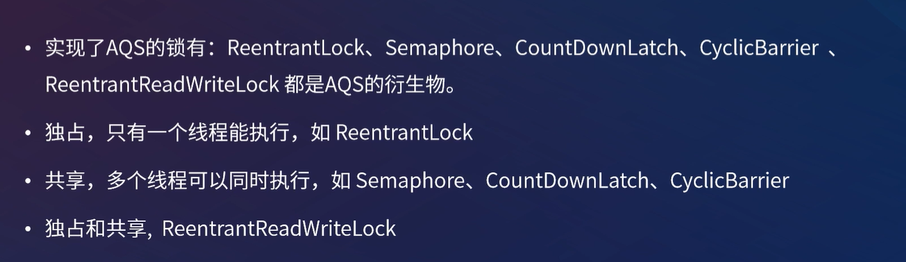

#### 如何使用AQS自定义锁

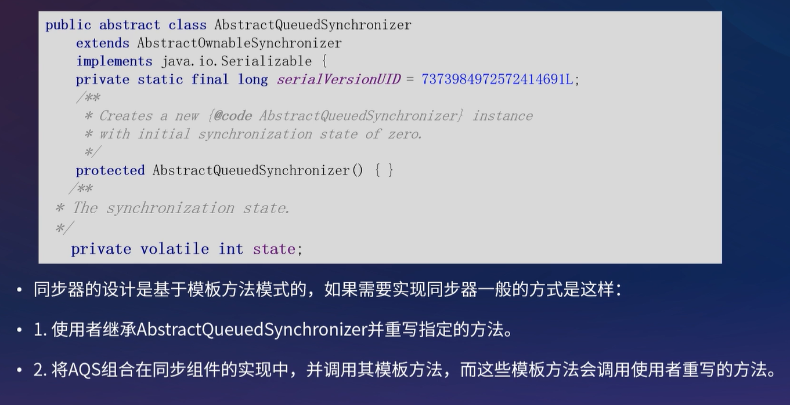

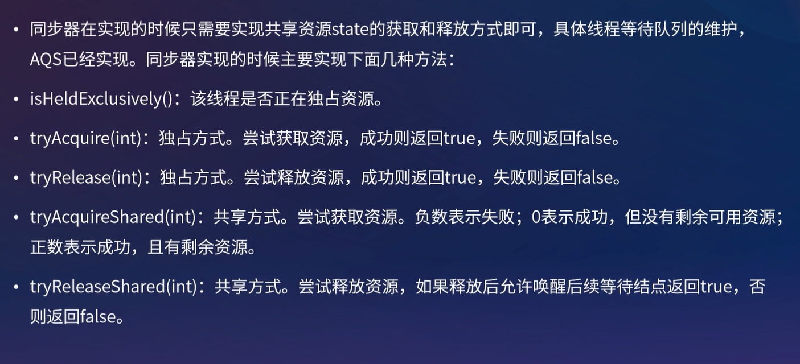


#### ReentrantLock原理


默认为非公平锁

#### CountDownLatch原理


#### ConditionObject原理

原理与对象锁的wait()和notify()类似

- wait()方法将当前线程放入Monitor的WaitSet集合中（线程状态进入waiting）
- notify()方法唤醒WaitSet集合中的头结点，并放入EntryList集合中等待锁（线程状态进入blocking）


当调用**Condition.await**的时候，将**当前线程封装到Node中，放到条件队列（单向链表）**，并且**线程状态进入Condition（条件阻塞）状态**。通过signal唤醒的时候，就将**条件队列中的first结点转移到CLH同步队列（同步队列）队尾**

我们可以创建多个Condition，按照不同的Condition将不同条件的线程进行阻塞和唤醒。


## 2. 并发容器

Java 并发包有很大一部分内容都是关于**并发容器**的，在JAVA1.5之前提供的**同步容器**虽也能保证线程安全，但是性能很差，这些同步容器包括：**Vector**、**Stack**、**Hashtable**以及被**Collections包装**的ArrayList、HashSet 和 HashMap。

在1.5之后出现的**并发容器**在性能方面做了很多优化，所包含的并发容器如下图所示：

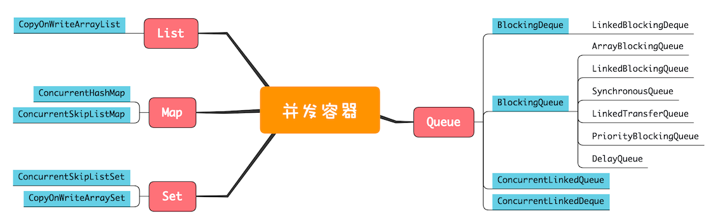

### 1.1 Queue

Queue分为阻塞和非阻塞（当队列已满时，入队操作阻塞；当队列已空时，出队操作阻塞），单端和双端（单端指的是只能队尾入队，队首出队；而双端指的是队首队尾皆可入队出队）。

带 **Blocking** 关键字的是**阻塞队列**，带 **Deque** 的是**双端队列**。

- 单端阻塞队列

  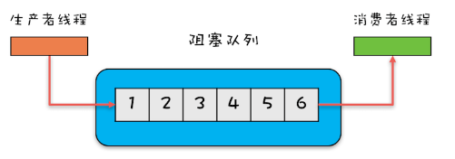

  ArrayBlockingQueue（数组）、LinkedBlockingQueue（链表）、SynchronousQueue（无队列）、LinkedTransferQueue（融合LinkedBLQ和SyncQueue，优于LinkedBLQ）、PriorityBlockingQueue 和 DelayQueue（延迟队列）

- 双端阻塞队列

  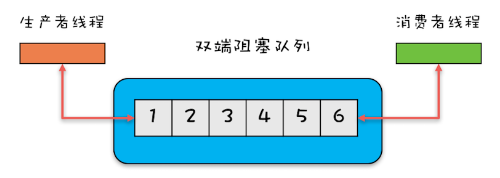

  LinkedBlockingDeque

- 单端非阻塞

  ConcurrentLinkedQueue

- 双端非阻塞

  ConcurrentLinkedDeque

**注意：**使用队列时，需要格外关注队列边界问题，其中只有ArrayBLQ和LinkedBLQ支持有界的，**其他都是无界队列，在使用时一定要充分考虑是否存在导致 OOM的隐患**

#### 1.1.1 阻塞队列-BLQ

常见实现类为**FIFO（ArrayBlockingQueue、LinkedBlockingQueue）** 和 **优先级出队PriorityBlockingQueue**

常用方法如下，**比Queue接口多了阻塞的方法**

- **put：若队列满，则阻塞直到队列有空位可存，然后存（存）**
- offer：如果队列可以容纳，则返回true，否则返回false（存）

- **take：若队列空，则阻塞直到队列有数据，然后取（取）**
- pool：若队列空，则返回null（取）

##### ArrayBlockingQueue

- 1个**数组**对象 + **1个reentrantLock锁** + **2个Condition条件**
  - **入队和出队使用同一把锁**，所以入队和出队无法被并发执行
  - 使用**两个Condition，防止读写线程互相唤醒**
- 数组必须指定大小，**无法扩容**
- 由于出队和入队由同一个锁控制，所以**count队列元素个数可以使用 int 非原子类型**

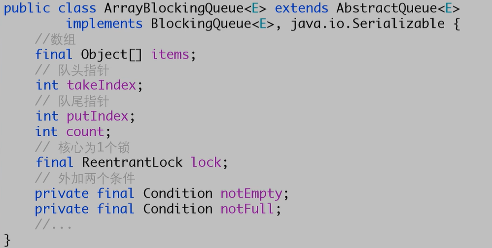


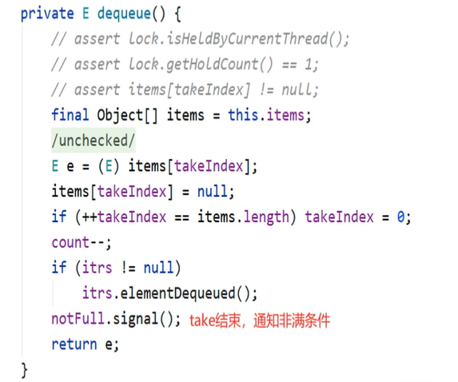

##### LinkedBlockingQueue 

- **单向链表** + **2个ReentrantLock锁** + **2个Condition条件**
  - **提供了并发度，入队和出队各由1把锁控制**，所以可以并发进行入队和出队
  - 两个Condition，防止读写线程互相唤醒
- 该单链表最大容量可以是Int最大值
- **count为队列的元素个数，使用AtomicInteger原子类型**，由于**出队和入队由不同锁控制**，**所以count必须保证原子性**

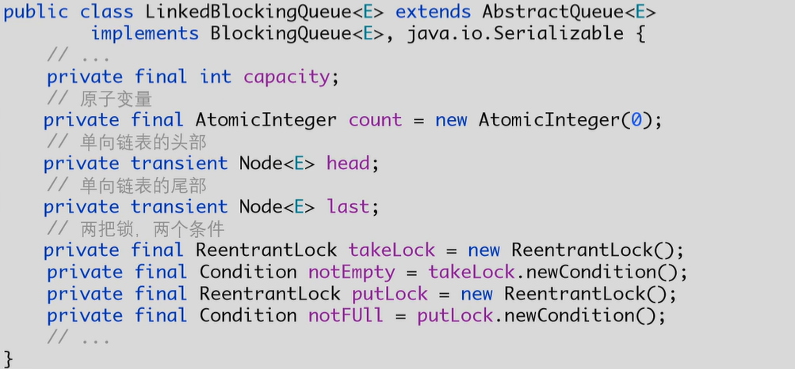


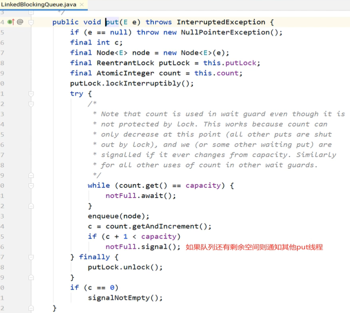


##### PriorityBlockingQueue

- 与ArrayBlockingQueue类似，区别在于使用数组**实现一个最小堆，堆顶优先出队**
- 没有notfull条件，即**队列满不会阻塞，而是扩容**


##### 自定义阻塞队列


###### 1. 使用synchronized、wait、和notifyAll实现


###### 2. 使用ReetrantLock（AQS-CLH同步队列）实现，这也是ArrayBlockingQueue的实现方式

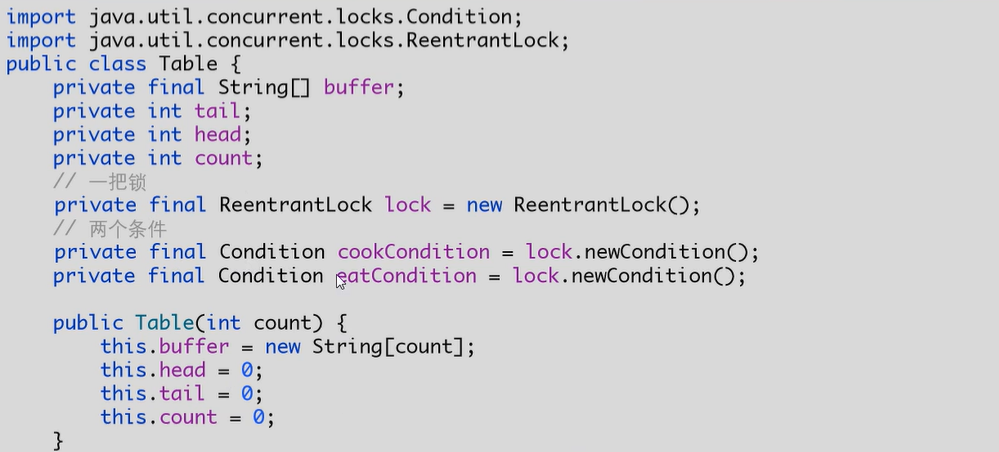


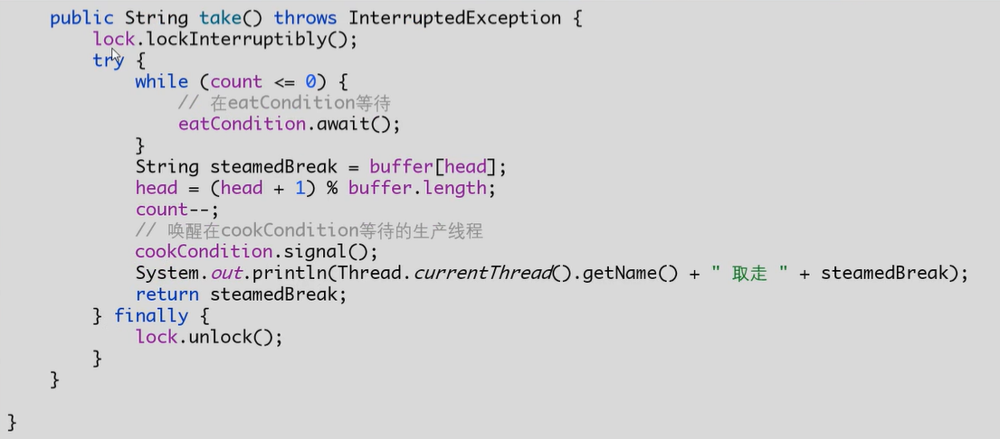


### 1.2 CopyOnWriteArrayList

在了解了CopyOnWriteArrayList之后，不知道大家会不会有这样的疑问：他的add/remove等方法都已经加锁了，还要copy一份再修改干嘛？多此一举？同样是线程安全的集合，这玩意和Vector有啥区别呢？

Copy-On-Write简称COW，是一种用于程序设计中的优化策略。其基本思路是，从一开始大家都在共享同一个内容，当某个人想要修改这个内容的时候，才会真正把内容Copy出去形成一个新的内容然后再改，这是一种延时懒惰策略。

CopyOnWrite容器即写时复制的容器。通俗的理解是当我们往一个容器添加元素的时候，不直接往当前容器添加，而是先将当前容器进行Copy，复制出一个新的容器，然后新的容器里添加元素，添加完元素之后，再将原容器的引用指向新的容器。

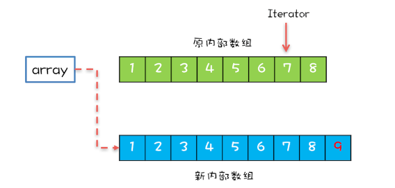

**CopyOnWriteArrayList中add/remove等写方法是需要加锁的**，目的是为了避免Copy出N个副本出来，导致并发写。

**CopyOnWriteArrayList中的读方法是没有加锁的。**

```java
public E get(int index) {
    return get(getArray(), index);
}
```

这样做的好处是我们可以对CopyOnWrite容器进行并发的读，当然，这里读到的数据可能不是最新的。因为写时复制的思想是通过延时更新的策略来实现数据的最终一致性的，并非强一致性。

**所以CopyOnWrite容器是一种读写分离的思想，读和写不同的容器。**而Vector在读写的时候使用同一个容器，读写互斥，同时只能做一件事儿。

#### 注意事项

- CopyOnWriteArrayList 仅适用于写操作非常少的场景，而且能够容忍读写的短暂不一致。例如上面的例子中，写入的新元素并不能立刻被遍历到。
- CopyOnWriteArrayList **迭代器是只读的，不支持增删改**。因为迭代器遍历的**仅仅是一个快照**，而对快照进行增删改是没有意义的。


### 1.3 ConcurrentHashMap

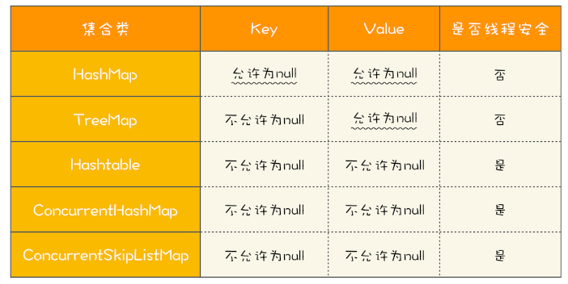

##### 实现原理

**JDK 7**


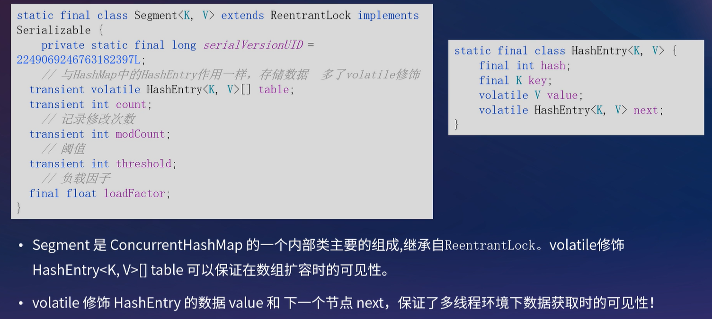

**JDK 8** 


##### JDK7 和 JDK8 的ConcurrentHashMap的区别


##### get方法需要加锁吗？为什么?

不需要，因为Entry节点和Value变量都是被volatile修饰的，保证了变量可见性，修改后能被立即可见

##### 不支持key或value为null的原因？

key不能为null仅仅可能是作者不喜欢key为null

value不能为null，是因为一旦 `get(key) == null` 时，在多线程的环境下很难确定是key为null 还是 value为null

##### 迭代器是强一致性还是弱一致性？

弱一致性，未遍历到的地方若被修改，迭代器遍历出来则也会更改。而HashMap的迭代器的数据是在迭代器生成那一刻的数据，当同时有线程修改数据，则遍历出来的还是就数据。

