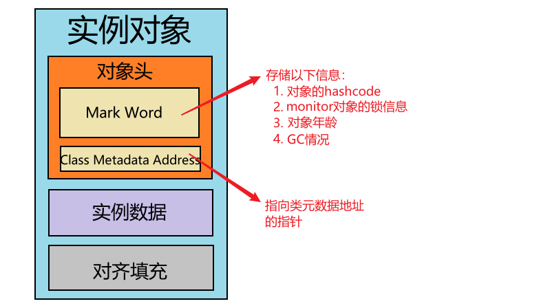
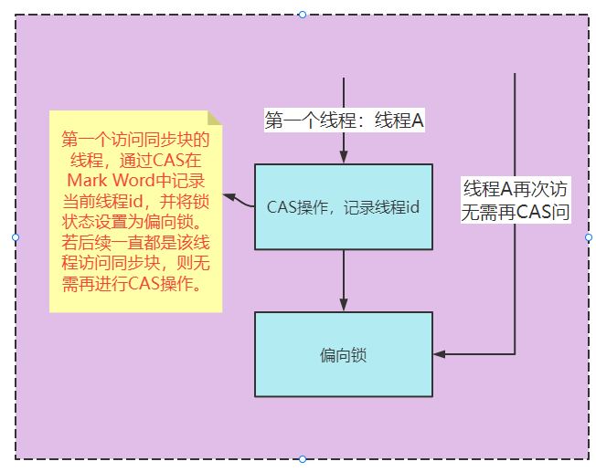
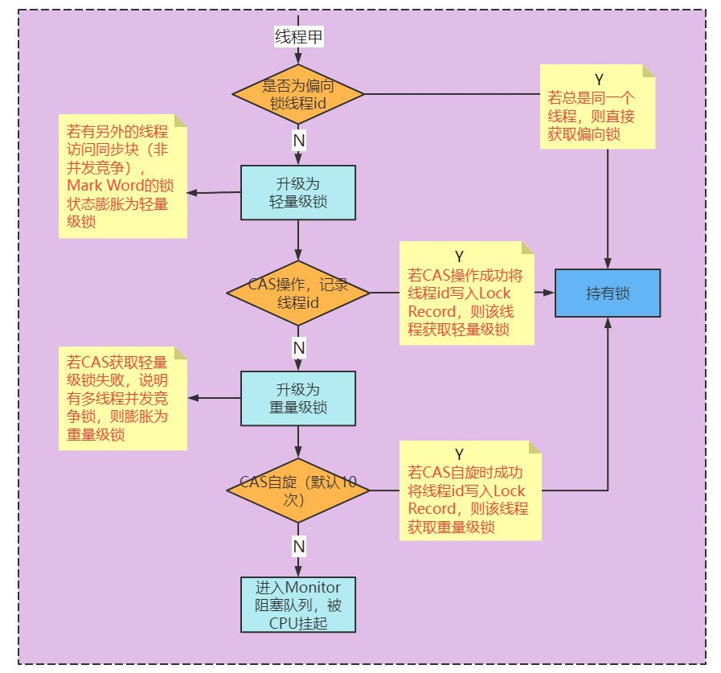

[toc]


## 1. 锁分类

- 乐观锁 VS 悲观锁
- 公平锁 VS 非公平锁
- 独占锁 VS 共享锁
- 分段锁

##### 乐观锁和悲观锁

- 乐观锁：乐观锁的思想就是先执行任务，在需要写数据时，判断旧数据是否被修改来决定是否写入，**适合读多写少**的场景。最常见的乐观锁有CAS、Redis watch乐观锁。
- 悲观锁：每次操作前都要加锁，**适合读少写多**的场景。synchronized就是一个悲观锁，AQS中的ReetratLock也是悲观锁。MySQL中的锁机制如行锁表锁也都是悲观锁。

##### 公平锁和非公平锁

- 公平锁：并发场景中，每个线程在获取锁时**先检查CLH等待队列是否为空**，为**空则**成为队列第一个结点并**占有锁**，**否则加入队尾排队**
  - 优点：等待锁的线程不会饿死
  - 缺点：整体吞吐量比非公平锁低，CLH等待队列中的等待线程都会阻塞
- 非公平锁：并发场景中，每个线程都直接尝试占有锁（CAS），如果尝试失败，再排在CLH等待队列的队尾进行排队
  - 优点：整体吞吐量较高，因为可能减少排队阻塞的情况以及唤醒线程的开销
  - 缺点：处于等待队列的线程可能会饿死，或者很久才获得锁

##### 独占锁和共享锁

- 独占锁：同一时间，锁只能被一个线程持有。synchronized、ReentrantLock、ReadWriteLock读锁
- 共享锁：同一时间，锁可以被多个线程同时持有 。ReadWriteLock写锁

##### 分段式锁

ConcurrentHashMap就是通过分段锁，java8中对hash表中每个Hash桶（bucket）都各自加锁，实现更细粒度的并发控制。


## 2. synchronized（基于CAS+Monitor）

#### 2.1 简介

synchronized 是 JVM层面提供的一个内置锁，所以获取锁、释放锁、锁膨胀、锁粗化、锁消除、自旋锁代码并不在java核心类库中，而在JVM的代码中。

修饰方法：使用**当前实例对象的锁**

修饰静态方法：使用**当前类的Class对象的锁**

修饰代码块：使用**synchronized括号中的对象的锁**


#### 2.2 对象内部结构

首先一个对象的内部结构如下：



主要由对象头、实例数据、对齐填充组成。

而对象头中有Mark Word和Class Metadata Address构成，**Mark Word记录了对象的hashcode、monitor锁信息、对象年龄等**。


#### 2.3 实现原理

- **每个java对象，的对象头的Mark Word中**，**都会关联一个Monitor（管程/监视器）对象**。Monitor对象**依赖操作系统的互斥锁（mutex lock）**，保证**同一时间只能一个线程获取Monitor对象**。

- Monitor对象的实现在**JVM代码中**，由C++编写，类型定义在**ObjectMonitor**.hpp中，主要的属性如下
  - **count：**执行monitorenter指令，获取monitor ，++count ；执行monitorexit指令，释放monitor，--count

  - **Owner：**线程获取到了这个Monitor对象时，Owner会指向这个线程。释放则置为null

  - **WaitSet：**wait()方法将当前线程放入Monitor的WaitSet集合中（线程状态进入waiting）

  - **EntryList：**notify()方法唤醒WaitSet集合中所有的线程，并放入EntryList集合中等待锁（线程状态进入blocking）

    

- synchronized内置锁修饰方法和代码块有所区别，如下：

  - **修饰方法**

    如果方法使用synchronozed修饰，则会设置**`ACC_SYNCHRONIZED ` 标志位**，**隐式的调用monitorenter和monitorexit指令**获取monitor和释放monitor

  - **代码块**

    代码块使用synchronozed包裹，**显式调用monitorenter和monitorexit指令**获取monitor和释放monitor

    

#### 2.4 为什么是重量级锁

1. 线程**阻塞和等待将进入内核调度态**

   在 **EntryList 和 WaitSet** 中的线程处于**阻塞和等待**状态，**依赖操作系统的pthread_mutex_lock函数实现**的。线程被阻塞后便会**进入到内核调度状态**，这会导致系统在**用户态和内核态之间切换**，严重**影响锁的性能**。

2. **互斥依赖操作系统的互斥锁**，涉及用户态和内核态的切换


#### 2.5 java6优化内容

##### 2.5.1 优化内容

synchronized同步锁提供了四种状态：无锁、**偏向锁（默认,基于CAS）**、**轻量级锁（基于CAS）**、**重量级锁（基于Monitor）**。JVM检测到不同的并发程度切换对应的锁，其中**偏向锁和轻量级锁属于无锁实现**

**偏向锁和轻量级锁的意义：**我们认为是降低无并发竞争的开销。

##### 2.5.2 锁膨胀（锁升级）

锁膨胀也就是锁升级，JVM检测**并发竞争的提升而将锁升级的过程**，这个过程是不可逆的。

不同锁的Mark Word结构各不相同

- 偏向锁：锁状态、偏向线程id、对象年龄、
- 轻量级锁：锁状态、lock record锁记录
- 重量级锁：锁状态、monitor指针


###### 	偏向锁（基于CAS）



当**第一个线程访问同步块时**，通过**CAS操作 **对象头的Mark Word **记录当前线程id**，并将锁状态置为偏向锁。下次该线程再申请获取锁时，**只需检查Mark Word**的**锁状态和线程id**，**无需进行CAS**

###### 	轻量锁（基于CAS）和重量锁（基于CAS自旋和Monitor）



如果有**另外的线程试图获取这个锁对象**，偏向锁就会升级为轻量级锁。轻量级锁依赖 CAS 操作 Mark Word 修改Lock Record，成功则获取轻量级锁；

如果CAS失败则说明有线程并发竞争，轻量级锁会膨胀成重量级锁。失败的线程会进行CAS自旋（通过CAS操作不断获取锁），若自旋次数达到上限，则通过Monitor进入阻塞队列


##### 2.5.3 自旋锁和自适应自旋锁（前提是多核CPU，支持线程并行）

当获取轻量级锁的CAS操作失败时，说明已经发生并发竞争，锁膨胀为重量级锁。而重量级锁涉及到线程阻塞和切换，导致重量级锁低性能。由此JVM使用了自旋锁来避免系统阻塞的可能性。

- **自旋锁：**等待锁时，**线程自旋等待锁**的Owner释放锁，而**不是直接被阻塞挂起**

- **优化思想：**先自旋，不成功再进行阻塞

  如果锁已经被占用时，**先让申请锁的线程循环等待（自旋）**。如果**锁Owner占用时间较短**，则申请锁的线程可直接竞争锁。**避免了被阻塞挂起和唤醒的过程**。

- **自旋锁问题：**如果不加限制的自旋，又一直获取不到锁的话，**会白白浪费CPU资源**。所以就需要指定自旋次数，达到上限后进入阻塞状态。

- **自适应自旋锁：**JVM采用了更聪明的方式——适应性自旋，**如果线程自旋成功了（默认自旋10次）**，则**下次自旋的次数会更多**，如果自旋失败了，则自旋的次数就会减少


##### 2.5.4 锁消除


##### 2.5.5 锁粗化


## 3. ReentrantLock（基于CAS）

基于AQS实现的独占锁，支持以下synchronized没有的功能：

- **公平锁：**并发场景中，每个线程在获取锁时**先检查CLH等待队列是否为空**，为**空则**成为队列第一个结点并**占有锁**，**否则加入队尾排队**
  - 优点：等待锁的线程不会饿死
  - 缺点：整体吞吐量比非公平锁低，CLH等待队列中的等待线程都会阻塞
- **非公平锁：**并发场景中，每个线程都直接尝试占有锁（CAS），如果尝试失败，再排在CLH等待队列的队尾进行排队
  - 优点：整体吞吐量较高，因为可能减少排队阻塞的情况以及唤醒线程的开销
  - 缺点：处于等待队列的线程可能会饿死，或者很久才获得锁

- **条件等待Condition：**设置独立的队列，提供**针对性的阻塞（await）**和  **唤醒（signal）**的功能

  `Condition notEmpty = lock.newCondition();`

  内部维护一个等待队列，调用await方法将当前线程加入等待，直到被signal方法唤醒。然后将线程挪到CLH阻塞队列中。

- **带超时的获取锁**

  `ReetrantLock::tryLock(long timeout, TimeUnit unit)`，减少线程阻塞可能性，类似synchronized的自旋锁。

- **等待中断  interrupted**

  等待锁的时候，5秒没有获取到锁，中断等待，线程继续做其它事情。


## 4. ReadWriteLock（基于CAS）

ReentrantReadWriteLock 是Java标准类库提供的再入锁版本实现的读写锁，对应行为的语义与ReentrantLock相似。

读操作之间不需要互斥，可以并发执行。而写操作则会影响一致性，所以需要互斥逻辑

```java
public class RWSample {
    private final Map<String, String> m = new TreeMap<>();
	private final ReentrantReadWriteLock rwl = new ReentrantReadWriteLock();
	private final Lock r = rwl.readLock();
	private final Lock w = rwl.writeLock();
    
	public String get(String key) {
    	r.lock();
    	System.out.println(" 读锁锁定！");
    	try {
        	return m.get(key);
    	} finally {
        	r.unlock();
    	}
	}
 
	public String put(String key, String entry) {
    	w.lock();
		System.out.println(" 写锁锁定！");
        try {
            return m.put(key, entry);
        } finally {
            w.unlock();
        }
    }
	// …
}
```

==如果读锁试图锁定时==，==写锁==是被某个线程==持有==，读锁将无法获得，而只好==等待对方操作结束==，这样就可以自动保证不会读取到有争议的数据。

==读写锁==看起来比 synchronized 的粒度似乎细一些，但在实际应用中，其==表现也并不尽如人意==，主要还是因为==相对比较大的开销==。


## 5. StampedLock 

优化了读模式，基于大多数情况下读操作并不会和写操作冲突，其逻辑是==先试着读==，然后通过 validate 方法==确认是否进入了写模式==，如果没有进入，就成功避免了开销；如果==进入==，==则尝试获取读锁==

```java
public class StampedSample {
	private final StampedLock sl = new StampedLock();
 
	void mutate() {
    	long stamp = sl.writeLock();
    	try {
        	write();//伪代码
    	} finally {
        	sl.unlockWrite(stamp);
    	}
	}
 
	Data access() {
    	long stamp = sl.tryOptimisticRead();
    	Data data = read();//伪代码
    	if (!sl.validate(stamp)) {
        	stamp = sl.readLock();
        	try {
            	data = read();//伪代码
        	} finally {
            	sl.unlockRead(stamp);
        	}
    	}
    	return data;
	}
	// …
}
```


## 6. 性能对比

1. synchronized：
   在资源竞争不是很激烈的情况下，偶尔会有同步的情形下，synchronized是很合适的。原因在于，编译程序通常会尽可能的进⾏优化synchronize，另外可读性⾮常好。
2. ReentrantLock:
   在资源竞争不激烈的情形下，性能稍微比synchronized差点点。但是当同步非常激烈的时候，synchronized的性能一下子能下降好几⼗倍，而ReentrantLock确还能维持常态。高并发量情况下使⽤ReentrantLock。
