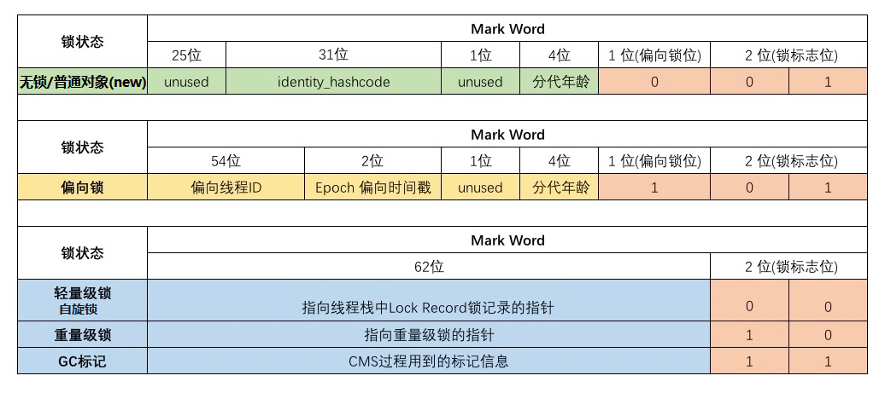
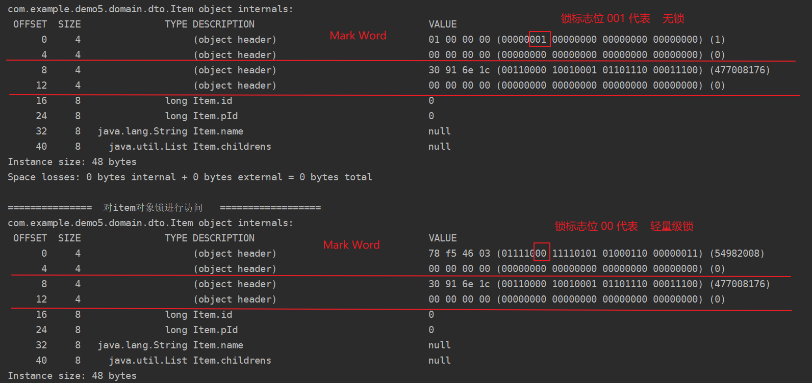

[toc]


## 1. 锁分类

- 乐观锁 VS 悲观锁
- 公平锁 VS 非公平锁
- 独占锁 VS 共享锁
- 分段锁

#### 乐观锁和悲观锁

- 乐观锁：乐观锁的思想就是先执行任务，在需要写数据时，判断旧数据是否被修改来决定是否写入，**适合读多写少**的场景。最常见的乐观锁有CAS、Redis watch乐观锁。
- 悲观锁：每次操作前都要加锁，**适合读少写多**的场景。synchronized就是一个悲观锁，AQS中的ReetratLock也是悲观锁。MySQL中的锁机制如行锁表锁也都是悲观锁。

#### 公平锁和非公平锁

- 公平锁：并发场景中，每个线程在获取锁时**先检查CLH等待队列是否为空**，为**空则**成为队列第一个结点并**占有锁**，**否则加入队尾排队**
  - 优点：等待锁的线程不会饿死
  - 缺点：整体吞吐量比非公平锁低，CLH等待队列中的等待线程都会阻塞
- 非公平锁：并发场景中，每个线程都直接尝试占有锁（CAS），如果尝试失败，再排在CLH等待队列的队尾进行排队
  - 优点：整体吞吐量较高，因为可能减少排队阻塞的情况以及唤醒线程的开销
  - 缺点：处于等待队列的线程可能会饿死，或者很久才获得锁

#### 独占锁和共享锁

- 独占锁：同一时间，锁只能被一个线程持有。synchronized、ReentrantLock、ReadWriteLock读锁
- 共享锁：同一时间，锁可以被多个线程同时持有 。ReadWriteLock写锁

#### 分段式锁

ConcurrentHashMap就是通过分段锁，java8中对hash表中每个Hash桶（bucket）都各自加锁，实现更细粒度的并发控制。


## 2. synchronized（基于CAS+Monitor）

#### 2.1 简介

synchronized 是 JVM层面提供的一个内置锁，所有获取锁、释放锁、锁膨胀、锁粗化、锁消除、自旋锁代码并不在java核心类库中，而在JVM的代码中。

修饰方法：使用**当前实例对象的锁**

修饰静态方法：使用**当前类的Class对象的锁**

修饰代码块：使用**synchronized括号中的对象的锁**


#### 2.2 对象内存分布


- **对象头**

  **Mark Word：**记录HashCode、分代年龄、锁标志位等信息

  Class pointer：类型指针，**指向类元数据**

  **32位**的 HotSpot虚拟机**对象头**占用**8个字节**，而**64位**的 HotSpot虚拟机**对象头**占用**16个字节**。其中Mark Word和Class point各占一半空间。64位的Hotspot有压缩指针功能，**`-XX:+UseCompressedOops（默认开启）`**，压缩后Class point的占4个字节。此时对象头位12个字节

  

- **实例数据**

  存放该对象的实例数据

- **对齐填充**

  64位的HotSpot虚拟机，要求实例对象内存按8字节对齐，因此 Java对象需要通过填充来满足对齐要求。


这里我推荐一个分析Java对象内存布局的工具——**JOL**

```xml
<!-- JOL依赖 -->
<dependency>
   <groupId>org.openjdk.jol</groupId>
   <artifactId>jol-core</artifactId>
   <version>0.9</version>
</dependency>
```

```java
public static void main(String[] args) {
    Item item = new Item();
    item.setId(111);
    item.setName("aaa");
    String s = ClassLayout.parseInstance(item).toPrintable();
    System.out.println(s);
}
```


#### 2.3 实现原理

- 对象头Mark Word中有**一个ObjectMonitor（重量级锁/管程/监视器）指针**。ObjectMonitor对象**依赖操作系统的互斥锁（mutex lock）**，保证**同一时间只能一个线程获取Monitor对象**，竞争**失败的被甩入EntryList**中。

- ObjectMonitor对象的实现在**HotSpot代码中**，由**C++编写**，类型定义在**ObjectMonitor**.hpp中，主要的属性如下
  - **count：**执行monitorenter指令，获取monitor ，++count ；执行monitorexit指令，释放monitor，--count

  - **Owner：**线程获取到了这个Monitor对象时，Owner会指向这个线程。释放则置为null

  - **WaitSet：**wait()方法将当前线程放入Monitor的WaitSet集合中（线程状态进入waiting）

  - **EntryList：**notify()方法唤醒WaitSet集合中所有的线程，并放入EntryList集合中等待锁（线程状态进入blocking）

    

- synchronized内置锁修饰方法和代码块有所区别，如下：

  - **修饰方法**

    如果方法使用synchronozed修饰，则会设置**`ACC_SYNCHRONIZED ` 标志位**，**隐式的调用monitorenter和monitorexit指令**获取monitor和释放monitor

  - **代码块**

    代码块使用synchronozed包裹，**显式调用monitorenter和monitorexit指令**获取monitor和释放monitor

    


#### 2.4 为什么是重量级锁

1. 互斥**依赖操作系统的互斥锁**（mutex lock），涉及用户态和内核态的切换

2. 线程**阻塞和等待将进入内核调度态**

   在 **EntryList 和 WaitSet** 中的线程处于**阻塞和等待**状态，**依赖操作系统的pthread_mutex_lock函数实现**（竞争锁互斥锁）。线程竞争锁失败便**进入到内核调度状态（阻塞）**，这会导致系统在**用户态和内核态之间切换**，严重**影响锁的性能**。


#### 2.5 java6优化内容

##### 2.5.1 优化内容

锁膨胀、锁自旋、锁粗化、锁消除

##### 2.5.2 锁膨胀（锁升级）

锁膨胀也就是锁升级，JVM检测**并发竞争的升级而将锁升级的过程**，这个过程是不可逆的。

**锁膨胀跟 Mark Word 息息相关**，不同锁结构Mark Word如下


- 偏向锁：当前偏向线程指针、对象分代年龄、锁标志位
- 轻量级锁：lock record锁记录指针（在虚拟机栈中，锁重入的实现）、锁标志位
- 重量级锁：monitor指针、锁标志位

###### 锁初步升级


我们可以借助 **JOL工具**，来查看不同时机Mark Word中的锁信息，判断以上锁升级是否正确

- 延时导致偏向锁还没启动

  **未开启偏向锁时，无锁状态直接进入轻量级锁**

  ```java
  public static void main(String[] args) {
      Item item = new Item();
      System.out.println(ClassLayout.parseInstance(item).toPrintable());
  
      System.out.println("===============  对item对象锁进行访问   ==================");
  
      synchronized (item){
          System.out.println(ClassLayout.parseInstance(item).toPrintable());
      }
  }
  ```

  

- 偏向锁启动后

  **开启偏向锁后默认就是偏向锁了**

  ```java
  public static void main(String[] args) throws InterruptedException {
          TimeUnit.SECONDS.sleep(5);
          Item item = new Item();
          System.out.println(ClassLayout.parseInstance(item).toPrintable());
          
          System.out.println("===============  对item对象锁进行访问   ==================");
  
          synchronized (item){
              System.out.println(ClassLayout.parseInstance(item).toPrintable());
          }
      }
  ```

  

###### 升级到轻量级锁


###### 升级到重量级锁


###### 总结


###### 	偏向锁（基于CAS）

**偏向于某个线程**，原因是比如**使用StringBuffer（synchronized线程安全）**，**大多数人在用的时候大部分都在一个线程运行**，所以一个线程反复的获取锁（进入内核态获取操作系统的互斥锁）。所以就记录线程id，通过CAS将线程id写入Mark Word里。下次再来申请锁时判断线程id，如果是自己的id，则直接获取锁。

偏向锁默认开启的`-XX:+UseBiasedLocking`，但是还有个配置是`-XX:BiasedLockingStartupDelay = 4000` 为延时4秒启动，原因是JVM在启动时存在大量线程并发竞争资源，所以为了性能索性延迟启动偏向锁。

因为明确有大量竞争时，并不推荐开启偏向锁，因为锁膨胀也是有代价的。

**注意：**偏向锁**不能重新偏向**

###### 	轻量锁（基于CAS自旋）

如果**偏向锁未开启**，或者**有其他线程来申请锁**，那么就会切换为轻量级锁，将Mark Word拷贝到生成的**Lock Record指针**。

然后，当前**线程会在自己的虚拟机栈**中**创建Lock Record锁记录对象**，然后通过CAS自旋，成功将Mard Word的锁记录指针指向自己的锁记录对象，代表成功获取轻量级锁。

**轻量级锁支持锁重入：**当重入锁时，在栈中在生成一个Lock Record对象，出锁时将一个对象踢出栈

###### 	重量锁（基于CAS自旋和Monitor）

如果有**另外的线程试图获取这个锁对象**，偏向锁就会升级为轻量级锁。轻量级锁依赖 CAS 操作 Mark Word 修改Lock Record，成功则获取轻量级锁；

如果CAS失败则说明有线程并发竞争，轻量级锁会膨胀成重量级锁。失败的线程会进行CAS自旋（通过CAS操作不断获取锁），若自旋次数达到上限，则通过Monitor进入阻塞队列


##### 2.5.3 自旋锁和自适应自旋锁（前提是多核CPU，支持线程并行）

当获取轻量级锁的CAS操作失败时，说明已经发生并发竞争，锁膨胀为重量级锁。而重量级锁涉及到线程阻塞和切换，导致重量级锁低性能。由此JVM使用了自旋锁来避免系统阻塞的可能性。

- **自旋锁：**等待锁时，**线程自旋等待锁**的Owner释放锁，而**不是直接被阻塞挂起**

- **优化思想：**先自旋，不成功再进行阻塞

  如果锁已经被占用时，**先让申请锁的线程循环等待（自旋）**。如果**锁Owner占用时间较短**，则申请锁的线程可直接竞争锁。**避免了被阻塞挂起和唤醒的过程**。

- **自旋锁问题：**如果不加限制的自旋，又一直获取不到锁的话，**会白白浪费CPU资源**。所以就需要指定自旋次数，达到上限后进入阻塞状态。

- **自适应自旋锁：**JVM采用了更聪明的方式——适应性自旋，**如果线程自旋成功了（默认自旋10次）**，则**下次自旋的次数会更多**，如果自旋失败了，则自旋的次数就会减少


##### 2.5.4 锁消除


##### 2.5.5 锁粗化


## 3. ReentrantLock（基于CAS）

基于AQS实现的独占锁，支持以下synchronized没有的功能：

- **公平锁：**并发场景中，每个线程在获取锁时**先检查CLH等待队列是否为空**，为**空则**成为队列第一个结点并**占有锁**，**否则加入队尾排队**
  - 优点：等待锁的线程不会饿死
  - 缺点：整体吞吐量比非公平锁低，CLH等待队列中的等待线程都会阻塞
- **非公平锁：**并发场景中，每个线程都直接尝试占有锁（CAS），如果尝试失败，再排在CLH等待队列的队尾进行排队
  - 优点：整体吞吐量较高，因为可能减少排队阻塞的情况以及唤醒线程的开销
  - 缺点：处于等待队列的线程可能会饿死，或者很久才获得锁

- **条件等待Condition：**设置独立的队列，提供**针对性的阻塞（await）**和  **唤醒（signal）**的功能

  `Condition notEmpty = lock.newCondition();`

  内部维护一个等待队列，调用await方法将当前线程加入等待，直到被signal方法唤醒。然后将线程挪到CLH阻塞队列中。

- **带超时的获取锁**

  `ReetrantLock::tryLock(long timeout, TimeUnit unit)`，减少线程阻塞可能性，类似synchronized的自旋锁。

- **等待中断  interrupted**

  等待锁的时候，5秒没有获取到锁，中断等待，线程继续做其它事情。


## 4. ReadWriteLock（基于CAS）

ReentrantReadWriteLock 是Java标准类库提供的再入锁版本实现的读写锁，对应行为的语义与ReentrantLock相似。

读操作之间不需要互斥，可以并发执行。而写操作则会影响一致性，所以需要互斥逻辑

```java
public class RWSample {
    private final Map<String, String> m = new TreeMap<>();
	private final ReentrantReadWriteLock rwl = new ReentrantReadWriteLock();
	private final Lock r = rwl.readLock();
	private final Lock w = rwl.writeLock();
    
	public String get(String key) {
    	r.lock();
    	System.out.println(" 读锁锁定！");
    	try {
        	return m.get(key);
    	} finally {
        	r.unlock();
    	}
	}
 
	public String put(String key, String entry) {
    	w.lock();
		System.out.println(" 写锁锁定！");
        try {
            return m.put(key, entry);
        } finally {
            w.unlock();
        }
    }
	// …
}
```

==如果读锁试图锁定时==，==写锁==是被某个线程==持有==，读锁将无法获得，而只好==等待对方操作结束==，这样就可以自动保证不会读取到有争议的数据。

==读写锁==看起来比 synchronized 的粒度似乎细一些，但在实际应用中，其==表现也并不尽如人意==，主要还是因为==相对比较大的开销==。


## 5. StampedLock 

优化了读模式，基于大多数情况下读操作并不会和写操作冲突，其逻辑是==先试着读==，然后通过 validate 方法==确认是否进入了写模式==，如果没有进入，就成功避免了开销；如果==进入==，==则尝试获取读锁==

```java
public class StampedSample {
	private final StampedLock sl = new StampedLock();
 
	void mutate() {
    	long stamp = sl.writeLock();
    	try {
        	write();//伪代码
    	} finally {
        	sl.unlockWrite(stamp);
    	}
	}
 
	Data access() {
    	long stamp = sl.tryOptimisticRead();
    	Data data = read();//伪代码
    	if (!sl.validate(stamp)) {
        	stamp = sl.readLock();
        	try {
            	data = read();//伪代码
        	} finally {
            	sl.unlockRead(stamp);
        	}
    	}
    	return data;
	}
	// …
}
```


## 6. 性能对比

synchronized底层依赖操作系统的mutex lock互斥锁，需要切换内核态

ReentrantLock底层依赖CAS操作竞争锁，以及等待队列中的线程不停地自旋CAS，不涉及内核态

1. synchronized：
   在资源竞争不是很激烈的情况下，偶尔会有同步的情形下，synchronized是很合适的。原因在于，编译程序通常会尽可能的进⾏优化synchronize，另外可读性⾮常好。
2. ReentrantLock:
   在资源竞争不激烈的情形下，性能稍微比synchronized差点点。但是当同步非常激烈的时候，synchronized的性能一下子能下降好几⼗倍，而ReentrantLock确还能维持常态。高并发量情况下使⽤ReentrantLock。
