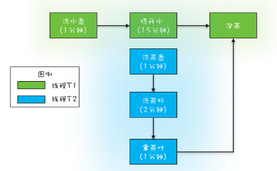
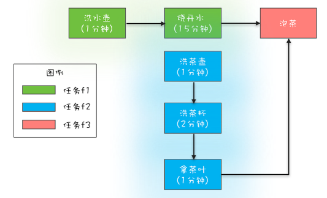
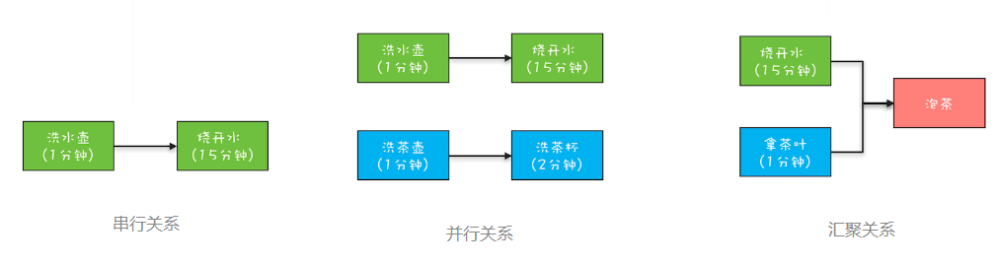

[toc]

## 应用案例

### 1. FutureTask

现有一个烧水泡茶程序，用两个线程 T1 和 T2 来完成烧水泡茶程序，T1 负责洗水壶、烧开水、泡茶这三道工序，T2 负责洗茶壶、洗茶杯、拿茶叶三道工序，其中 T1 在执行泡茶这道工序时需要等待 T2 完成拿茶叶的工序。



我们可以用LockSupport、Thread.join、CountDownLatch等实现，但这里使用Futrue特性来实现。

```java
// 创建任务 T2 的 FutureTask
FutureTask<String> ft2 = new FutureTask<>(new T2Task());
// 创建任务 T1 的 FutureTask
FutureTask<String> ft1 = new FutureTask<>(new T1Task(ft2));
// 创建线程池
ExecutorService es = Executors.newCachedThreadPool();
// 线程 T1 执行任务 ft1
es.submit(ft1);
es.submit(ft2);
// 等待线程 T1 执行结果
System.out.println(ft1.get());

// T1Task 需要执行的任务：
// 洗水壶、烧开水、泡茶
class T1Task implements Callable<String>{
    FutureTask<String> ft2;
    // T1 任务需要 T2 任务的 FutureTask
    T1Task(FutureTask<String> ft2){
        this.ft2 = ft2;
    }
    @Override
    String call() throws Exception {
        System.out.println("T1: 洗水壶...");
        TimeUnit.SECONDS.sleep(1);

        System.out.println("T1: 烧开水...");
        TimeUnit.SECONDS.sleep(15);
        // 获取 T2 线程的茶叶  
        String tf = ft2.get();
        System.out.println("T1: 拿到茶叶:"+tf);

        System.out.println("T1: 泡茶...");
        return " 上茶:" + tf;
    }
}
// T2Task 需要执行的任务:
// 洗茶壶、洗茶杯、拿茶叶
class T2Task implements Callable<String> {
    @Override
    String call() throws Exception {
        System.out.println("T2: 洗茶壶...");
        TimeUnit.SECONDS.sleep(1);

        System.out.println("T2: 洗茶杯...");
        TimeUnit.SECONDS.sleep(2);

        System.out.println("T2: 拿茶叶...");
        TimeUnit.SECONDS.sleep(1);
        return " 龙井 ";
    }
}
```


### 2. CompletableFuture

还是以烧水泡茶的程序为例，现在分成了 3 个任务：任务 1 负责洗水壶、烧开水，任务 2 负责洗茶壶、洗茶杯和拿茶叶，任务 3 负责泡茶。其中任务 3 要等待任务 1 和任务 2 都完成后才能开始。这个分工如下图所示。



```java
// 任务 1：洗水壶 -> 烧开水
CompletableFuture<Void> f1 = CompletableFuture.runAsync(()->{
        System.out.println("T1: 洗水壶...");
        sleep(1, TimeUnit.SECONDS);

        System.out.println("T1: 烧开水...");
        sleep(15, TimeUnit.SECONDS);
    });
// 任务 2：洗茶壶 -> 洗茶杯 -> 拿茶叶
CompletableFuture<String> f2 = CompletableFuture.supplyAsync(()->{
        System.out.println("T2: 洗茶壶...");
        sleep(1, TimeUnit.SECONDS);

        System.out.println("T2: 洗茶杯...");
        sleep(2, TimeUnit.SECONDS);

        System.out.println("T2: 拿茶叶...");
        sleep(1, TimeUnit.SECONDS);
        return " 龙井 ";
    });
// 任务 3：任务 1 和任务 2 完成后执行：泡茶
CompletableFuture<String> f3 = f1.thenCombine(f2, (__, tf)->{
        System.out.println("T1: 拿到茶叶:" + tf);
        System.out.println("T1: 泡茶...");
        return " 上茶:" + tf;
    });
// 等待任务 3 执行结果
System.out.println(f3.join());

void sleep(int t, TimeUnit u) {
    try {
        u.sleep(t);
    }catch(InterruptedException e){}
}

// 一次执行结果
T1: 洗水壶...
T2: 洗茶壶...
T1: 烧开水...
T2: 洗茶杯...
T2: 拿茶叶...
T1: 拿到茶叶: 龙井
T1: 泡茶...
上茶: 龙井
```

案例中涉及到的方法，会在后续介绍。


## CompletableFuture

- 支持异步任务关系处理，比如任务关系的依赖执行、任意任务完成即成功等等
- 异步处理异常
- 链式调用
- 所有带Async的方法都是异步执行并且可以指定线程池，没有就是复用之前任务的线程

### 1.1 创建 CompletableFuture 对象

```java
// 创建时使用默认线程池
static CompletableFuture<Void> runAsync(Runnable runnable);
static <U> CompletableFuture<U> supplyAsync(Supplier<U> supplier);

// 使用无参构造函数创建
CompletableFuture<String> completableFuture = new CompletableFuture<String>();
```

创建 `CompletableFuture` 的方法，有runAsync和supplyAsync。创建完 `CompletableFuture` 对象后会自动异步执行runnable.run() 方法或者 supplier.get()

- `runAsync(Runnable runnable)`：runnable.run() 没有返回值
- `supplyAsync(Supplier<U> supplier)`：supplier.get()有返回值，相当于call()方法。


### 1.2 使用线程池

**`CompletableFuture`** 默认使用了**公共的 ForkJoinPool线程池**，这个 common线程池创建的coreThread为  **CPU核数**（可通过 JVM option:`-Djava.util.concurrent.ForkJoinPool.common.parallelism` 来指定该默认线程池的线程数）。如果所有 **`CompletableFuture `** 公用一个线程池，一旦有任务执行很慢的I/O操作，那么所有的线程都将阻塞造成线程饥饿，进而影响整个系统性能。所以**应该根据不同业务类型创建不同的线程池，避免互相干扰。**

创建 `CompletableFuture `时，可指定线程池或者默认使用线程池

```java
// 创建时指定线程池 
static CompletableFuture<Void> runAsync(Runnable runnable, Executor executor)
static <U> CompletableFuture<U> supplyAsync(Supplier<U> supplier, Executor executor)  
```


### 1.3 获取结果

```java
// 如果完成则返回结果，否则就抛出具体的异常
public T get() throws InterruptedException, ExecutionException 
    
// 最大时间等待返回结果，否则就抛出具体异常
public T get(long timeout, TimeUnit unit) throws InterruptedException, ExecutionException, TimeoutException

// 完成时返回结果值，否则抛出unchecked异常。为了更好地符合通用函数形式的使用，如果完成此 CompletableFuture所涉及的计算引发异常，则此方法将引发unchecked异常并将底层异常作为其原因
public T join()
 
// 如果完成则返回结果值（或抛出任何遇到的异常），否则返回给定的 valueIfAbsent。
public T getNow(T valueIfAbsent)
 
// 如果任务没有完成，返回的值设置为给定值
public boolean complete(T value)
 
// 如果任务没有完成，就抛出给定异常
public boolean completeExceptionally(Throwable ex) 
```


### 1.4 CompletionStage

`CompletableFuture ` 除了实现 `Futrue `接口，还实现了 `CompletionStage ` 接口，在1.8版本中有40个方法，现在我们来理解 `CompletionStage`。

`CompletionStage` 接口的工作流分为**串行关系任务**、并行关系任务、**聚合关系任务**、**异常处理**，可使用烧水泡茶来解读这些关系：



其中聚合关系又包含 **AND聚合关系（所有依赖任务都完成才执行当前任务）**、**OR聚合关系（任意一个依赖任务完成就执行当前任务）、allOf、anyOf**。


#### 1.3.1 串行关系

##### 介绍

串行关系有：**thenApply、thenAccept、thenRun 和 thenCompose**， 这四个系列的接口都是在**前置任务完成后才执行**，不同的是入参和出参不同。

```java
CompletableFuture<R> thenApply(Function<T, R> fn);
CompletableFuture<R> thenApplyAsync(Function<T, R> fn);
CompletableFuture<Void> thenAccept(Consumer<T> consumer);
CompletableFuture<Void> thenAcceptAsync(Consumer<T> consumer);
CompletableFuture<Void> thenRun(Runnable action);
CompletableFuture<Void> thenRunAsync(Runnable action);
CompletableFuture<R> thenCompose(Function<T, R> fn);
CompletableFuture<R> thenComposeAsync(Function<T, R> fn);
```

- thenApply 系列方法的入参类型为 `Function<T, R>`，Function既能**接收参数也支持返回值**，所以 thenApply 系列方法返回的是`CompletionStage<R>`。

- thenAccept 系列方法入参类型为 `Consumer<T>`，Consumer**支持参数，但却不支持回值**，所以 thenAccept 系列方法返回的是`CompletionStage<Void>`。

- thenRun 系列方法入参类型为 `Runnable`，Runnable**既不能接收参数也不支持返回值**，所以 thenRun 系列方法返回的也是`CompletionStage<Void>`。

- 有Async关键字的代表的是异步执行（可指定线程池）。其中，需要你注意的是 thenCompose 系列方法，这个系列的方法会新创建出一个子流程，最终结果和 thenApply 系列是相同的。

##### 使用

使用supplyAsync() 启动一个异步流程，然后执行两个串行操作。

```java
CompletableFuture<String> f0 =  CompletableFuture.supplyAsync(() -> "Hello World")  //①
    .thenApply(s -> s + " QQ")  //②
    .thenApply(String::toUpperCase);//③

System.out.println(f0.join());

// 输出结果
HELLO WORLD QQ
```

**注意：**尽管使用的是异步流程，但过程确实同步的。因为任务**①②③是串行执行**的，**②依赖①**的执行结果，**③依赖②**的执行结果。


#### 1.3.2 并行关系

并行关系就是创建多个CompletableFutrue对象并执行。

```java
CompletableFuture<String> f1 = CompletableFuture.supplyAsync(()->{
        int t = getRandom(5, 10);
        sleep(t, TimeUnit.SECONDS);
        return String.valueOf(t);
    });

CompletableFuture<String> f2 = CompletableFuture.supplyAsync(()->{
        int t = getRandom(5, 10);
        sleep(t, TimeUnit.SECONDS);
        return String.valueOf(t);
    });
```


#### 1.3.3 AND 聚合

##### 介绍

AND 聚合接口有：**thenCombine、thenAcceptBoth 和 runAfterBoth** 系列的接口

这些方法的区别在于入参类型不同，参考串行关系方法之前的区别，使用方法参考烧水泡茶的程序。

```java
CompletableFuture<R> thenCombine(other,Function<T, R> fn);
CompletableFuture<R> thenCombineAsync(other,Function<T, R> fn);
CompletableFuture<Void> thenAcceptBoth(other,Consumer<T> consumer);
CompletableFuture<Void> thenAcceptBothAsync(other,Consumer<T> consumer);
CompletableFuture<Void> runAfterBoth(other,Runnable action);
CompletableFuture<Void> runAfterBothAsync(other,Runnable action);

```

- other：AND 的 其他CompletableFuture流程

##### 使用

```java
public static void main(String[] args) throws ExecutionException, InterruptedException {
        CompletableFuture<Integer> cf1 = CompletableFuture.supplyAsync(() -> {
            System.out.println(Thread.currentThread() + " cf1 do something....");
            return 1;
        });
 
        CompletableFuture<Integer> cf2 = CompletableFuture.supplyAsync(() -> {
            System.out.println(Thread.currentThread() + " cf2 do something....");
            return 2;
        });
 
        CompletableFuture<Integer> cf3 = cf1.thenCombine(cf2, (a, b) -> {
            System.out.println(Thread.currentThread() + " cf3 do something....");
            return a + b;
        });
 
        System.out.println("cf3结果->" + cf3.get());
}
 
 public static void main(String[] args) throws ExecutionException, InterruptedException {
        CompletableFuture<Integer> cf1 = CompletableFuture.supplyAsync(() -> {
            System.out.println(Thread.currentThread() + " cf1 do something....");
            return 1;
        });
 
        CompletableFuture<Integer> cf2 = CompletableFuture.supplyAsync(() -> {
            System.out.println(Thread.currentThread() + " cf2 do something....");
            return 2;
        });
        
        CompletableFuture<Void> cf3 = cf1.thenAcceptBoth(cf2, (a, b) -> {
            System.out.println(Thread.currentThread() + " cf3 do something....");
            System.out.println(a + b);
        });
 
        System.out.println("cf3结果->" + cf3.get());
}
 
public static void main(String[] args) throws ExecutionException, InterruptedException {
        CompletableFuture<Integer> cf1 = CompletableFuture.supplyAsync(() -> {
            System.out.println(Thread.currentThread() + " cf1 do something....");
            return 1;
        });
 
        CompletableFuture<Integer> cf2 = CompletableFuture.supplyAsync(() -> {
            System.out.println(Thread.currentThread() + " cf2 do something....");
            return 2;
        });
 
        CompletableFuture<Void> cf3 = cf1.runAfterBoth(cf2, () -> {
            System.out.println(Thread.currentThread() + " cf3 do something....");
        });
 
        System.out.println("cf3结果->" + cf3.get());
}
```


#### 1.3.4 OR 聚合

##### 介绍

OR 聚合接口有：**applyToEither、acceptEither 和 runAfterEither** 系列的接口

这些方法的区别在于入参类型不同，参考串行关系方法之前的区别。

```java
CompletableFuture applyToEither(other,Function<T, R> fn);
CompletableFuture applyToEitherAsync(other,Function<T, R> fn);
CompletableFuture acceptEither(other,Consumer<T> consumer);
CompletableFuture acceptEitherAsync(other,Consumer<T> consumer);
CompletableFuture runAfterEither(other,Runnable action);
CompletableFuture runAfterEitherAsync(other,Runnable action);
```

- OR 的 其他CompletableFuture流程

##### 使用

```java
CompletableFuture<String> f1 = CompletableFuture.supplyAsync(()->{
        int t = getRandom(5, 10);
        sleep(t, TimeUnit.SECONDS);
        return String.valueOf(t);
    });

CompletableFuture<String> f2 = CompletableFuture.supplyAsync(()->{
        int t = getRandom(5, 10);
        sleep(t, TimeUnit.SECONDS);
        return String.valueOf(t);
    });

CompletableFuture<String> f3 = f1.applyToEither(f2,s -> s);

System.out.println(f3.join());
```


#### 1.3.5 allOf/anyOf

##### 介绍

- allOf：allOf是多个任务都执行完成后才会执行，只要有一个任务执行异常，则返回的CompletableFuture执行get方法时会抛出异常，如果都是正常执行，则get返回null。

- anyOf ：anyOf是多个任务任意一个任务完成后才会执行，如果该任务异常，则返回的CompletableFuture执行get方法时会抛出异常，如果该任务正常执行，则get返回执行完成任务的结果。

```java
CompletableFuture<Void> allOf(CompletableFuture<?>... cfs);
CompletableFuture<Object> anyOf(CompletableFuture<?>... cfs);
```

##### 使用

```java
public static void main(String[] args) throws ExecutionException, InterruptedException {
    CompletableFuture<String> cf1 = CompletableFuture.supplyAsync(() -> {
        try {
            System.out.println(Thread.currentThread() + " cf1 do something....");
            Thread.sleep(2000);
        } catch (InterruptedException e) {
            e.printStackTrace();
        }
        System.out.println("cf1 任务完成");
        return "cf1 任务完成";
    });

    CompletableFuture<String> cf2 = CompletableFuture.supplyAsync(() -> {
        try {
            System.out.println(Thread.currentThread() + " cf2 do something....");
            int a = 1/0;
            Thread.sleep(5000);
        } catch (InterruptedException e) {
            e.printStackTrace();
        }
        System.out.println("cf2 任务完成");
        return "cf2 任务完成";
    });

    CompletableFuture<String> cf3 = CompletableFuture.supplyAsync(() -> {
        try {
            System.out.println(Thread.currentThread() + " cf2 do something....");
            Thread.sleep(3000);
        } catch (InterruptedException e) {
            e.printStackTrace();
        }
        System.out.println("cf3 任务完成");
        return "cf3 任务完成";
    });

    CompletableFuture<Void> cfAll = CompletableFuture.allOf(cf1, cf2, cf3);
    System.out.println("cfAll结果->" + cfAll.get());
}


public static void main(String[] args) throws ExecutionException, InterruptedException {
    CompletableFuture<String> cf1 = CompletableFuture.supplyAsync(() -> {
        try {
            System.out.println(Thread.currentThread() + " cf1 do something....");
            Thread.sleep(2000);
        } catch (InterruptedException e) {
            e.printStackTrace();
        }
        System.out.println("cf1 任务完成");
        return "cf1 任务完成";
    });

    CompletableFuture<String> cf2 = CompletableFuture.supplyAsync(() -> {
        try {
            System.out.println(Thread.currentThread() + " cf2 do something....");
            Thread.sleep(5000);
        } catch (InterruptedException e) {
            e.printStackTrace();
        }
        System.out.println("cf2 任务完成");
        return "cf2 任务完成";
    });

    CompletableFuture<String> cf3 = CompletableFuture.supplyAsync(() -> {
        try {
            System.out.println(Thread.currentThread() + " cf2 do something....");
            Thread.sleep(3000);
        } catch (InterruptedException e) {
            e.printStackTrace();
        }
        System.out.println("cf3 任务完成");
        return "cf3 任务完成";
    });

    CompletableFuture<Object> cfAll = CompletableFuture.anyOf(cf1, cf2, cf3);
    System.out.println("cfAll结果->" + cfAll.get());
}
```


#### 1.3.6 异常处理

##### 介绍

非异步编程里面，我们可以使用 try{}catch{}来捕获并处理异常，而在异步编程中，CompletableFuture 提供了处理运行时异常的方法。以下代码没有异常处理，则会抛异常。

```java
CompletableFuture<Integer> f0 = CompletableFuture.
    .supplyAsync(()->(7/0))
    .thenApply(r->r*10);
System.out.println(f0.join());
```

提供的异常接口

```java
CompletableFuture<R> exceptionally(fn);
CompletableFuture<R> whenComplete(consumer);
CompletableFuture<R> whenCompleteAsync(consumer);
CompletableFuture<R> handle(fn);
CompletableFuture<R> handleAsync(fn);
```

- **exceptionally**：类似于 try{}catch{}中的 **catch{}**
- **whenComplete**：类似于 try{}finally{}中的 **finally{}**
- **handle**：类似于 try{}finally{}中的 **finally{}**
- 注意：无论是否发生异常都会调用whenComplete的回调函数consumer，或者handle的回调函数fn。

##### 使用

```java
// exceptionally
CompletableFuture<Integer> ex = CompletableFuture.supplyAsync(() -> 7 / 0).thenApplyAsync(t -> t * 10).exceptionally(e -> 0);

// whenComplete
CompletableFuture<String> whenComplete = CompletableFuture.supplyAsync(() -> {
    return "ok";
}).thenApplyAsync(s -> s + "!").whenComplete((resp,e) -> {
    if (resp != null) System.out.println("whenComplete 返回结果："+resp);
    else System.out.println("whenComplete 捕获异常："+e.getMessage());
});

// handle
CompletableFuture<String> finnally = CompletableFuture.supplyAsync(() -> {
    int i = 7 /0 ;
    return "ok";
}).thenApplyAsync(s -> s + "!").handle((resp,e) -> {
    if (resp != null) return "handle 返回结果："+resp;
    else return "handle 捕获异常：" + e.getMessage();
});
System.out.println("ex.join："+ ex.join());
System.out.println("whenComplete.join："+ whenComplete.join());
System.out.println("finnally.join："+ finnally.join());
```


## [ReactiveX](http://reactivex.io/intro.html)

曾经一提到**异步编程**，大家脑海里都会随之浮现**回调函数**，例如在 JavaScript 里面异步问题基本上都是靠回调函数来解决的，**回调函数在处理异常以及复杂的异步任务关系时往往力不从心**，对此业界还发明了个名词：**回调地狱**（Callback Hell）。应该说在前些年，异步编程还是声名狼藉的。

不过最近几年，伴随着[ReactiveX](http://reactivex.io/intro.html)的发展（Java 语言的实现版本是 RxJava），回调地狱已经被完美解决了，异步编程已经慢慢开始成熟，Java 语言也开始官方支持异步编程：在 1.8 版本提供了 CompletableFuture，在 Java 9 版本则提供了更加完备的 Flow API，**异步编程目前已经完全工业化**。因此，学好异步编程还是很有必要的。

CompletableFuture 已经能够满足简单的异步编程需求，如果你对异步编程感兴趣，可以重点关注 RxJava 这个项目，**利用 RxJava，即便在 Java 1.6 版本也能享受异步编程的乐趣**。