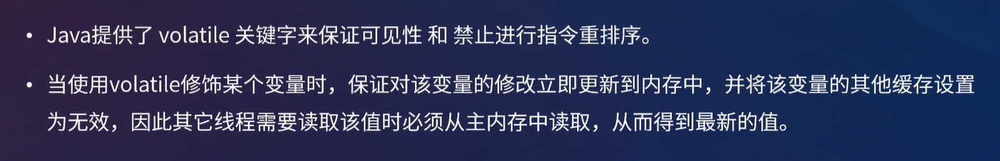
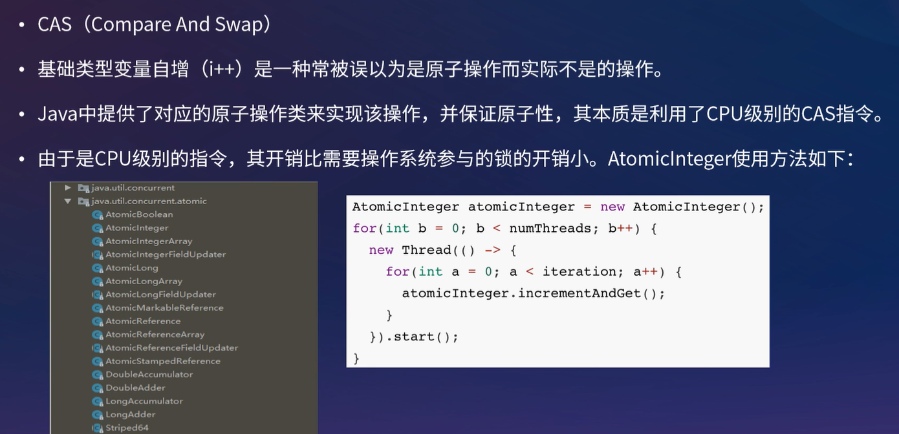

[toc]

## 一、线程基础

从操作系统的角度，可以简单认为，**线程是系统调度的最小单元**，一个进程可以包含多个线程，线程直接读取的数据位于寄存器中，但是会和进程内其他线程共享文件描述符、虚拟地址空间等。

Thread.States类中定义线程的状态，即线程的生命周期

- **NEW**：线程被创建出来还没真正启动的状态，可以认为它是个 Java 内部状态

- **RUNNABLE（就绪）**：线程已经在 JVM 中执行，当然由于执行需要计算资源，它可能是正在运行，也可能还在等待系统分配给它 CPU 片段，在就绪队列里面排队

- **BLOCKED（阻塞） **：线程在等待 Monitor lock，即尝试获取锁，但由于锁被其他线程独占而处于阻塞状态

- **WAITING（等待）**：正在等待另一个线程的动作，如调用了 `wait()` 、`join()`

- **TIME_WAITING（计时等待）**：正在等待另一个线程的操作，但是有时间限制，如调用了 `wait(long)` 、`sleep(long)` 、`joing(long) `

- **TERMINATED（终止）**：不管是意外退出还是正常执行结束，线程已经完成使命，终止运行，也有人把这个状态叫作死亡

## 二、多线程基础

**线程：**CPU任务调度的最小单位，获得CPU派发的时间片，则开始执行任务。当时间分片被派发给别的线程时，通过程序计数器（PC寄存器）来记录执行的字节码行号。

**注意：**程序在**多线程（或多进程）环境下同时 执行**，同时进行并不是完全指进程或线程在不同的物理 CPU 上独立运行，更多情况下，**是在一个物理 CPU 上交替执行多个线程或进程**。并发既可在线程中，也可在进程中。

**CPU密集型任务：**需要大量CPU算力的任务，本身耗时短，所以不适合创建大量线程（大量线程上下文切换耗时，得不偿失）

**IO密集型任务：**需要大量磁盘IO的任务，本身阻塞时间长，所以适合创建大量线程执行任务（大量线程上下文切换耗时总比长时间IO阻塞好）

### 1. 并发编程三大核心特性

多线程环境下需要保证原子性、可见性、有序性

#### 1.1 原子性

定义：一个或者多个操作**要么全部成功要么全部失败**，并且**不能被其他线程干扰或打断**

如下所示，结果并不是10000，而是9688。

count++ 的执行实际上不是原子性的，而会被拆分成以下三个步骤执行（这样的步骤不是虚拟的，而是真实情况就是这么执行的）

1. 从主内存中读取 count 的值
2. 计算 +1 的结果
3. 将 +1 的结果赋值给 count变量

如此，便导致线程A还未完成第三步，CPU就切换到线程B执行任务，导致线程B读取到了线程A还未写入的值，最后结果被覆盖

#### 1.2 可见性

定义：一个线程对**共享变量的修改**，**另一个线程需要立即可见**

如下所示，结果并不是10000，而是9688。

CPU写本地缓存速度快、内存写速度中、磁盘写速度慢，导致数据同步延时，引发数据不一致的情况。

所以CPU引入了本地缓存，如果CPU本地缓存不能及时刷到内存，并发时就会导致可见性的问题

#### 1.3 有序性

定义：程序的**执行顺序**按照**代码的先后顺序**执行

重排序在**单线程环境下是安全**的，类型如下

- **编译器优化的重排序**：编译器在**不改变单线程程序语义的前提**下，可以**重新安排语句的执行顺序**
- **指令级并行的重排序**：现代处理器采用了**指令级并行技术**（Instruction-Level Parallelism，ILP）来将多条指令重叠执行。如果**不存在数据依赖性**，处理器可以**改变语句对应机器指令的执行顺序**
- 内存系统的重排序：由于处理器使用缓存和读/写缓冲区，这使得加载和存储操作看上去可能是在乱序执行

##### 重排序引发线程安全问题的经典案例

双重检查锁的单例模式

看似没有问题，但创建对象并不是一个原子操作，而是被拆分成了以下三个步骤：

- 分配对象的内存空间--------->>>初始化对象--------->>>设置instance指向刚分配的内存地址

被重排后，顺序如下：

- 分配对象的内存空间--------->>>设置instance指向刚分配的内存地址--------->>>初始化对象

多线程环境下，可能导致线程B读到了因为重排序而尚未初始化的对象。

### 2. JMM

##### 2.1 背景

在**不同的硬件平台**和**不同的操作系统**下，**内存的访问逻辑有一定的差异**，当你的**代码在A操作系统环境下运行良好**，并且**线程安全**，但是**换个操作系统就出现各种问题。**

#####  2.2 JMM定义

**JMM（Java Memory Model）**就是Java 内存模型，**针对多线程并发**环境的**原子性**、**可见性**和**有序性**定义出了一套规则，来**保证多个线程**间可以有效地、**正确地协同工作**。

为了Java的**可以植性**，还需要**屏蔽**不同硬件平台和**不同操作系统访问内存的差异。**

**注意：**为了获得较好的执行性能，JMM存在以下问题

- JMM 执行引擎还是使用 **CPU寄存器** 和 **高速缓存 **来提升指令执行速度
- JMM 没有限制编译器对指令进行重排序。

也就是说 JMM也会**存在缓存一致性问题**和**指令重排序**的问题。

##### 2.3 JMM内存结构

JMM 将内存划分为主内存（Main Memory）和工作内存（Working Memory）

- 主内存（Main Memory）：Java进程内存。**所有的共享变量**都存储**在主内存**中
- 工作内存（Working Memory）：线程的工作内存使用的是**寄存器和高速缓存**。工作内存是每个线程私有的本地内存

当线程访问变量时，需要去主内存中读取并加载变量值到工作内存中，对变量的操作都在自己的工作线程进行，最后将变量值刷入主内存。

##### 2.4 JMM内存交互操作

##### 2.5 happens-before原则（先行发生原则）

- **传递规则：**如果操作1先行于操作2，操作2先行于操作3，那么操作1肯定先行于操作3

- **锁定规则：**一个锁的 **unlock**操作 **先行于** **该锁的Lock**操作（锁后只有unlock后才能Lock）
- **volatile变量规则：**对一个被 **volatile** 修饰的变量**写操作** **先行于** 对该变量的**读操作**
- 程序相关规则
  - **程序次序规则：**一个线程内，按照**代码顺序执行**
- 对象相关规则
  - **对象终结规则：**一个对象**构造** **先行于** 它的 **finalize**
- 线程相关规则
  - 线程启动规则：Thread对象的 **start()**方法 **先行于** 此线程的**其他动作**
  - 线程中断规则：线程**interrupt()**方法 **先行于** 对该**中断异常的捕获**
  - 线程终结原则：线程的**终止检测**（Thread.join()、Thread.isAlive()） **后行于** 线程中的**其他所有操作**

### 3. 线程安全

线程安全定义：**多线程环境下**，保证**共享的、可修改的状态（数据）的正确性**

## 三、关键字

##### 1. volatile

volatile本质是告诉JVM当前变量在寄存器中的值是不确定的，需要从主存中读取。

设置屏障指令，在屏障指令之前的操作执行完后，才能只能屏障后面的才能操作，也就是volatile标记的变量不会被编译器优化的重排序

##### 2. synchronized

##### volatile 和 synchronized区别

最大区别在于原子性，synchronized具有原子性

## 四、CAS

## 五、JUC

## 六、线程池

