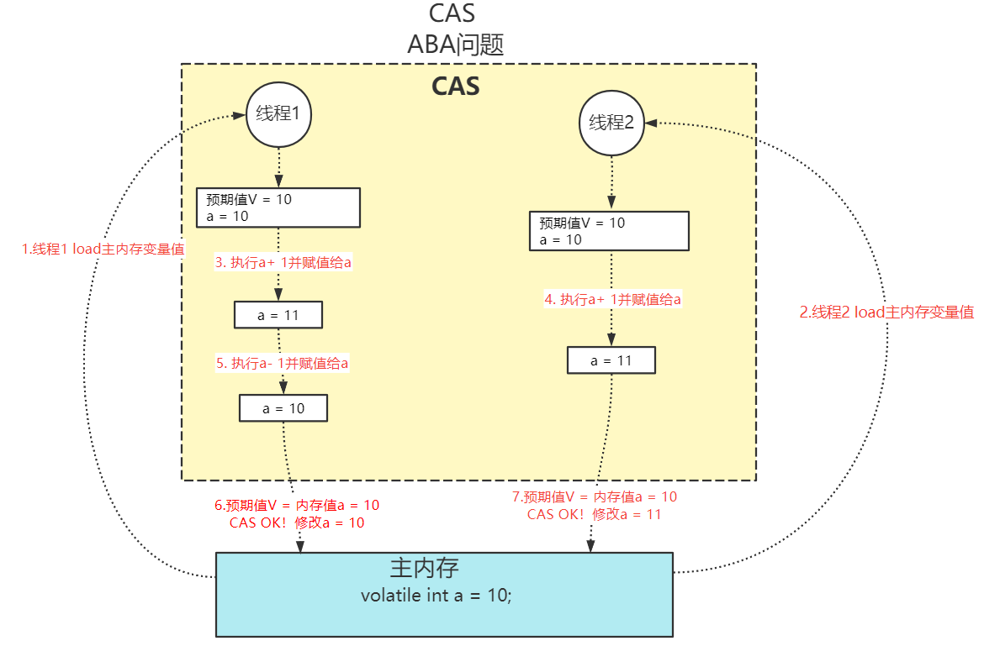
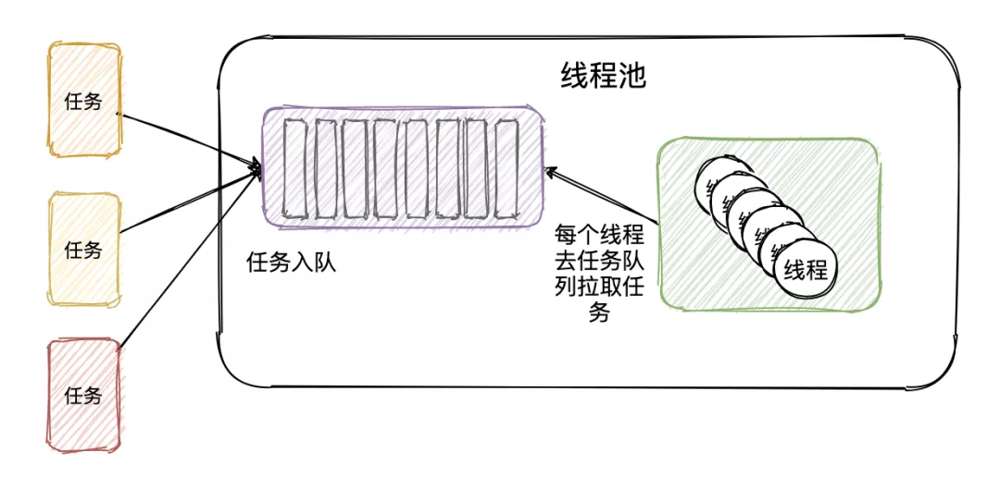

[toc]

## 一、线程基础

从操作系统的角度，可以简单认为，**线程是系统调度的最小单元**，一个进程可以包含多个线程，线程直接读取的数据位于寄存器中，但是会和进程内其他线程共享文件描述符、虚拟地址空间等。


Thread.States类中定义线程的状态，即线程的生命周期


- **NEW**：线程被创建出来还没真正启动的状态，可以认为它是个 Java 内部状态

- **RUNNABLE（就绪）**：线程已经在 JVM 中执行，当然由于执行需要计算资源，它可能是正在运行，也可能还在等待系统分配给它 CPU 片段，在就绪队列里面排队

- **BLOCKED（阻塞） **：线程在等待 Monitor lock，即尝试获取锁，但由于锁被其他线程独占而处于阻塞状态

- **WAITING（等待）**：正在等待另一个线程的动作，如调用了 `wait()` 、`join()`

- **TIME_WAITING（计时等待）**：正在等待另一个线程的操作，但是有时间限制，如调用了 `wait(long)` 、`sleep(long)` 、`joing(long) `

- **TERMINATED（终止）**：不管是意外退出还是正常执行结束，线程已经完成使命，终止运行，也有人把这个状态叫作死亡


## 二、多线程基础

**线程：**CPU任务调度的最小单位，获得CPU派发的时间片，则开始执行任务。当时间分片被派发给别的线程时，通过程序计数器（PC寄存器）来记录执行的字节码行号。

**注意：**程序在**多线程（或多进程）环境下同时 执行**，同时进行并不是完全指进程或线程在不同的物理 CPU 上独立运行，更多情况下，**是在一个物理 CPU 上交替执行多个线程或进程**。并发既可在线程中，也可在进程中。

**CPU密集型任务：**需要大量CPU算力的任务，本身耗时短，所以不适合创建大量线程（大量线程上下文切换耗时，得不偿失）

**IO密集型任务：**需要大量磁盘IO的任务，本身阻塞时间长，所以适合创建大量线程执行任务（大量线程上下文切换耗时总比长时间IO阻塞好），比如Tomcat的线程池就是直接将线程创建到设置的最大值。

### 1. 并发编程三大核心特性

多线程环境下需要保证原子性、可见性、有序性

#### 1.1 原子性

定义：一个或者多个操作**要么全部成功要么全部失败**，并且**不能被其他线程干扰或打断**

如下所示，结果并不是10000，而是9688。


count++ 的执行实际上不是原子性的，而会被拆分成以下三个步骤执行（这样的步骤不是虚拟的，而是真实情况就是这么执行的）

1. 从主内存中读取 count 的值
2. 计算 +1 的结果
3. 将 +1 的结果赋值给 count变量

如此，便导致线程A还未完成第三步，CPU就切换到线程B执行任务，导致线程B读取到了线程A还未写入的值，最后结果被覆盖


#### 1.2 可见性

定义：一个线程对**共享变量的修改**，**另一个线程需要立即可见**

重排序类型如下

- 编译器重排序：对于没有先后依赖关系的语句，编译器可以重新调整语句的执行顺序。
- CPU指令重排序：现代处理器采用了指令级并行技术（Instruction-Level Parallelism，ILP）来将多条指令重叠执行，让没有依赖关系的多条指令并行
- **CPU内存重排序：**CPU有自己的缓存，指令的执行顺序和写入主内存的顺序不完全一致

影响可见性的是CPU内存重排序

多线程环境下的CPU内存重排序，将导致并发安全问题

如下所示，结果并不是10000，而是9688。


CPU写本地缓存速度快、内存写速度中、磁盘写速度慢，导致数据同步延时，引发数据不一致的情况。

所以CPU引入了本地缓存，如果CPU本地缓存不能及时刷到内存，并发时就会导致可见性的问题


#### 1.3 有序性

定义：程序的**执行顺序**按照**代码的先后顺序**执行

重排序在类型如下

- **编译器重排序：**对于**没有先后依赖关系**的语句，**编译器**可以**重新调整语句的执行顺序**。
- **CPU指令重排序：**现代处理器采用了**指令级并行技术**（Instruction-Level Parallelism，ILP）来将多条指令重叠执行，**让没有依赖关系的多条指令并行**
- CPU内存重排序：CPU有自己的缓存，指令的执行顺序和写入主内存的顺序不完全一致

多线程环境下的指令重排序和编译器优化重排序，将导致并发安全问题，影响执行的有序性

##### 重排序引发线程安全问题的经典案例

双重检查锁的单例模式


看似没有问题，但创建对象并不是一个原子操作，而是被拆分成了以下三个步骤：

- 分配对象的内存空间--------->>>初始化对象--------->>>设置instance指向刚分配的内存地址

被重排后，顺序如下：

- 分配对象的内存空间--------->>>设置instance指向刚分配的内存地址--------->>>初始化对象

多线程环境下，可能导致线程B读到了因为重排序而尚未初始化的对象。


### 2. JMM

##### 2.1 背景

在不同的硬件平台和不同的操作系统下，内存的访问逻辑有一定的差异，当你的代码在A操作系统环境下运行良好，并且线程安全，但是换个操作系统就出现各种问题。

为了Java的**移植性**，还需要**屏蔽**不同硬件平台和**不同操作系统访问内存的差异。**


#####  2.2 为什么需要JMM？

**JMM（Java Memory Model）**就是Java内存模型，它的**执行引擎**为了**弥补直接读内存带来的的性能差异**，还是使用**CPU缓存和寄存器**，来。并且**为了更快的执行效率**，对**编译器和CPU指令并没做重排序的限制**。

这就意味着在，多线程环境下，JMM中会有内存不可见性、以及指令重排序等线程不安全问题。

但是，JMM**为了保证多线程的安全性**，**提供了一套内存访问操作规范（happens-before）来保证原子性、可见性和有序性**。需不需**保证并发安全，完全由开发者自己决定**，在代码层面的实现为volatile、synchronized、CAS等。


##### 2.3 JMM内存结构

JMM 将内存划分为主内存（Main Memory）和工作内存（Working Memory）

- 主内存（Main Memory）：Java进程内存。**所有的共享变量**都存储**在主内存**中
- 工作内存（Working Memory）：线程的**工作内存是个抽象概念**，实际使用的是**寄存器和高速缓存**。工作内存是每个线程私有的本地内存

就是为了弥补CPU与主内存两者之间的性能差异，从而使用了CPU高速缓存和寄存器作为线程的工作内存。Java线程每次操作数据都从自己的工作内存中进行，先去主内存读取变量的值然后拷贝到工作内存中的变量副本中，使用完后再写入主内存。但是**在多线程环境中，各线程的工作内存互不可见**，会导致线程不安全。

但是，JMM**为了保证多线程的安全性**，**提供了一套内存访问操作规范（happens-before）来保证原子性、可见性和有序性**。需不需**保证并发安全，完全由开发者自己决定**，在代码层面的实现为volatile、synchronized、CAS等。


##### 2.4 JMM内存交互操作

JMM内存交互一共有 8种 原子性操作，原子性意为不可再分的（对于double和long类型的变量来说，load、store、read和write操作在某些平台上允许例外）。


| 操作指令         | 作用域                 | 说明                                                         |
| ---------------- | ---------------------- | ------------------------------------------------------------ |
| lock （锁定）    | 作用于主内存的变量     | 把一个变量标识为线程独占状态。                               |
| unlock （解锁）  | 作用于主内存的变量     | 把一个处于锁定状态的变量释放出来，释放后的变量才可以被其他线程锁定。 |
| read （读取）    | 作用于主内存变量       | 把一个**变量的值**从主内存**传输到线程的工作内存**中，以便随后的load动作使用。 |
| load （载入）    | 作用于工作内存的变量   | 把**read操作的值放入到工作内存的变量副本**中。               |
| use （使用）     | 作用于工作内存中的变量 | 把工作内存中的变量**传输给执行引擎**，每当虚拟机遇到一个需要使用到变量值，就会使用到这个指令。 |
| assign （赋值）  | 作用于工作内存中的变量 | 把一个**从执行引擎中接受到的值放入工作内存的变量副本**中。   |
| store （存储）   | 作用于主内存中的变量   | 把工作内存中一个**变量的值传输到主内存**，以便后续的write使用。 |
| write 　（写入） | 作用于主内存中的变量   | 把store操作**从工作内存得到的变量值放入主内存的变量中**。    |


##### 2.5 JMM内存操作规范——happens-before原则（先行发生原则）

- **传递规则：**如果操作1先行于操作2，操作2先行于操作3，那么操作1肯定先行于操作3

- **锁定规则：**一个锁的 **unlock**操作 **先行于** **该锁的Lock**操作（锁后只有unlock后才能Lock）
- **volatile变量规则：**对一个被 **volatile** 修饰的变量**写操作** **先行于** 对该变量的**读操作**
- 程序相关规则
  - **程序次序规则：**一个线程内，按照**代码顺序执行**
- 对象相关规则
  - **对象终结规则：**一个对象**构造** **先行于** 它的 **finalize**
- 线程相关规则
  - 线程启动规则：Thread对象的 **start()**方法 **先行于** 此线程的**其他动作**
  - 线程中断规则：线程**interrupt()**方法 **先行于** 对该**中断异常的捕获**
  - 线程终结原则：线程的**终止检测**（Thread.join()、Thread.isAlive()） **后行于** 线程中的**其他所有操作**


### 3. 线程安全

定义：**多线程环境下**，保证**共享的、可修改的状态（数据）的正确性**

- 原子性

  使用**synchronized**关键字、**AQS同步锁**（ReentratLock）、具有**原子性的类**（底层由CAS实现）

  ```java
  x = 10; 		//语句1 原子操作
  y = x; 			//语句2 非原子操作
  x++; 			//语句3 非原子操作
  x = x + 1; 		//语句4 非原子操作
  ```

- 可见性

  **synchronized**关键字和**AQS同步锁**：通过happens-before原则规定的必须工作内存的值**write写入到主内存的变量后，才能unlock锁**

  **volatile**关键字：共享变量被volatile修饰时，保证工作内存中对该变量的修改**立即更新到主内存**中，并将**其他线程的工作内存**中的该**共享变量**值设置为**无效**，重新到主内存中读取新值。本质：告诉JVM**当前变量在寄存器中的值是不确定的，需要从主内存中读取**。

- 有序性

  **synchronized**关键字和**AQS同步锁**：保证只有单线程执行指令，所以不存在多线程指令乱序的情况

  **volatile**关键字：CPU和编译器提供的禁止指令重排的代码实现


## 三、关键字

### 1. volatile

volatile是 **CPU和编译器层面**提供的 **可见性** 和 **禁止指令重排**的代码实现

##### 1.1 可见性

共享变量被volatile修饰时，保证工作内存中对该变量的修改**立即更新到主内存**中，并将**其他线程的工作内存**中的该**共享变量**值设置为**无效**，重新到主内存中读取新值。

本质：告诉JVM**当前变量在寄存器中的值是不确定的，需要从主内存中读取**。


**falg被volatile修饰**，当线程B已经读取了flag = false，由于**线程A将修改后的flag变量刷到了主内存**，所以**线程B**中的**缓存失效**，需要**重新到主内存中获取**。


##### 1.2 禁止指令重排-内存屏障

Memory barrier内存屏障，是    **CPU和编译器层面提供的 **     **禁止指令重排**     的**一套指令**

设置屏障指令，在屏障指令之前的所有操作执行完后，才能执行屏障后面的操作，也就是volatile标记的变量不会被编译器几二CPU重排优化

1. 在volatile写操作的前面插入一个StoreStore屏障。保证volatile写操作不会和之前的写操作重排序。
2. 在volatile写操作的后面插入一个StoreLoad屏障。保证volatile写操作不会和之后的读操作重排序。
3. 在volatile读操作的后面插入一个LoadLoad屏障+LoadStore屏障。保证volatile读操作不会和之后的读操作、写操作重排序


### 2. synchronized

[synchronized锁相关知识](./常见锁)

##### 2.1 原子性

##### 2.2 可见性

##### 2.3 有序性

##### 2.4 可重入性


### 3. volatile 和 synchronized区别

区别很大

volatile是 **CPU和编译器层面**提供的 **可见性** 和 **禁止指令重排**的代码实现，和synchronized关键字实现可见性和有序性有着本质上的区别。只能修饰变量

synchronized 是JVM提供的一个同步锁，可以修饰方法、代码块。通过锁机制解决多线程下可见性、有序性、原子性的并发问题。


## 四、CAS

### 1. 什么是CAS？

CAS（Compare And Swap）翻译过来就是比较并交换，**判断内存中的某个值是否为预期值**（Compare），**是就更新**（Swap），这个过程是**原子性的**。

解释：CAS有三个操作数，内存值V，旧预期值A，要更新的值B。仅当预期值A=内存值V时，才将内存值V修改为B，否则什么都不做。

**CAS是CPU并发原语（属于操作系统范畴，依赖硬件，不能被中断）**，也就是说**CAS是CPU层面提供的原子指令**（cmpxchg），该指令可在用户态执行，**无需切换到内核态**。


### 2. Java CAS的实现及使用案例

**实现：**Java CAS 操作 依赖 Unsafe类（由C++编写，底层调用汇编去执行CPU cmpxchg指令）。

**使用案例：** **CAS**（原子性） 配合   **volatile**（可见性），是**原子操作类（如AtomicInteger）、AQS、synchronized的底层实现**

以AtomicInteger的自增加一来说明：

- java.util.concurrent.atomic.AtomicInteger#getAndIncrement

  - 底层调用Unsafe的 **cas 方法** 比较 **当前主内存的值 与 工作内存中的期望值  是否相等**

  - value使用volatile修饰，内存中该变量值被立即可见（vlalue更新后可见，才能保证cas自旋成功）。

  ```java
  static {
      try {
          valueOffset = unsafe.objectFieldOffset
              (AtomicInteger.class.getDeclaredField("value"));
      } catch (Exception ex) { throw new Error(ex); }
  }
  
  private volatile int value;
  
  
  /**
  * 参数说明：
  * this: atomicInteger对象
  * valueOffset：对象的内存地址
  * unsafe：sun.misc.Unsafe类
  * AtomicInteger中变量value使用volatile修饰，保证内存可见。
  * 结论：底层依赖CAS操作/Unsafe类
  */
  public final int getAndIncrement() {
      return unsafe.getAndAddInt(this, valueOffset, 1);
  }
  ```

- sun.misc.Unsafe

  Unsafe类的getAndAddInt()方法**调用cas，若失败则一直自旋**，尝试修改主内存，Unsafe的cas是个本地方法，由C++编写 调用汇编去执行CPU cmpxchg指令。
  
  ```java
  public final class Unsafe {
  
      // ...
      
      public final native boolean compareAndSwapInt(Object var1, long var2, int var4, int var5);
  
      /**
  * compareAndSwapInt：即CAS
  * while: 如果修改失败，会一直尝试修改，直到成功。
  */
      public final int getAndAddInt(Object var1, long var2, int var4) {
          int var5;
          do {
              var5 = this.getIntVolatile(var1, var2);
          } while(!this.compareAndSwapInt(var1, var2, var5, var5 + var4));
  
          return var5;
      }
      
      // ...
  }
  ```


### 3. Java CAS存在的问题

- 循环时间长，开销大

  如果cas失败，就一直do while尝试。如果长时间不成功，可能给CPU带来很大开销。

- **存在ABA问题**

  - 线程1从内存位置V中取出A，此时线程2也取出A
  - 线程2做了一次cas将值改为了B，然后又做了一次cas将值改回了A
  - 线程1做cas发现内存中还是A，则线程1也操作成功
  - 这个时候实际上A值已经被其他线程改变过，这与设计思想是不符合的

  如果不在乎B那就没关系，如果B存在会造成影响，那就有问题。

  


### 4. 如何解决ABA问题

解决思路：为变量追加版本号stamp，每次**变量更新的时**，把**变量的版本号stamp加一**，这样只要变量被某一个线程修改过，该变量**版本号就会发生递增**操作，从而解决了ABA变化

在Java中，有**AtomicStampedReference<E>**和**AtomicMarkableReference<E>**都可以解决ABA问题

例如下面的代码分别用**AtomicInteger**和**AtomicStampedReference**来对初始值为100的原子整型变量进行更新

AtomicInteger会成功执行CAS操作，而加上版本戳的AtomicStampedReference对于ABA问题会执行CAS失败


```java
import java.util.concurrent.TimeUnit;
import java.util.concurrent.atomic.AtomicInteger;
import java.util.concurrent.atomic.AtomicStampedReference;

public class ABA {

    private static AtomicInteger atomicInt = new AtomicInteger(100);
    private static AtomicStampedReference<Integer> atomicStampedRef = new AtomicStampedReference<Integer>(100, 0);

    public static void main(String[] args) throws InterruptedException {
        Thread intT1 = new Thread(new Runnable() {
            @Override
            public void run() {
                atomicInt.compareAndSet(100, 101);
                atomicInt.compareAndSet(101, 100);
            }
        });

        Thread intT2 = new Thread(new Runnable() {
            @Override
            public void run() {
                try {
                    TimeUnit.SECONDS.sleep(1);
                } catch (InterruptedException e) {
                    e.printStackTrace();
                }
                boolean c3 = atomicInt.compareAndSet(100, 101);
                System.out.println(c3);        //true
            }
        });

        intT1.start();
        intT2.start();
        intT1.join();
        intT2.join();

        Thread refT1 = new Thread(new Runnable() {
            @Override
            public void run() {
                try {
                    TimeUnit.SECONDS.sleep(1);
                } catch (InterruptedException e) {
                    e.printStackTrace();
                }
                atomicStampedRef.compareAndSet(100, 101, 
                                               atomicStampedRef.getStamp(), atomicStampedRef.getStamp()+1);
                atomicStampedRef.compareAndSet(101, 100, 
                                               atomicStampedRef.getStamp(), atomicStampedRef.getStamp()+1);
            }
        });

        Thread refT2 = new Thread(new Runnable() {
            @Override
            public void run() {
                int stamp = atomicStampedRef.getStamp();
                System.out.println("before sleep : stamp = " + stamp);    // stamp = 0
                try {
                    TimeUnit.SECONDS.sleep(2);
                } catch (InterruptedException e) {
                    e.printStackTrace();
                }
                System.out.println("after sleep : stamp = " + atomicStampedRef.getStamp());//stamp = 1
                boolean c3 = atomicStampedRef.compareAndSet(100, 101, stamp, stamp+1);
                System.out.println(c3);        //false
            }
        });

        refT1.start();
        refT2.start();
    }

}
```


## 五、常见锁机制

[常见锁相关原理](./常见锁)


## 六、JUC

[JUC相关知识](./JUC)


## 七、线程池

### 1. 为什么使用多线程？

如果只有单线程的话，**遇到IO阻塞**，那么**该线程就会被CPU挂起**。没有其他线程的话，**CPU强大的算力资源**就会处于长时间的**空闲状态**，并且系统处于长时间阻塞状态。**为了提高CPU利用率**，所以需要使用多线程。


### 2. 为什么要用线程池？

##### 2.1 时间开销

JVM线程 与 OS的线程一一对应，当JVM需要**创建和销毁线程**时，**必须通过 OS对应的API 去调用CPU资源**。由于OS调用就涉及到用户态和内核态**上下文切换**。并且还需要**分配空间**、**列入调度**等操作

##### 2.2 内存开销

JVM 给**每一个线程都分配一个默认大小为 1MB 栈**空间，如果创建成百上千的线程，**很容易就占用1GB的内存**，所以必须控制号线程的数量

##### 2.3 池化设计

综上所述，**创建和销毁线程**带来的**时间开销**和**内存开销**，**是不可被忽略的**。因此我们要考虑**如何复用这些线程、以及如何限制线程数量**，线程池也由此诞生。


### 3. 怎么理解线程池技术

线程池对于我们开发者而言就是一个**黑盒**，我们**只需要往里面提交任务**，而**无需关心其内部线程运作的细节**。那么线程池内部的构造是怎么样的呢？

- 首先，线程池是经典的**生产者-消费者模式**，内部维护了一个**队列存储我们提交的任务**，

- 然后，维护一个有一定数量线程的列表，不断地去队列获取任务执行。
- 提供个性化的配置，比如：队列使用何种阻塞队列、核心线程数，非核心线程存活时间、最大线程数、任务的执行策略（先放入队列还是先创建最大线程数）、线程池监控埋点（可以用开源组建metric检控埋点数据），等等。。



```java
public class YesThreadPool {
    
    BlockingQueue<Runnable> taskQueue; //存放任务的阻塞队列
    List<YesThread> threads; //线程列表
    
    YesThreadPool(BlockingQueue<Runnable> taskQueue,int threadSize) {
        this.taskQueue = taskQueue;
        threads = new ArrayList<>(threadSize);
        // 初始化线程，并定义名称
        IntStream.rangeClosed(1,threadSize).forEach((i) -> {
            YesThread thread = new YesThread("yes-taskthread-"+ i);
            thread.start();
            threads.add(thread);
        });
    }
    
    // 提交任务将任务存放到阻塞队列中
    public void execute(Runnable task) throws InterruptedException {
        taskQueue.put(task);
    }
    
    // 自定义线程,不断循环的去阻塞队列获取任务
    class YesThread extends Thread { 
        
        public YesThread(String name) {
            super(name);
        }
        
        @Override
        public void run() {
            while (true) {
                Runnable task = null;
                try {
                    task = taskQueue.take(); //不断从任务队列获取任务
                } catch (InterruptedException e) {
                    logger.error("记录点东西.....", e);
                }
                task.run(); //执行
            }
        }
    }
}
```


### 4. ThreadPoolExcecutor

##### 4.1 ThreadPoolExcutor工作原理

ThreadPoolExcutor中的线程并不是随线程池创建而创建，而是使用**懒加载**的方式，只有在**提交任务时才创建线程**。一旦有任务提交，**为了满足日常任务的需求**，**每次提交任务都会创建线程**，直到**达到核心线程数**为止，属于**懒中带急**的方式。


1. 提交任务到线程池，判断 **当前线程数是否**  <  **核心线程数**。若小于核心数，则创建新线程来处理任务。

2. 若当前线程数大于或等于核心线程数，则判断阻塞队列是否已满。若没满，则放入阻塞队列。

3. 若阻塞队列已满，则判断 **当前线程数是否**  <  **最大线程数**。若小于最大数，则创建新线程来处理任务。
4. 若队列也满，当前线程数也达到了最大线程数，则采用拒绝策略


##### 4.2 ThreadPoolExecutor内部构造

```java
public ThreadPoolExecutor(int corePoolSize,
                          int maximumPoolSize,
                          long keepAliveTime,
                          TimeUnit unit,
                          BlockingQueue<Runnable> workQueue) {
    this(corePoolSize, maximumPoolSize,
         keepAliveTime, unit, workQueue,
         Executors.defaultThreadFactory(),
         defaultHandler);
}
```

- 核心线程：相当于公司核心员工，满足日常任务所必须的中坚力量。
- 最大线程数：相当于公司临时工，应付突发情况。在完成任务后，达到设定的时间后会被销毁。
- KeepAliveTime：当有线程空闲时间超过存活时间，并且当前的线程数超过核心线程数，则销毁此线程。
- WorkQueue：起到一个缓冲、削峰的作用。大小取决于任务执行时长、线程数、业务对于等待时间的容忍度。不能太大会占用很多内存。


##### 4.3 ThreadPoolExcecutor生命周期


##### 4.4 为什么要把任务先放在任务队列里面，而不是把线程先拉满到最大线程数？

我认为ThreadPoolExcecutor线程池设计的最初目的是，偏向CPU密集型的任务。因为CPU密集型的任务本来就依赖CPU算力，不涉及大量的耗时，所以优先考虑堆积任务。如果先创建大量的线程，就会导致CPU频繁切换线程造成大量耗时，反而得不偿失了。


