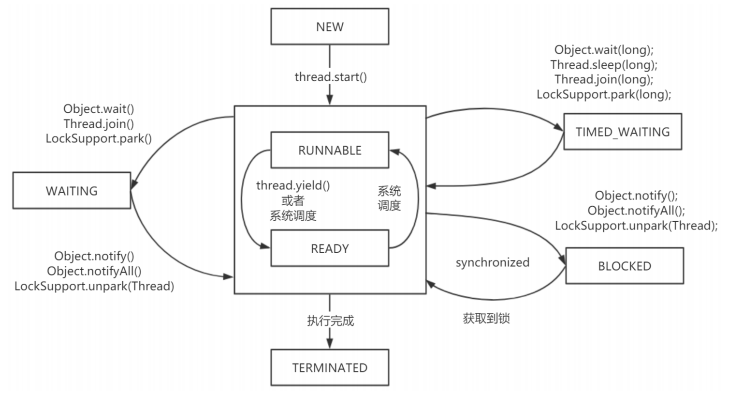

[toc]

### 1. 线程的简介

从操作系统的角度，可以简单认为，==线程是系统调度的最小单元==，一个进程可以包含多个线程，作为任务的真正运作者，有==自己的栈（Stack）==、==寄存器（Register）==、==本地存储（Thread Local）==等，但是会和进程内其他线程共享文件描述符、虚拟地址空间等。

### 2. 线程的生命周期

Thread.States类中定义线程的状态，即线程的生命周期

- **NEW**：线程被创建出来还没真正启动的状态，可以认为它是个 Java 内部状态

- **RUNNABLE（就绪）**：线程已经在 JVM 中执行，当然由于执行需要计算资源，它可能是正在运行，也可能还在等待系统分配给它 CPU 片段，在就绪队列里面排队

- **BLOCKED（阻塞） **：线程在等待 Monitor lock，即尝试获取锁，但由于锁被其他线程独占而处于阻塞状态

- **WAITING（等待）**：正在等待另一个线程的动作，如调用了 `wait()` 、`join()`

- **TIME_WAITING（计时等待）**：正在等待另一个线程的操作，但是有时间限制，如调用了 `wait(long)` 、`sleep(long)` 、`joing(long) `

- **TERMINATED（终止）**：不管是意外退出还是正常执行结束，线程已经完成使命，终止运行，也有人把这个状态叫作死亡

