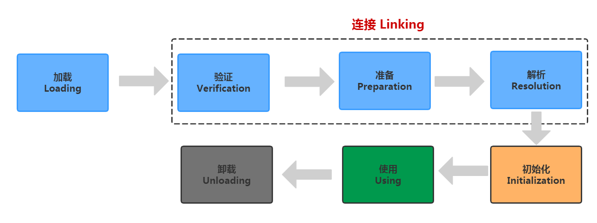
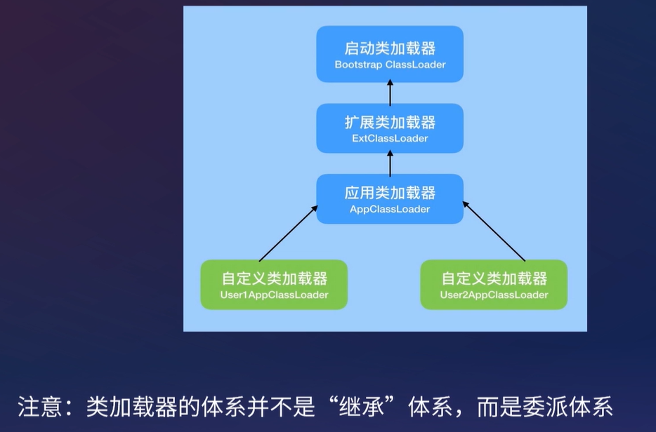
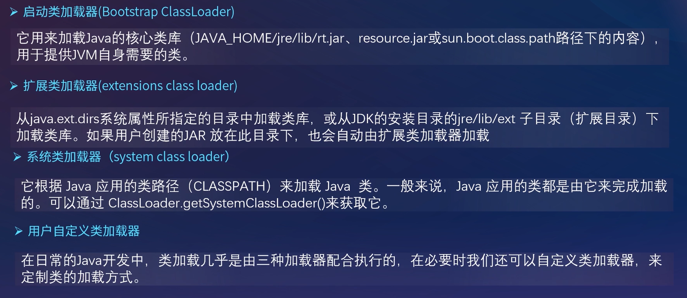
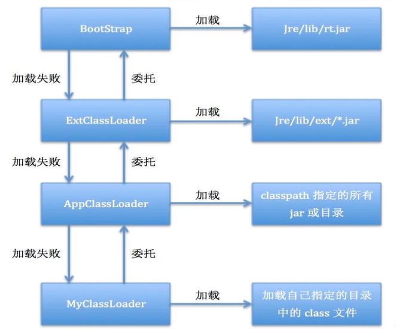
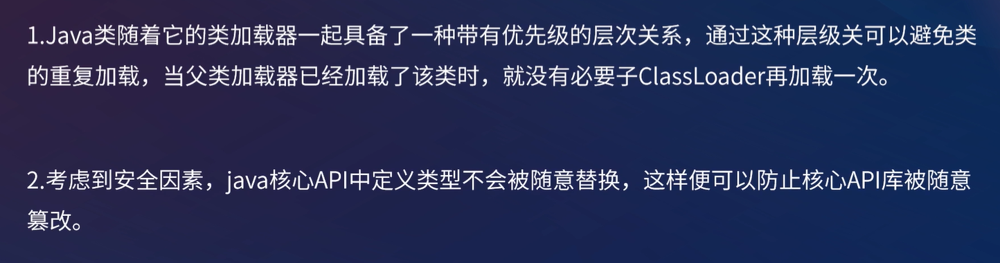
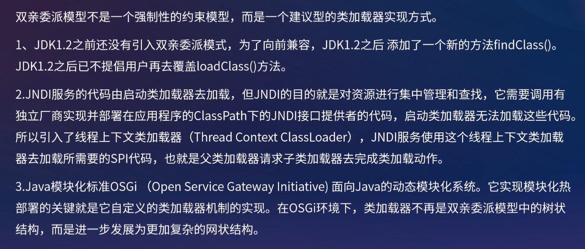

[toc]

## 一、类加载

#### 类加载定义


#### 类加载触发时机

- **预加载**

  **JVM启动时加载**，加载的是JAVA_HOME/lib/下的**rt.jar下的.class文件**，这个jar包里面的内容是程序运行时非常常常用到的，如java.lang.*、java.util.、java.io. 等等，因此随着虚拟机一起加载。要证明这一点很简单，写一个空的main函数，设置虚拟机参数为**"-XX:+TraceClassLoading"**来获取类加载信息，运行一下

- **运行时加载**

  虚拟机在用到一个类时（**new对象**、**读取静态变量或代码块**、**调用静态方法**、**反射**、**初始化子类时先初始化父类**），会先去内存中查看一下这个.class文件有没有被加载，如果没有就会按照类的全限定名来加载这个类

  - 获取.class文件的二进制流
  - 将类信息、静态变量、字节码、常量这些.class文件中的内容放入方法区中
  - 在内存中生成一个代表这个.class文件的java.lang.Class对象，作为方法区这个类的各种数据的访问入口。一般这个Class是在堆里的，不过HotSpot虚拟机比较特殊，这个Class对象是放在方法区中的


#### 类加载执行过程（类的生命周期）




- 加载：

  虚拟机在用到一个类时（**new对象**、**读取静态变量或代码块**、**调用静态方法**、**反射**、**初始化子类时先初始化父类**），会先去内存中查看一下这个.class文件有没有被加载，如果没有就会按照类的全限定名来加载这个类，**获取.class文件的二进制流**

- 验证：**检查加载的class文件的正确性**，.class文件未必要从Java源码编译而来，防止有心人使用十六进制编辑器编写**有害的字节流**而导致系统崩溃，所以验证是**虚拟机对自身保护**

- 准备：给**类信息、静态变量、常量分配内存**并**设置静态变量默认初始值**的阶段，这些变量所使用的内存都将**在方法区中分配**
- 解析：虚拟机将**常量池**内的**符号引用替换为直接引用**的过程。**符号引用就是一个标识**，而**直接引用指向一个内存中的地址**

- 初始化：对**静态变量和静态代码块进行初始化**工作（即程序员编写的值，而**非准备阶段的默认值**）


#### 类加载器的分类和作用






## 二、双亲委派模型

#### 什么是双亲委派模型




###### 1. ClassLoader.loadClass(String name, boolean resolve)，resolve是否链接

###### 2. ClassLoader.findClass(String name) 没有实现，直接抛出了ClassNotFoundException异常

###### 3. ClassLoader.defineClass(String name, java.nio.ByteBuffer b,ProtectionDomain protectionDomain) 将字节流解析成Class对象

###### 4. AppClassLoader和ExtClassLoader继承于URLClassLoader继承于SecureClassLoader继承于ClassLoader

###### 5. URLClassLoader实现findClass方法，通过类名获取对应字节码流，然后通过ClassLoader.defineClass方法解析成Class对象返回。

###### 6.AppClassLoader和ExtClassLoader都是Launcher的内部类，Java应用在启动前，JVM创建Launcher初始化程序运行所需要的类加载器。Launcher初始化时，首先初始化ExtClassLoader，然后将ExtClassLoader作为父类加载器初始化AppClassLoader。ExtClassLoader没有父类加载器（在loadClass中，没有父类加载器时委托给启动类加载器）

```java
public Launcher() {
    Launcher.ExtClassLoader var1;
    try {
        //先初始化了个ExtClassLoader
        var1 = Launcher.ExtClassLoader.getExtClassLoader();
    } catch (IOException var10) {
        throw new InternalError("Could not create extension class loader", var10);
    }

    try {
        //初始化了个AppClassLoader,然后把ExtClassLoader作为AppClassLoader的父loader
        this.loader = Launcher.AppClassLoader.getAppClassLoader(var1);
    } catch (IOException var9) {
        throw new InternalError("Could not create application class loader", var9);
    }
    //把初始化的AppClassLoader 作为全局变量保存起来，并设置到当前线程contextClassLoader
    Thread.currentThread().setContextClassLoader(this.loader);
    String var2 = System.getProperty("java.security.manager");
    if(var2 != null) {
        SecurityManager var3 = null;
        if(!"".equals(var2) && !"default".equals(var2)) {
            try {
                var3 = (SecurityManager)this.loader.loadClass(var2).newInstance();
            } catch (IllegalAccessException var5) {
                ;
            } catch (InstantiationException var6) {
                ;
            } catch (ClassNotFoundException var7) {
                ;
            } catch (ClassCastException var8) {
                ;
            }
        } else {
            var3 = new SecurityManager();
        }

        if(var3 == null) {
            throw new InternalError("Could not create SecurityManager: " + var2);
        }

        System.setSecurityManager(var3);
    }

}
```

###### 7. AppClassLoader和ExtClassLoader最终调用的还是ClassLoader.loadClass()加载类，遵守了双亲委派机制

###### 8.命名空间：每个类加载器都有自己的命名空间，存放各自加载的Class对象；由该加载器及所有父加载器所加载的类组成。即子加载器所加载的类能访问到父加载器加载的类，但父加载器所加载的类不能访问子加载器所访问的类；同一个命名空间中只能有一个类的完整名字(包括类的包名)的Class对象；不同命名空间的类互不可见

###### 9.由于父类加载器加载的类无法访问子类加载器加载的类，比如加载DriverManager时，静态代码块中调用了SPI服务————加载classpath下所有java.sql.Driver的实现（数据库连接驱动），驱动管理器类在rt.jar下，所以使用的是启动类加载器，而java.sql.Driver具体实现在第三方jar中（如mysql包）无法被启动类加载器加载。所以java引入了线程上下文加载器，线程上下文加载器默认保存的是Appclassloader。


#### 为什么使用双亲委派

- 防止多个类加载器重复加载同一个类
- 安全考虑，防止Java核心API被随意替换




#### 怎么主动破坏这种双亲委派机制？怎么破坏？

自定义一个类加载器，**继承URLClassloader并重写loadClass方法**。不要调用父类加载器去加载就行。

因为双亲委派的具体实现（首先**检查是否已加载->委托给父类加载->父类加载失败->该加载器加载**）在loadClass方法中；findClass方法主要获取加载类对应的字节码流然后调用defineClass解析成Class对象


#### 打破双亲委派模型

- **JDBC**

  由于**父类加载器加载的类无法访问子类加载器加载的类**，比如**加载DriverManager时**，静态代码块中调用了SPI服务————**加载classpath下所有java.sql.Driver的实现**（数据库连接驱动），驱动管理器类在rt.jar下，所以使用的是启动类加载器，而java.sql.Driver具体实现在第三方jar中（如mysql包）**无法被启动类加载器加载**。所以java引入了线程上下文加载器，**线程上下文加载器默认保存的是Appclassloader**。

  

  ```java
  public static <S> ServiceLoader<S> load(Class<S> service) {
      ClassLoader cl = Thread.currentThread().getContextClassLoader();
      return ServiceLoader.load(service, cl);
  }
  ```

- **Tomcat**

  **多个Webapp可能依赖不同版本的jar包**，为了给每个webapp**提供依赖隔离**，便使用WebAppClassLoader加载器，破坏了双亲委派。

  **优先加载 Web 应用自己定义的类**，所以没有遵照双亲委派的约定，每个Webapp都有自己的WebAppClassLoader加载自己Classpath下的类

  

  类加载器加载路径配置：tomcat/conf/catalina.properties

  ```
  common.loader=${catalina.base}/lib,${catalina.base}/lib/*.jar,${catalina.home}/lib,${catalina.home}/lib/*.jar
  server.loader=
  shared.loader=
  ```

  - **commonLoader**

    Tomcat最基本的类加载器，加载路径由/conf/catalina.properties配置，默认为/lib下所有类；没有指定parent，所以父类为BootstrpClassLoader；实例为URLClassLoader；加载的类可以被Tomcat容器本身以及各个Webapp访问；

  - **catalinaLoader**

    Tomcat容器私有的类加载器，加载路径由/conf/catalina.properties配置，默认为空；为空则使用commonLoader实例，实例为URLClassLoader，否则其父类为commonLoader；加载的类只对容器本身可见；

  - **sharedLoader**

    各个Webapp共享的类加载器，加载路径由/conf/catalina.properties配置，默认为空；为空则使用commonLoader实例,实例为URLClassLoader，否则其父类为commonLoader；加载的类只对所有Webapp可见；

  - **WebappClassLoader**

    每个Webapp私有的类加载器，加载路径为/webapp/项目/WEB-INF下所有类(项目classpath下)；继承URLClassLoader，父类加载器为App ClassLoader；加载的类只对当前Webapp可见；

  - JasperLoader

    加载范围仅仅是这个JSP文件所编译出来的那一个.Class文件，它出现的目的就是为了被丢弃：当Web容器检测到JSP文件被修改时，会替换掉目前的JasperLoader的实例，并通过再建立一个新的Jsp类加载器来实现JSP文件的HotSwap功能。




