[toc]

## 一、JVM结构

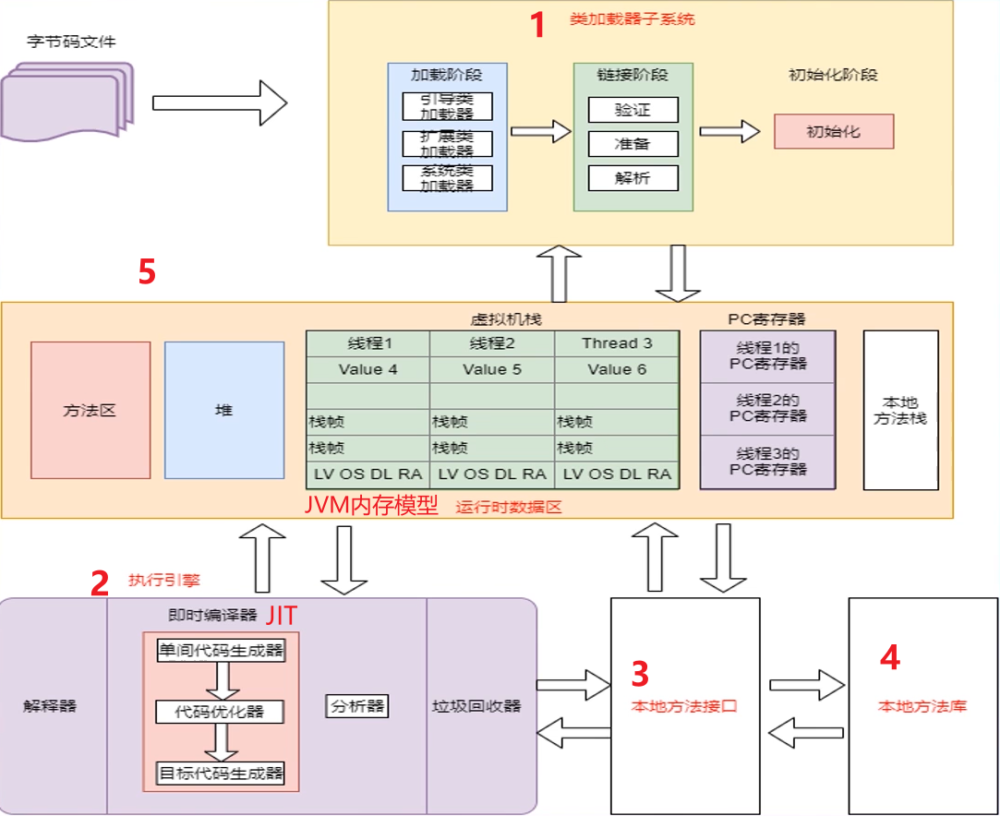

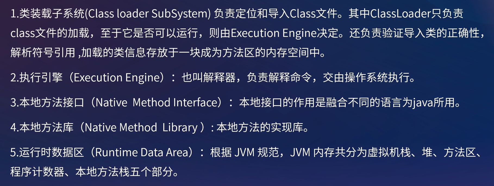


## 二、JVM内存结构

#### JDK7 的 JVM内存模型

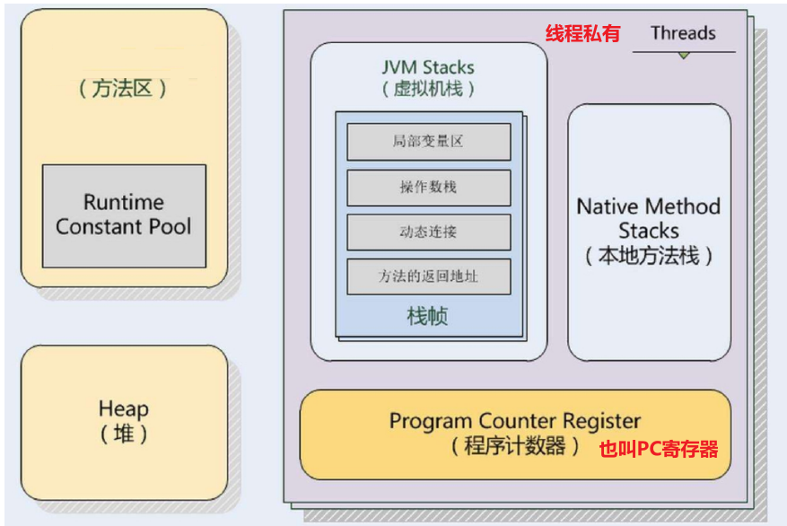
##### 1. 虚拟机栈（JVM Stacks）

**Java虚拟机栈**(Java Virtual Machine Stacks)也是**线程私有**的，即生命周期和线程相同。**Java虚拟机栈和线程同时创建，用于存储栈帧**。**每个方法在执行时都会创建一个栈帧**(Stack Frame)，用于存储局部变量表、操作数栈、动态链接、方法出口等信息。**每一个方法从调用直到执行完成的过程就对应着一个栈帧在虚拟机栈中从入栈到出栈的过程。**

**虚拟机栈默认大小是1M**，别小看这1M的空间，如果每个用户请求都新建线程的话，1024个用户光线程就占用了1个G的内存，如果系统比较大的话，一下子系统资源就不够用了，最后导致程序崩溃

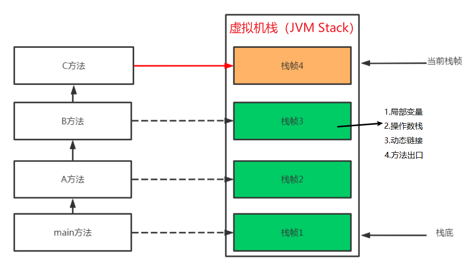


##### 2. 本地方法栈

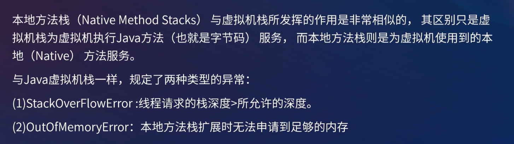


##### 3. 程序计数器

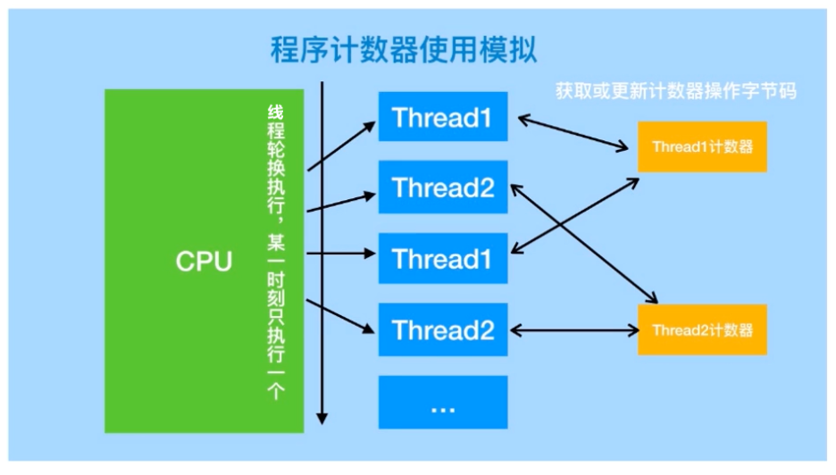


##### 4. 堆（Heap）

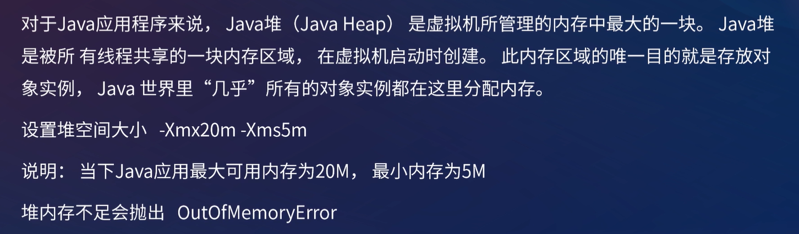

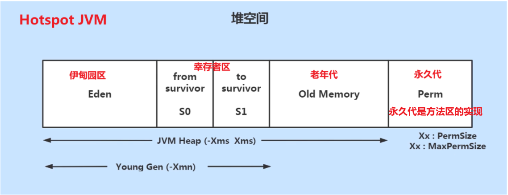

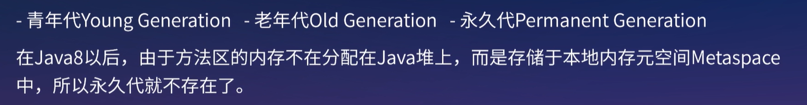


##### 5. 方法区（Runtime Constant Pool）

方法区是一种JVM规范，其 **JDK1.8之前的实现为堆中的永久代**

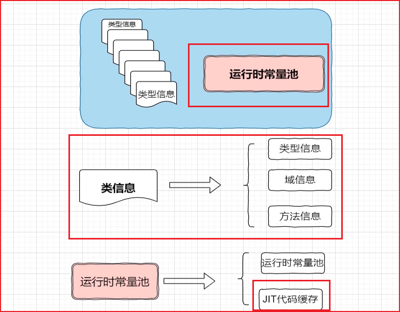


##### 6. 总结

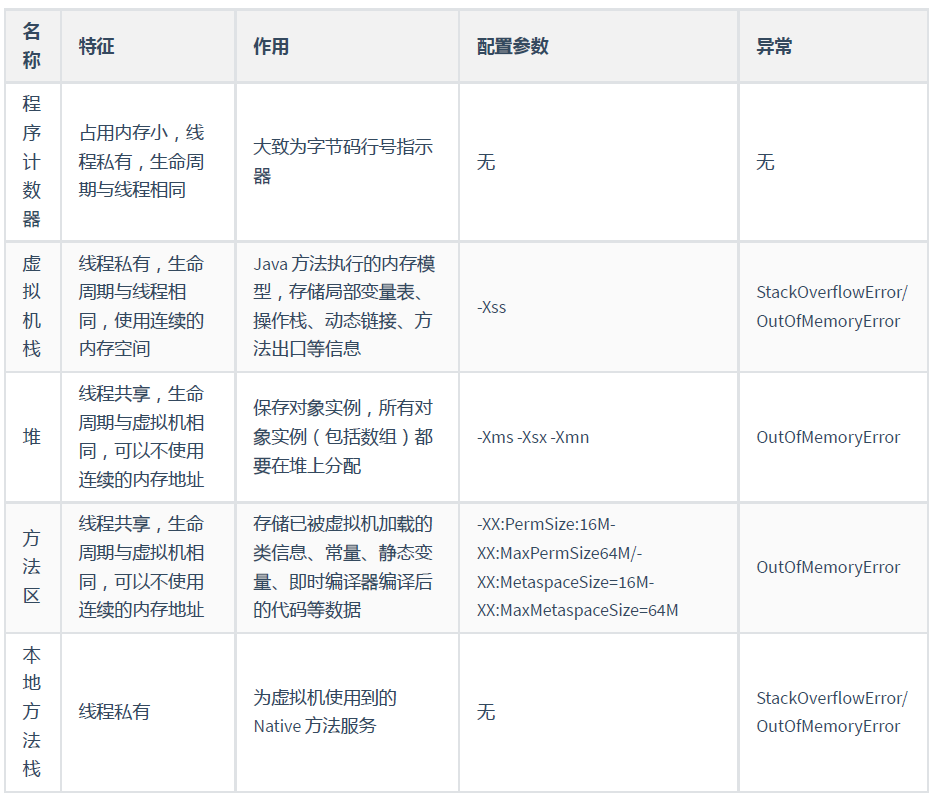


#### JDK8 的 JVM内存模型

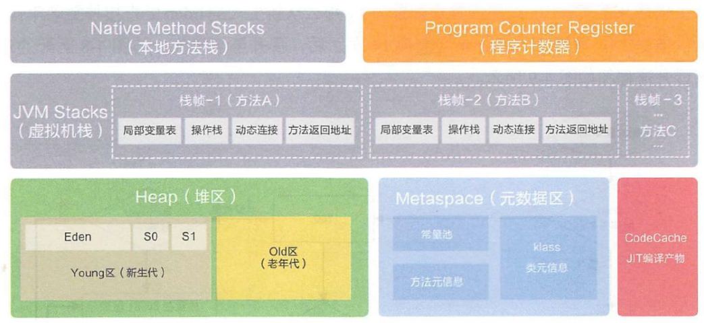


#### JDK8 对比 JDK7  JVM内存模型的变化

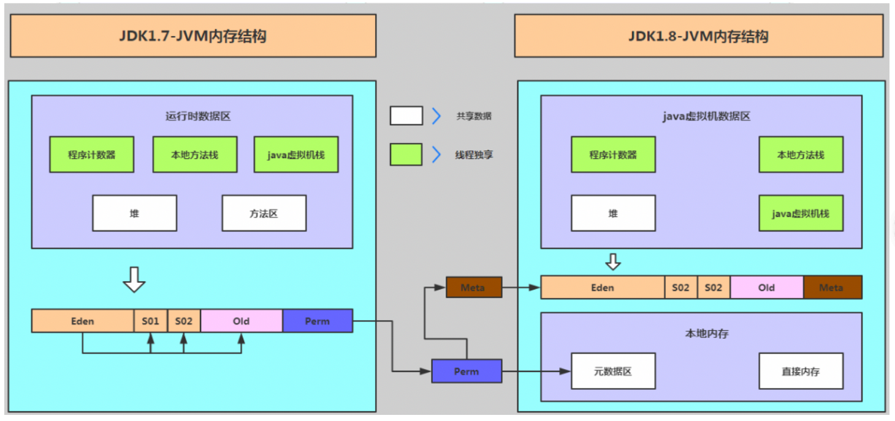

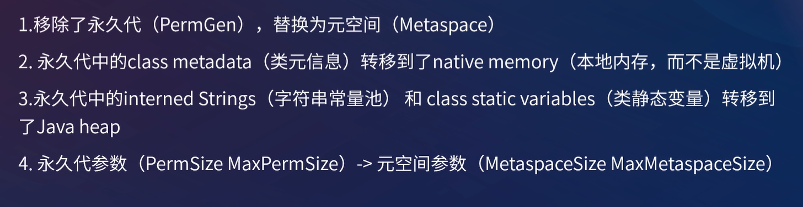


#### 元空间和永久代的区别


#### 为什么要用元空间替代永久代？


#### JDK8 是否就没有方法区了？


## 三、对象与内存

#### 1. 对象内存分布

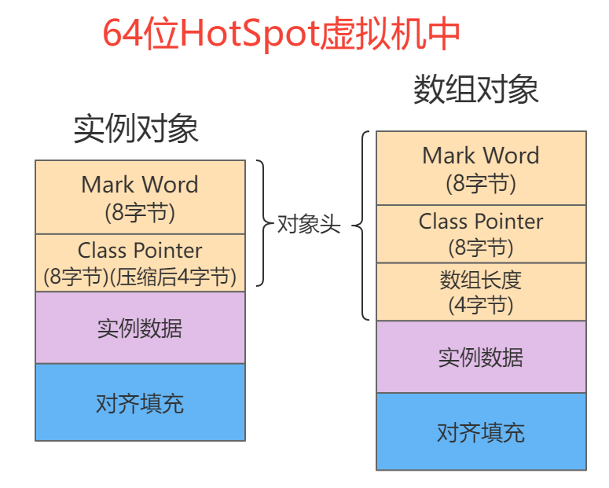

- **对象头**

  **Mark Word：**记录HashCode、分代年龄、锁标志位等信息

  Class pointer：类型指针，**指向类元数据**

  **32位**的 HotSpot虚拟机**对象头**占用**8个字节**，而**64位**的 HotSpot虚拟机**对象头**占用**16个字节**。其中Mark Word和Class point各占一半空间。64位的Hotspot有压缩指针功能，**`-XX:+UseCompressedOops（默认开启）`**，压缩后Class point的占4个字节。此时对象头位12个字节

- **实例数据**

  存放该对象的实例数据

- **对齐填充**

  64位的HotSpot虚拟机，要求实例对象内存按8字节对齐，因此 Java对象需要通过填充来满足对齐要求。

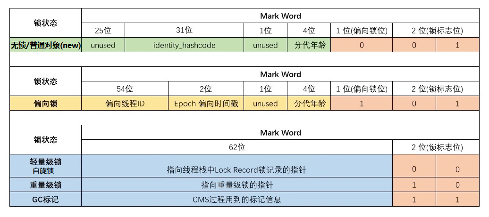


这里我推荐一个分析Java对象内存布局的工具——**JOL**

```xml
<!-- JOL依赖 -->
<dependency>
   <groupId>org.openjdk.jol</groupId>
   <artifactId>jol-core</artifactId>
   <version>0.9</version>
</dependency>
```

```java
public static void main(String[] args) {
    Item item = new Item();
    item.setId(111);
    item.setName("aaa");
    String s = ClassLayout.parseInstance(item).toPrintable();
    System.out.println(s);
}
```

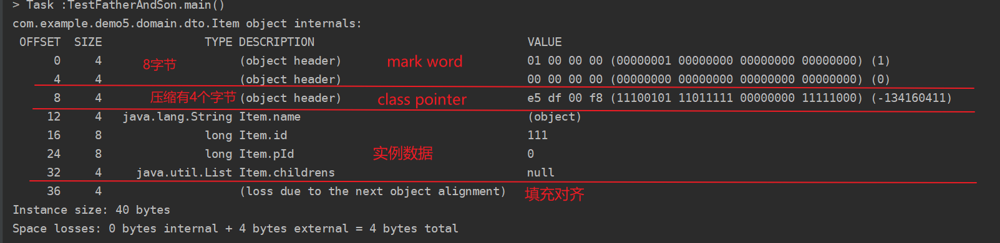


#### 2. 对象逃逸分析

**对象逃逸分析：**针对在**方法中创建的对象**，**分析其动态作用域**。然后根据作用域判断对象存**放堆中还是栈帧中**。

- 发生**对象逃逸场景**

  ```java
  public void test1{
     User user=new user();
      user.setId(1);
      user.setName("张三");
  }
  ```

- **不发生**对象逃逸场景

  ```java
  public User test2{
      User user=new user();
      user.setId(1)
      user.setName("张三")
      return user;
  }
  ```

发生对象逃逸的场景：因为对象的作用域**仅仅存在当前方法中，也就没必要放在堆中了（毕竟堆内存只能通过GC释放）**。

对象没逃逸场景：因为方法2中创建的对象最后被return返回，可能被外部方法引用，所以对象在堆中分配

JDK7以后默认开启对象逃逸分析**`-XX:+DoEscapeAnalysis`**，开启后判断**对象的作用域是否仅仅在当前方法**，**是的话则将对象放到当前方法的栈帧中**，**避免**了该对象**只能通过GC来回收对象而对程序产生的压力**。

##### 2.1 标量替换

JVM**栈帧**是有很多**内存碎片**的且内存空间有限，**无法存放完整的对象**。所以逃逸分析确定仅仅作用域在当前方法后，将**对象的成员变量分解**，使用**方法的成员变量来替换**（**存放于栈帧**或**寄存器**中）。

如果**栈帧空间不足**，还是会将对象**分配到堆中**的。

