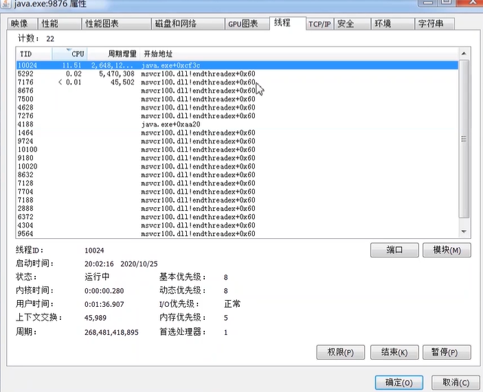
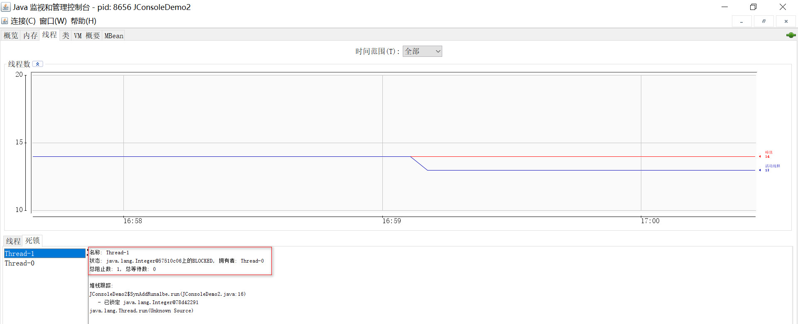
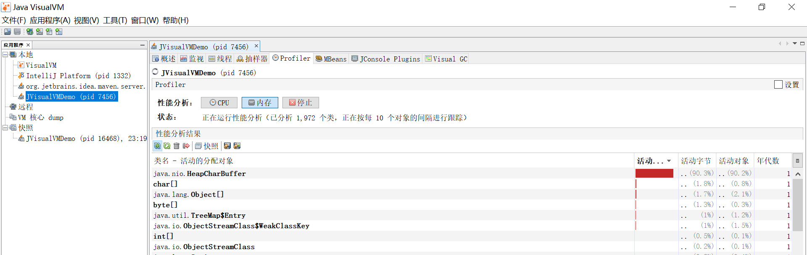
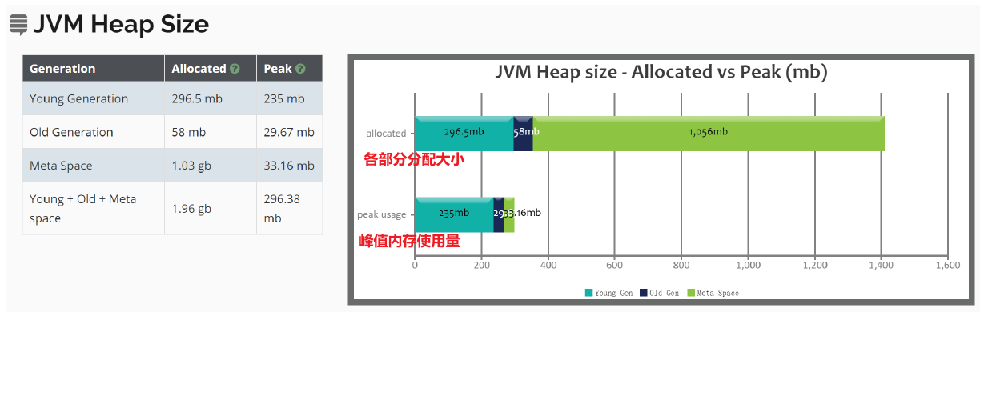
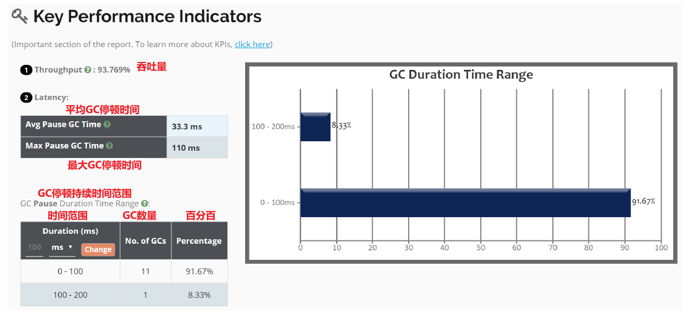
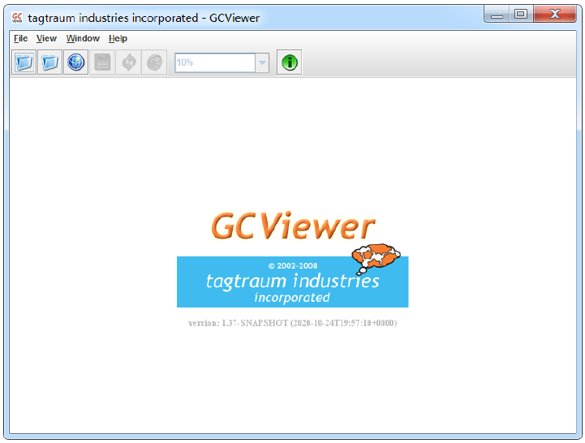
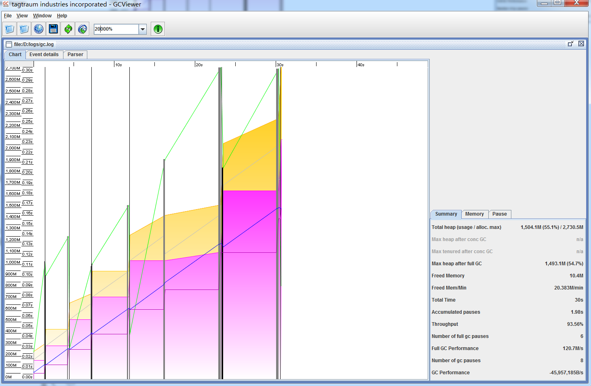

[toc]

### 内存泄漏与内存溢出

### JVM内存调优参数的类型

### JVM内存调优的参数

##### 1. 标准参数

##### 2. 非标准参数

##### 3. 非稳定参数

补充：

- -XX:MetaspaceSize  元空间初始值
- -XX:NewRatio  年轻代和老年代大小比值，取值为整数，默认为2  无需修改
- -XX:SurvivorRatio  Eden区与Survivor区大小的比值，取值为整数，默认为8  无需修改

### JVM内存调优工具

#### 调优-常用指令

##### 1. jps

`jps [options] [hostid]`

- options：
  - -l 输出jar包路径，类全名
  * -m 输出主类名，及传入main方法的参数
  * -v 输出主类名，及输出JVM参数
  * -q 显示进程id

- hostid : 主机或其他服务器ip

##### 2. jstat

`jstat [option] VMID [interval] [count ]`

其中VMID是进程id，interval是打印间隔时间（毫秒），count是打印次数（默认一直打印）

option参数解释：

- -class class loader的行为统计
- **-compiler HotSpt JIT编译器行为统计**
- **-gc 垃圾回收堆的行为统计（GC统计的实际值）**
- **-gcutil 垃圾回收统计概述（GC统计的百分比）**
- -gccapacity 各个垃圾回收代容量(young,old,perm)和他们相应的空间统计
- **-gccause 垃圾收集统计概述（同-gcutil），附加最近两次垃圾回收事件的原因**
- **-gcnew 新生代行为统计**
- -gcnewcapacity 新生代与其相应的内存空间的统计
- **-gcold 年老代和永生代行为统计**
- **-gcoldcapacity 年老代行为统计**
- -printcompilation HotSpot编译方法统计

##### 3. jstack

`jstack [options] <pid>`

option参数解释：

- -F 当使用 `jstack <pid>`无响应时，强制输出线程堆栈。
- -m 同时输出java堆栈和c/c++堆栈信息(混合模式)
- -l 除了输出堆栈信息外，还显示关于锁的附加信息

###### cpu占用过高问题

**Linux：**

1. top命令，然后按shift+p按照CPU排序，找到占用CPU过高的进程的pid
2. top -H -p [进程id] 找到进程中消耗资源最高的线程的id
3. 使用计算器讲 线程十进制id 转换成16进制
4. 使用`jstack -l <pid> |grep -A 10 线程id ` 查看CPU占用过高进程堆栈
5. 线程快照中找到指定线程，并分析代码

**Windows：**

1. 使用Process Explorer工具找到cpu占用率较高的线程
2. 在thread卡中找到cpu占用高的线程id
3. 使用计算器讲 线程十进制id 转换成16进制
4. 使用`jstack -l <pid> |grep -A 10 线程id ` 查看CPU占用过高进程堆栈
5. 线程快照中找到指定线程，并分析代码

###### jstack检查死锁问题

#### 调优-可视化工具

##### 1. Jconsole

**JDK中自带**的 java监控和管理控制台，用于对 **JVM内存，线程 和 类等的监控**，是一个基于JMX（java management extensions）的GUI性能监测工具，直接在 **jdk/bin目录下点击jconsole.exe即可启动**

###### 内存监控

从图中详细信息可以看出，**Eden区的内存大小为27.328KB**，所以折线图中显示**每次到27Mb左右时系统就会进行一次GC**。当1000次循环结束后，执行System.gc()，柱状图中显示Eden区和Survivor区基本被清空，但老年代的对应柱状图仍保持峰值状态，这是因为System.gc()是在fillHeap()方法内执行，所以list**对象在System.gc()执行时仍然是存活的(处于作用域之内、被引用**)。如果将System.gc()移动到fillHeap()方法外执行，如下柱状图所示，则会回收包括老年代的所有内存。

###### 线程监控

##### 2. Jvisualvm

VisualVM基于NetBeans平台开发，因此它一开始就具备了插件扩展的特性，通过插件支持，VisualVM可以做许多事情，例如:

- 显示虚拟机进程和进程的配置、环境信息(jps、jinfo)
- **监视应用程序的CPU、GC、堆、方法区及线程的信息(jstat、jstack)**
- **dump及分析堆转储快照(jmap、jhat)**
- 方法级的程序运行性能分析, 找出被调用最多、运行时间最长的方法
- 离线程序快照: 收集程序的运行时配置、线程dump、内存dump等信息建立一个快照, 可以将快照发送开发者处进行bug反馈等等

在 %JAVA_HOME%\bin目录下, **启动 jvisualvm.exe**进入主界面, 点击  "工具"   →   "插件"   →   "可用插件"   选项, 选择所需的插件安装。

安装好插件后, 选择一个正在运行的java程序就可以查看程序监控的主界面了

###### 堆dump快照

两种方式生成堆dump文件

- 在"应用程序"窗口中右键单击应用程序节点，选择  "堆 Dump"
- 在"监视"页签中选择"堆 Dump"

###### 分析

在Profiler页签中，可以对程序运行期间方法级的CPU和内存进行分析，这个操作会对程序运行性能有很大影响，所以**一般不再生产环境使用Profiler**。CPU分析将会统计每个方法的执行次数、执行耗时；内存分析则会统计每个方法关联的对象数及对象所占空间。

### JVM的性能指标

### CG日志工具

GC日志可视化分析工具GCeasy和GCviewer。通过GC日志可视化分析工具，我们可以很方便的看到JVM各个分代的内存使用情况、垃圾回收次数、垃圾回收的原因、垃圾回收占用的时间、吞吐量等，这些指标在我们进行JVM调优的时候是很有用的。

- **GCeasy** 是一款在线的GC日志分析器，可以通过GC日志分析进行**内存泄露检测**、**GC暂停原因分析**、**JVM配置建议优化**等功能，而且是可以免费使用

  在线分析工具 https://gceasy.io/index.jsp

- GCViewer是一款实用的GC日志分析软件，免费开源使用，你**需要安装jdk或者java环境才可以使用**。软件为GC日志分析人员提供了强大的功能支持，有利于大大提高分析效率

#### GCeasy使用如下

- 通过`-Xloggc:D://logs/gc.log` 指令在指定路径下生成gc log，登陆https://gceasy.io/index.jsp并将log文件上传

  

- **jvm堆**

  

- **关键性能指标**

  

- 交互式图表

  

#### GCViewer使用如下

下载： https://sourceforge.net/projects/gcviewer /

启动：`java -jar gcviewer-1.37-SNAPSHOT.jar`

点击  File->Open File 打开我们的GC日志，可以看到如下图，图标是可以放大缩小的，主要内容就是红线圈住的部分，里面的内容跟上面的GCeasy的比较类似，具体的可以看下GitHub中的描述。

### 常见JVM调优的问题和原因

### 调优案例

