[toc]

## 一、垃圾回收

**垃圾回收（Garbage Collection， 下文简称GC）也称垃圾收集** ，Java程序会**不定时的检查是否有死亡的对象**，**并回收它们占用的内存空间** 

垃圾收集需要完成的三件事情：

- 哪些内存需要回收？
- 什么时候回收？
- 如何回收？

#### 对象死亡判定算法

##### 1. 引用计数法（C++用得多）

给**每个创建的对象添加一个引用计数器**，每当此对象**被某个地方引用时，计数值+1，引用失效时-1**，所以当计数值**为0时表示对象已经不能被使用**。引用计数算法大多数情况下是个比较不错的算法，简单直接，也有一些著名的应用案例**但是对于Java虚拟机来说，并不是一个好的选择**，因为它**很难解决对象直接相互循环引用的问题**。

循环引用示例：

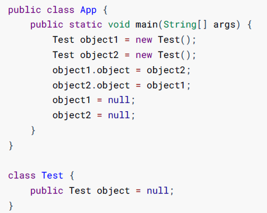

以上两个对象他们都互相引用，**除此之外都没有任何对外的引用**， 实际上这两个对象已经不可能再被访问， **但是它们因为互相引用着对方**， 导致它们的**引用计数都不为零**， 引用计数算法也就**无法回收**它们

##### 2. 可达性分析算法

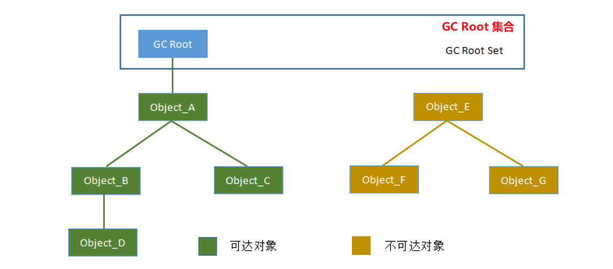

主流的编程程序语言如 **Java、C#等的主流实现中，都是通过可达性分析(Reachability Analysis)来判断对象是否存活的**

此算法的基本思路就是**通过一系列的 “GC Roots” 的对象作为起始点**，从**起始点开始向下搜索**到对象的路径。搜索**所经过的路径称为引用链(Reference Chain)**，**当一个对象到任何GC Roots都没有引用链时，则表明对象“不可达”**，即该对象是**不可用的**。

#### 可以作为GC Root的对象有哪些？

在Java语言中，可作为GC Roots的对象包括下面几种：

- **在虚拟机栈（栈帧中的本地变量表）中引用的对象，即方法中的局部变量**（这意味着方法退出时，对象在栈帧中的强引用将被清空）
- **方法区中静态属性引用的对象**
- **方法区中常量引用的对象**
- 本地方法栈中JNI(Native方法)引用的对象
- **Java虚拟机内部的引用**， 如基本数据类型对应的Class对象， 一些常驻的**异常对象**（比如 NullPointExcepiton、OutOfMemoryError） 等， 还有系统类加载器。
- **所有被同步锁（synchronized关键字） 持有的对象**
- 反映Java虚拟机内部情况的 JMXBean、JVMTI中注册的回调、本地代码缓存等

## 二、分代回收理论

#### 1. 定义

根据对象的生命周期将内存划分，然后进行分区管理。 当前商业虚拟机的垃圾收集器， 大多数都遵循了**“分代收集”（Generational Collection）的理论进行设计**， 分代收集名为理论， 实质是一套符合大多数程序运行实际情况的经验法则， 它建立在两个分代假说之上：

- 弱分代假说（Weak Generational Hypothesis） ： 绝大多数对象都是朝生夕灭的。
- 强分代假说（Strong Generational Hypothesis） ： 熬过越多次垃圾收集过程的对象就越难以消亡。

设计原则： 收集器应该**将Java堆划分 出不同的区域**，然后**将回收对象依据其年龄（年龄即对象熬过垃圾收集过程的次数） 分配到不同的区 域之中存储和回收**

好处：**兼顾了垃圾收集的时间开销**和 对**内存的空间有效利用**

#### 2. GC的类型有哪些

- **部分收集（Partial GC）：**指目标不是完整收集整个Java堆的垃圾收集， 其中又有如下细分
  - 新生代收集（**Minor GC/Young GC**）： 指目标只是**新生代**的垃圾收集。
  - 老年代收集（**Major GC/Old GC**）： 指目标只是**老年代**的垃圾收集，**目前只有CMS收集器会有单独收集老年代的行为**。
  - 混合收集（Mixed GC）： 指目标是收集整个新生代以及部分老年代的垃圾收集。 目前**只有G1收集器会有这种行为**。
- **整堆收集（Full GC）：**收集**整个Java堆 和 方法区**的垃圾收集

在Java堆划分出不同的区域之后， 垃圾收集器才可以每次只回收其中某一个或者某些部分的区域，因此才有了**“Minor GC”、“Major GC”、“Full GC”这样的GC类型的划分**； 

也才能够针对不同的区域安排与里面存储对象存亡特征相匹配的垃圾收集算法——因而发展出了“标记-复制算法”“标记-清除算 法”“标记-整理算法”等针对性的垃圾收集算法。

#### 3. GC的触发条件

##### 3.1 Minor GC触发条件:

- 当 **Eden区满，就会触发Minor GC**，Minor GC会引发STW（stop the world），暂停其他用户的线程，等垃圾回收接收，用户的线程才恢复

##### 3.2 FullGC 触发机制:

- **调用System.gc()**，系统只是建议执行Full GC，但**不是必然执行**

- **老年代空间不足**

- **方法区空间不足（元空间内存不足，扩容导致Full GC）**

- 通过**Minor GC后**，**进入老年代的**平均大小**大于老年代可用内存**

##### 3.3 Major GC触发机制（忽略major GC，可认为是Full GC）

- **老年代空间不足**时，会尝试**先触发MinorGC**，如果空间还是不足，则**触发Major GC**，Major GC的速度比Minor GC**慢10倍以上**，如果Major GC，内存仍然不足，则报错OOM

#### 4. 对象什么时候去老年代？

- 对象年龄超过MaxTenuringThreshold阈值（默认15），对象头的**Mark Word中有4个字节来存储对象分代年龄**，所以**最大不能超过15岁（每次GC (E区复制到S0)  或者  (E区+S0复制到S1)，年龄就加一）**
- 当S0和S1内存空间被占满时（每次GC (E区复制到S0)  或者  (E区+S0复制到S1)，年龄就加一），则存活对象直接放入老年代
- 对象超过PretenureSizeThreshold阈值大小（默认0），则直接进入老年代

## 三、垃圾回收算法

- **标记-清除算法**（Mark-Sweep）

  标记可回收的对象，然后进行清除回收

- **标记-复制算法**（Mark-Copy）

  按照容量**划分二个大小相等的内存区域**，回收垃圾时，**将存活对象复制到另一块上**，然后再**把旧的需要回收的内存空间回收掉**。

- **标记-整理算法**（Mark-Compact）

  标记可回收对象，将存活的对象都向一端移动，然后直接清除掉端边界以外的内存。

#### 1. 标记-清除算法

**最基础的收集算法**，将垃圾回收分为 “标记” 和 “清除” 两个阶段，**先标记出所有可回收的对象**，然后**再回收所有被标记对象所占用的空间**

**优点：**实现简单，不需要对象进行移动和复制；**无需暂停用户线程**

**缺点：**标记、清除过程效率低，并会**产生大量不连续的内存碎片**，**提高了垃圾回收频率**（需要分配较大对象时**无法找到足够的连续内存**）

#### 2. 标记-复制算法（适用新生代）

**将内存空间划分为大小相等的两块区域**，每次只使用其中的一块。垃圾回收时，遍历当前使用的区域，**将存活对象复制到另一个区域中**，最后**将当前区域的可回收对象进行回收**。

不过**实际新生代中的对象有98%熬不过第一轮收集**。因此**并不需要按照1∶1的比例来划分新生代的内存空间**。每次GC (E区复制到S0)  或者  (E区+S0复制到S1)，年龄就加一

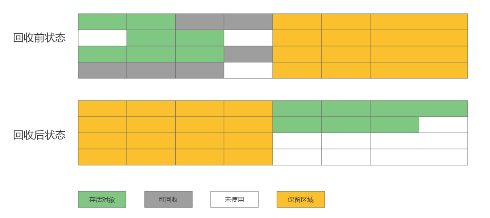

**优点：**按顺序分配内存即可，实现简单、运行高效，**不会产生内存碎片**。

**缺点：**

- **需要暂停用户线程（比如G1是要冻结用户线程来复制对象的，因为对象引用地址改变）**

- **可用的内存缩小为原来的一半**，浪费空间，使该区域GC更加频繁；
- 对象**存活率高时会频繁进行复制**，开销大效率低

#### 3. 标记-整理算法（适用老年代）

标记-整理算法（Mark-Compact），与标记-清除算法不同的是，**先标记可回收的对象**后，将所有**存活对象移动到内存的一端**，使他们紧凑的排列在一起，**然后对端边界意外的内存进行回收**，回收后已用和未用的内存都各自一边。

**关注吞吐量的ParallelScavenge收集器是基于标记-整理算法（暂停用户线程，提高GC效率，从而提高吞吐量）**的，而关注**低延迟的CMS收集器则是基于标记-清除算法（不暂停用户线程）**的，这也从侧面印证这点。

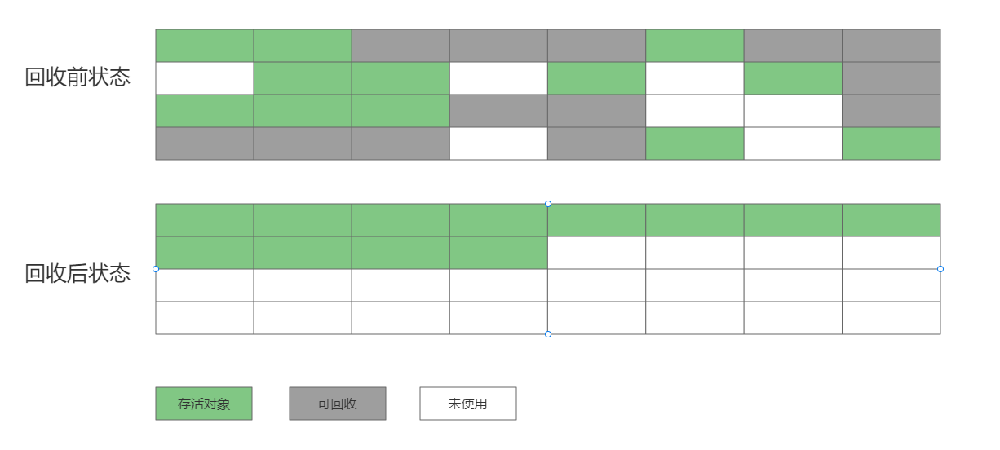

**优点：**不会产生内存碎片

**缺点：**

- 仍需要进行局部对象移动，一定程度上降低了效率
- **需要暂停用户线程（对象移动操作必须全程暂停用户应用程序才能进行，因为对象引用地址改变）**（ZGC和Shenandoah出现后标记整理得到优化，无需暂停用户线程了）

#### 4. [分代回收算法](#二、分代回收)

#### 5. 各GC类型适用的回收算法

## 四、垃圾回收器

#### 1. 垃圾回收器与垃圾回收算法的关系

垃圾回收算法分为两类，分别如下

- 对象死亡判定算法：引用计数法、可达性算法
- 垃圾回收算法：标记清除算法、标记复制算法、标记整理算法

根据堆内存不同区域的特点使用不同的回收算法进行回收，而垃圾收集器正是垃圾回收算法的落地实现

#### 2. 垃圾回收器类型及常用组合

**[JVM参数配置使用回收器](./4.JVM性能调优及排故)**

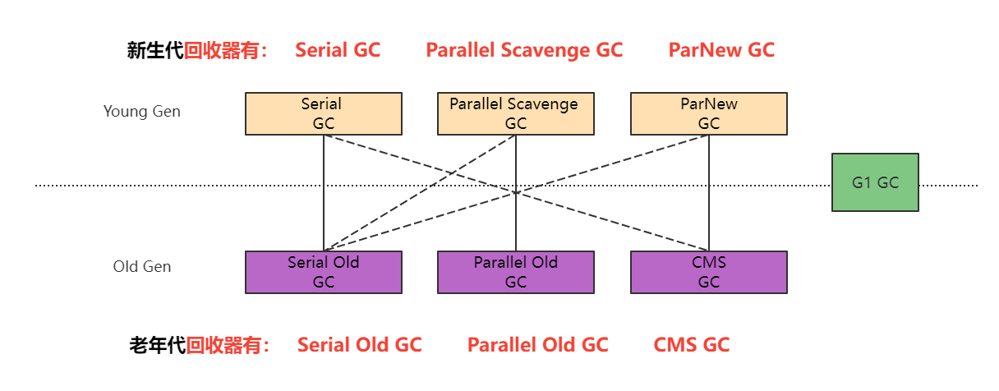

实线代表常用搭配、虚线代表有些版本不支持了。

JDK8 默认使用PS + PO

JDK9 默认使用G1

JDK14 弃用了 PS、PO、移除了CMS

#### 3. 串行回收器

**[JVM参数配置使用串行回收器](./4.JVM性能调优及排故)**

##### 3.1 Serial 回收器

新生代单线程串行回收器，采用**标记复制算法**，导致较长STW，在**单核环境**中使用。

##### 3.2 Serial Old 回收器

是Serial回收器的老年代版本，不过其采用**标记整理算法**，在**单核环境**中或者使用。

串行回收器的工作示意图

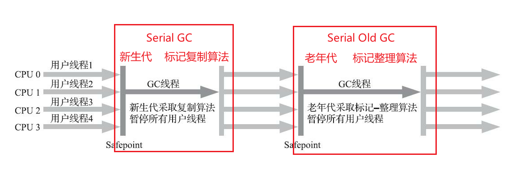

#### 4. 并行回收器

**[JVM参数配置使用并行回收器](./4.JVM性能调优及排故)**

##### 4.1 ParNew 回收器

并行回收器，与Serial GC共用了大部分代码（包括参数、算法、回收策略），采用**标记复制算法**

##### 4.2 Parallel Scavenge 回收器

**吞吐量优先**的并行回收器，采用**标记整理算法**，是JDK 1.8默认的回收器

PS供了两个参数用于精确控制吞吐量，分别是控制最大垃圾收集停顿时间的-XX：MaxGCPauseMillis参数以及直接设置吞吐量大小的-XX：GCTimeRatio参数。

大家不要异想天开地认为如果把`-XX:MaxGCPauseMillis`的值设置得更小一点就能使得系统的垃圾收集速度变得更快，**停顿时间缩短**是以**牺牲吞吐量和新生代空间为代价**换取的：系统把新生代调得小一些，收集300MB新生代肯定比收集500MB快，但这也直接导致垃圾收集发生得更频繁，原来10秒收集一次、每次停顿100毫秒，现在变成5秒收集一次、每次停顿70毫秒。**停顿时间的确在下降**，但**可用内存也少了（吞吐量也降下来了）**

##### 4.3 Parallel Old 回收器

**吞吐量优先**的并行回收器，使用**标记整理算法**，是JDK 1.8默认的回收器

并行回收器工作示意图

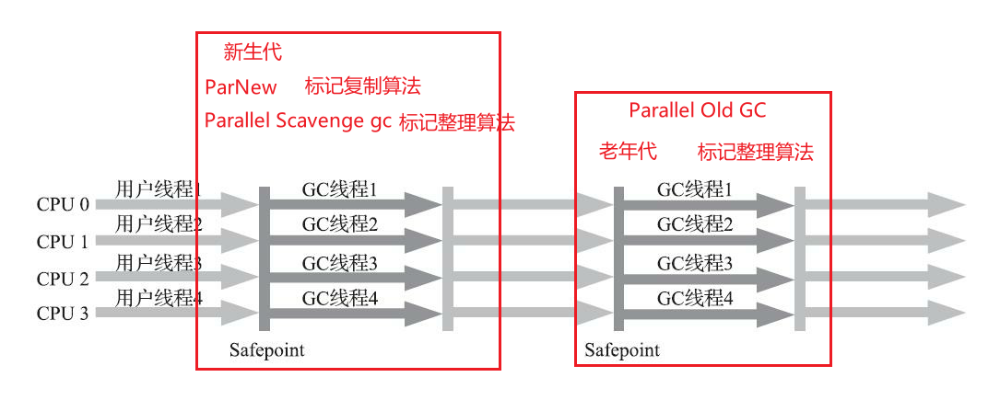

#### 5. CMS垃圾回收器

**[JVM参数配置使用CMS回收器](./4.JVM性能调优及排故)**

CMS（Concurrent Mark Sweep）是**尽可能缩短暂停时间的垃圾回收器**，适用于互联网交互型的服务器，采用**标记-清除算法**

##### 5.1 CMS回收过程

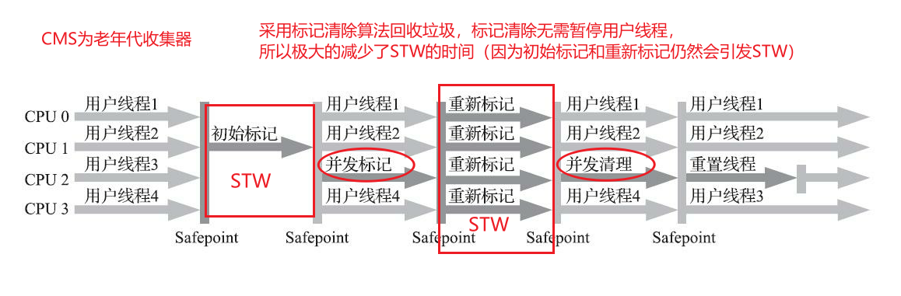

- **初始标记（Initial-Mark）阶段：**该阶段 **所有的工作线程**都将会因为"**Stop-the-Wold**"机制而出现**短暂的的暂停**，这个阶段的主要任务**标记GC Roots 直接关联对象**。一旦标记完成后就恢复之前被暂停的的所有应用。**由于直接关联对象比较小**，所以这里的**操作速度非常快**。
- **并发标记（Concurrent-Mark）阶段：**从GC Roots的**直接关联对象开始遍历整个引用链**的过程，这个过程**耗时较长**，但是**不需要暂停用户线程**，用户线程可以与垃圾回收器一起运行。
- **重新标记（Remark）阶段：由于并发标记阶段**，程序的工作线程会和垃圾收集**线程**同时运行或者**交叉运行**。因此，为了**修正并发标记期间**因为用户继续运行而导致标记**产生变动的那一部分对象的标记记录**，因为"**Stop-the-Wold**"机制而出现暂停，通常**比初始标记阶段长一些**，但也远**比并发标记阶段时间短**。
- **并发清除（Concurrent-Sweep）阶段:** 此阶段**使用标记-清除算法**回收死亡对象占用的内存空间。由于**不需要移动存活对象**，所以这个阶段可以**与用户线程同时并发运行**。

其中**初始标记**、**重新标记**这两个步骤仍然**需要“Stop The World”**

##### 5.2 CMS为什么使用标记清除算法，而不用标记整理算法？

因为**标记清除算法无需暂停用户线程**，**可以尽量减少暂停时间（因为初始标记和重新标记仍然会STW）**，正是CMS诞生的目的

##### 5.3 CMS优点

- 基于标记清除算法，不暂停用户线程，**减少了暂停时间（因为初始标记和重新标记会STW）**

##### 5.4 CMS缺点

- CMS收集器**比较吃CPU性能**。（当CPU核心数不足四个时， CMS会**导致用户CPU资源紧缺而执行变慢**）

- 并发清理阶段产生的 **“浮动垃圾”**，可能**导致老年代预留的空间不足**，**无法满足程序正常运行**（新分配的老年代对象），就会**出现”并发失败“（Concurrent Mode Failure）**。启动备用预案： **暂停用户线程的执行**， 临时**启用Serial Old收集器**来重新进行老年代的垃圾收集， 这就导致长时间停顿的Full GC。
  - CMS**并发清理阶段**，**此时此时用户线程产生的可回收对象并未被标记**，只能留到下次GC清理，这个称为**”浮动垃圾“**
  - 由于CMS线程和用户线程**并发执行**，为了**保证CMS回收垃圾时，程序也能正常运行**，因此在CMS执行回收时得**确保老年代有预留足够得内存空间供用户线程运行**。

  -XX:CMSInitiatingOccupancyFraction    CMS的触发百分比，值大则降低GC频率但是容易并发失败（**浮动垃圾导致可用内存小了，导致吞吐量差**），值小则避免并发失败但是GC频率UP
  
- CMS是基于标记-清除算法的回收器，**会产生内存碎片**

#### 6. G1垃圾回收器（Mixed GC模式）

**[JVM参数配置使用G1回收器](./4.JVM性能调优及排故)**

G1（Garbage First）是**在可控的暂停时间内（默认停顿时间为200ms），最大化吞吐量**的垃圾回收器，需要多核和大内存的支撑

-XX:MaxGCPauseMillis  **预期收集停顿时间**，默认值是**200毫秒**，如果预期**暂停时间设置太短，如20ms**，**暂停时间短导致GC效果差如CMS**，**GC效果差导致可用内存小了从而使吞吐量差**

-XX:G1HeapRegionSize   设定Region，取值范围为1MB～32MB，且应为2的N次幂

##### 6.1 逻辑分代

G1面向堆内存任何部分来组成回收集（Collection Set，一般简称CSet）进行回收，衡量标准不再是它属于哪个分代，而是**哪个块存放的垃圾数量最多，回收收益最大**，这就是G1收集器的Mixed GC模式。

虽然G1也仍是遵循**分代收集理论设计（逻辑分代）**，但其**堆内存的布局发生很大变化**：G1不在将堆内存划分为固定大小的新生代和老年代，而是**把连续的堆划分为多个大小相等的独立区域（Region）**，每一个Region都可以根据需要，**扮演**新生代的**Eden空间**、**Survivor空间**、**老年代空间**。收集器能够对扮演**不同角色的Region采用不同的策略去处理**，这样无论是新创建的对象还是已经存活了一段时间、熬过多次收集的旧对象都能获取很好的收集效果。

Region中还有一类特殊的**Humongous区域**，专门用来**存储大对象**。容量**超过1.5个Region为大对象**。而对于那些超过了整个Region容量的**超级大对象被存放在N个连续的Humongous Region之中**，G1的大多数行为都把Humongous Region作为老年代的一部分来进行看待

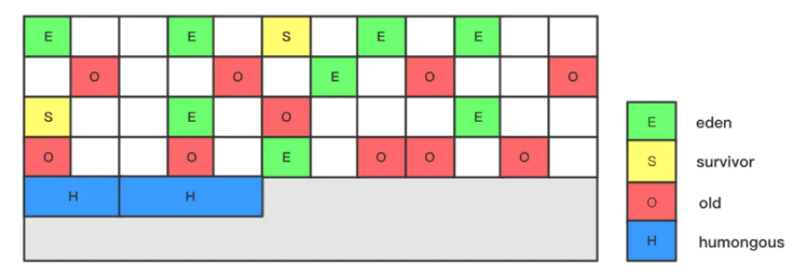

##### 6.2 G1回收过程

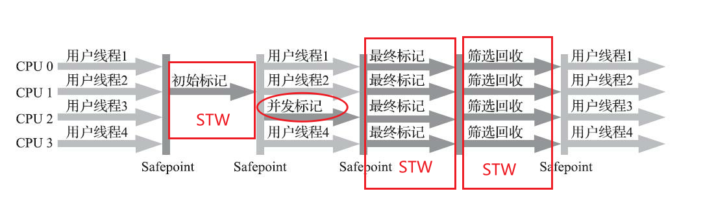

- **初始标记：**和CMS 初始标记相同
- **并发标记：**和CMS 并发标记相同
- **最终标记：**和CMS的重新标记相同，修正并发标记期间，因程序运行导致发生变化的那一部分对象
- **筛选回收：**对**各个块（Region）的回收价值和时间成本进行排序**，根据**用户所期望的停顿时间选择价值大的块**，把**选中的块的部分存活对象复制到空的块中**，然后**将新块整理移动挤压到内存的一端**，然后**将旧块的空间全部回收掉**

##### 6.3 为什么G1有三个阶段是暂停用户线程的，不是追求低暂停时间吗?

从G1的回收过程看，**G1收集器除了并发标记外，其余阶段也是要完全暂停用户线程的**，换言之，它并非纯粹地追求低延迟，官方给它设定的目标是**在延迟可控的情况下**获得**尽可能高的吞吐量**，所以才能担当起“全功能收集器”的重任与期

G1为了**保证吞吐量**所以才**选择了标记复制算法和标记整理算法**，来暂停用户线程

##### 6.4 G1优点

1. G1从**整体**来看是基于**标记-整理算法**实现的收集器，但从局部（**两个Region之间**）上看又是基于**标记-复制算法**实现，**不产生内存碎片**
2. G1的**暂停时间可控**，在规定时间内，**选中并回收那些价值最大的Region**（吞吐量最大化）

##### 6.5 G1缺点

- 它的**每个Region都维护有自己的记忆集（卡表）**，G1的**记忆集（卡表）**在存储结构的**本质上是一种哈希表**，**Key是指向自己的Region的指针（谁指向我），Value是一个集合（元素是卡表的索引号，我指向谁）**。这种“双向”的卡表结构比原来的卡表实现起来更复杂，同时由于**Region数量比传统收集器的分代数量要多得多**，因此G1收集器要比其他的传统垃圾收集器有着**更高的内存占用负担**。根据经验，这导致G1的记忆集（和其他内存消耗）可能会占整个堆容量的20%乃至更多的内存空间
- 如果预期**暂停时间设置太短，如20ms**，**暂停时间短导致GC效果差如CMS**，**GC效果差导致可用内存小了从而使吞吐量差**

#### 7. CMS和G1的选择

目前在小内存应用上CMS的表现大概率仍然要会优于G1，而在大内存应用上G1则大多能发挥其优势，这个优劣势的Java堆容量平衡点通常在6GB至8GB之间。不同应用需要量体裁衣地实际测试才能得出最合适的结论，随着HotSpot的开发者对G1的不断优化，也会让对比结果继续向G1倾斜。

#### 8. 低延迟垃圾收集器

衡量垃圾收集器的三项最重要的指标是：内存占用（Footprint）、吞吐量（Throughput）和延迟（Latency）。CMS注重延时，但是吞吐量比较差（回收效率低，导致垃圾堆积快，从而Full GC）。

ZGC和Shenandoah收集器使用读屏障（Read Barrier）技术**实现了标记整理算法与用户线程的并发执行**

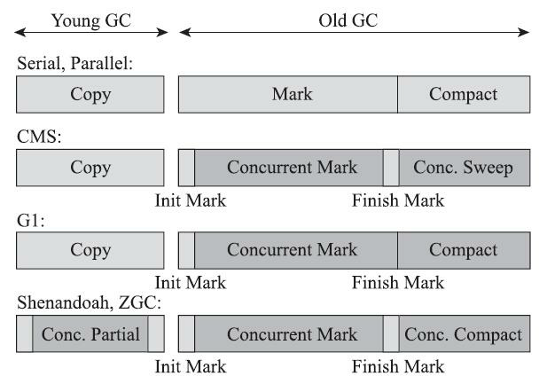
