[toc]

## 一、JVM参数、性能指标

#### 1. 内存泄漏与内存溢出

- 内存泄漏：指**本该被回收的对象无法被回收**，导致内存浪费。**内存泄漏严重时会导致OOM**。
- 内存溢出：指OOM（OutOfMemoryError异常），就是**JVM内存不够用**。


#### 2. JVM参数类型

- **标准参数（-）：**所有的 JVM 实现都必须实现这些参数的功能，而且向后兼容；
- **非标准参数（-X）：**默认 JVM 实现这些参数的功能，但是并不保证所有 ivm 实现都满足，且不保向后兼容；
- **非稳定参数（-XX:）：**此类参数各个 ivm 实现会有所不同，将来可能会随时取消，需要谨慎使用
  - `-XX:+[options]  `   启动
  - `-XX:-[options]`    禁用
  - `-XX:[options] = 整数`     如  `-XX:MaxMetaSpaceSize = 512m`
  - `-XX:[options] = 字符串`     如  `-XX:HeapDumpPath=./dump.core`

##### 2.1 标准参数(-)

- **-client**：设置JVM使用client模式，使用于一般PC
- **-server**：设置JVM使用server模式，启动速度虽然慢，但效率高，适用于服务器
- **-verbose:class**：输出JVM载入类的相关信息，当JVM报告说找不到类或者类冲突时进行诊断。
- **-verbose:gc**：输出每次GC的相关情况。
- **-verbose:jni**：输出 native方法调用的相关情况，一般用于诊断jni调用错误信息

##### 2.2 非标准参数(-X)

- **堆内存大小**
  - **-Xms4096m**：堆的初始值（最小值），默认值为 物理内存/64（小于1G），单位可指定k、m、g
  - **-Xmx4096m**：堆的最大值，如果Xms和Xmx都不设置，则两者大小会相同，**默认情况下，当堆中可用內存大于70%时**，堆内存会**收缩直到堆的最小值为止**，单位可指定k、m、g
- **新生代大小**
  - -Xmn2048m：新生代最大内存（包含E、S0、S1），单位可指定k、m、g
- **栈内存大小**
  - **-Xss256k**：这个参数用于设置每个线程的栈內存，默认1M，单位可指定k、m、g
- **GC打印监控**
  - **-Xloggc:filepath**：与 verbose:gc功能类似，只是**将每次GC事件的相关情况记录到一个文件中**

##### 2.3 非稳定参数(-XX:)

- **性能参数( Performance Options)**：用于JVM的**性能调优和內存分配**

  - **-XX:LargePageSizeInBytes=128m**   内存页的大小
  - **-XX:MaxDirectMemorySize**   直接内存大小
- **-XX:+UseFastAccessorMethods**    原始类型的快速优化，get/set 方法转成本地代码（对于jvm来说是冗余代码，jvm将进行优化）
  - **堆内存分配**
    - -XX:MaxHeapFreeRatio=70   空闲堆内存的最大比例，达到该值则堆**收缩直至堆初始值**
    - -XX:NewRatio=2   新生代和老年代大小比值，**默认为2（Young : Old = 1 : 2）**，**有-XXNewSize和-XX:MaxNewSize时不设置此项**
  - **新生代分配**
    - **-XX:NewSize=size**    新生代占用内存初始值
    - **-XX:MaxNewSize=size**   新生代占用内存最大值
    - **-XX:SurvivorRatio**  Eden区与Survivor区大小的比值，取值为整数，**默认为8（E : S0 : S1 = 8 : 1 : 1）**
  - **老年代分配**
    - **-XX:MaxTenuringThreshold=15**   对象年龄超过这个阈值，则进入老年代
    - **-XX:PretenureSizeThreshold=1M**    对象内存**超过阈值大小直接进入老年代**，默认值为0（直接放入E区）
  - **方法区分配**
    - -XX:PermSize=64m   永久代初始内存
    - -XX:MaxPermsize=64m  永久代占用内存最大值(非堆内存)
    - **-XX:MetaspaceSize=256m**  元空间初始值
    - **-XX:MaxMetaspaceSize=256m**   元空间最大内存

- **行为参数( Behavioral Options)**：用于改变JVM的基础行为，如GC的方式和算法的选择

  - **-XX:+DisableExplicitGC**    忽略手动调用GC，例如System.gc()，使其完全不触发GC
  - **串行或弃用GC组合**
    - -XX:+UseSerialGC   启用串行GC，即**Sera + Serial old**（S+SO）组合（只适合单核小型程序）
    - -XX:+UseParNewGC   使用**ParNew + Serial Old**组合（在某些版本中已经废弃）
  - **吞吐优先并行GC组合**
    - **-XX:+UseParallelGC**   启用并行GC，即JDK1.8使用**Parallel Scavenge + Parallel Old**组合（PS + PO）
    - **-XX:+UseParallelOldGC**   启用并行GC，即**Parallel Scavenge + Parallel Old**组合（PS + PO）
    - **-XX:GCTimeRatio=99**   设置吞吐量大小（默认值99，即1%的时间用于GC，吞吐量99%）
    - **-XX:MaxGCPauseMillis=80**   设置GC导致最大的STW时间
    - **-XX:+UseAdaptiveSizePolicy**   根据系统运行情况进行自适应调节年轻代、E、S的比例，晋升老年代对象年龄等参数
  - **CMS回收器**
    - **-XX:+UseConcMarkSweepGC**   使用 **ParNew + CMS + Serial Old（当CMS失败时自动切换为SO）**
    - **-XX:ConcGCThreads=10**   设置CMS并发回收线程
    - **-XX:+CMSParallelRemarkEnabled**   并行remark
    - **-XX:CMSInitiatingOccupancyFraction=70**    **CMS的触发百分比**，值大则降低GC频率但是容易并发失败（**浮动垃圾导致可用内存小了，导致吞吐量差**），值小则避免并发失败但是GC频率UP
    - **-XX:+UseCMSInitiatingOccupancyOnly**   使用手动定义初始化定义开始CMS收集
  - **G1 回收器**
    - **-XX:+UseG1GC**    使用G1
    - **-XX:MaxGCPauseMillis=100**  **预期收集停顿时间**，默认值是**200毫秒**，如果预期**暂停时间设置太短，如20ms**，**暂停时间短导致GC效果差如CMS**，**GC效果差导致可用内存小了从而使吞吐量差**
    - **-XX:G1HeapRegionSize**   Region大小，取值范围为1MB～32MB，且应为2的N次幂
    - -XX:G1NewSizePercent   手动指定新生代初始占比，默认是5%
    - -XX:G1MaxNewSizePercent   新生代的最大占比默认是60%
  - **锁参数**
    - **-XX:+PrintAssembly**  参数输出反汇编
    - **-XX:+UseBiasedLocking**   偏向锁开启
    - **-XX:BiasedLockingStartupDelay = 4000** 偏向锁启动延时
    - **-XX:PreBlockSpin**  自旋次数
  - **GC日志格式**
    - **-XX:+PrintGCDetails**   打印GC详细信息
    - **-XX:+PrintGCTimeStamps **  输出GC的时间戳（以基准时间的形式）
    - **-XX:+PrintGCDateStamps **  输出GC的时间戳（以日期的形式）
    - **-XX:+PrintHeapAtGC**   在进行GC的前后打印出堆的信息
    - **-Xloggc:../logs/gc.log（非标参数）**   指定输出路径收集日志到日志文件

- **调试参数( Debugging Options)**：用于监控、打印、输出JVM参数，用于显示JVM更加详细的信息
  - **-XX:ErrorFile=./hs_er_pid.log**   保存错误日志或者数据到文件中
  
  - **-XX:+HeapDumpOnOutOfMemoryError**   当首次遭遇OOM时导出此时堆中相关信息
  
  - **-XX:HeapDumpPath=./log/log_hprof/oom.hprof**   指定导出堆信息时的路径或文件名
  


#### 3. JVM性能指标

**吞吐量**、**暂停时间（延迟）**、**内存占用**三者类似CAP，构成了一个不可能三角，只能选择其中两个进行调优。不过Orecal官方出的一款Z GC可以管理4G堆内存的同时，将GC暂停时间控制在10ms以内，并且保证高吞吐量。（**除了初始标记和最终标记，整个过程全是并发执行。**）

##### 3.1 暂停时间（STW）/延迟

暂停用户线程的时间，STW越短越好

- 适合减少暂停时间的垃圾收集算法：**标记清除算法**

  因为标记清除无需暂停用户线程，从而使GC线程和用户线程并行执行。如CMS正是标记清除算法，减少了STW时间（因为初始标记和重新标记仍然会STW）

- 垃圾收集器：**CMS、G1**

- 使用低延迟的场景

  **需要经常与用户交互**或需要**保证服务响应质量**的程序，良好的响应速度能提升**用户体验**

- **注意**

  **停顿时间缩短**是以**牺牲吞吐量和新生代空间为代价**换取的：系统把新生代调得小一些，收集300MB新生代肯定比收集500MB快，但这也直接导致垃圾收集发生得更频繁，原来10秒收集一次、每次停顿100毫秒，现在变成5秒收集一次、每次停顿70毫秒。**停顿时间的确在下降**，但**可用内存也少了（吞吐量也降下来了）**

##### 3.2 吞吐量

**运行用户代码的时间**  与  **CPU总消耗时间** 的比值-------运行用户代码时间 / (运行用户代码时间+垃圾收集时间)

- 适合的垃圾收集算法：标记复制算法、**标记整理算法**

  因为复制和整理需要暂停用户线程从而保证GC效率，提供了更高的可用内存，从而提升吞吐量。不过缺点是增加STW的时间。

- 垃圾收集器：**PS+PO、G1**

- 使用吞吐量优先的场景：**需要高CPU使用率**的场景，如：**大量运算任务**、**订单任务**、**批处理**、无需太多与客户端交互的任务等


## 二、JVM调优

#### 1. 什么时候调优

调优其实就是围绕**内存分配** 和 **回收策略**进行的，尽量降低GC频率和耗时。

一般调优是在系统**上线**或**大版本迭代**时进行，对业务系统接口进行压力测试，通过监控和分析工具观察内存变化、GC日志。对比给定的量化性能指标（吞吐量、延时/暂停时间），不断调整JVM参数直至达到性能指标为止。当然不同业务服务的性能指标不同[查看场景](#3. JVM性能指标)

- 订单系统、批处理、大量运算任务，适合高吞量吐指标。可使用PS+PO或G1
- 用户交互型服务，适合低延时指标。可用CMS或G1

#### 2. 监控、分析工具

- 可视化工具有：[JConsole](#2.1 Jconsole)、[JvisualVM](#2.2 JvisualVM)可视化工具。查看CPU、内存、线程信息、类加载、GC信息
- 阿里在线诊断工具：[Arthas](#3. 阿里在线诊断工具—Arthas)
- GC日志分析工具：[GCeasy](#GCeasy使用如下)、[GCViewer](#GCViewer使用如下)。Minor GC和Full GC次数、耗时
- 查看**堆内和方法区内存使用情况**、**线程信息**、**GC情况**和**CPU使用率**。

#### 3. 不需要优化

- Minor GC < 50ms

- Minor GC 约 10s~20s 一次

- Full GC < 1s

- Full GC执行不频率，不低于10分钟一次

#### 4. 调优原则

1. 多数的JAVA应用不需要在服务器上进行GC优化
2. 多数导致GC问题的基本是 JAVA应用问题，都不是因为我们参数设置错误，而是代码问题
3. **应用上线前，先考虑将JVM参数设置到最优**
4. 减少对象创建的数量
5. **减少全局变量和大对象**
6. GC优化是最后不得已才使用的，在实际应用中，分析GC情况 **优化代码比优化GC参数 效果来得更好更直接**

#### 5. 调优策略，直到找到合适的JVM参数配置

- **堆内存Xms和Xmx**

  - 堆初始空间和最大空间设置一样，防止堆内存因为伸缩而造成性能损耗
  - 保证堆内存足够大，新生代和老年代足够大，大部分临时对象都能保证在新生代被回收，**减少了Full GC发生频率**。

- **虚拟机栈Xss**

  - 分配每个**线程够用的大小**，默认1Mb太大，比较浪费内存

- **新生代和老年代内存分配**

  观察当前业务系统 **朝生夕灭的对象多 还是持久对象多**，我们来观察新生代和老年代的峰值占用内存，以及Minor GC前后新生代内存空间变化。由于**FullGC 的成本远远高于 MinorGC**，因此尽可能将对象分配在新生代是明智的做法

  - 设置合理的 `-XX:PretenureSizeThreshold` 和 `-XX:MaxtenuringThreshold`，**大对象直接进入老年代**可以防止新生代空间不足而频繁GC，**对象年龄阈值合适的话也可以减少FullGC的发生**。

  - **如果新生代峰值高，并且老年代峰值占用空间不大**，且每次Minor GC可以**回收大部分对象**，说明**临时对象居多**，调大新生代内存空间（与老年代保持1:1或1:2）。可以极大**降低Full GC发生频率**
  - **如果新生代峰值高，并且老年代峰值空间也大**，且每次Minor GC可以**回收对象占比不高**，说明持久对象居多，**调大老年代内存空间。**

  - NewSize和MaxNewSize调整足够大的新生代内存，有利于降低MinorGC但会增加MinorGC耗时。
  - 若新生代内存分配占比小，则大的老年代有利于降低FullGC频率但会增加FullGC耗时。

- 垃圾收集器选择及参数配置

  - 高吞吐：PS+PO、G1（对系统内存要求高，本身会占用20%左右内存）
  - 低延时：CMS（内存碎片）、G1（对系统内存要求高，本身会占用20%左右内存）


## 三、JVM诊断分析——工具


#### 1. 常用指令

##### 1.1 jinfo

`jinfo [option] <pid>`

- options参数解释：
  - no options 输出所有的系统属性和参数
  - -flag 打印指定名称的参数
  - -flag [+|-] 打开或关闭参数
  - -flag = 设置参数
  - -flags 打印所有参数
  - -sysprops 打印系统配置

- 示例

  ```sh
  jinfo 11666
  jinfo -flags 11666
  jinfo -sysprops 11666
  jinfo -flag PrintGC 11666
  ```


##### 1.2 jps

`jps [options] [hostid]`

- options：
  - -l 输出jar包路径，类全名
  * -m 输出主类名，及传入main方法的参数
  * -v 输出主类名，及输出JVM参数
  * -q 显示进程id

- hostid : 主机或其他服务器ip

##### 1.3 jmap

jmap可以生成 java 程序的 dump 文件， 也可以查看堆内对象示例的统计信息、查看 ClassLoader 的信息以及finalizer 队列

`jmap [option] (连接正在执行的进程)`

- -heap 打印java heap摘要
- -histo[:live] 打印堆中的java对象统计信息
- -clstats 打印类加载器统计信息
- -dump: 生成java堆的dump文件

示例：

```sh
jmap -heap 11666   #输出堆的详细信息

jmap -dump:live,format=b,file=/heap/dump.bin 11666   #把java堆中的存活对象信息转储到/heap/dump.bin文件
    
jmap -histo:live 11666 | more    #输出存活对象统计信息
```


##### 1.4 jstat

`jstat [option] VMID [interval] [count ]`

其中VMID是进程id，interval是打印间隔时间（毫秒），count是打印次数（默认一直打印）

option参数解释：

- -class class loader的行为统计
- **-compiler HotSpt JIT编译器行为统计**
- **-gc 垃圾回收堆的行为统计（GC统计的实际值）**
- **-gcutil 垃圾回收统计概述（GC统计的百分比）**
- -gccapacity 各个垃圾回收代容量(young,old,perm)和他们相应的空间统计
- **-gccause 垃圾收集统计概述（同-gcutil），附加最近两次垃圾回收事件的原因**
- **-gcnew 新生代行为统计**
- -gcnewcapacity 新生代与其相应的内存空间的统计
- **-gcold 年老代和永生代行为统计**
- **-gcoldcapacity 年老代行为统计**
- -printcompilation HotSpot编译方法统计

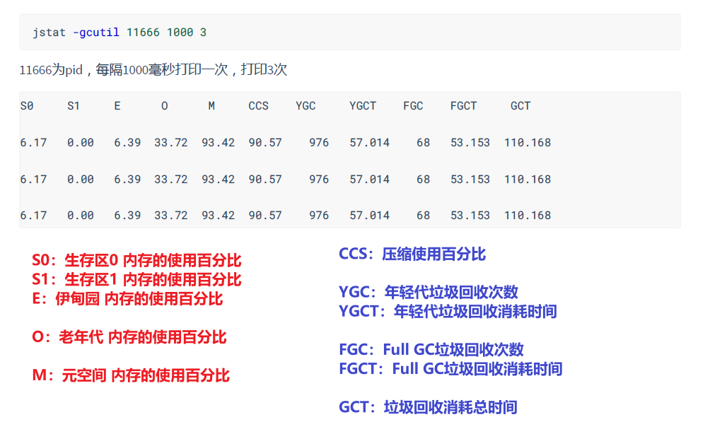

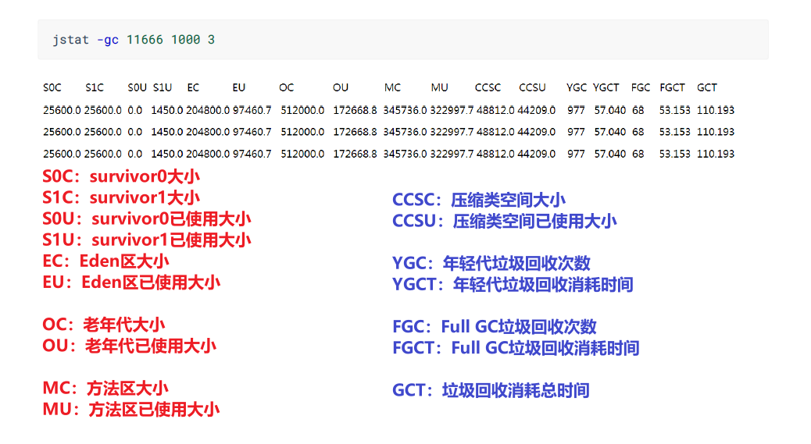

##### 1.5 jstack

`jstack [options] <pid>`

option参数解释：

- -F 当使用 `jstack <pid>`无响应时，强制输出线程堆栈。
- -m 同时输出java堆栈和c/c++堆栈信息(混合模式)
- -l 除了输出堆栈信息外，还显示关于锁的附加信息

###### cpu占用过高问题

**Linux：**

1. top命令，然后按shift+p按照CPU排序，找到占用CPU过高的进程的pid
2. top -H -p [进程id] 找到进程中消耗资源最高的线程的id
3. 使用计算器讲 线程十进制id 转换成16进制
4. 使用`jstack -l <pid> |grep -A 10 线程id ` 查看CPU占用过高进程堆栈
5. 线程快照中找到指定线程，并分析代码

**Windows：**

1. 使用Process Explorer工具找到cpu占用率较高的线程
2. 在thread卡中找到cpu占用高的线程id
3. 使用计算器讲 线程十进制id 转换成16进制
4. 使用`jstack -l <pid> |grep -A 10 线程id ` 查看CPU占用过高进程堆栈
5. 线程快照中找到指定线程，并分析代码

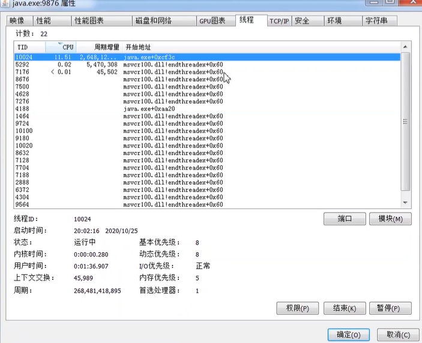

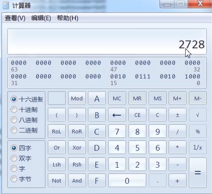

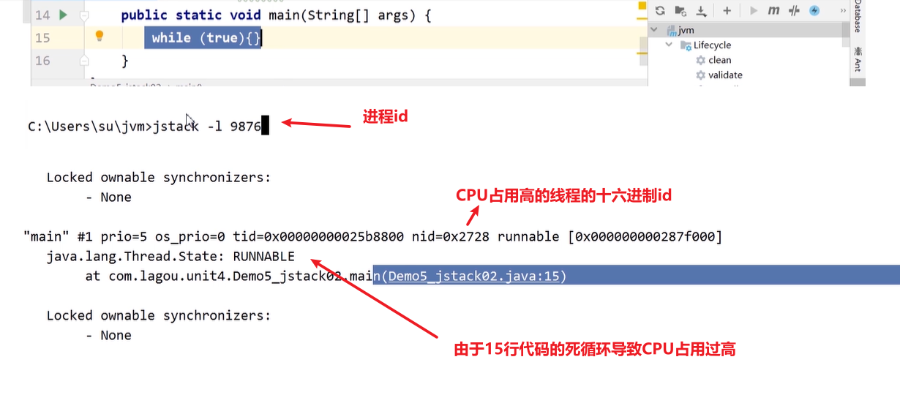

###### jstack检查死锁问题

`jstack -l <pid> | grep deadlock`

打印结果如下：Thread-1和Thread-0分别锁住了`xxxxxx1dc5c8` 和 `xxxxx1dc5d8`，然后又想分别去获取对方持有的锁，导致死锁。

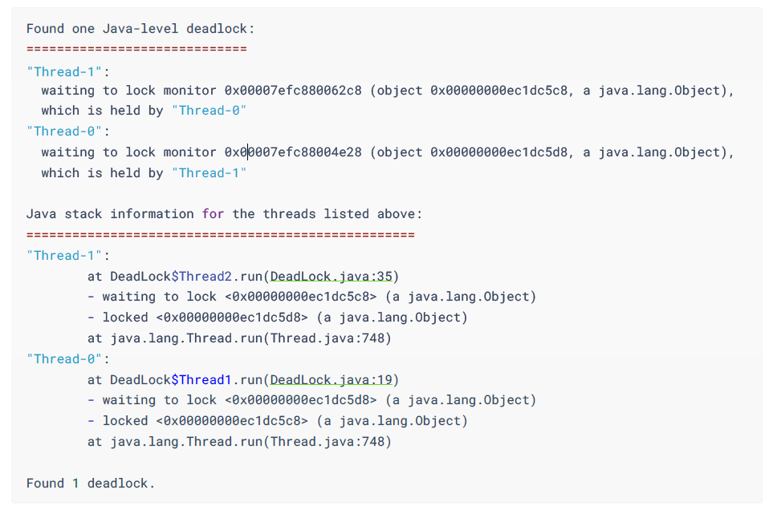


#### 2. 可视化监控工具

可视化监控访问远程Java程序时，需要远程程序开启**JMX，如下配置**

```sh
-Dcom.sun.management.jmxremote.port=9999 #指定端口
-Dcom.sun.management.jmxremote.authenticate=false #指定是否需要密码验证
-Dcom.sun.management.jmxremote.ssl=false #指定是否使用SSL通讯
```

##### 2.1 Jconsole

**JDK中自带**的 java监控和管理控制台，用于对 **JVM内存，线程 和 类等的监控**，是一个基于JMX（java management extensions）的GUI性能监测工具，直接在 **jdk/bin目录下点击jconsole.exe即可启动**

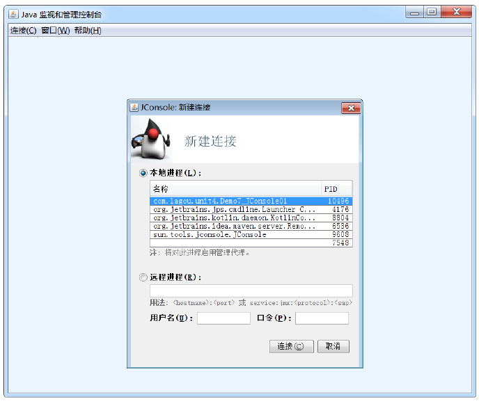

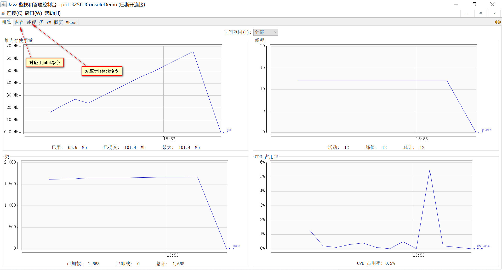


###### 内存监控

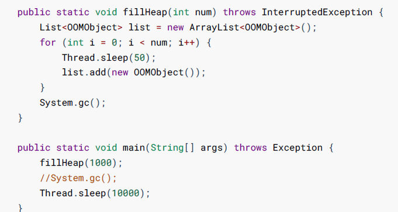

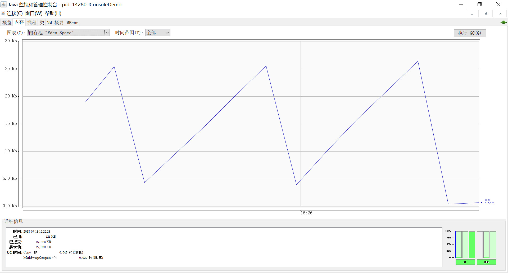

从图中详细信息可以看出，**Eden区的内存大小为27.328KB**，所以折线图中显示**每次到27Mb左右时系统就会进行一次GC**。当1000次循环结束后，执行System.gc()，柱状图中显示Eden区和Survivor区基本被清空，但老年代的对应柱状图仍保持峰值状态，这是因为System.gc()是在fillHeap()方法内执行，所以list**对象在System.gc()执行时仍然是存活的(处于作用域之内、被引用**)。如果将System.gc()移动到fillHeap()方法外执行，如下柱状图所示，则会回收包括老年代的所有内存。

###### 线程监控

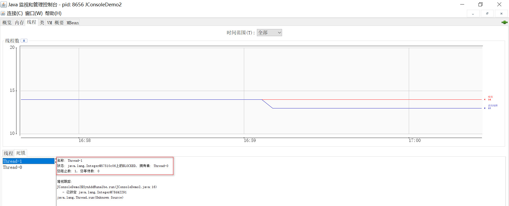


##### 2.2 Jvisualvm

VisualVM基于NetBeans平台开发，因此它一开始就具备了插件扩展的特性，通过插件支持，VisualVM可以做许多事情，例如:

- 显示虚拟机进程和进程的配置、环境信息(jps、jinfo)
- **监视应用程序的CPU、GC、堆、方法区及线程的信息(jstat、jstack)**
- **dump及分析堆转储快照(jmap、jhat)**
- 方法级的程序运行性能分析, 找出被调用最多、运行时间最长的方法
- 离线程序快照: 收集程序的运行时配置、线程dump、内存dump等信息建立一个快照, 可以将快照发送开发者处进行bug反馈等等

###### 启动

在 %JAVA_HOME%\bin目录下, **启动 jvisualvm.exe**

###### 概述

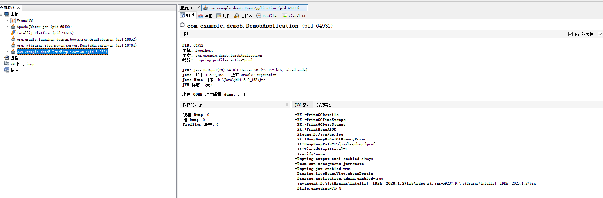

###### 堆内存信息及dump堆快照

查看堆及元空间内存使用率

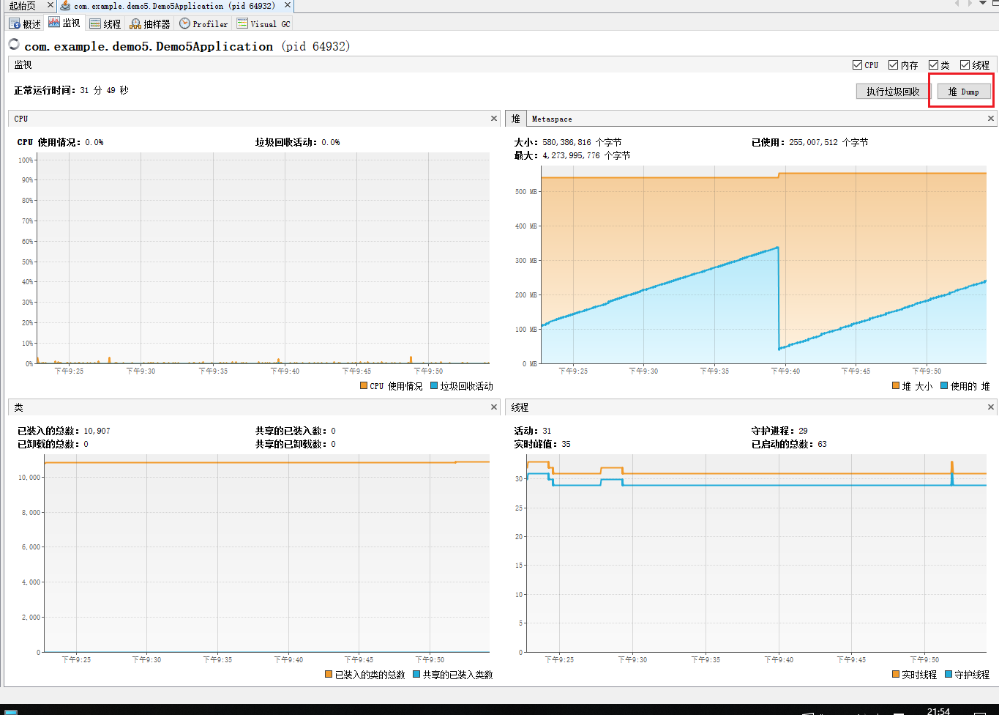

堆dump信息查看类信息及实例数

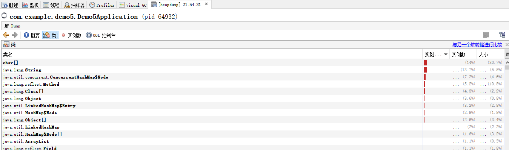

###### 线程信息及dump线程快照

- 可警示死锁信息

- 所有线程信息及高CPU占用率的线程
- dunp线程快照，**查看死锁信息**和**CPU高使用率线程信息**（[查找高CPU率的线程id并计算十六进制](#cpu占用过高问题)）

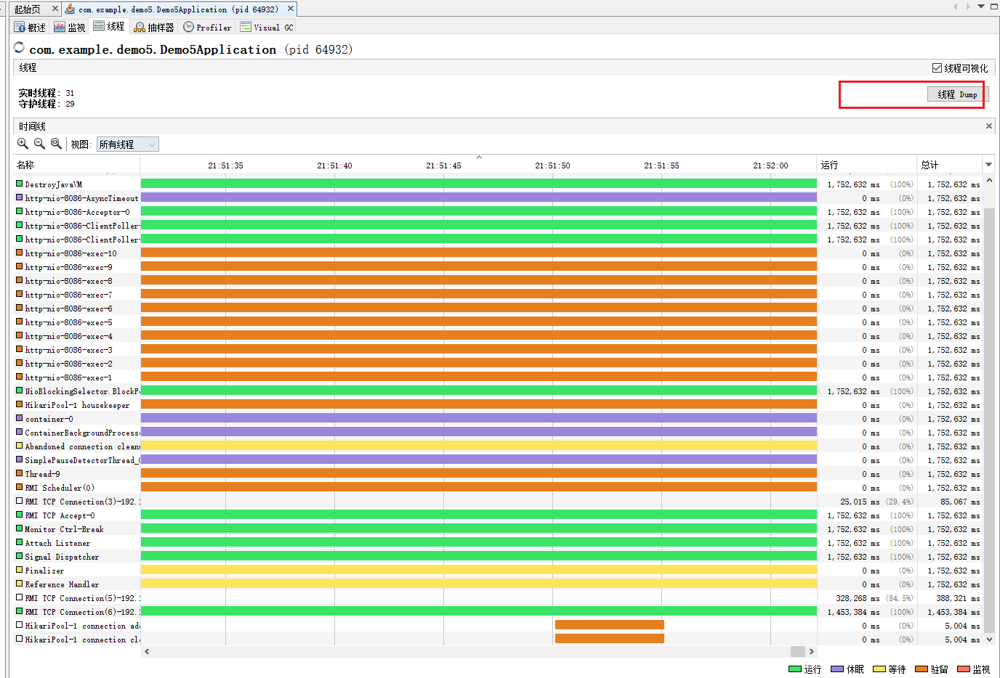

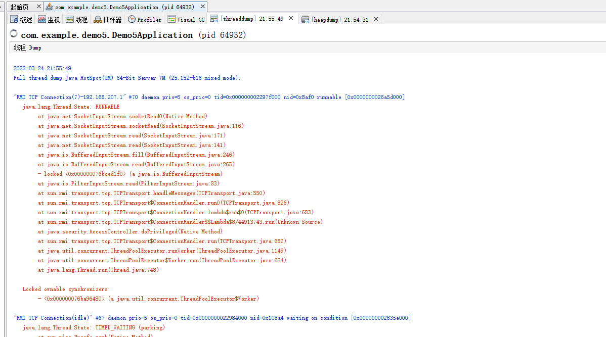

###### Profiler分析

对程序运行期间方法级的CPU和内存进行分析，这个操作会对程序运行性能有很大影响，所以**一般不再生产环境使用Profiler**。CPU分析将会统计每个方法的执行次数、执行耗时；内存分析则会统计每个方法关联的对象数及对象所占空间。

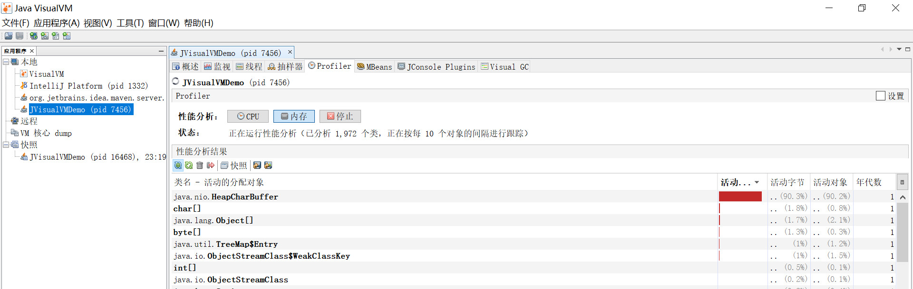

###### GC信息

 点击  "工具"   →   "插件"   →   "可用插件"   选项, 选择Visual GC安装。

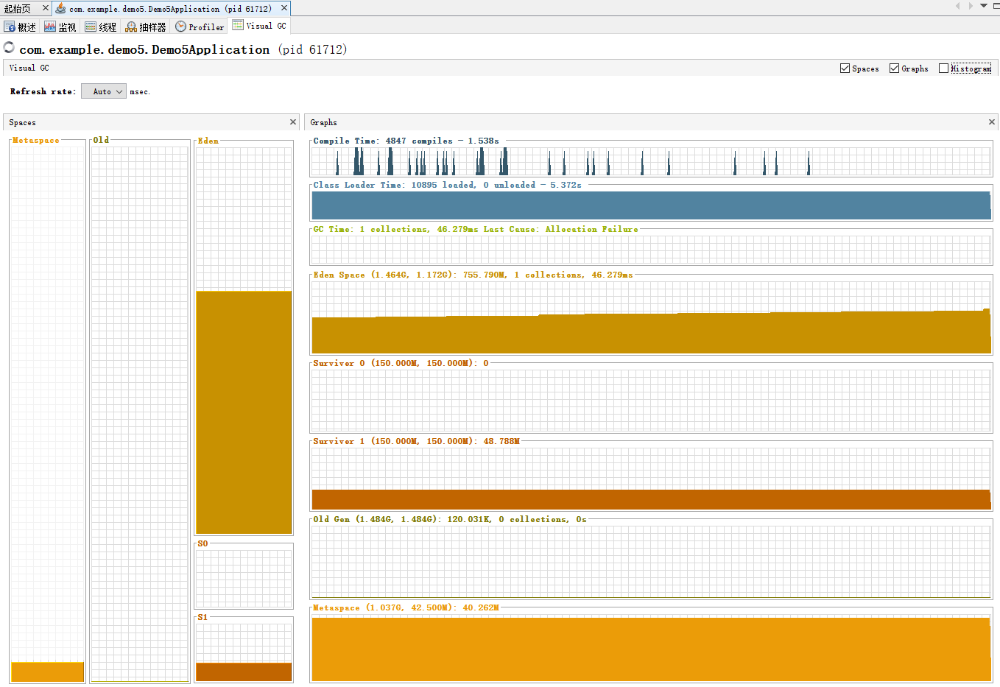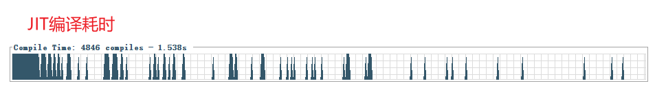


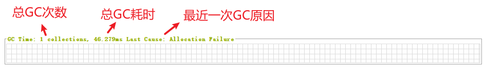

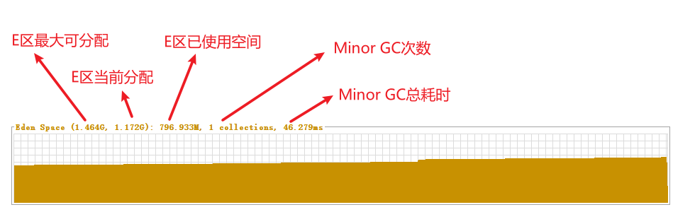


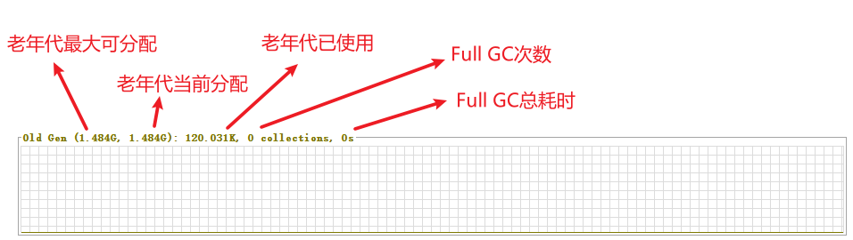

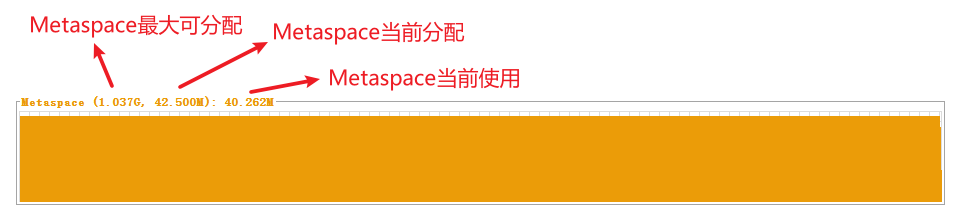


#### 3. 阿里在线诊断工具—Arthas

Arthas 是Alibaba开源的Java诊断工具，深受开发者喜爱。当你遇到以下类似问题而束手无策时，Arthas可以帮助你解决：

- 这个类从哪个 jar 包加载的？为什么会报各种类相关的 Exception？
- 我改的代码为什么没有执行到？难道是我没 commit？分支搞错了？
- 遇到问题无法在线上 debug，难道只能通过加日志再重新发布吗？
- 线上遇到某个用户的数据处理有问题，但线上同样无法 debug，线下无法重现！
- 是否有一个全局视角来查看系统的运行状况？
- 有什么办法可以监控到JVM的实时运行状态？怎么快速定位应用的热点，生成火焰图？

Arthas支持JDK 6+，支持Linux/Mac/Windows，采用命令行交互模式，同时提供丰富的 Tab 自动补全功能，进一步方便进行问题的定位和诊断。


## 四、GC日志工具

GC日志可视化分析工具GCeasy和GCviewer。通过GC日志可视化分析工具，我们可以很方便的看到JVM各个分代的内存使用情况、垃圾回收次数、垃圾回收的原因、垃圾回收占用的时间、吞吐量等，这些指标在我们进行JVM调优的时候是很有用的。

- **GCeasy** 是一款在线的GC日志分析器，可以通过GC日志分析进行**内存泄露检测**、**GC暂停原因分析**、**JVM配置建议优化**等功能，而且是可以免费使用

  在线分析工具 https://gceasy.io/index.jsp

- GCViewer是一款实用的GC日志分析软件，免费开源使用，你**需要安装jdk或者java环境才可以使用**。软件为GC日志分析人员提供了强大的功能支持，有利于大大提高分析效率


#### GCeasy使用如下

- 通过`-Xloggc:D://logs/gc.log` 指令在指定路径下生成gc log，登陆https://gceasy.io/index.jsp并将log文件上传

  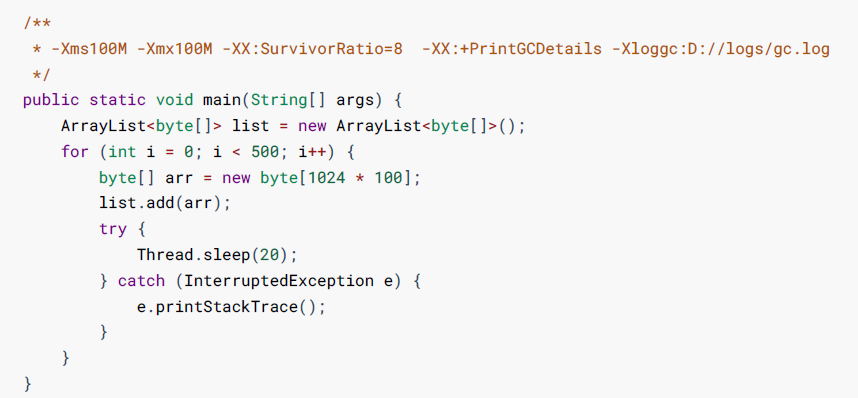

- **jvm堆**

  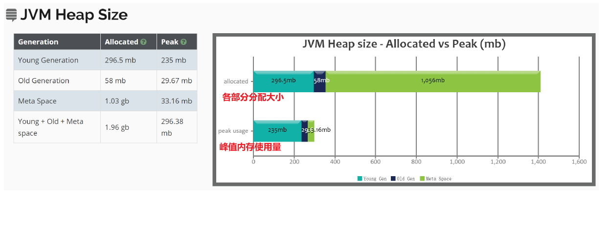

- **关键性能指标**

  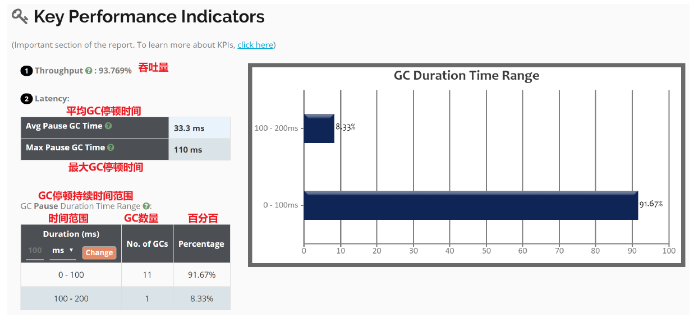

- 交互式图表

  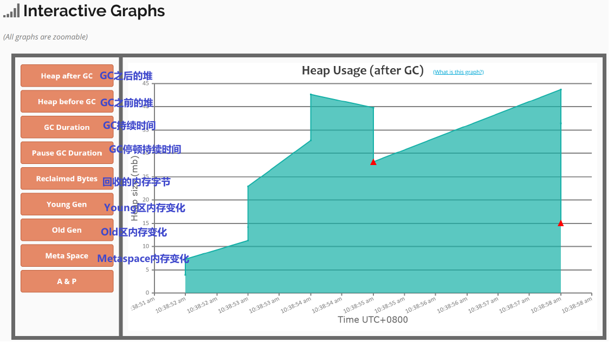


#### GCViewer使用如下

下载： https://sourceforge.net/projects/gcviewer /

启动：`java -jar gcviewer-1.37-SNAPSHOT.jar`

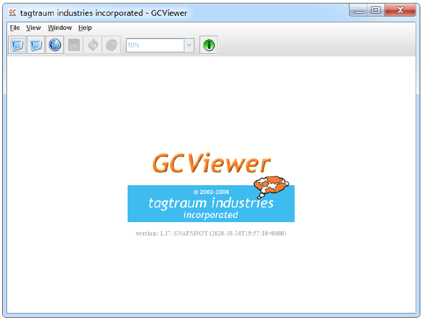

点击  File->Open File 打开我们的GC日志，可以看到如下图，图标是可以放大缩小的，主要内容就是红线圈住的部分，里面的内容跟上面的GCeasy的比较类似，具体的可以看下GitHub中的描述。

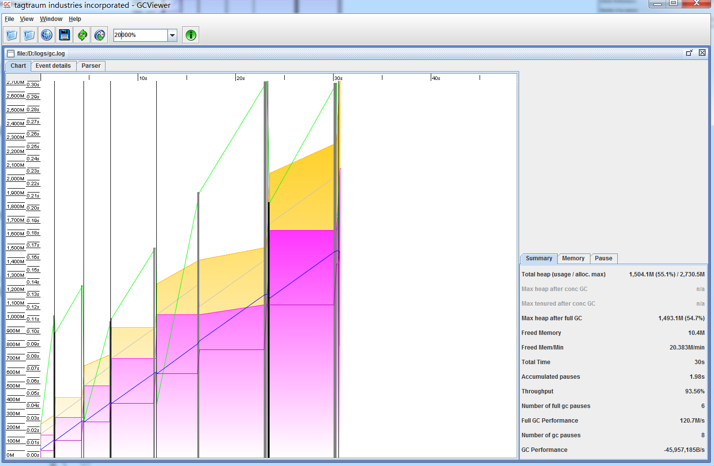


## 五、调优实战

### 1.Jmeter

Apache Jmeter是开源的压力测试工具，我们借助于此工具进行测试，将测试出tomcat 的吞吐量等信息。下载地址： http://jmeter.apache.org/download_jmeter.cgi

#### 1.1 下载安装

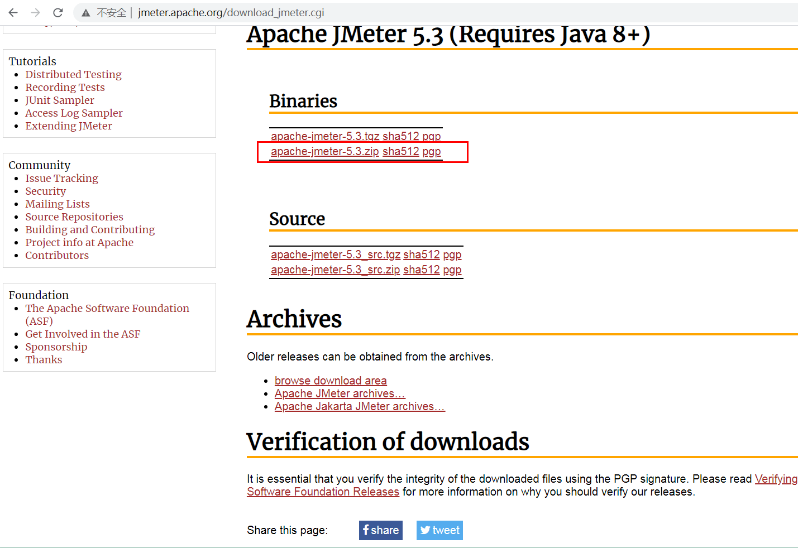

下载完成打开路径为：\JmeterHome\bin\jmeter.bat

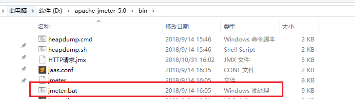


#### 1.2 修改配置

- 设置中文

  Options -> Choose Language -> Chinese(Simplified)

- 设置外观主题

  Options -> Windows


#### 1.3 使用方法

- Test Plan右键添加线程组

  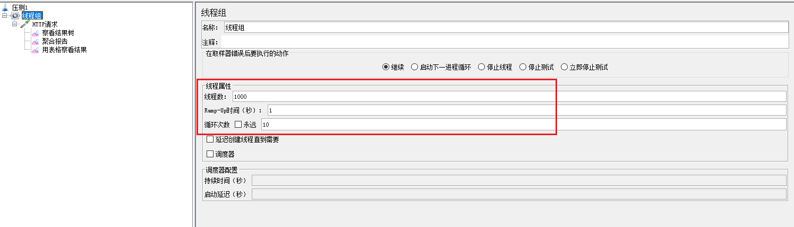

- 线程组右键 -> 取样器 -> 添加HTTP请求

  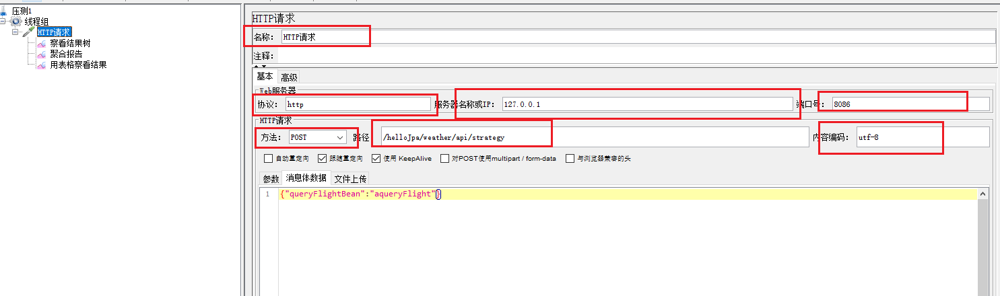

- 为HTTP添加监控

  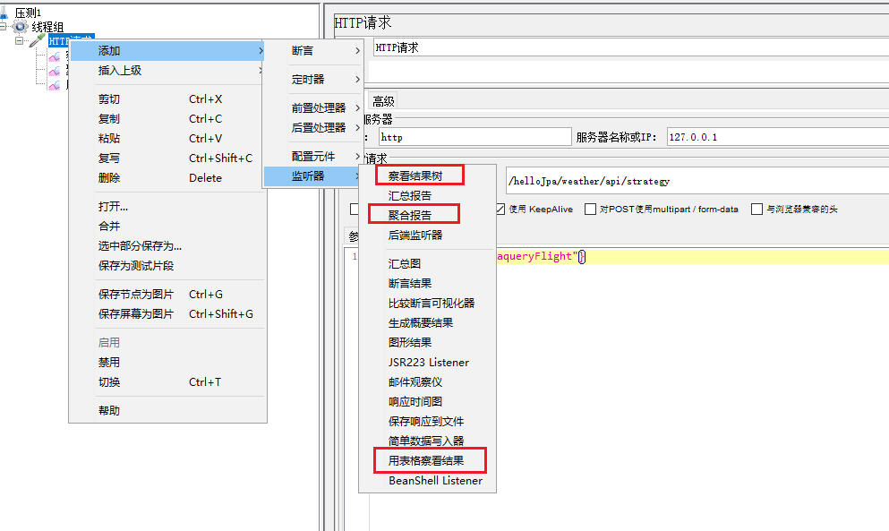

- 启动Http请求

- 压测查看监控

  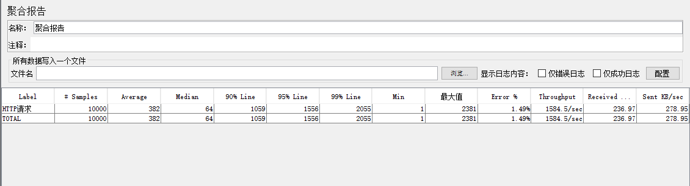

  平均响应时间：382ms

  错误率：1.49%

  吞吐量：1584.5/sec


### 2. Tomcat调优

[Tomcat调优详情](../../架构/Web应用服务/Tomcat/Tomcat配置https及调优)


### 3. JVM参数调优过程

#### 3.1 默认内存分配启动，打印GC和OOM日志

```sh
-XX:+PrintGCDetails
-XX:+PrintGCTimeStamps
-XX:+PrintGCDateStamps
-XX:+PrintHeapAtGC
-Xloggc:D:/jvm/gc.log
-XX:LargePageSizeInBytes=128m
-XX:+UseFastAccessorMethods
-XX:+DisableExplicitGC
-XX:+HeapDumpOnOutOfMemoryError
-XX:HeapDumpPath=D:/jvm/heapdump.hprof
```

##### 启动后查看堆内存默认分配如下

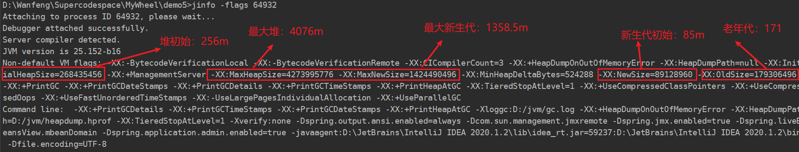

##### 压测接口结果

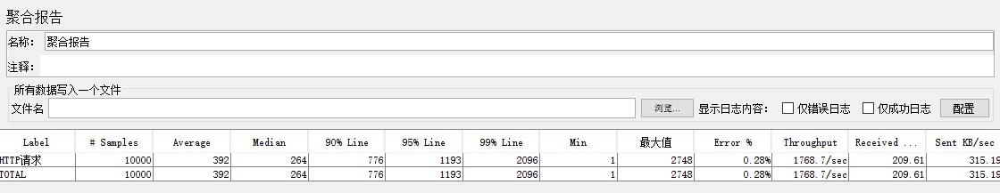

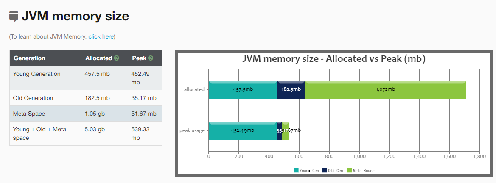

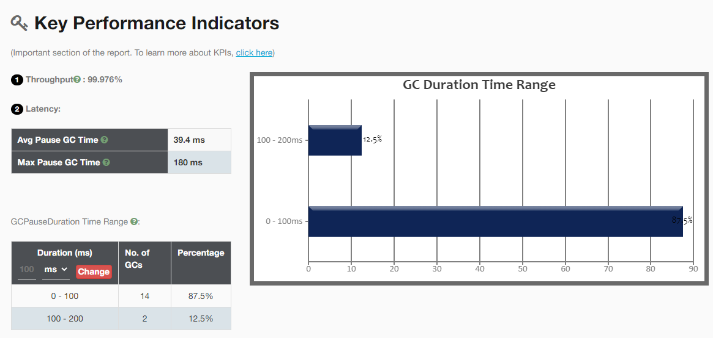

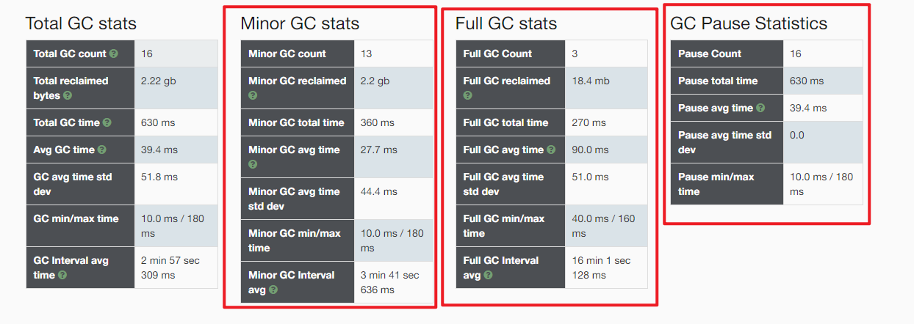

##### 总结

- 默认老年代为170m，年轻代卡在457m
- 吞吐量：99.976%
- 老年代太小导致频繁Full GC，所以GC次数总体比较多。


#### 3.2 设置内存分配参数

```sh
-Xms3020m
-Xmx3020m
-Xss256k
-XX:NewSize=1500m
-XX:MaxNewSize=1500m
-XX:MetaspaceSize=512m
-XX:MaxMetaspaceSize=512m
-XX:SurvivorRatio=8
-XX:LargePageSizeInBytes=128m
-XX:+UseFastAccessorMethods
-XX:+PrintGCDetails
-XX:+PrintGCTimeStamps
-XX:+PrintGCDateStamps
-XX:+PrintHeapAtGC
-Xloggc:D:/jvm/gc.log
-XX:+DisableExplicitGC
-XX:+HeapDumpOnOutOfMemoryError
-XX:HeapDumpPath=D:/jvm/heapdump.hprof
```

##### 	启动后查看堆内存默认分配如下

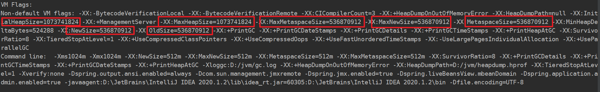

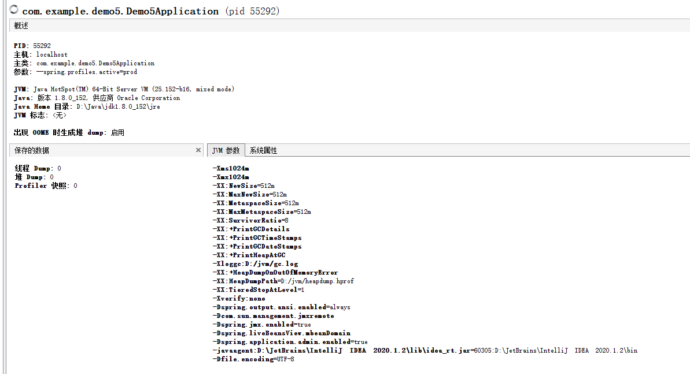

##### 压测接口结果如下

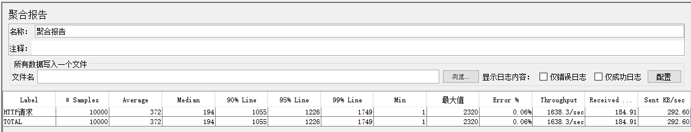

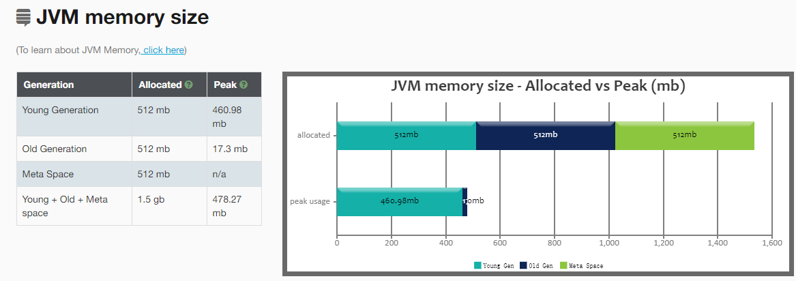

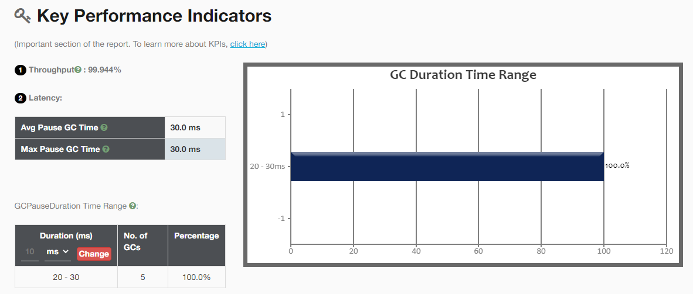

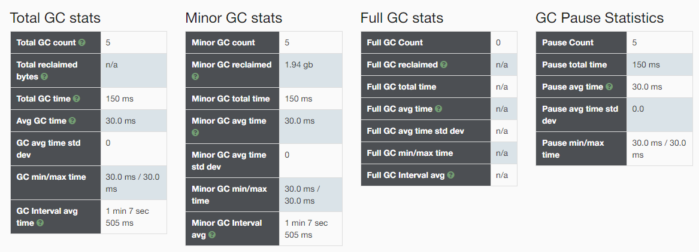

- 分配新生代和老年代为1:1后，均为512m
- 吞吐量：99.944%
- 老年代分配大内存后，GC次数由16次减为了5次


#### 3.3 设置CMS回收器

```sh
-Xms3020m
-Xmx3020m
-Xss256k
-XX:NewSize=1500m
-XX:MaxNewSize=1500m
-XX:MetaspaceSize=512m
-XX:MaxMetaspaceSize=512m
-XX:SurvivorRatio=8
-XX:LargePageSizeInBytes=128m
-XX:+UseFastAccessorMethods
-XX:+UseConcMarkSweepGC
-XX:+CMSParallelRemarkEnabled
-XX:CMSInitiatingOccupancyFraction=70
-XX:+UseCMSInitiatingOccupancyOnly
-XX:+PrintGCDetails
-XX:+PrintGCTimeStamps
-XX:+PrintGCDateStamps
-XX:+PrintHeapAtGC
-Xloggc:D:/jvm/gc.log
-XX:+DisableExplicitGC
-XX:+HeapDumpOnOutOfMemoryError
-XX:HeapDumpPath=D:/jvm/heapdump.hprof
```

#### 3.4 设置G1回收器

```sh
-Xms3020m
-Xmx3020m
-Xss256k
-XX:NewSize=1500m
-XX:MaxNewSize=1500m
-XX:MetaspaceSize=512m
-XX:MaxMetaspaceSize=512m
-XX:SurvivorRatio=8
-XX:LargePageSizeInBytes=128m
-XX:+UseFastAccessorMethods
-XX:+UseG1GC
-XX:MaxGCPauseMillis=10
-XX:+PrintGCDetails
-XX:+PrintGCTimeStamps
-XX:+PrintGCDateStamps
-XX:+PrintHeapAtGC
-Xloggc:D:/jvm/gc.log
-XX:+DisableExplicitGC
-XX:+HeapDumpOnOutOfMemoryError
-XX:HeapDumpPath=D:/jvm/heapdump.hprof
```


## 六、常见JVM调优的问题和原因


## 七、调优案例


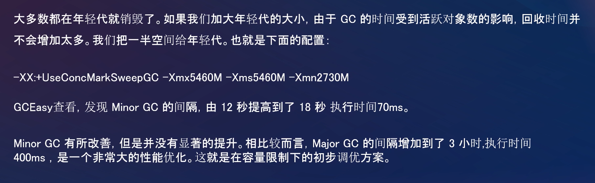

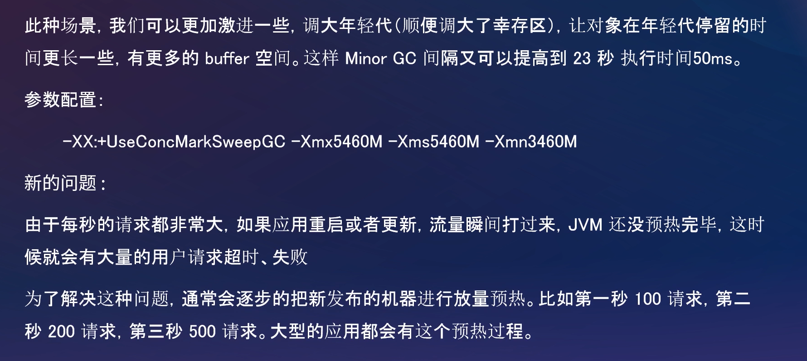

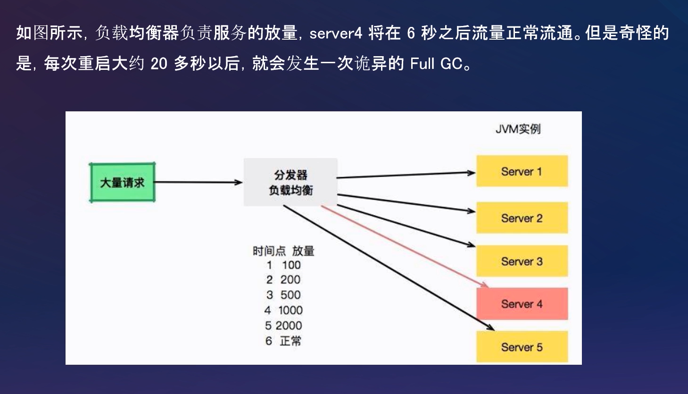

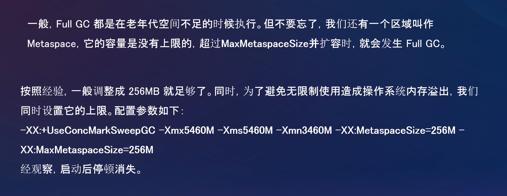

