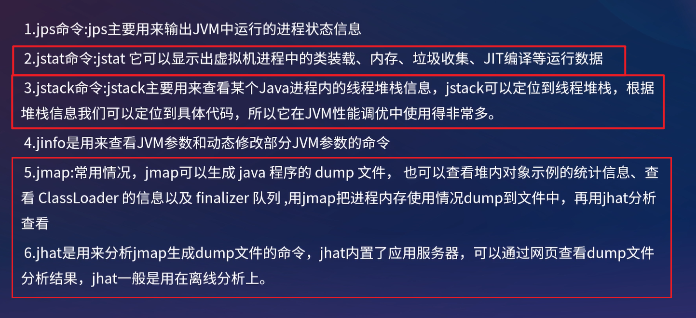

[toc]

## 一、JVM问题及参数

#### 1. 内存泄漏与内存溢出

- 内存泄漏：指**本该被回收的对象无法被回收**，导致内存浪费。**内存泄漏严重时会导致OOM**。
- 内存溢出：指OOM（OutOfMemoryError异常），就是**JVM内存不够用**。


#### 2. JVM参数类型

- **标准参数（-）：**所有的 JVM 实现都必须实现这些参数的功能，而且向后兼容；
- **非标准参数（-X）：**默认 JVM 实现这些参数的功能，但是并不保证所有 ivm 实现都满足，且不保向后兼容；
- **非稳定参数（-XX:）：**此类参数各个 ivm 实现会有所不同，将来可能会随时取消，需要谨慎使用
  - `-XX:+[options]  `   启动
  - `-XX:-[options]`    禁用
  - `-XX:[options] = 整数`     如  `-XX:MaxMetaSpaceSize = 512m`
  - `-XX:[options] = 字符串`     如  `-XX:HeapDumpPath=./dump.core`

##### 2.1 标准参数(-)

- **-client**：设置JVM使用client模式，使用于一般PC
- **-server**：设置JVM使用server模式，启动速度虽然慢，但效率高，适用于服务器
- **-verbose:class**：输出JVM载入类的相关信息，当JVM报告说找不到类或者类冲突时进行诊断。
- **-verbose:gc**：输出每次GC的相关情况。
- **-verbose:jni**：输出 native方法调用的相关情况，一般用于诊断jni调用错误信息

##### 2.2 非标准参数(-X)

- **堆内存大小**
  - **-Xms4096m**：堆的初始值（最小值），默认值为 物理内存/64（小于1G），单位可指定k、m、g
  - **-Xmx4096m**：堆的最大值，如果Xms和Xmx都不设置，则两者大小会相同，**默认情况下，当堆中可用內存大于70%时**，堆内存会**收缩直到堆的最小值为止**，单位可指定k、m、g
- **新生代大小**
  - **-Xmn**：新生代最大内存（包含E、S0、S1），单位可指定k、m、g
- **栈内存大小**
  - **-Xss256k**：这个参数用于设置每个线程的栈內存，默认1M，单位可指定k、m、g
- **GC打印监控**
  - **-Xloggc:file**：与 verbose:gc功能类似，只是**将每次GC事件的相关情况记录到一个文件中**

##### 2.3 非稳定参数(-XX:)

- **性能参数( Performance Options)**：用于JVM的**性能调优和內存分配**

  - **堆内存分配**
    - **-XX:MaxHeapFreeRatio=70**   空闲堆内存的**最大比例**，达到该值则堆**收缩直至堆内存初始值**
    - **-XX:NewRatio=2**   新生代和老年代大小比值，**默认为2（Young : Old = 1 : 2）**，**有-XXNewSize和-XX:MaxNewSize时不设置此项**
  - **新生代分配**
    - **-XX:NewSize=size**    新生代占用内存初始值
    - **-XX:MaxNewSize=size**   新生代占用内存最大值
    - **-XX:SurvivorRatio**  Eden区与Survivor区大小的比值，取值为整数，**默认为8（E : S0 : S1 = 8 : 1 : 1）**
  - **老年代分配**
    - **-XX:MaxTenuringThreshold=15**   对象年龄超过这个阈值，则进入老年代
    - **-XX:PretenureSizeThreshold=1M**    对象内存**超过阈值大小直接进入老年代**，默认值为0（直接放入E区）
  - **方法区分配**
    - **-XX:PermSize=64m**   永久代初始内存
    - **-XX:MaxPermsize=64m **  永久代占用内存最大值(非堆内存)
    - **-XX:MetaspaceSize=256m**  元空间初始值
    - **-XX:MaxMetaspaceSize=256m**   元空间最大内存

- **行为参数( Behavioral Options)**：用于改变JVM的基础行为，如GC的方式和算法的选择

  - **串行或弃用GC组合**
    - **-XX:+UseSerialGC**   启用串行GC，即**Sera + Serial old**（S+SO）组合（只适合单核小型程序）
    - **-XX:+UseParNewGC**   使用**ParNew + Serial Old**组合（在某些版本中已经废弃）

  - **吞吐优先并行GC组合**
    - **-XX:+UseParallelGC**   启用并行GC，即JDK1.8使用**Parallel Scavenge + Parallel Old**组合（PS + PO）
    - **-XX:+UseParallelOldGC**   启用并行GC，即**Parallel Scavenge + Parallel Old**组合（PS + PO）
    - **-XX:GCTimeRatio=99**   设置吞吐量大小（默认值99，即1%的时间用于GC，吞吐量99%）
    - **-XX:MaxGCPauseMillis=80**   设置GC导致最大的STW时间（这个参数只对 Parallel Scavenge有效）
    - **-XX:+UseAdaptiveSizePolicy**   根据系统运行情况进行自适应调节年轻代、E、S的比例，晋升老年代对象年龄等参数
  - **CMS回收器**
    - **-XX:+UseConcMarkSweepGC**   使用 **ParNew + CMS + Serial Old（当CMS失败时自动切换为SO）**
    - **-XX:ConcGCThreads=10**   设置CMS并发回收线程
    - **-XX:CMSInitiatingOccupancyFraction**    **CMS的触发百分比**，值大则降低GC频率但是容易并发失败（**浮动垃圾导致可用内存小了，导致吞吐量差**），值小则避免并发失败但是GC频率UP
  - **G1 回收器**
    - **-XX:+UseG1GC**    使用G1
    - -XX:MaxGCPauseMillis  **预期收集停顿时间**，默认值是**200毫秒**，如果预期**暂停时间设置太短，如20ms**，**暂停时间短导致GC效果差如CMS**，**GC效果差导致可用内存小了从而使吞吐量差**
    - -XX:G1HeapRegionSize设定，取值范围为1MB～32MB，且应为2的N次幂
    
  - **锁参数**
    - **-XX:+PrintAssembly**  参数输出反汇编
    - **-XX:+UseBiasedLocking**   偏向锁开启
    - **-XX:BiasedLockingStartupDelay = 4000** 偏向锁启动延时
    - **-XX:PreBlockSpin**  自旋次数

- **调试参数( Debugging Options)**：用于监控、打印、输出JVM参数，用于显示JVM更加详细的信息

  - **-XX:ErrorFile=./hs_er_pid.log**   保存错误日志或者数据到文件中

  - **-XX:+HeapDumpOnOutOfMemoryError**   当首次遭遇OOM时导出此时堆中相关信息

  - **-XX:HeapDumpPath=./log/log_hprof/oom.hprof**   指定导出堆信息时的路径或文件名

    


### JVM调优——性能指标及步骤

#### 1. 调优原因及调优内容

JVM 调优主要是 **优化内存分配** 和 **优化垃圾回收策略**。

**JVM运行环境（慢，卡顿）**、解决JVM运行过程中**出现的各种问题(OOM、CPU过载)**，产生系统瓶颈。

- 在**硬件资源不变**的情况下，**调整内存分配**和**合适的回收器**来最大程度**降低GC对系统的影响**。
- 通过工具对线程长时间阻塞、甚至死锁、CPU过载进行分析，并作出优化。


#### 1. 性能指标

- 吞吐量 = 运行用户代码时间 / (运行用户代码时间+垃圾收集时间)

  追求高吞吐量，回收算法使用标记复制、标记整理为佳，如串行回收器的SGC（标记复制）和SOGC（标记整理）、并行回收器的PNew（标记复制）和PO、G1

  如GC 1s支撑用户运行1天   ------》   GC 1s 支撑用户运行2天，表示吞吐量提升

  用户代码加上垃圾收集总共耗费了100分钟，其中垃圾收集花掉1分钟，那吞吐量就是99%

  **停顿时间缩短**是以**牺牲吞吐量和新生代空间为代价**换取的：系统把新生代调得小一些，收集300MB新生代肯定比收集500MB快，但这也直接导致垃圾收集发生得更频繁，原来10秒收集一次、每次停顿100毫秒，现在变成5秒收集一次、每次停顿70毫秒。**停顿时间的确在下降**，但**可用内存也少了（吞吐量也降下来了）**

- 暂停时间：暂停用户线程的时间，STW越短越好。

  回收算法使用标记清除为佳，如CMS(标记清除算法)、G1(标记复制、标记整理，但G1在可控的暂停时间内，也保证了高吞吐量)

**吞吐量优先**主要是**后台运算，交互不多的场景**，如**批处理**，**订单处理**，科学计算等。适合**使用 PS + PO**

响应时间：网站 GUI API （G1）

**所谓调优：吞吐量优先，还是暂停时间优先？在缩短STW的的情况下，要求达到多大的吞吐量。。。**


#### 2. 调优步骤

##### 2.2 如何分析？

使用[JConsole、VisualVM可视化工具](#调优-可视化工具)和[GC日志工具](#GC日志工具)，查看**堆内和方法区内存使用情况**、**线程信息**、**GC情况**和**CPU使用率**。

比如

1. 如**Mino GC和Full GC频率和耗时**（主要是对内存划分、垃圾回收器的选择）
   - Mino GC 执行 大于200 ms，几秒一次
   - Full GC 执行大于 1 s，半小时-一小时一次
2. 避免大量**线程长时间阻塞挂起**，如何发现原因。
3. 避免出现死锁，导致CPU使用率过高，影响其他线程工作。


### JVM调优——工具



#### 调优-常用指令

##### 1. jinfo

`jinfo [option] <pid>`

- options参数解释：
  - no options 输出所有的系统属性和参数
  - -flag 打印指定名称的参数
  - -flag [+|-] 打开或关闭参数
  - -flag = 设置参数
  - -flags 打印所有参数
  - -sysprops 打印系统配置

- 示例

  ```sh
  jinfo 11666
  jinfo -flags 11666
  jinfo -sysprops 11666
  jinfo -flag PrintGC 11666
  ```

  

##### 1. jps

`jps [options] [hostid]`

- options：
  - -l 输出jar包路径，类全名
  * -m 输出主类名，及传入main方法的参数
  * -v 输出主类名，及输出JVM参数
  * -q 显示进程id

- hostid : 主机或其他服务器ip

##### 2. jstat

`jstat [option] VMID [interval] [count ]`

其中VMID是进程id，interval是打印间隔时间（毫秒），count是打印次数（默认一直打印）

option参数解释：

- -class class loader的行为统计
- **-compiler HotSpt JIT编译器行为统计**
- **-gc 垃圾回收堆的行为统计（GC统计的实际值）**
- **-gcutil 垃圾回收统计概述（GC统计的百分比）**
- -gccapacity 各个垃圾回收代容量(young,old,perm)和他们相应的空间统计
- **-gccause 垃圾收集统计概述（同-gcutil），附加最近两次垃圾回收事件的原因**
- **-gcnew 新生代行为统计**
- -gcnewcapacity 新生代与其相应的内存空间的统计
- **-gcold 年老代和永生代行为统计**
- **-gcoldcapacity 年老代行为统计**
- -printcompilation HotSpot编译方法统计


##### 3. jstack

`jstack [options] <pid>`

option参数解释：

- -F 当使用 `jstack <pid>`无响应时，强制输出线程堆栈。
- -m 同时输出java堆栈和c/c++堆栈信息(混合模式)
- -l 除了输出堆栈信息外，还显示关于锁的附加信息

###### cpu占用过高问题

**Linux：**

1. top命令，然后按shift+p按照CPU排序，找到占用CPU过高的进程的pid
2. top -H -p [进程id] 找到进程中消耗资源最高的线程的id
3. 使用计算器讲 线程十进制id 转换成16进制
4. 使用`jstack -l <pid> |grep -A 10 线程id ` 查看CPU占用过高进程堆栈
5. 线程快照中找到指定线程，并分析代码

**Windows：**

1. 使用Process Explorer工具找到cpu占用率较高的线程
2. 在thread卡中找到cpu占用高的线程id
3. 使用计算器讲 线程十进制id 转换成16进制
4. 使用`jstack -l <pid> |grep -A 10 线程id ` 查看CPU占用过高进程堆栈
5. 线程快照中找到指定线程，并分析代码


###### jstack检查死锁问题

`jstack -l <pid> | grep deadlock`

打印结果如下：Thread-1和Thread-0分别锁住了`xxxxxx1dc5c8` 和 `xxxxx1dc5d8`，然后又想分别去获取对方持有的锁，导致死锁。


#### 调优-可视化工具

可视化监控访问远程Java程序时，需要远程程序开启**JMX，如下配置**

```sh
-Dcom.sun.management.jmxremote.port=9999 #指定端口
-Dcom.sun.management.jmxremote.authenticate=false #指定是否需要密码验证
-Dcom.sun.management.jmxremote.ssl=false #指定是否使用SSL通讯
```

##### 1. Jconsole

**JDK中自带**的 java监控和管理控制台，用于对 **JVM内存，线程 和 类等的监控**，是一个基于JMX（java management extensions）的GUI性能监测工具，直接在 **jdk/bin目录下点击jconsole.exe即可启动**


###### 内存监控


从图中详细信息可以看出，**Eden区的内存大小为27.328KB**，所以折线图中显示**每次到27Mb左右时系统就会进行一次GC**。当1000次循环结束后，执行System.gc()，柱状图中显示Eden区和Survivor区基本被清空，但老年代的对应柱状图仍保持峰值状态，这是因为System.gc()是在fillHeap()方法内执行，所以list**对象在System.gc()执行时仍然是存活的(处于作用域之内、被引用**)。如果将System.gc()移动到fillHeap()方法外执行，如下柱状图所示，则会回收包括老年代的所有内存。


###### 线程监控


##### 2. Jvisualvm

VisualVM基于NetBeans平台开发，因此它一开始就具备了插件扩展的特性，通过插件支持，VisualVM可以做许多事情，例如:

- 显示虚拟机进程和进程的配置、环境信息(jps、jinfo)
- **监视应用程序的CPU、GC、堆、方法区及线程的信息(jstat、jstack)**
- **dump及分析堆转储快照(jmap、jhat)**
- 方法级的程序运行性能分析, 找出被调用最多、运行时间最长的方法
- 离线程序快照: 收集程序的运行时配置、线程dump、内存dump等信息建立一个快照, 可以将快照发送开发者处进行bug反馈等等

在 %JAVA_HOME%\bin目录下, **启动 jvisualvm.exe**进入主界面, 点击  "工具"   →   "插件"   →   "可用插件"   选项, 选择所需的插件安装。


安装好插件后, 选择一个正在运行的java程序就可以查看程序监控的主界面了


###### 堆dump快照

两种方式生成堆dump文件

- 在"应用程序"窗口中右键单击应用程序节点，选择  "堆 Dump"
- 在"监视"页签中选择"堆 Dump"


###### 分析

在Profiler页签中，可以对程序运行期间方法级的CPU和内存进行分析，这个操作会对程序运行性能有很大影响，所以**一般不再生产环境使用Profiler**。CPU分析将会统计每个方法的执行次数、执行耗时；内存分析则会统计每个方法关联的对象数及对象所占空间。


### GC日志工具

GC日志可视化分析工具GCeasy和GCviewer。通过GC日志可视化分析工具，我们可以很方便的看到JVM各个分代的内存使用情况、垃圾回收次数、垃圾回收的原因、垃圾回收占用的时间、吞吐量等，这些指标在我们进行JVM调优的时候是很有用的。

- **GCeasy** 是一款在线的GC日志分析器，可以通过GC日志分析进行**内存泄露检测**、**GC暂停原因分析**、**JVM配置建议优化**等功能，而且是可以免费使用

  在线分析工具 https://gceasy.io/index.jsp

- GCViewer是一款实用的GC日志分析软件，免费开源使用，你**需要安装jdk或者java环境才可以使用**。软件为GC日志分析人员提供了强大的功能支持，有利于大大提高分析效率


#### GCeasy使用如下

- 通过`-Xloggc:D://logs/gc.log` 指令在指定路径下生成gc log，登陆https://gceasy.io/index.jsp并将log文件上传

  

- **jvm堆**

  

- **关键性能指标**

  

- 交互式图表

  


#### GCViewer使用如下

下载： https://sourceforge.net/projects/gcviewer /

启动：`java -jar gcviewer-1.37-SNAPSHOT.jar`


点击  File->Open File 打开我们的GC日志，可以看到如下图，图标是可以放大缩小的，主要内容就是红线圈住的部分，里面的内容跟上面的GCeasy的比较类似，具体的可以看下GitHub中的描述。


### 常见JVM调优的问题和原因


### 调优案例


