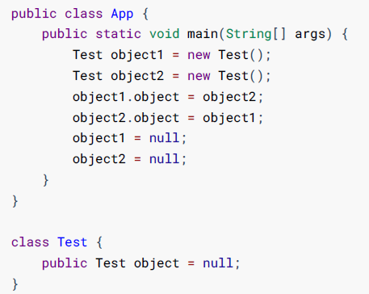

[toc]

## 一、垃圾回收

**垃圾回收（Garbage Collection， 下文简称GC）也称垃圾收集** ，Java程序会**不定时的检查是否有死亡的对象**，**并回收它们占用的内存空间** 

垃圾收集需要完成的三件事情：

- 哪些内存需要回收？
- 什么时候回收？
- 如何回收？

#### 对象死亡判定算法

##### 1. 引用计数法（C++用得多）

给**每个创建的对象添加一个引用计数器**，每当此对象**被某个地方引用时，计数值+1，引用失效时-1**，所以当计数值**为0时表示对象已经不能被使用**。引用计数算法大多数情况下是个比较不错的算法，简单直接，也有一些著名的应用案例**但是对于Java虚拟机来说，并不是一个好的选择**，因为它**很难解决对象直接相互循环引用的问题**。

循环引用示例：

以上两个对象他们都互相引用，**除此之外都没有任何对外的引用**， 实际上这两个对象已经不可能再被访问， **但是它们因为互相引用着对方**， 导致它们的**引用计数都不为零**， 引用计数算法也就**无法回收**它们

##### 2. 可达性分析算法

主流的编程程序语言如 **Java、C#等的主流实现中，都是通过可达性分析(Reachability Analysis)来判断对象是否存活的**

此算法的基本思路就是**通过一系列的 “GC Roots” 的对象作为起始点**，从**起始点开始向下搜索**到对象的路径。搜索**所经过的路径称为引用链(Reference Chain)**，**当一个对象到任何GC Roots都没有引用链时，则表明对象“不可达”**，即该对象是**不可用的**。

#### 可以作为GC Root的对象有哪些？

在Java语言中，可作为GC Roots的对象包括下面几种：

- **在虚拟机栈（栈帧中的本地变量表）中引用的对象，即方法中的局部变量、参数变量**
- **方法区中静态属性引用的对象**
- **方法区中常量引用的对象**
- 本地方法栈中JNI(Native方法)引用的对象
- **Java虚拟机内部的引用**， 如基本数据类型对应的Class对象， 一些常驻的**异常对象**（比如 NullPointExcepiton、OutOfMemoryError） 等， 还有系统类加载器。
- **所有被同步锁（synchronized关键字） 持有的对象**
- 反映Java虚拟机内部情况的 JMXBean、JVMTI中注册的回调、本地代码缓存等

## 二、分代回收

#### 定义

根据对象的生命周期将内存划分，然后进行分区管理。 当前商业虚拟机的垃圾收集器， 大多数都遵循了**“分代收集”（Generational Collection）的理论进行设计**， 分代收集名为理论， 实质是一套符合大多数程序运行实际情况的经验法则， 它建立在两个分代假说之上：

- 弱分代假说（Weak Generational Hypothesis） ： 绝大多数对象都是朝生夕灭的。
- 强分代假说（Strong Generational Hypothesis） ： 熬过越多次垃圾收集过程的对象就越难以消亡。

设计原则： 收集器应该**将Java堆划分 出不同的区域**，然后**将回收对象依据其年龄（年龄即对象熬过垃圾收集过程的次数） 分配到不同的区 域之中存储和回收**

好处：**兼顾了垃圾收集的时间开销**和 对**内存的空间有效利用**

#### GC的类型有哪些

- **部分收集（Partial GC）：**指目标不是完整收集整个Java堆的垃圾收集， 其中又有如下细分
  - 新生代收集（**Minor GC/Young GC**）： 指目标只是**新生代**的垃圾收集。
  - 老年代收集（**Major GC/Old GC**）： 指目标只是**老年代**的垃圾收集，**目前只有CMS收集器会有单独收集老年代的行为**。
  - 混合收集（Mixed GC）： 指目标是收集整个新生代以及部分老年代的垃圾收集。 目前**只有G1收集器会有这种行为**。
- **整堆收集（Full GC）：**收集**整个Java堆 和 方法区**的垃圾收集

在Java堆划分出不同的区域之后， 垃圾收集器才可以每次只回收其中某一个或者某些部分的区域，因此才有了**“Minor GC”、“Major GC”、“Full GC”这样的GC类型的划分**； 

也才能够针对不同的区域安排与里面存储对象存亡特征相匹配的垃圾收集算法——因而发展出了“标记-复制算法”“标记-清除算 法”“标记-整理算法”等针对性的垃圾收集算法。

#### GC的触发条件

###### Minor GC触发条件:

- 当 **Eden区满，就会触发Minor GC**，Minor GC会引发STW（stop the world），暂停其他用户的线程，等垃圾回收接收，用户的线程才恢复

###### FullGC 触发机制:

- **调用System.gc()**，系统只是建议执行Full GC，但**不是必然执行**

- **老年代空间不足**

- **方法区空间不足（元空间内存不足，扩容导致Full GC）**

- 通过**Minor GC后**，**进入老年代的**平均大小**大于老年代可用内存**

Major GC触发机制（武略major GC，可认为是Full GC）

- **老年代空间不足**时，会尝试**先触发MinorGC**，如果空间还是不足，则**触发Major GC**，Major GC的速度比Minor GC**慢10倍以上**，如果Major GC，内存仍然不足，则报错OOM

#### GC后存活的对象什么时候去老年代？

- 当新生代存活对象年龄达到15时，对象头的**Mark Word中有4个字节来存储对象分代年龄**，所以**最大不能超过15岁**

- 当S0和S1内存空间被占满时，则会将对象放入老年代

## 三、垃圾回收算法

#### 标记-清除算法

标记-清除算法（Mark-Sweep）最基础的收集算法， 是因为后续的收集算法大多都是以标记-清除算法为基础， 对其 缺点进行改进而得到的。

将垃圾回收分为 “标记” 和 “清除” 两个阶段，**先标记出所有可回收的对象**，然后**再回收所有被标记对象所占用的空间**

**特点：**标记、无复制、无移动

**优点：**实现简单，不需要对象进行移动

**缺点：**标记、清除过程效率低，并会**产生大量不连续的内存碎片**，**提高了垃圾回收频率**（需要分配较大对象时**无法找到足够的连续内存**）

#### 标记-复制算法（适用新生代）

**将内存空间划分为大小相等的两块区域**，每次只使用其中的一块。垃圾回收时，遍历当前使用的区域，**将存活对象复制到另一个区域中**，最后**将当前区域的可回收对象进行回收**。

**特点：**标记、复制

**优点：**按顺序分配内存即可，实现简单、运行高效，不用考虑内存碎片。

**缺点：**可用的内存缩小**为原来的一半**，使该区域GC更加频繁；对象**存活率高时会频繁进行复制**，开销大效率低

#### 标记-整理算法（适用老年代）

标记-整理算法（Mark-Compact），与标记-清除算法不同的是，**先标记可回收的对象**后，将所有**存活对象移动到内存的一端**，使他们紧凑的排列在一起，**然后对端边界意外的内存进行回收**。回收后已用和未用的内存都各自一边

**特点：**标记、移动

**优点：**解决了标记-清除算法存在的内存碎片问题

**缺点：**仍需要进行局部对象移动，一定程度上降低了效率

#### 各GC类型适用的回收算法

## 四、垃圾回收器

#### 垃圾回收器与垃圾回收算法的关系

垃圾回收算法分为两类，分别如下

- 对象死亡判定算法：引用计数法、可达性算法
- 回收死亡对象算法：标记清除算法、标记复制算法、标记整理算法

根据堆内存不同区域的特点使用不同的回收算法进行回收，而垃圾收集器正是垃圾回收算法的落地实现

#### 垃圾回收器类型

四种：串行、并行、CMS并发、G1

#### 七种常见垃圾回收器组合关系

#### 并行、串行回收器

##### 1. 串行回收器

**JVM参数：**

-  使用串行新生代+串行老年代回收器：`-XX:+UseSerialGC`  

##### 2. 并行回收器

**ParNew收 集器的工作过程**

**ParNew 参数：**

- 使用方式：`-XX:+UseParNewGC`

- 设置年轻代线程数: `-XX:ParllGCThreads=10`

**Parallel Scanvenge参数：**

- 使用方式：`-XX:+UseParallelGC`
- 设置年轻代线程数：`-XX:ParllGCThreads`
- 吞吐量大小：`-XX:GCTimeRatio=10`
- 最大垃圾收集停顿时间：`-XX:MaxGCPauseMillis=50`
- 根据系统运行情况进行自适应调节年轻代、E、S的比例，晋升老年代对象年龄等参数：`-XX:+UseAdaptiveSizePolicy`

**Parallel Old收集器的工作过程**

**Parallel Old 参数：**

- 使用方式：`-XX:+UseParallelOldGC`

#### CMS垃圾回收器

##### CMS回收过程

三次标记、一次清理；两次STW

- **初始标记（Initial-Mark）阶段：**该阶段 **所有的工作线程**都将会因为"**Stop-the-Wold**"机制而出现**短暂的的暂停**，这个阶段的主要任务**标记GC Roots 直接关联对象**。一旦标记完成后就恢复之前被暂停的的所有应用。**由于直接关联对象比较小**，所以这里的**操作速度非常快**。
- **并发标记（Concurrent-Mark）阶段：**从**GC Roots的直接关联对象开始遍历**整个引用链的过程，这个过程**耗时较长**，但是**不需要暂停用户线程**，用户线程可以与垃圾回收器一起运行。
- **重新标记（Remark）阶段：由于并发标记阶段**，程序的工作线程会和垃圾收集**线程**同时运行或者**交叉运行**。因此，为了**修正并发标记期间**因为用户继续运行而导致标记**产生变动的那一部分对象的标记记录**，因为"**Stop-the-Wold**"机制而出现暂停，通常**比初始标记阶段长一些**，但也远**比并发标记阶段时间短**。
- **并发清除（Concurrent-Sweep）阶段:** 此阶段**使用标记-清除算法**回收死亡对象占用的内存空间。由于不需要移动存活对象，所以这个阶段可以**与用户线程同时并发运行**。

##### CMS缺点

- CMS收集器**比较吃CPU性能**。（当CPU核心数不足四个时， CMS会**导致用户CPU资源紧缺而执行变慢**）
- 并发清理阶段产生的 **“浮动垃圾”**，可能**导致老年代预留的空间不足**，**无法满足程序正常运行**（新分配的老年代对象），就会**出现”并发失败“（Concurrent Mode Failure）**。启动备用预案： **暂停用户线程的执行**， 临时**启用Serial Old收集器**来重新进行老年代的垃圾收集， 这就导致长时间停顿的Full GC。
  - CMS**并发清理阶段**，**此时此时用户线程产生的可回收对象并未被标记**，只能留到下次GC清理，这个称为**”浮动垃圾“**
  - 由于CMS线程和用户线程**并发执行**，为了**保证CMS回收垃圾时，程序也能正常运行**，因此在CMS执行回收时得**确保老年代有预留足够得内存空间供用户线程运行**。

- CMS是基于标记-清除算法的回收器，**会产生内存碎片**

#### G1垃圾回收器

##### G1回收过程

三次标记、一次回收；三次STW

- **初始标记：**和CMS 初始标记相同
- **并发标记：**和CMS 并发标记相同
- **最终标记：**和CMS的重新标记相同，修正并发标记期间,因程序运行导致发生变化的那一部分对象
- **筛选回收：**根据时间来进行价值最大化收集

##### G1优点

1. G1把连续的Java堆划**分为2048个大小相同的独立块（Region）**
2. G1仍然保留分代思想，保留了新生代和老年代，但他们**不再是物理隔离**，**是一部分Region的集合**，通过Region的动态分配方式实现**逻辑上的连续**，H块，主要用于存储大对象（超过1.5个块）
3. G1能够**充分利用多CPU**、**多核**环境**硬件优势**，尽量**缩短STW**
4. G1整体整体采用**标记-整理算法**，局部是采用**复制算法**，**不产生内存碎片**
5. G1的**停顿可预测**，能够明确**指定在一个时间段内**，消耗在垃圾收集上的时间**不超过设置时间**
6. G1跟踪各个**Region**里面**垃圾的价值**大小，会维护一个优先列表，每次**根据允许的时间来回收价值最大的块（Region）**，从而保证回收时间**不超过设置时间**

##### G1常用参数

