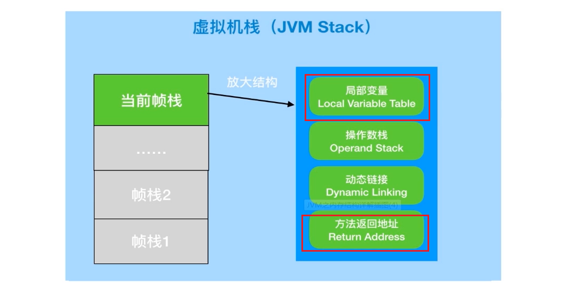
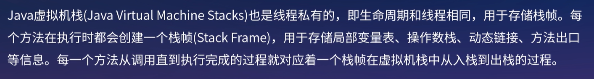

[toc]

## 一、JVM结构

## 二、JVM内存结构

#### JDK7 的 JVM内存模型

##### 1. 虚拟机栈（JVM Stacks）

##### 2. 本地方法栈

##### 3. 程序计数器

##### 4. 堆（Heap）

##### 5. 方法区（Runtime Constant Pool）

方法区是一种JVM规范，其 **JDK1.8之前的实现为堆中的永久代**

##### 6. 总结

#### JDK8 的 JVM内存模型

#### JDK8 对比 JDK7  JVM内存模型的变化

#### 元空间和永久代的区别

#### 为什么要用元空间替代永久代？

#### JDK8 是否就没有方法区了？

