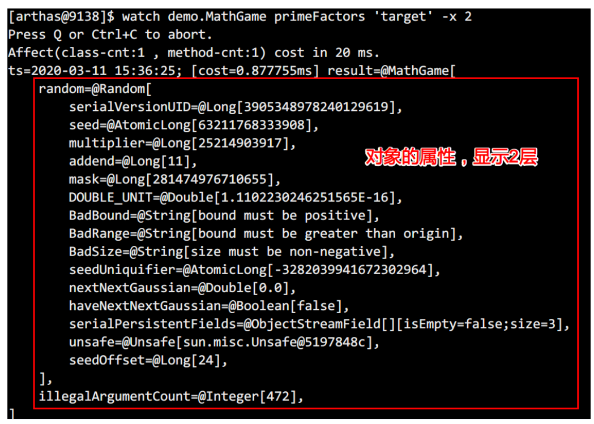

[toc]

## 一、概述

Arthas 是Alibaba开源的Java诊断工具，深受开发者喜爱。当你遇到以下类似问题而束手无策时，Arthas可以帮助你解决：

* 1. 这个类从哪个 jar 包加载的？为什么会报各种类相关的 Exception？
* 2. 我改的代码为什么没有执行到？难道是我没 commit？分支搞错了？
* 3. 遇到问题无法在线上 debug，难道只能通过加日志再重新发布吗？
* 4. 线上遇到某个用户的数据处理有问题，但线上同样无法 debug，线下无法重现！
* 5. 是否有一个全局视角来查看系统的运行状况？
* 6. 有什么办法可以监控到JVM的实时运行状态？
* 7. 怎么快速定位应用的热点，生成火焰图？

Arthas支持JDK 6+，支持Linux/Mac/Winodws，采用命令行交互模式，同时提供丰富的 Tab 自动补全功能，进一步方便进行问题的定位和诊断。


## 二、快速安装

### <font style=color:#e0861a>1. 下载及安装</font>

官方文档地址：https://arthas.aliyun.com/doc/install-detail.html

##### <font style=color:#78a355>1.1 github下载全量包</font>

https://github.com/alibaba/arthas/releases

##### <font style=color:#78a355>1.2 下载arthas-boot.jar，并启动</font>

```sh
curl -O https://arthas.aliyun.com/arthas-boot.jar
java -jar arthas-boot.jar
```

安装后，默认路径为` /~/.arthas/...`

##### <font style=color:#78a355>1.3 阿里云Maven仓库下载</font>

https://maven.aliyun.com/repository/public/com/taobao/arthas/arthas-packaging/3.1.7/arthas-packaging-3.1.7-bin.zip

解压：`unzip -d arthas arthas-packaging-3.1.7-bin.zip`


### <font style=color:#e0861a>2. 启动及卸载</font>

##### <font style=color:#78a355>2.1 启动</font>

```
java -jar arthas-boot.jar
```

##### <font style=color:#78a355>2.2 卸载</font>

- 在 Linux/Unix/Mac 平台

  ```sh
  rm -rf ~/.arthas/
  rm -rf ~/logs/arthas
  ```

- Windows

​	直接删除user home下面的.arthas和logs/arthas目录


## 三、快速入门

### <font style=color:#e0861a>1. 准备待监听的代码</font>

以下是arthas官方准备的一个demo，每隔一秒生成一个随机数，再执行质因数分解，并打印出分解结果。代码的内容不用理会这不是现在关注的点。

```java
import java.util.ArrayList;
import java.util.List;
import java.util.Random;
import java.util.concurrent.TimeUnit;

public class MathGame {
    private static Random random = new Random();
    //用于统计生成的不合法变量的个数
    public int illegalArgumentCount = 0;

    public static void main(String[] args) throws InterruptedException {
        MathGame game = new MathGame();
        //死循环，每过 1 秒调用 1 次下面的方法(不是开启一个线程)
        while (true) {
            game.run();
            TimeUnit.SECONDS.sleep(1);
        }
    }

    //分解质因数
    public void run() throws InterruptedException {
        try {
            //随机生成 1 万以内的整数
            int number = random.nextInt() / 10000;
            //调用方法进行质因数分解
            List<Integer> primeFactors = primeFactors(number);
            //打印结果
            print(number, primeFactors);
        } catch (Exception e) {
            System.out.println(String.format("illegalArgumentCount:%3d, ",
                    illegalArgumentCount) + e.getMessage());
        }
    }

    //打印质因数分解的结果
    public static void print(int number, List<Integer> primeFactors) {
        StringBuffer sb = new StringBuffer(number + "=");
        for (int factor : primeFactors) {
            sb.append(factor).append('*');
        }
        if (sb.charAt(sb.length() - 1) == '*') {
            sb.deleteCharAt(sb.length() - 1);
        }
        System.out.println(sb);
    }

    //计算number的质因数分解
    public List<Integer> primeFactors(int number) {
        //如果小于 2 ，则抛出异常，并且计数加 1
        if (number < 2) {
            illegalArgumentCount++;
            throw new IllegalArgumentException("number is: " + number + ", need >=
                    2");
        }
        //用于保存每个质数
        List<Integer> result = new ArrayList<Integer>();
        //分解过程，从 2 开始看能不能整除
        int i = 2;
        while (i <= number) { //如果i大于number就退出循环
            //能整除，则i为一个因数，number为整除的结果再继续从 2 开始
            if (number % i == 0) {
                result.add(i);
                number = number / i;
                i = 2;
            } else {
                i++; //否则i++
            }
        }
        return result;
    }
}
```

下载代码

```shell
#下载已经打包好的arthas-demo.jar
curl -O https://alibaba.github.io/arthas/arthas-demo.jar
#在命令行下执行
java -jar arthas-demo.jar
```


### <font style=color:#e0861a>2. 启动 arthas</font>

* 另开一个命令窗口执行 arthas-boot.jar，如果端口被占用则指定端口号

  ```sh
  java -jar arthas-boot.jar --telnet-port 9998 --http-port -1
  ```

* 启动成功后，会出现可选择监控的java进程号，出现arthas-client connect ip port 表示监听成功


### <font style=color:#e0861a>3. 通过浏览器连接 arthas</font>

Arthas目前支持Web Console，用户在attach成功之后，可以直接访问：http://127.0.0.1:3658/。可以填入IP，远程连接其它机器上的arthas。


默认情况下，arthas只listen 127.0.0.1，所以如果想从远程连接，则可以使用 --target-ip参数指定listen的IP


### <font style=color:#e0861a>4. 常用命令</font>

- [dashboard](#1. dashboard)

- [thread](#2. thread)

- [ognl](#8. ognl)

- [jad](#3. jad)、[mc](#4. mc (Memory Compiler))、[redefine](#5. redefine)

- [tt](#5. tt)、[watch](#2. watch)、[trace](#3. trace)

- [quit](#quit)或者exit

  离开当前会话，attach的arthas进程还会继续运行，下次执行java -jar直接能连上

- [stop](#stop)

  关闭 arthas进程


## 四、基础命令

#### help


#### cat

打印文件内容，和linux里的cat命令类似
注：汉字有乱码的问题，如果没有写路径，则显示当前目录下的文件


#### grep

匹配查找，和linux里的grep命令类似，但它只能用于管道命令

| 参数列表        | 作用                                 |
| --------------- | ------------------------------------ |
| -n              | 显示行号                             |
| -i              | 忽略大小写查找                       |
| -m 行数         | 最大显示行数，要与查询字符串一起使用 |
| -e "正则表达式" | 使用正则表达式查找                   |

举例

```shell
# 只显示包含java字符串的行系统属性
sysprop | grep java

# 显示包含java字符串的行和行号的系统属性
sysprop | grep java -n

# 显示包含system字符串的 10 行信息
thread | grep system -m 10

# 使用正则表达式，显示包含 2 个o字符的线程信息
thread | grep -e "o{2}"
```

#### pwd

返回当前的工作目录，和linux命令类似

#### cls

清空当前屏幕区域

#### session

查看当前会话的信息


#### reset

重置增强类，将被 Arthas 增强过的类全部还原，Arthas 服务端关闭时会重置所有增强过的类

```shell
# 还原指定类 
reset Test 
# 还原所有以List结尾的类 
reset *List 
# 还原所有的类 
reset
```


#### version

输出当前目标 Java 进程所加载的 Arthas 版本号

#### history

打印命令历史

#### quit

退出当前 Arthas 客户端，其他 Arthas 客户端不受影响

#### stop

关闭 Arthas 服务端，所有 Arthas 客户端全部退出

#### 快捷键

| 快捷键说明       |                        命令说明                         |
| ---------------- | :-----------------------------------------------------: |
| ctrl + c         |                      终止当前命令                       |
| ctrl + z         | 挂起当前命令，后续可以 bg/fg 重新支持此命令，或 kill 掉 |
| ctrl + a         |                        跳到行首                         |
| ctrl + e         |                        跳到行尾                         |
| ctrl + f         |                    向前移动一个单词                     |
| ctrl + b         |                    向后移动一个单词                     |
| 键盘左方向键     |                  光标向前移动一个字符                   |
| 键盘右方向键     |                  光标向后移动一个字符                   |
| 键盘下方向键     |                   下翻显示下一个命令                    |
| 键盘上方向键     |                   上翻显示上一个命令                    |
| ctrl + h         |                    向后删除一个字符                     |
| ctrl + shift + / |                    向后删除一个字符                     |
| ctrl + u         |            撤销上一个命令，相当于清空当前行             |
| ctrl + d         |                  删除当前光标所在字符                   |
| ctrl + k         |              删除当前光标到行尾的所有字符               |
| ctrl + i         |                  自动补全，相当于敲TAB                  |
| ctrl + j         |                结束当前行，相当于敲回车                 |
| ctrl + m         |                结束当前行，相当于敲回车                 |

* 任何时候 tab 键，会根据当前的输入给出提示
* 命令后敲 - 或 -- ，然后按 tab 键，可以展示出此命令具体的选项


## 五、jvm相关

### <font style=color:#e0861a>**1. dashboard</font>

显示当前**系统的实时数据**面板，按q或ctrl+c退出


##### 说明


### <font style=color:#e0861a>**2. thread</font>

查看当前 **JVM 的线程堆栈**信息

##### 说明

| 参数名称    |               参数说明                |
| ----------- | :-----------------------------------: |
| d           |                线程id                 |
| [n:]        |     指定最忙的前N个线程并打印堆栈     |
| [b]         |      找出当前阻塞其他线程的线程       |
| [i <value>] | 指定cpu占比统计的采样间隔，单位为毫秒 |

##### 示例

- 展示当前**最忙的前 3 个线程**并打印堆栈，会展示CPU占用率

  ```sh
  thread -n 3
  ```

  

- 找出**当前阻塞其他线程的线程**

```sh
thread -b
```


- 查看**处于等待状态的线程**

```sh
thread --state WAITING
```


- 当没有参数时，显示所有线程的信息

  ```sh
  thread
  ```

- 显示 1 号线程的运行堆栈

  ```sh
  thread 1
  ```


- 指定**采样时间间隔**，每过1000毫秒采样，显示最忙的3个线程 

  ```sh
  thread -i 1000 -n 3
  ```

​	


### <font style=color:#e0861a>3. jvm</font>

查看当前 **JVM 的信息**


##### THREAD 相关

* COUNT: JVM当前活跃的线程数
* DAEMON-COUNT: JVM当前活跃的守护线程数
* PEAK-COUNT: 从JVM启动开始曾经活着的最大线程数
* STARTED-COUNT: 从JVM启动开始总共启动过的线程次数
* DEADLOCK-COUNT: JVM当前死锁的线程数

##### 文件描述符相关

* MAX-FILE-DESCRIPTOR-COUNT：JVM进程最大可以打开的文件描述符数
* OPEN-FILE-DESCRIPTOR-COUNT：JVM当前打开的文件描述符数


### <font style=color:#e0861a>4. sysprop</font>

查看和修改 **JVM的系统属性**

##### 示例

```shell
# 查看所有属性
sysprop
# 查看单个属性
sysprop user.country
# 修改单个属性
sysprop user.country CN
```


### <font style=color:#e0861a>5. sysenv</font>

查看当前**JVM环境变量** (System Environment Variables)

##### 示例

```sh
# 查看所有属性
sysenv
# 查看单个环境变量
sysenv USER
```


### <font style=color:#e0861a>**6. vmoption</font>

查看，更新 **JVM诊断相关的参数**

##### 示例

```sh
#查看所有的选项
vmoption
# 查看指定的选项
vmoption PrintGCDetails
# 更新指定的选项
vmoption PrintGCDetails true
# 设置内存溢出时打印日志
vmoption HeapDumpOnOutOfMemoryError true
vmoption HeapDumpPath ./log/log_hprof/oom.hprof
```


### <font style=color:#e0861a>7. getstatic</font>

通过getstatic命令可以方便的**查看类的静态变量的值**，该命令完全可用 ognl命令替代

`getstatic 类全限定路径名 属性名`

##### 示例

```shell
# 显示demo.MathGame类中静态属性random
getstatic demo.MathGame random
```


### <font style=color:#e0861a>**8. ognl</font>

ognl **动态调用线上的代码**，这是从3.0.5版本新增的功能

##### 说明

| 参数名称 |                           参数说明                           |
| -------- | :----------------------------------------------------------: |
| express  |                         执行的表达式                         |
| [c:]     | 执行表达式的 ClassLoader 的 hashcode，默认值是SystemClassLoader |
| [x]      |                 结果对象的展开层次，默认值1                  |

##### 示例

- 调用**静态函数**

  - 返回字符串

    ```sh
    # ognl '@全路径类名@静态方法名("参数")'
    ognl '@java.lang.System@out.println("hello")'
    ```

  - 返回对象并展开对象

    ```sh
    # ognl '@全路径类名@静态方法名("参数")' -x 2
    ognl '@com.lxl.jvm.DeadLockTest@addUsers(1,"zhangsan")' -x 1
    ognl '@com.lxl.jvm.DeadLockTest@addUsers(1,"zhangsan")' -x 2
    ognl '@com.lxl.jvm.DeadLockTest@addUsers(1,"zhangsan")' -x 3
    ```

    

    

    

  - 方法A结果当作方法B的入参

    ```sh
    ognl '#value1=@com.lxl.jvm.DeadLockTest@getCitys(), #value2=@com.lxl.jvm.DeadLockTest@generatorUser(1,"lisi",#value1), {#value1,#value2}' -x 2
    
    ```

    

  - 入参为集合、对象

    ```sh
    # 入参为数组
    ognl '@com.lxl.jvm.DeadLockTest@returnCitys({"beijing","shanghai","guangdong"})'
    
    # 入参为对象
    ognl '#value1=new com.lxl.jvm.User(1,"zhangsan"),#value1.setName("aaa"), #value1.setCitys({"bj", "sh"}), #value2=@com.lxl.jvm.DeadLockTest@addUsers(#value1), #value2' -x 3
    
    # 入参为Map
    ognl '#value1=new com.lxl.jvm.User(1,"zhangsan"), #value1.setCitys({"bj", "sh"}), #value2=#{"mum":"zhangnvshi","dad":"wangxiansheng"}, #value1.setFamily(#value2), #value1' -x 2
    ```

- 获取**静态变量**

  ```sh
  # ognl '@全路径类名@静态属性名'
  ognl '@com.lxl.jvm.DeadLockTest@names'
  ```

- 获取实例对象

  ```sh
  ognl '#value1=new com.lxl.jvm.User(1,"zhangsan"),#value1.setName("aaa"), #value1.setCitys({"bj", "sh"}), {#value1}' -x 2
  ```

  


## **六、class/classloader相关

### <font style=color:#e0861a>**1. sc (Search-Class)</font>

搜索 JVM **已加载的类信息**

默认开启了子类匹配功能，也就是说所有当前类的子类也会被搜索出来，想要精确的匹配，请打开options disable-sub-class true 开关

##### 参数说明

| 参数名称       |                           参数说明                           |
| -------------- | :----------------------------------------------------------: |
| class-pattern  | 类名表达式匹配，支持全限定名，如com.taobao.test.AAA，也支持com/taobao/test/AAA这样的格式，这样，我们从异常堆栈里面把类名拷贝过来的时候，不需要在手动把/替换为.啦。 |
| method-pattern |                       方法名表达式匹配                       |
| [d]            | 输出当前类的详细信息，包括这个类所加载的原始文件来源、类的声明、加载的 ClassLoader等详细信息。 如果一个类被多个ClassLoader所加载，则会出现多次 |
| [E]            |             开启正则表达式匹配，默认为通配符匹配             |
| [f]            |      输出当前类的成员变量信息（需要配合参数-d一起使用）      |


##### 举例

```shell
# 模糊搜索，demo包下所有的类
sc demo.*

# 打印类的详细信息
sc -d demo.MathGame
```


```shell
# 打印出类的Field信息
sc -df demo.MathGame
```


### <font style=color:#e0861a>**2. sm (Search-Method)</font>

搜索 **已加载类的方法信息**

sm 命令只能看到由当前类所声明 (declaring) 的方法，父类则无法看到。

##### 参数说明

| 参数名称       |               参数说明               |
| -------------- | :----------------------------------: |
| class-pattern  |            类名表达式匹配            |
| method-pattern |           方法名表达式匹配           |
| [d]            |        展示每个方法的详细信息        |
| [E]            | 开启正则表达式匹配，默认为通配符匹配 |

##### 举例

```shell
# 显示String类加载的方法
sm java.lang.String
```


```shell
# 显示String中的toString方法详细信息
sm -d java.lang.String toString
```


### <font style=color:#e0861a>**3. jad</font>

**反编译**指定已加载类的源码

反编绎时只显示源代码，默认情况下，反编译结果里会带有ClassLoader信息

通过**`--source-only`** 选项，可以只打印源代码。**方便和mc/redefine命令结合使用。**

##### 参数说明

| 参数名称      |               参数说明               |
| ------------- | :----------------------------------: |
| class-pattern |            类名表达式匹配            |
| [E]           | 开启正则表达式匹配，默认为通配符匹配 |

##### 举例

```shell
# 反编译java.lang.String，并省略classloader信息
jad --source-only java.lang.String
```


```shell
# 反编译指定的函数
jad demo.MathGame main
```


### <font style=color:#e0861a>**4. mc (Memory Compiler)</font> 

内存编译器，**编译.java文件生成.class**

##### 举例

```shell
# 在内存中编译Hello.java为Hello.class
mc /root/Hello.java

# 可以通过-d命令指定输出目录
mc -d /root/bbb /root/Hello.java
```


### <font style=color:#e0861a>**5. redefine</font>

**加载外部的.class文件**，redefine到 JVM里

* 注意：redefine后的原来的类不能恢复，redefine有可能失败（比如增加了新的field），参考jdk本身的文档。
* reset命令对redefine的类无效。如果想重置，需要redefine原始的字节码。
* **redefine命令和 jad/watch/trace/monitor/tt等命令会冲突**。执行完redefine之后，如果 再执行上面提到的命令，则会将字节码重置，恢复为未修改之前的样子

##### redefine 的限制

* **不允许新增加field/method**
* 正在跑的函数，没有退出不能生效，比如下面新增加的System.out.println，只有run()函数里的会生效


```java
public class MathGame {

public static void main(String[] args) throws InterruptedException {
    MathGame game = new MathGame();
    while (true) {
        game.run();
        TimeUnit.SECONDS.sleep( 1 );
        // 这个不生效，因为代码一直跑在 while里
        System.out.println("in loop");
    }
}

public void run() throws InterruptedException {
        // 这个生效，因为run()函数每次都可以完整结束
        System.out.println("call run()");
        try {
            int number = random.nextInt();
            List<Integer> primeFactors = primeFactors(number);
            print(number, primeFactors);
        } catch (Exception e) {
            System.out.println(String.format("illegalArgumentCount:%3d, ",
            illegalArgumentCount) + e.getMessage());
        }
    }
}
```


### <font style=color:#e0861a>**6. 修改线上代码并生效</font>

```shell
# 1.使用jad反编译com.lxl.jvm.DeadLockTest输出到/root/
jad  --source-only com.lxl.jvm.DeadLockTest > /root/DeadLockTest.java
```

```shell
# 2.对/root/MathGame.java修改后，使用mc对/root/MathGame.java进行编译
mc  -d /root /root/DeadLockTest.java
```

```shell
# 3.使用redefine命令加载新的字节码
redefine /root/com/lxl/jvm/DeadLockTest.class
```


### <font style=color:#e0861a>6. dump</font>

**将**已加载类的**字节码文件保存到特定目录**：logs/arthas/classdump/

##### 参数

| 参数名称      |               参数说明               |
| ------------- | :----------------------------------: |
| class-pattern |            类名表达式匹配            |
| [c:]          |    类所属 ClassLoader 的 hashcode    |
| [E]           | 开启正则表达式匹配，默认为通配符匹配 |

##### 举例

```shell
# 把String类的字节码文件保存到~/logs/arthas/classdump/目录下
dump java.lang.String
```

```shell
# 把demo包下所有的类的字节码文件保存到~/logs/arthas/classdump/目录下
dump demo.*
```


### <font style=color:#e0861a>7. classloader</font>

* classloader 命令将 JVM 中**所有的classloader的信息统计出来**，并可以展示继承树，urls等。
* 可以让指定的classloader去getResources，打印出所有查找到的resources的url。**对于ResourceNotFoundException异常比较有用**。

##### 参数说明

| 参数名称   |                  参数说明                   |
| ---------- | :-----------------------------------------: |
| [l]        |            按类加载实例进行统计             |
| [t]        |         打印所有ClassLoader的继承树         |
| [a]        |   列出所有ClassLoader加载的类，请谨慎使用   |
| [c:]       |            ClassLoader的hashcode            |
| [c: r:]    | 用ClassLoader去查找resource（查找所在路径） |
| [c: load:] |         用ClassLoader去加载指定的类         |

##### 举例


```shell
# 按类加载类型查看统计信息
classloader
```


```shell
# 按类加载实例查看统计信息，可以看到类加载的hashCode
classloader -l
```


```shell
# 查看ClassLoader的继承树
classloader -t
```


```shell
# 通过类加载器的hash，查看此类加载器实际所在的位置
classloader -c 680f2737
```


```shell
# 使用ClassLoader去查找指定资源resource所在的位置
classloader -c 680f2737 -r META-INF/MANIFEST.MF
```


```shell
# 使用ClassLoader去查找类的class文件所在的位置
classloader -c 680f2737 -r java/lang/String.class
```


```sh
# 使用ClassLoader去加载String
classloader -c 70dea4e --load java.lang.String
```


## 七、方法相关

### <font style=color:#e0861a>1. monitor</font>

* 监视**一个时间段中**指定**方法的执行次数**，成功次数，失败次数，耗时**等信息**
* monitor 命令是一个非实时返回命令，实时返回命令是输入之后立即返回，而非实时返回的命令，则是不断的等待目标 Java 进程返回信息，直到用户输入 Ctrl+C 为止。

##### 参数说明

方法拥有一个命名参数 [c:]，意思是统计周期（cycle of output），拥有一个整型的参数值

| 参数名称       |               参数说明               |
| -------------- | :----------------------------------: |
| class-pattern  |            类名表达式匹配            |
| method-pattern |           方法名表达式匹配           |
| [E]            | 开启正则表达式匹配，默认为通配符匹配 |
| [c:]           |       统计周期，默认值为120秒        |

##### 举例

```shell
# 过 5 秒统计一次，统计类demo.MathGame中primeFactors方法
monitor -c 5 demo.MathGame primeFactors
```


##### 返回结果说明

| 监控项    |            说明            |
| --------- | :------------------------: |
| timestamp |           时间戳           |
| class     |           Java类           |
| method    | 方法（构造方法、普通方法） |
| total     |          调用次数          |
| success   |          成功次数          |
| fail      |          失败次数          |
| rt        |          平均耗时          |
| fail-rate |           失败率           |


### <font style=color:#e0861a>2. watch</font>

方法执行数据观测，让你能方便的观察到指定方法的调用情况。

能观察到的范围为：**返回值、抛出异常、入参**，通过编写OGNL 表达式进行对应变量的查看。

##### 参数说明

| 参数名称          |                   参数说明                   |
| ----------------- | :------------------------------------------: |
| class-pattern     |                类名表达式匹配                |
| method-pattern    |               方法名表达式匹配               |
| express           |                  观察表达式                  |
| condition-express |                  条件表达式                  |
| [n:]              |   命令捕捉次数（针对目标方法的多次被调用）   |
| [b]               |           在 **方法调用之前** 观察           |
| [e]               |           在 **方法异常之后** 观察           |
| [s]               |           在 **方法返回之后** 观察           |
| [f]               | 在 **方法结束之后** (正常返回和异常返回)观察 |
| [E]               |     开启正则表达式匹配，默认为通配符匹配     |
| [x:]              |     指定输出结果的属性遍历深度，默认为 1     |

这里重点要说明的是观察表达式，观察表达式的构成主要由ognl 表达式组成，所以你可以这样写"{params,returnObj}"，只要是一个合法的 **ognl 表达式**，都能被正常支持。

##### 特别说明

* watch 命令定义了4个观察事件点，即 -b 方法调用前，-e 方法异常后，-s 方法返回后，-f 方法结束后
* 4个观察事件点 -b、-e、-s 默认关闭，**-f 默认打开**，当指定观察点被打开后，在相应事件点会对观察表达式进行求值并输出
* 这里要注意方法入参和方法出参的区别，有可能在中间被修改导致前后不一致，除了 -b 事件点params 代表方法入参外，其余事件都代表方法出参
* 当使用 -b 时，由于观察事件点是在方法调用前，此时返回值或异常均不存在

##### 举例

```shell
# 观察demo.MathGame类中primeFactors方法出参和返回值，结果属性遍历深度为 2 
#params表示所有参数数组，returnObject表示返回值
watch demo.MathGame primeFactors "{params,returnObj}" -x 2
```


```shell
# 观察方法入参，对比前一个例子，返回值为空（事件点为方法执行前，因此获取不到返回值）
watch demo.MathGame primeFactors "{params,returnObj}" -x 2 -b
```


```shell
# 同时观察方法调用前和方法返回后，参数里-n 2，表示只执行两次。
#这里输出结果中，第一次输出的是方法调用前的观察表达式的结果，第二次输出的是方法返回后的表达式的结果params表示参数，target表示执行方法的对象，returnObject表示返回值
watch demo.MathGame primeFactors "{params,target,returnObj}" -x 2 -b -s -n 2
```


```shell
# 观察当前对象中的属性，如果想查看方法运行前后，当前对象中的属性，可以使用target关键字，代表当前对象
watch demo.MathGame primeFactors 'target' -x 2
```



```shell
# 使用target.field_name访问当前对象的某个属性
watch demo.MathGame primeFactors 'target.illegalArgumentCount'
```


```shell
# 条件表达式的例子，输出第 1 参数小于0的情况，耗时大于10ms
watch demo.MathGame primeFactors "{params[0],target}" "params[0]<0" '#cost>10'
```


### <font style=color:#e0861a>**3. trace</font>

**方法内部调用链路**，并输出方法路径上的**每个节点上耗时**

trace 命令能主动搜索 class-pattern／method-pattern 对应的方法调用路径，渲染和统计整个调用链路上的所有性能开销和追踪调用链路。

观察表达式的构成主要由ognl 表达式组成，所以你可以这样写"{params,returnObj}"，只要是一个合法的 ognl 表达式，都能被正常支持。

很多时候我们只想看到**某个方法的rt大于某个时间之后的trace结果**，现在Arthas可以按照方法执行的耗时来进行过滤了，例如  **`trace *StringUtils isBlank '#cost>100'`**  表示当**执行时间超过100ms**的时候，才会输出trace的结果

watch/stack/trace这个三个命令都支持#cost

##### 参数说明

| 参数名称          |                 参数说明                 |
| ----------------- | :--------------------------------------: |
| class-pattern     |              类名表达式匹配              |
| method-pattern    |             方法名表达式匹配             |
| condition-express |                条件表达式                |
| [E]               |   开启正则表达式匹配，默认为通配符匹配   |
| [n:]              | 命令捕捉次数（针对目标方法的多次被调用） |
| #cost             |               方法执行耗时               |

##### 举例

```shell
# trace函数指定类的指定方法
trace demo.MathGame run
```


```shell
# 如果方法调用的次数很多，那么可以用-n参数指定捕捉结果的次数。比如下面的例子里，捕捉到一次调用就退出命令。
trace demo.MathGame run -n 1
```


```shell
# 默认情况下，trace不会包含jdk里的函数调用，如果希望trace jdk里的函数，需要显式设置--skipJDKMethod false。
trace --skipJDKMethod false demo.MathGame run
```


```shell
# 据调用耗时过滤，trace大于0.5ms的调用路径
trace demo.MathGame run '#cost > .5'
```


```shell
# 可以用正则表匹配路径上的多个类和函数，一定程度上达到多层trace的效果。
trace -E com.test.ClassA|org.test.ClassB method1|method2|method3
```


### <font style=color:#e0861a>4. stack</font>

**输出当前方法被调用的调用链路**

很多时候我们都知道一个方法被执行，但这个方法被执行的路径非常多，或者你根本就不知道这个方法是从那里被执行了，此时你需要的是 stack 命令。

##### 参数说明

| 参数名称          |                 参数说明                 |
| ----------------- | :--------------------------------------: |
| class-pattern     |              类名表达式匹配              |
| method-pattern    |             方法名表达式匹配             |
| condition-express |                条件表达式                |
| [E]               |   开启正则表达式匹配，默认为通配符匹配   |
| [n:]              | 命令捕捉次数（针对目标方法的多次被调用） |

##### 举例

```shell
# 获取primeFactors的调用路径
stack demo.MathGame primeFactors
```


```shell
# 条件表达式来过滤，第 0 个参数的值小于 0 ，-n表示获取 2 次
stack demo.MathGame primeFactors 'params[0]<0' -n 2
```


```shell
# 据执行时间来过滤，耗时大于 5 毫秒
stack demo.MathGame primeFactors '#cost>5'
```


### <font style=color:#e0861a>**5. tt</font>

**time-tunnel 时间隧道**,记录下指定**方法每次调用的入参和返回信息**，并能对这些不同时间下调用的信息进行观测

* watch 虽然很方便和灵活，但需要提前想清楚观察表达式的拼写，这对排查问题而言要求太高，因为很多时候我们并不清楚问题出自于何方，只能靠蛛丝马迹进行猜测。
* 这个时候如果能记录下当时方法调用的所有入参和返回值、抛出的异常会对整个问题的思考与判断非常有帮助。
* 于是乎，TimeTunnel 命令就诞生了。

##### 参数说明

| 参数 |                             说明                             |
| ---- | :----------------------------------------------------------: |
| -t   |               记录某个方法在一个时间段中的调用               |
| -l   |                    显示所有已经记录的列表                    |
| -n   | 次数 只记录多少次（防止大量请求该方法导致命令无法使用 CTRL + C中断） |
| -s   |                      表达式 搜索表达式                       |
| -i   |             索引号 查看指定索引号的详细调用信息              |
| -p   |              重新调用指定方法（通过方法索引号）              |

##### 使用案例

```shell
# 条件表达式来过滤，第 0 个参数的值小于 0 ，-n表示获取 2 次sh
stack demo.MathGame primeFactors 'params[0]<0' -n 2

# 记录下当前方法在一段时间内的调用环境现场。
tt -t demo.MathGame primeFactors
```


##### 表格字段说明

| 表格字段  |                           字段解释                           |
| --------- | :----------------------------------------------------------: |
| INDEX     | 时间片段记录编号，每一个编号代表着一次调用，后续tt还有很多命令都是基于此编号指定记录操作，非常重要。 |
| TIMESTAMP |    方法执行的本机时间，记录了这个时间片段所发生的本机时间    |
| COST(ms)  |                        方法执行的耗时                        |
| IS-RET    |                 方法是否以正常返回的形式结束                 |
| IS-EXP    |                  方法是否以抛异常的形式结束                  |
| OBJECT    | 执行对象的hashCode()，曾经有人误认为是对象在JVM中的内存地址，但很遗憾他不是。但他能帮助你简单的标记当前执行方法的类实体 |
| CLASS     |                          执行的类名                          |
| METHOD    |                         执行的方法名                         |

##### 条件表达式

不知道大家是否有在使用过程中遇到以下困惑

* Arthas 似乎很难区分出重载的方法
* 我只需要观察特定参数，但是 tt 却全部都给我记录了下来

​	条件表达式也是用 OGNL 来编写，核心的判断对象依然是 Advice 对象。除了 tt 命令之外，watch、trace、stack 命令也都支持条件表达式。

* 解决方法重载

  ```sh
  tt -t *Test print params.length==1
  ```

* 通过制定参数个数的形式解决不同的方法签名，如果参数个数一样，你还可以这样写

  ```sh
  tt -t *Test print 'params[1] instanceof Integer'
  ```

* 解决指定参数

  ```sh
  tt -t *Test print params[0].mobile=="13989838402"
  ```

##### 检索调用记录

当你用 tt 记录了一大片的时间片段之后，你希望能从中筛选出自己需要的时间片段，这个时候你就需要对现有记录进行检索。

```shell
tt -l
```


##### 筛选方法

```
tt -s 'method.name=="primeFactors"'
```


##### 查看调用详情

对于具体一个时间片的信息而言，你可以通过 -i 参数后边跟着对应的 INDEX 编号查看到他的详细信息。

```shell
tt -i 1002
```


##### 重试指定方法

当你稍稍做了一些调整之后，你可能需要前端系统重新触发一次你的调用，此时得求爷爷告奶奶的需要前端配合联调的同学再次发起一次调用。而有些场景下，这个调用不是这么好触发的。

tt 命令由于保存了当时调用的所有现场信息，所以我们可以自己主动对一个 INDEX 编号的时间片自主发起一次调用，从而解放你的沟通成本。此时你需要 **`-p`** 参数。通过 **`--replay-times`** 指定 调用次数，通过 **`--replay-interval`** 指定多次调用间隔(单位ms, 默认1000ms)

```shell
tt -i 1002 -p
```


### <font style=color:#e0861a>6. options</font>

查看或设置**arthas全局环境变量**

| 名称                | 默认值 |                             描述                             |
| ------------------- | :----: | :----------------------------------------------------------: |
| unsafe              | false  | 是否支持对系统级别的类进行增强，打开该开关可能导致把JVM搞挂，请慎重选择！ |
| dump                | false  | 是否支持被增强了的类dump到外部文件中，如果打开开关，class文件会被dump到/${application dir}/arthas-class-dump/目录下，具体位置详见控制台输出 |
| batch-re-transform  |  true  |         是否支持批量对匹配到的类执行retransform操作          |
| json-format         | false  |                     是否支持json化的输出                     |
| disable-sub-class   | false  | 是否禁用子类匹配，默认在匹配目标类的时候会默认匹配到其子类，如果想精确匹配，可以关闭此开关 |
| debug-for-asm       | false  |                    打印ASM相关的调试信息                     |
| save-result         | false  | 是否打开执行结果存日志功能，打开之后所有命令的运行结果都将保存到~/logs/arthas-cache/result.log中 |
| job-timeout         |   1d   | 异步后台任务的默认超时时间，超过这个时间，任务自动停止；比如设置1d, 2h, 3m, 25s，分别代表天、小时、分、秒 |
| print-parent-fields |  true  |               是否打印在parent class里的filed                |

##### 案例

```shell
# 查看所有的 options
options
```


```shell
# 获取 option 的值
options json-format
```


```shell
# 设置指定的 option 例如，想打开执行结果存日志功能，输入如下命令即可：
options save-result true
```


### <font style=color:#e0861a>7. profiler</font>

火焰图

* profiler 命令支持生成应用热点的火焰图。本质上是通过不断的采样，然后把收集到的采样结果生成火焰图。
* 命令基本运行结构是 profiler 命令 [命令参数]

案例

```shell
# 启动 profiler
profiler start
```

默认情况下，生成的是cpu的火焰图，即event为cpu。可以用--event参数来指定。

```shell
# 显示支持的事件
profiler list
```

```shell
# 获取已采集的 sample 的数量
profiler getSamples
```

```shell
# 查看 profiler 状态
profiler status
```

可以查看当前profiler在采样哪种event和采样时间。

```shell
# 停止 profiler 生成 svg 格式结果
profiler stop
```

```shell
# 默认情况下，生成的结果保存到应用的工作目录下的arthas-output目录。可以通过 --file参数来指定输出结果路径。比如：
profiler stop --file /tmp/output.svg
```

生成 html 格式结果

```shell
# 默认情况下，结果文件是svg格式，如果想生成html格式，可以用--format参数指定：或者在--file参数里用文件名指名格式。比如--file /tmp/result.html 
profiler stop --format html
```

默认情况下，arthas使用3658端口，则可以打开： http://localhost:3658/arthas-output/ 查看到arthas-output目录下面的profiler结果：


点击可以查看具体的结果：


##### 火焰图的含义

* 火焰图是基于 perf 结果产生的SVG 图片，用来展示 CPU 的调用栈。
  * y 轴表示调用栈，每一层都是一个函数。调用栈越深，火焰就越高，顶部就是正在执行的函数，下方都是它的父函数。
  * x 轴表示抽样数，如果一个函数在 x 轴占据的宽度越宽，就表示它被抽到的次数多，即执行的时间长。注意，x 轴不代表时间，而是所有的调用栈合并后，按字母顺序排列的。

火焰图就是看顶层的哪个函数占据的宽度最大。只要有"平顶"（plateaus），就表示该函数可能存在性能问题。

颜色没有特殊含义，因为火焰图表示的是 CPU 的繁忙程度，所以一般选择暖色调。

##### 小结

| profiler            |                           命令作用                           |
| ------------------- | :----------------------------------------------------------: |
| profiler start      |          启动profiler，默认情况下，生成cpu的火焰图           |
| profiler list       |                      显示所有支持的事件                      |
| profiler getSamples |                   获取已采集的sample的数量                   |
| profiler status     |                查看profiler的状态，运行的时间                |
| profiler stop       | 停止profiler，生成火焰图的结果，指定输出目录和输出格式：svg或html |


## 八、Arthas实践

我们可以快速定位一个请求是被哪些Filter拦截的，或者请求最终是由哪些Servlet处理的。但有时，我们想知道一个请求是被哪个Spring MVC Controller处理的。如果翻代码的话，会比较难找，并且不一定准确。通过Arthas可以精确定位是哪个Controller处理请求。

### 1. 线上debug

* trace定位DispatcherServlet

  ```sh
  # 前端请求到web
  trace *.DispatcherServlet *
  ```

  

  ```sh
  # 可以分步trace，请求最终是被DispatcherServlet#doDispatch()处理了
  trace *.FrameworkServlet doService
  ```

  

* jad反编译DispatcherServlet

  ```sh
  # trace结果里把调用的行号打印出来了，我们可以直接在IDE里查看代码（也可以用jad命令反编译）
  jad --source-only *.DispatcherServlet doDispatch
  ```

  

* watch定位handler

  ```sh
  # 查看返回的结果，得到使用到了 2 个控制器的方法
  watch *.DispatcherServlet getHandler 'returnObj'
  ```

  

- 最后得到这个操作由2个控制器来处理，分别是：

  ```java
  com.itheima.controller.UserController.login()
  com.itheima.controller.StudentController.findAll()
  ```

  