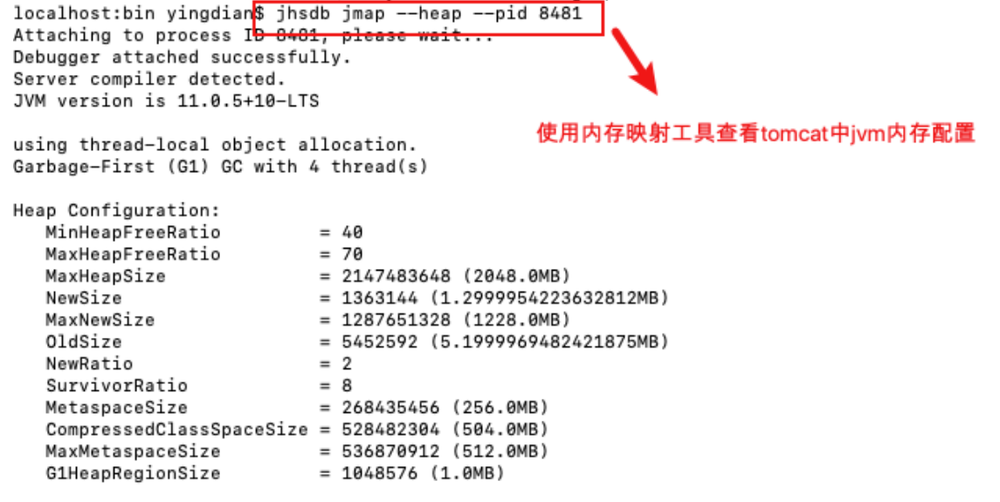

[toc]

#### 虚拟机运⾏优化（参数调整）

Java 虚拟机的运⾏优化主要是内存分配和垃圾回收策略的优化：

- 内存直接影响服务的运⾏效率和吞吐量

- 垃圾回收机制会不同程度地导致程序运⾏中断（垃圾回收策略不同，垃圾回收次数和回收效率都是不同的）


#####  4.1 Java 虚拟机内存相关参数调优

| 参数                 | 参数作⽤                                          | 优化建议                |
| -------------------- | ------------------------------------------------- | ----------------------- |
| -server              | 启动Server，以服务端模式运⾏                      | 服务端模式建议开启      |
| -Xms                 | 最⼩堆内存                                        | 建议与-Xmx相同          |
| -Xmx                 | 最大对内存                                        | 建议设置为可用内存的80% |
| -XX:MetaspaceSize    | 元空间初始值                                      |                         |
| -XX:MaxMetaspaceSize | 元空间最大内存                                    | 默认无限                |
| -XX:NewRatio         | 年轻代和⽼年代⼤⼩⽐值，取值为整数，默认为2       | 无需修改                |
| -XX:SurvivorRatio    | Eden区与Survivor区⼤⼩的⽐值，取值为整数，默认为8 | 无需修改                |

###### **JVM内存模型回顾**


###### **启动配置追加如下配置 :**

```sh
JAVA_OPTS="-server -Xms2048m -Xmx2048m -XX:MetaspaceSize=256m -XX:MaxMetaspaceSize=512m
```

调整后查看可使⽤**JDK**提供的内存映射⼯具




##### 4.2 垃圾回收（GC）策略

###### **垃圾回收性能指标**

- 吞吐量：⼯作时间（排除GC时间）占总时间的百分⽐， ⼯作时间并不仅是程序运⾏的时间，还包含内存分配时间。

- 暂停时间：由垃圾回收导致的应⽤程序停⽌响应次数/时间。


###### **垃圾收集器**

- 串⾏收集器（Serial Collector）

  单线程执⾏所有的垃圾回收⼯作， 适⽤于单核CPU服务器

  ⼯作进程**-----|**（单线程）垃圾回收线程进⾏垃圾收集**|---**⼯作进程继续

  

  

- 并⾏收集器（Parallel Collector）

  ⼜称为吞吐量收集器（关注吞吐量）， 以并⾏的⽅式执⾏年轻代的垃圾回收， 该⽅式可以显著降低垃圾回收的开销(指多条垃圾收集线程并⾏⼯作，但此时⽤户线程仍然处于等待状态)。适⽤于多处理器或多线程硬件上运⾏的数据量较⼤的应⽤

  ⼯作进程**-----|**（多线程）垃圾回收线程进⾏垃圾收集**|---**⼯作进程继续

  

  

- 并发收集器（Concurrent Collector）

  以并发的⽅式执⾏⼤部分垃圾回收⼯作，以缩短垃圾回收的暂停时间。适⽤于那些响应时间优先于吞吐量的应⽤， 因为该收集器虽然最⼩化了暂停时间(指⽤户线程与垃圾收集线程同时执⾏,但不⼀定是并⾏的，可能会交替进⾏)， 但是会降低应⽤程序的性能


- CMS收集器（Concurrent Mark Sweep Collector）

  并发标记清除收集器， 适⽤于那些更愿意缩短垃圾回收暂停时间并且负担的起与垃圾回收共享处理器资源的应⽤


- G1收集器（Garbage-First Garbage Collector）

  适⽤于⼤容量内存的多核服务器， 可以在满⾜垃圾回收暂停时间⽬标的同时， 以最⼤可能性实现⾼吞吐量(JDK1.7之后)


###### **垃圾回收器参数**

| 参数                           | 描述                                                         |
| ------------------------------ | ------------------------------------------------------------ |
| -XX:+UseSerialGC               | 启⽤串⾏收集器                                               |
| -XX:+UseParallelGC             | 启⽤并⾏垃圾收集器，配置了该选项，那么 -XX:+UseParallelOldGC默认开启 |
| -XX:+UseParNewGC               | 年轻代采⽤并⾏收集器，如果设置了 -XX:+UseConcMarkSweepGC选项，⾃动启⽤ |
| -XX:ParallelGCThreads          | 年轻代及⽼年代垃圾回收使⽤的线程数。默认值依赖于JVM使⽤的CPU个数 |
| -XX:+UseConcMarkSweepGC（CMS） | 对于⽼年代，启⽤CMS垃圾收集器。 当并⾏收集器⽆法满⾜应⽤的延迟需求是，推荐使⽤CMS或G1收集器。启⽤该选项后， -XX:+UseParNewGC⾃动启⽤。 |
| -XX:+UseG1GC                   | 启⽤G1收集器。 G1是服务器类型的收集器， ⽤于多核、⼤内存的机器。它在保持⾼吞吐量的情况下，⾼概率满⾜GC暂停时间的⽬标。 |


###### **启动配置追加如下配置 :**

```sh
JAVA_OPTS="-XX:+UseConcMarkSweepGC"
```

