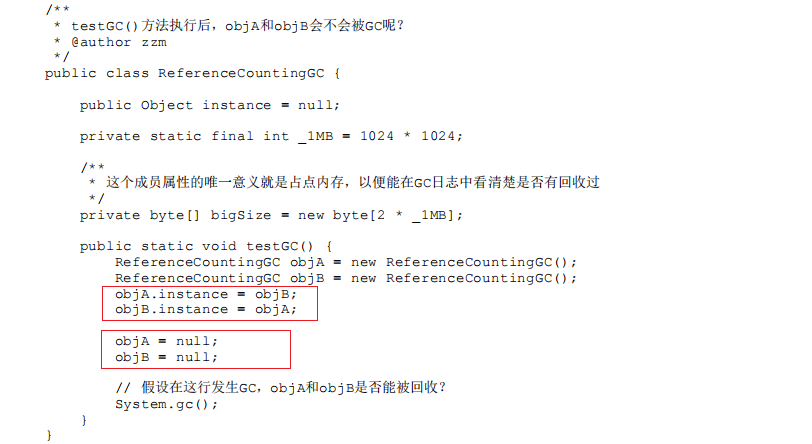
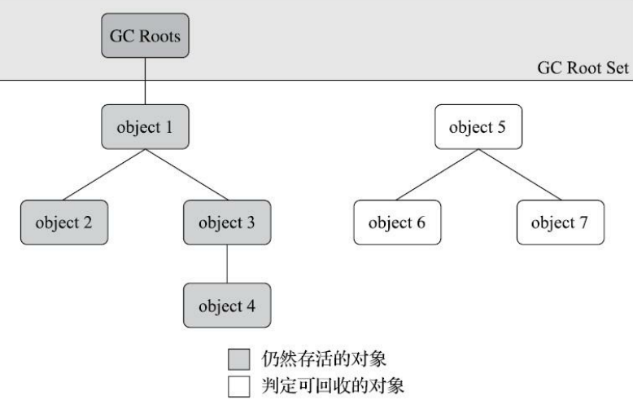

[toc]

## 一、哪些区域的内存被动态分配以及垃圾收集器管理？

Java内存运行时区域的各个部分中，其中**==程序计数器、虚拟机栈、本地方法栈 3 个区域随线程而生，随线程而灭==**

其中栈的内存空间，在编译期间加载类时，由类结构就确定了栈所需要的内存空间是多少（尽管在运行期会由即时编译器进行一些优化，但在基于概念模 型的讨论里，大体上可以认为是编译期可知的）

因此**==这几个区域的内存分配和回收都具备确定性==**，当方法结束或者线程结束时，内存自然就跟随着 回收了

而 Java **==堆和方法区==** 这两个区域则有着很显著的不确定性，一个**==方法执行时进入的不同条件分支所需要的内存也可能不一样==**，只有在**==运行时，才能知道需要创建哪些对象，多少对象==**

因此 **==堆和方法 内存的分配和回收是动态的==**

## 二、如何判断对象是否死亡/是否可被回收？

### 1. 引用计数器算法（Reference Counting）

在对象中添加一个引用计数器，每当有一个地方 引用它时，计数器值就加一；当引用失效时，计数器值就减一；任何时刻计数器为零的对象就是不可能再被使用的，即表示对象可被回收

**注意：引用计数 就很难解决对象之间相互循环引用的问题。** 

如图，这两个对象再无任何引用，实际上这两个对象已经不可能再被访问，但是它们因为互相引用着对方，导致它们的引用计数都不为零，引用计数算法也 就无法回收它们

### 2. 可达性分析算法（Reachability Analysis）

Java 和 C# 都是采用可达性分析（Reachability Analysis）算法来判定对象是否存活的

**算法原理：**

通过 一系列**==称为“GC Roots”的根对象==**作为起始节点集，从这些节点开始，根据引用关系向下搜索，搜索过 程所走过的路径称为**==“引用链”（Reference Chain）==**，如果**==某个对象到GC Roots间没有任何引用链相连==**， 或者用图论的话来说就是从GC Roots到这个对象不可达时，则**==证明此对象是不可能再被使用的==**。 

如图所示，对象object 5、object 6、object 7虽然互有关联，但是它们到GC Roots是不可达的， 因此它们将会被判定为可回收的对象。 

**可作为GC Roots的对象包括以下几种**

- 在虚拟机栈（栈帧中的本地变量表）中引用的对象，譬如**==各个线程被调用的方法堆栈中使用到的 参数、局部变量、临时变量等==**。 

- 在方法区中类静态属性引用的对象，譬如**==Java类的引用类型静态变量==**。 

- 在方法区中常量引用的对象，譬如**==字符串常量池（String Table）里的引用==**。
- 在本地方法栈中JNI（即通常所说的**==Native方法）引用的对象==**。 

- Java虚拟机内部的引用，如**==基本数据类型对应的Class对象==**，一些常驻的**==异常对象==**（比如 NullPointExcepiton、OutOfMemoryError）等，还有**==系统类加载器==**。 

- 所有被同步锁（**==synchronized关键字）持有的对象==**。 

- 反映Java虚拟机内部情况的JMXBean、JVMTI中注册的回调、本地代码缓存等。

除了这些固定的GC Roots集合以外，根据用户所选用的垃圾收集器以及当前回收的内存区域不 同，还可以有其他对象“临时性”地加入，共同构成完整GC Roots集合。譬如后文将会提到的分代收集 和局部回收（Partial GC），如果只针对Java堆中某一块区域发起垃圾收集时（如最典型的只针对新生 代的垃圾收集），必须考虑到内存区域是虚拟机自己的实现细节（在用户视角里任何内存区域都是不 可见的），更不是孤立封闭的，所以某个区域里的对象完全有可能被位于堆中其他区域的对象所引 用，这时候就需要将这些关联区域的对象也一并加入GC Roots集合中去，才能保证可达性分析的正确 性。

目前最新的几款垃圾收集器[1]无一例外都具备了局部回收的特征，为了避免GC Roots包含过多对 象而过度膨胀，它们在实现上也做出了各种优化处理。关于这些概念、优化技巧以及各种不同收集器 实现等内容，都将在本章后续内容中一一介绍。 

## 三、引用

### 1. 引用的定义

**在JDK 1.2版之前**，Java里面的引用是很传统的定义： 如果reference类型的数据中**存储的数值代表的是另外一块内存的起始地址**，就称该reference数据是代表 **某块内存、某个对象的引用**。

**在JDK 1.2版之后**，Java对引用的概念进行了扩充，将引用分为**==强引用（Strongly Re-ference）==**、**==软 引用（Soft Reference）==**、**==弱引用（Weak Reference）==**和**==虚引用（Phantom Reference）==**4种，这4种引用强 度依次逐渐减弱

### 2. 强引用(关联的对象无论如何都不会被回收)

强引用是最传统的“引用”的定义，是指在**==程序代码之中普遍存在的引用赋值==**，即类似“**==Object obj=new Object()==**”这种引用关系。

无论任何情况下，**==只要强引用关系还存在，垃圾收集器就永远不会回 收掉被引用的对象==**

### 3. 软引用（关联的对象只有在JVM内存不足时才会被回收）

软引用是用来描述**==一些还有用，但非必须的对象==**。

只被软引用关联着的对象，在**==系统将要发生内 存溢出异常前，会把这些对象列进回收范围之中进行第二次回收==**，如果这次回收还没有足够的内存， 才会抛出内存溢出异常。

在JDK 1.2版之后提供了SoftReference类来实现软引用

### 4. 弱引用（关联的对象在第一次GC就会被回收）

弱引用也是用来描述那些**==非必须对象==**，但是它的强度比软引用更弱一些

被弱引用关联的对象只 能生存到下一次垃圾收集发生为止**==即创建后遇到第一次垃圾收集就会被回收==**。当垃圾收集器开始工作，无论当前内存是否足够，都会回收掉只 被弱引用关联的对象。

在JDK 1.2版之后提供了WeakReference类来实现弱引用

### 5. 虚引用（关联的对象在被回收时向系统发送一个通知）

虚引用也称为**==“幽灵引用”或者“幻影引用”==**，它是最弱的一种引用关系。

一个对象是否有虚引用的 存在，*完全不会对对象生存时间构成影响*，也**==无法通过虚引用来取得一个对象实例==**。为一个对象设置虚 引用关联的唯一目的只是为了能在这个**==对象被收集器回收时收到一个系统通知==**。

在JDK 1.2版之后提供 了PhantomReference类来实现虚引用。