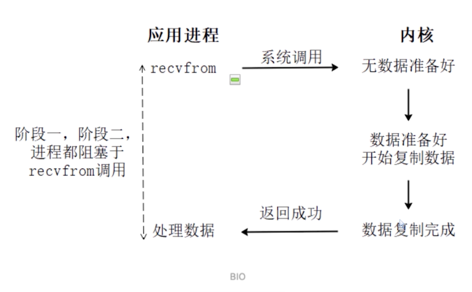

## 一、操作系统内存空间

## 二、引用

### 1. 引用的定义

**在JDK 1.2版之前**，Java里面的引用是很传统的定义： 如果reference类型的数据中**存储的数值代表的是另外一块内存的起始地址**，就称该reference数据是代表 **某块内存、某个对象的引用**。

**在JDK 1.2版之后**，Java对引用的概念进行了扩充，将引用分为**==强引用（Strongly Re-ference）==**、**==软 引用（Soft Reference）==**、**==弱引用（Weak Reference）==**和**==虚引用（Phantom Reference）==**4种，这4种引用强 度依次逐渐减弱

### 2. 强引用(关联的对象无论如何都不会被回收)

强引用是最传统的“引用”的定义，是指在**==程序代码之中普遍存在的引用赋值==**，即类似“**==Object obj=new Object()==**”这种引用关系。

无论任何情况下，**==只要强引用关系还存在，垃圾收集器就永远不会回 收掉被引用的对象==**

### 3. 软引用（关联的对象只有在JVM内存不足时才会被回收）

软引用是用来描述**==一些还有用，但非必须的对象==**。

只被软引用关联着的对象，在**==系统将要发生内 存溢出异常前，会把这些对象列进回收范围之中进行第二次回收==**，如果这次回收还没有足够的内存， 才会抛出内存溢出异常。

在JDK 1.2版之后提供了SoftReference类来实现软引用

### 4. 弱引用（关联的对象在第一次GC就会被回收）

弱引用也是用来描述那些**==非必须对象==**，但是它的强度比软引用更弱一些

被弱引用关联的对象只 能生存到下一次垃圾收集发生为止**==即创建后遇到第一次垃圾收集就会被回收==**。当垃圾收集器开始工作，无论当前内存是否足够，都会回收掉只 被弱引用关联的对象。

在JDK 1.2版之后提供了WeakReference类来实现弱引用

### 5. 虚引用（关联的对象在被回收时向系统发送一个通知）

虚引用也称为**==“幽灵引用”或者“幻影引用”==**，它是最弱的一种引用关系。

一个对象是否有虚引用的 存在，*完全不会对对象生存时间构成影响*，也**==无法通过虚引用来取得一个对象实例==**。为一个对象设置虚 引用关联的唯一目的只是为了能在这个**==对象被收集器回收时收到一个系统通知==**。

在JDK 1.2版之后提供 了PhantomReference类来实现虚引用。
