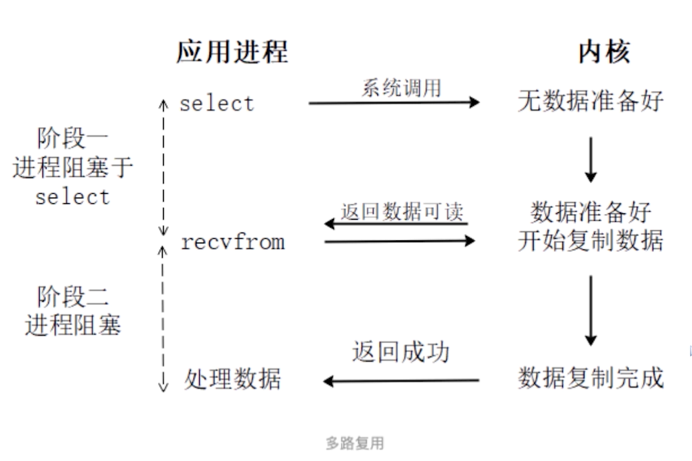
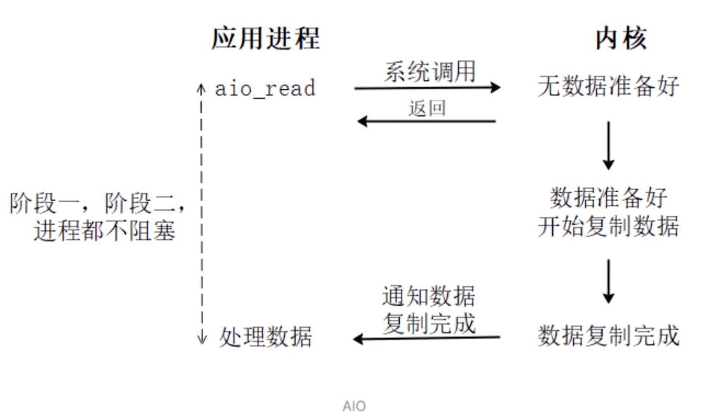

[toc]

## 一、Socket网络编程

#### 1. 简介

Socket是由ip和port组成的唯一标识一个通信端点，即套接字，是两台主机之间逻辑连接的端点。

TCP/IP协议是传输层协议，主要解决数据如何在网络中传输，HTTP是应用层协议，主要解决如何包装数据。

Socket是通信的基石，是支持TCP/IP协议的网络通信的基本操作单元。它是网络通信过程中端点的抽象表示，Socket包含进行网络通信必须的五种信息：

**连接使用的协议、本地主机的IP地址、本地进程的协议端口、远程主机的IP地址、远程进程的协议端口。**

#### 2. 使用的端口

端口号的**范围是0到65536**，但是**0到1024是为特权服务保留的端口号**，可以选择任意一个当前没有被其他进程使用的端口。

**常用协议端口如下**


#### 3.应用

 Socket编程主要涉及到客户端和服务端两个方面，网络通信数据通过流传输

具体代码查看[BIO代码案例](#三、Java中的BIO(同步并阻塞))

- 服务端创建一个带port入参的服务器套接字（ServerSocket），然后监听（accept）这个端口的连接
- 客户端创建一个带目标ip和port的客户端套接字（Socket），即请求服务器建立TCP连接
- 服务器和客户端之间的通信就像输入输出流一样进行操作。


## 二、IO分类及原理

Java中的IO有分为同步和非同步、阻塞和非阻塞的方式。并提供了BIO、NIO和NIO三种模式。那么IO操作**调用的是操作系统的read和write两大IO函数**

下面我们以**读取数据来分析IO模型**，为什么有**阻塞、非阻塞、同步、异步**的IO方式

注意：我们常说的IO都是**一种缓存IO**，每次读，操作系统检查内核的缓冲区有没有需要的数据，如果已经缓存了，那么就直接从缓存中返回；否则从磁盘中读取，然后缓存在操作系统的缓存中。

### 1. read-读数据

Linux操作系统的内存空间分为**用户空间**和**内核空间（直接内存）**


- **应用程序**可以操作的是**用户空间**，磁盘IO或者网络IO都需要**通过CPU拷贝内核空间的数据到用户空间**。
- **内核空间**也就是**直接内存**，**硬件**（网卡、磁盘）可以**直接（DMA）拷贝数据到内核空间的缓冲区**

操作系统的**read调用**分为两个阶段，分别是**准备数据**、**拷贝数据**。

- **等待（准备）数据**：应用程序发起read调用，操作系统**由用户态转入内核态**，**等待数据从硬件设备拷贝到内核缓冲区**

  硬件     ------直接（DMA）拷贝数据-----》    内核空间（直接内存）

  - 如果阻塞，就是阻塞IO
  - 如果非阻塞，就是非阻塞IO

- **拷贝数据**：内核缓冲区有数据了，**等待数据从内核空间通过CPU拷贝到用户空间缓冲区**
  
  内核空间（直接内存）      ------CPU拷贝数据-----》     用户空间
  
  - 如果阻塞，就是同步IO
  - 如果非阻塞，就是异步IO

以上读操作呢，其实可以用[零拷贝](./零拷贝)来优化，可以减少上下文切换次数和CPU拷贝次数

#### 1.1 同步阻塞-BIO

##### 1.1.1 表面知识

线程监听服务端Socket的连接事件和**客户端Socket的读写事件**，都**需要阻塞等待**。即使建立客户端连接后采用连接池处理读写事件，但线程还是会在read数据时阻塞。也就**意味着有多少IO事件的请求就需要多少线程处理**。


伪代码：

```java
ServerSockt serverSockt = new ServerSockt (port);
// 此时阻塞状态，直到有客户端通过new Socket(host,port)建立与服务端的连接
Sockt socket = serverSockt.accept();

InputStream inputStream = socket.getInputStream();
byte[] bytes = new byte[1024];
// read读取数据阻塞，直到客户端的OutputStream执行write写数据
inputStream.read(bytes);

OutputStream outputStream = socket.getOutputStream();
outputStream.write("今天这么晚呀");


InputStream inputStream = socket.getInputStream();
byte[] bytes = new byte[1024];
inputStream.read(bytes)
```

##### 1.1.2 底层原理


- 准备阶段：应用程序发起**read请求，阻塞等待数据从硬件拷贝到内核空间**
- 拷贝阶段：当数据准备好后，**阻塞等待数据从内核空间拷贝到用户空间**


#### 1.2 同步非阻塞-NIO（推荐使用）

##### 1.2.1 表面知识

**[详情查看NIO基础及应用](NIO基础及应用)**

一个线程处理多个连接及连接后的IO，分别将服务端通道和客户端通道**注册到多路复用器上**（操作系统提供的一种进程），**由多路复用器监听服务端通道的连接事件和客户端通道的读写事件**，在**当前没有事件发生时**，线程**可以去做别的事情**，无需阻塞挂起。（**当然也可以选择阻塞等待事件**）


##### 1.2.2 底层原理



- 准备阶段：应用程序发起**read请求，不阻塞等待数据从硬件拷贝到内核空间**，可以正常执行其他任务
- 拷贝阶段：当**数据拷贝到内核空间后好后**，应用程序的**读请求会发生阻塞**，直到数据**从内核空间拷贝到用户空间**


#### 1.4 异步-AIO

基于异步通知的设计模式，Linux内核**只支持文件IO的回调**，**不支持网络AIO**，所以AIO不如NIO流行



- 应用程序发起read请求，并**向内核注册了一个回调函数**，然后直接返回。当内核**准备好数据并且拷贝数据到用户空间后**，通过**回调通知应用程序**。


## 三、多路复用机制

### 1. 前置知识

**简单理解多路复用机制**：就是操作系统提供一个多路复用器，比如有很多个连接都有IO操作，**就可以用一个多路复用器来监听所有连接的读写事件，节约了线程资源**。而如果是传统IO，则这么多个IO操作就需要同等数量的线程阻塞读写

**多路复用器：**多路复用器是Linux中的一种**进程（本质是不断轮询的进程）**，作用是**监视**多个**文件描述符**的事件

**文件描述符：**Linux系统中**一切都是文件**，比如**进程**、**磁盘**、**socket连接**被**抽象为文件**。程序**创建新文件时（比如连接socket**），内核向进程**返回文件描述符**（**fd：指向文件的引用**），形式上以非负整数表述。


### 2. 多路复用器的种类

#### 2.1 select

**过程：**当应用程序**创建多个socket连接**，操作系统中就有**多个fd**，发起一次**read请求**，**调用select函数把fd传到到内核**，等待fd就绪，当**有fd就绪**时，**遍历检查就绪的fd是否有读写事件**，然后由应用程序根据fd的状态**进行读写操作。**

**优点：**

所有平台都支持

**缺点：**

- select 限制了最大fd的数量是1024，可通过FD_SETSIZE设置
- 在调用select函数时，**每次都要传入fd到内核空间**
- 遍历检查就绪的fd是否由读写事件，**扫描整个数组**


#### 2.2 poll

与select基本相同，区别在于没有最大数量限制

**优点：**

- **没有最大fd的限制**，因为使用链表存储

**缺点：**

- 在调用pool函数时，每次都要传入fd到内核空间

- 遍历检查就绪的fd是否由读写事件，**扫描整个链表**


#### 2.3 epoll

将**用户空间的文件描述符事件表复制到内核的一个事件表中**，这样在用户空间和内核空间的copy只需一次

**优点：**

- 没有最大并发连接的限制，**上限是最大可以打开文件的数目**（在1GB内存的机器上大约是10万左右）
- 遍历检查就绪的fd是否由读写事件，**只关心活跃的socket连接**，不需要扫描全表

**注意：**select、pool、epool这三种多路复用器，等待读写事件就绪，是阻塞的，直到有事件发生或者超时（timeout指定等待时间，如果立即返回设为null即可）


#### 2.4 kqueue

kqueue 是 **unix** 下的一个IO多路复用库，注册一批socket描述符到 kqueue 以后，当其中的描述符状态发生变化时，kqueue 将一次性通知应用程序哪些描述符

- 优点：能处理大量数据，性能较好


## 四、代码

### 1. BIO应用代码

#### 1.1 Client

```java
import java.io.InputStream;
import java.io.OutputStream;
import java.net.Socket;
import java.util.Scanner;

public class ClientDemo {
    public static void main(String[] args) throws Exception {
        while (true) {
            //1.创建 Socket 对象
            Socket s = new Socket("127.0.0.1", 9999);
            //2.从连接中取出输出流并发消息
            OutputStream os = s.getOutputStream();
            System.out.println("请输入:");
            Scanner sc = new Scanner(System.in);
            String msg = sc.nextLine();
            os.write(msg.getBytes());
            //3.从连接中取出输入流并接收回话
            InputStream is = s.getInputStream();
            byte[] b = new byte[1024];
            int read = is.read(b);
            System.out.println("老板说:" + new String(b, 0, read).trim());
            //4.关闭
            s.close();
        }
    }
}
```

#### 1.2 Server

```java
import java.io.IOException;
import java.io.InputStream;
import java.io.OutputStream;
import java.net.ServerSocket;
import java.net.Socket;
import java.util.concurrent.ExecutorService;
import java.util.concurrent.Executors;

public class ServerDemo {

    public static void main(String[] args) throws Exception {
        //1.创建一个线程池,如果有客户端连接就创建一个线程, 与之通信
        ExecutorService executorService = Executors.newCachedThreadPool();
        //2.创建 ServerSocket 对象
        ServerSocket serverSocket = new ServerSocket(9999);
        System.out.println("服务器已启动");
        while (true) {
            //3.监听客户端
            final Socket socket = serverSocket.accept();
            System.out.println("有客户端连接");
            //4.开启新的线程处理
            executorService.execute(new Runnable() {
                @Override
                public void run() {
                    handle(socket);
                }
            });
        }
    }

    public static void handle(Socket socket) {
        try {
            System.out.println("线程ID:" + Thread.currentThread().getId()
                    + "   线程名称:" + Thread.currentThread().getName());
            //从连接中取出输入流来接收消息
            InputStream is = socket.getInputStream();
            byte[] b = new byte[1024];
            int read = is.read(b);
            System.out.println("客户端:" + new String(b, 0, read));
            //连接中取出输出流并回话
            OutputStream os = socket.getOutputStream();
            os.write("没钱".getBytes());
        } catch (Exception e) {
            e.printStackTrace();
        } finally {
            try {
                //关闭连接
                socket.close();
            } catch (IOException e) {
                e.printStackTrace();
            }
        }
    }
}
```


### 2. NIO

**[详情查看NIO基础及应用](NIO基础及应用)**


## 五、适用场景

- BIO适用于：连接数比较小的项目，不过对服务器资源要求比较高，并发局限于应用中，JDK1.4以前的唯一选择，但程序简单易理解
- NIO适用于：连接数多但是短的项目（多但是轻），比如聊天服务器，弹幕系统，服务器间通讯等。编程比较复杂，JDK1.4 开始支持
- AIO适用于：连接数多并且长的项目（多且重），比如相册文件上传，充分调用 OS 参与并发操作， 编程比较复杂，JDK7 开始支持。
