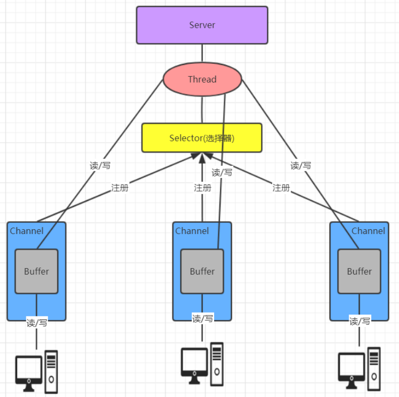
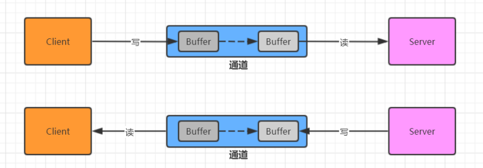
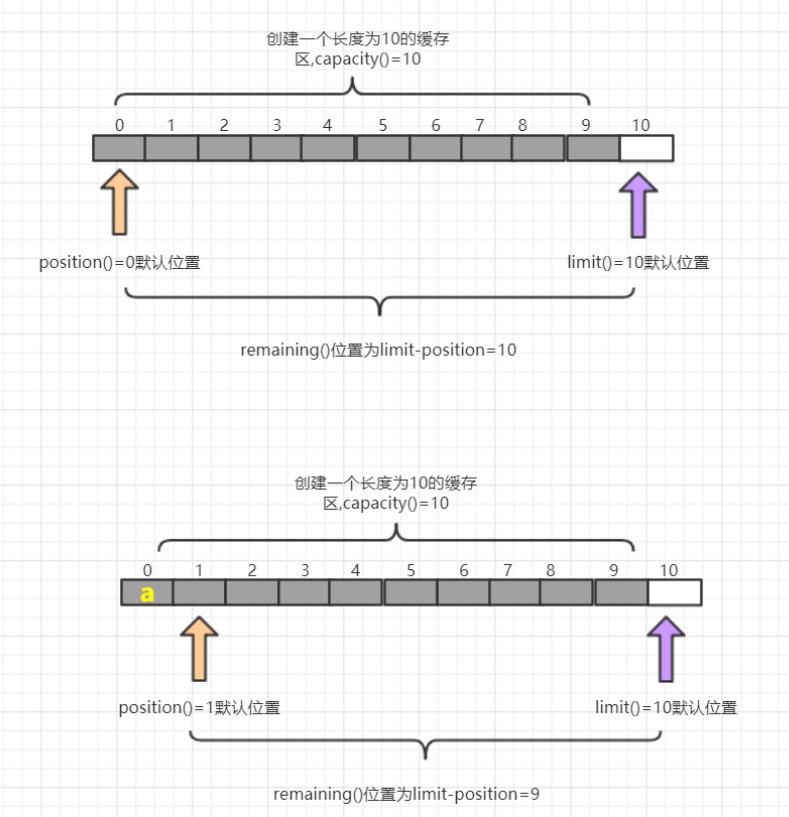
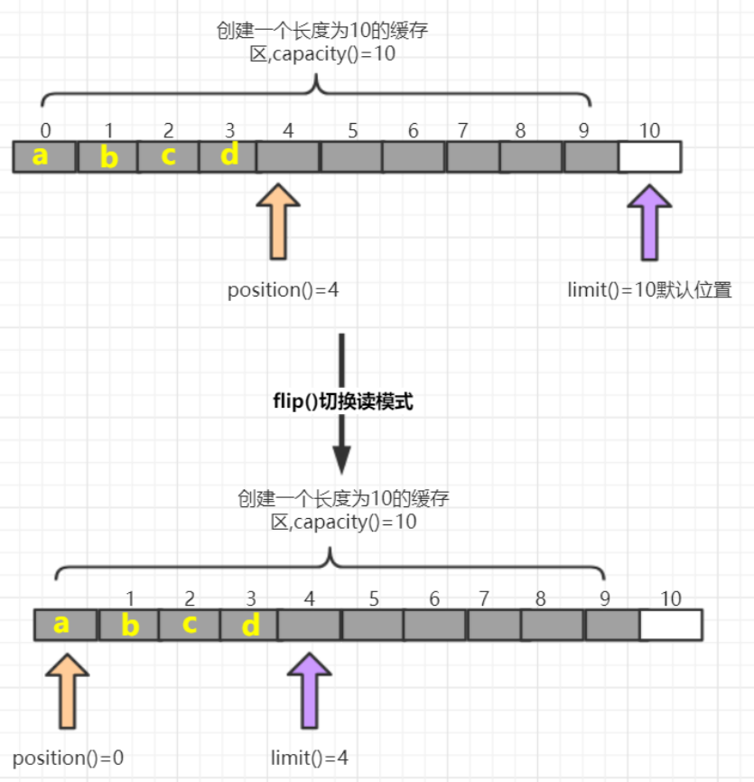
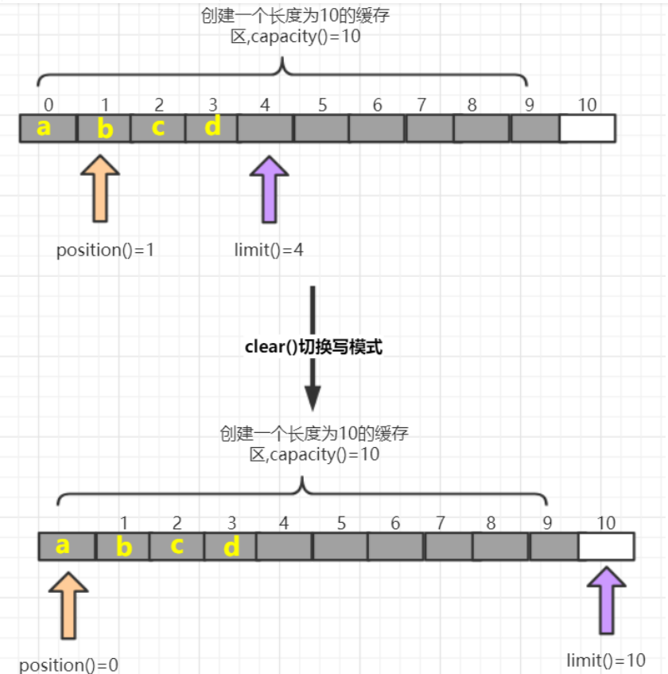
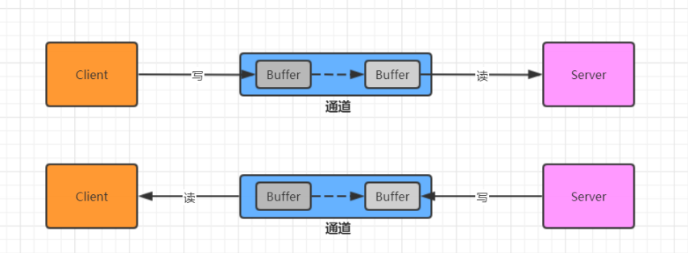
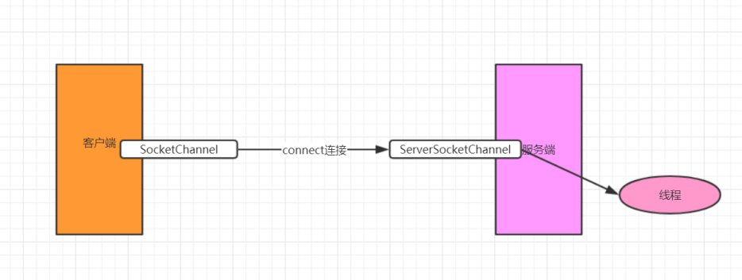
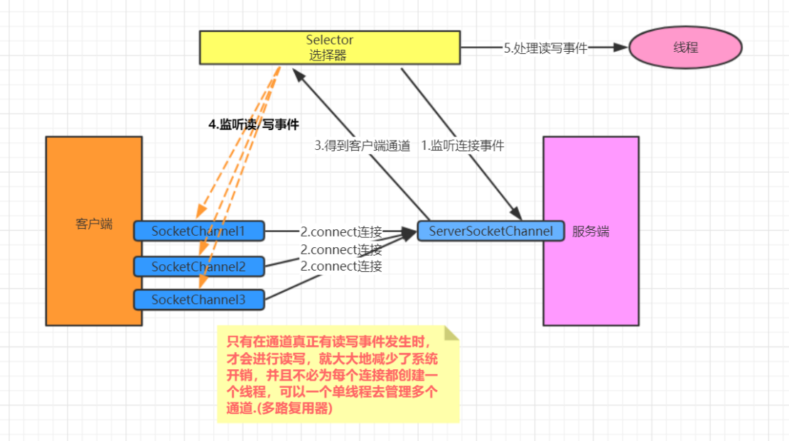

[toc]

## 一、NIO概述

Java NIO 全称**java non-blocking IO** ，是指 JDK 提供的新 API。**从 JDK1.4 开始，Java 提供了一系列改进的输入/输出的新特性，被统称为 NIO(即 New IO)，是同步非阻塞的**

NIO 有三大核心部分：**Channel(通道)，Buffer(缓冲区), Selector(选择器)** 

NIO是 面向缓冲区编程的。数据读取到一个缓冲区中，需要时可在缓冲区中前后移动，这就增加了处理过程中的灵活性，使用它可以提供非阻塞式的高伸缩性网络

Java NIO 的非阻塞模式，使一个线程从某通道发送请求或者读取数据，但是它仅能得到目前可用的数据，如果目前没有数据可用时，就什么都不会获取，而不是保持线程阻塞，所以直至数据变的可以读取之前，该线程可以继续做其他的事情。 非阻塞写也是如此，一个线程请求写入一些数据到某通道，但不需要等待它完全写入， 这个线程同时可以去做别的事情。

**通俗理解**：NIO 是可以做到用一个线程来处理多个操作的。假设有 10000 个请求过来,根据实际情况，可以分配50 或者 100 个线程来处理。不像之前的阻塞 IO 那样，非得分配 10000 个


## 二、NIO与BIO的比较

- BIO 以流的方式处理数据，而 NIO 以缓冲区的方式处理数据,缓冲区 I/O 的效率比流 I/O 高很多

- BIO 是阻塞的，NIO则是非阻塞的

- BIO 基于字节流和字符流进行操作，而 NIO 基于 Channel(通道)和 Buffer(缓冲区)进行操作，数据总是从通道读取到缓冲区中，或者从缓冲区写入到通道中。Selector(选择器)用于监听多个通道的事件（比如：连接请求， 数据到达等），因此使用单个线程就可以监听多个客户端通道


## 三、NIO三大核心组件原理

NIO三大核心组件 `Selector `、 `Channel `和 `Buffer `的关系大致如下，略有不全，详细可查看后面核心组件部分




1. **每个 channel 都会对应一个 Buffer**

2. **Selector 对应一个线程， 一个线程对应多个 channel(连接)** 

3. **每个 channel 都注册到 Selector选择器上**

4. **Selector不断轮询查看Channel上的事件, 事件是通道Channel非常重要的概念**

5. **Selector 会根据不同的事件，完成不同的处理操作**

6. **Buffer 就是一个内存块 ， 底层是有一个数组**

7. **数据的读取写入是通过 Buffer, 这个和 BIO , BIO 中要么是输入流，或者是输出流, 不能双向，但是NIO 的 Buffer 是可以读也可以写 , channel 是双向的.**

## 四、缓冲区(Buffer)

### 4.1 基本介绍

缓冲区（Buffer）：缓冲区本质上是一个可以读写数据的内存块，可以理解成是一个数组，该对象提供了一组方法，可以更轻松地使用内存块，，缓冲区对象内置了一些机制，能够跟踪和记录缓冲区的状态变化情况。Channel 提供从网络读取数据的渠道，但是读取或写入的数据都必须经由 Buffer



### 4.2 Buffer常用API介绍

#### 4.2.1 Buffer 类及其子类


在 NIO 中，Buffer是一个顶层父类，它是一个抽象类, 类的层级关系图,常用的缓冲区分别对应byte,short, int, long,float,double,char 7种

#### 4.2.2 缓冲区对象创建

| 方法名                               | 说明                           |
| ------------------------------------ | ------------------------------ |
| static ByteBuffer allocate(长度)     | 创建byte类型的指定长度的缓冲区 |
| static ByteBuffer wrap(byte[] array) | 创建一个有内容的byte类型缓冲区 |

##### 示例代码

```java
import java.nio.ByteBuffer;

/**
 * Buffer的创建
 */
public class CreateBufferDemo {
    public static void main(String[] args) {
        //1.创建指定长度的缓冲区  ByteBuffer为例
        ByteBuffer allocate = ByteBuffer.allocate(5);
        for (int i = 0; i < 5; i++) {
            System.out.println(allocate.get());//从缓冲区当中拿去数据
        }
        // 超出部分会报错，因为下标，后续讲解
        //System.out.println(allocate.get());

        //2.创建一个有内容的缓冲区
        ByteBuffer wrap = ByteBuffer.wrap("lagou".getBytes());
        for (int i = 0; i < 5; i++) {
            System.out.println(wrap.get());
        }
    }
}
```


#### 4.2.3 缓冲区对象添加数据

| 方法名                                   | 说明                                          |
| ---------------------------------------- | --------------------------------------------- |
| int position()/position(int newPosition) | 获得当前要操作的索引/修改当前要操作的索引位置 |
| int limit()/limit(int newLimit)          | 最多能操作到哪个索引/修改最多能操作的索引位置 |
| int capacity()                           | 返回缓冲区的总长度                            |
| int remaining()/boolean hasRemaining     | 还有多少能操作索引个数/是否还有能操作         |
| put(byte b)/put(byte[] src)              | 添加一个字节/添加字节数组                     |

##### 图解




##### 示例代码

```java
import java.nio.ByteBuffer;

/**
 * 向缓冲区中添加数据
 */
public class PutBufferDemo {
    public static void main(String[] args) {
        //1.创建一个缓冲区
        ByteBuffer allocate = ByteBuffer.allocate(10);
        System.out.println(allocate.position());//0 获取当前索引所在位置
        System.out.println(allocate.limit());//10 最多能操作到哪个索引位置
        System.out.println(allocate.capacity());//10 返回缓冲区总长度
        System.out.println(allocate.remaining());//10 还有多少个可以操作的个数

        System.out.println("----------------");
        // 修改当前索引所在位置
        //allocate.position(1);
        // 修改最多能操作到哪个索引的位置
        //allocate.limit(9);
        // System.out.println(allocate.position());//1 获取当前索引所在位置
        //System.out.println(allocate.limit());//9 最多能操作到哪个索引位置
        //System.out.println(allocate.capacity());//10 返回缓冲区总长度
        //System.out.println(allocate.remaining());//8 还有多少个可以操作的个数

        // 添加一个字节
        allocate.put((byte) 97);
        System.out.println(allocate.position());//1 获取当前索引所在位置
        System.out.println(allocate.limit());//10 最多能操作到哪个索引位置
        System.out.println(allocate.capacity());//10 返回缓冲区总长度
        System.out.println(allocate.remaining());//9 还有多少个可以操作的个数

        System.out.println("----------------");
        // 添加一个数组
        allocate.put("abc".getBytes());
        System.out.println(allocate.position());//4 获取当前索引所在位置
        System.out.println(allocate.limit());//10 最多能操作到哪个索引位置
        System.out.println(allocate.capacity());//10 返回缓冲区总长度
        System.out.println(allocate.remaining());//6 还有多少个可以操作的个数
        System.out.println("----------------");
        // 添加一个数组
        allocate.put("123456".getBytes());
        System.out.println(allocate.position());//10 获取当前索引所在位置
        System.out.println(allocate.limit());//10 最多能操作到哪个索引位置
        System.out.println(allocate.capacity());//10 返回缓冲区总长度
        System.out.println(allocate.remaining());//0 还有多少个可以操作的个数
        System.out.println(allocate.hasRemaining());//false 是否还能操作
        System.out.println("----------------");
        //如果缓冲区满了. 可以调整position位置, 就可以重复写. 会覆盖之前存入索引位置的值
        allocate.position(0);
        allocate.put("123456".getBytes());
        System.out.println(allocate.position());//6 获取当前索引所在位置
        System.out.println(allocate.limit());//10 最多能操作到哪个索引位置
        System.out.println(allocate.capacity());//10 返回缓冲区总长度
        System.out.println(allocate.remaining());//4 还有多少个可以操作的个数
        System.out.println(allocate.hasRemaining());//true 是否还能操作

    }
}
```


#### 4.2.4 缓冲区对象读取数据

| **方法名**      | 介绍                                               |
| --------------- | -------------------------------------------------- |
| flip()          | 写切换读模式 limit设置position位置, position设置0  |
| get()           | 读一个字节                                         |
| get(byte[] dst) | 读多个字节                                         |
| get(int index)  | 读指定索引的字节                                   |
| rewind()        | 将position设置为0，可以重复读                      |
| clear()         | 切换写模式 position设置为0 , limit 设置为 capacity |
| array()         | 将缓冲区转换成字节数组返回                         |

##### 图解:flip()方法



##### 图解:clear()方法



##### 示例代码

```java
import java.nio.ByteBuffer;

/**
 * 从缓冲区中读取数据
 */
public class GetBufferDemo {
    public static void main(String[] args) {
        //1.创建一个指定长度的缓冲区
        ByteBuffer allocate = ByteBuffer.allocate(10);
        allocate.put("0123".getBytes());
        System.out.println("position:" + allocate.position());//4
        System.out.println("limit:" + allocate.limit());//10
        System.out.println("capacity:" + allocate.capacity());//10
        System.out.println("remaining:" + allocate.remaining());//6

        //切换读模式
        System.out.println("读取数据--------------");
        allocate.flip();
        System.out.println("position:" + allocate.position());//4
        System.out.println("limit:" + allocate.limit());//10
        System.out.println("capacity:" + allocate.capacity());//10
        System.out.println("remaining:" + allocate.remaining());//6
        for (int i = 0; i < allocate.limit(); i++) {
            System.out.println(allocate.get());
        }
        //读取完毕后.继续读取会报错,超过limit值
        //System.out.println(allocate.get());
        //读取指定索引字节
        System.out.println("读取指定索引字节--------------");
        System.out.println(allocate.get(1));

        System.out.println("读取多个字节--------------");
        // 重复读取
        allocate.rewind();
        byte[] bytes = new byte[4];
        allocate.get(bytes);
        System.out.println(new String(bytes));

        // 将缓冲区转化字节数组返回
        System.out.println("将缓冲区转化字节数组返回--------------");
        byte[] array = allocate.array();
        System.out.println(new String(array));

        // 切换写模式,覆盖之前索引所在位置的值
        System.out.println("写模式--------------");
        allocate.clear();
        allocate.put("abc".getBytes());
        System.out.println(new String(allocate.array()));

    }
}
```


##### 注意事项

1. capacity：容量（长度）limit： 界限（最多能读/写到哪里）posotion：位置（读/写哪个索引）

2. 获取缓冲区里面数据之前，需要调用flip方法

3. 再次写数据之前，需要调用clear方法，但是数据还未消失，等再次写入数据，被覆盖了才会消失。

## 五、通道(Channel)

### 5.1 NIO基于通道操作IO流

- 通道可以读也可以写，流一般来说是单向的（只能读或者写，所以之前我们用流进行IO操作的时候需要分别创建一个输入流和一个输出流）
- 通道可以异步读写
- 通道总是基于缓冲区Buffer来读写



### 5.2 Channel常用类介绍

#### 5.2.1 Channel接口

常 用 的Channel实现类类 有 ：**FileChannel** , **DatagramChannel** ,**ServerSocketChannel**和**SocketChannel** 。

- FileChannel 用于文件的数据读写

- DatagramChannel 用于 UDP 的数据读写

- ServerSocketChannel 和SocketChannel 用于 TCP 的数据读写。

**【ServerSocketChanne类似 ServerSocket , SocketChannel 类似 Socket】** 

#### 5.2.2 SocketChannel 与ServerSocketChannel

类似 Socke和ServerSocket,可以完成客户端与服务端数据的通信工作


### 5.3 ServerSocketChannel 代码案例

```java
import java.io.IOException;
import java.net.InetSocketAddress;
import java.nio.ByteBuffer;
import java.nio.channels.ServerSocketChannel;
import java.nio.channels.SocketChannel;
import java.nio.charset.StandardCharsets;

/**
 * 服务端
 */
public class NIOServer {
    public static void main(String[] args) throws IOException, InterruptedException {
        //1. 打开一个服务端通道
        ServerSocketChannel serverSocketChannel = ServerSocketChannel.open();
        //2. 绑定对应的端口号
        serverSocketChannel.bind(new InetSocketAddress(9999));
        //3. 通道默认是阻塞的，需要设置为非阻塞
        serverSocketChannel.configureBlocking(false);
        System.out.println("服务端启动成功....");
        while (true) {
            //4. 检查是否有客户端连接 有客户端连接会返回对应的通道
            SocketChannel socketChannel = serverSocketChannel.accept();
            if (socketChannel == null) {
                System.out.println("没有客户端连接...我去做别的事情");
                Thread.sleep(2000);
                continue;
            }
            //5. 获取客户端传递过来的数据,并把数据放在byteBuffer这个缓冲区中
            ByteBuffer allocate = ByteBuffer.allocate(1024);
            //返回值
            //正数: 表示本地读到有效字节数
            //0: 表示本次没有读到数据
            //-1: 表示读到末尾
            int read = socketChannel.read(allocate);
            System.out.println("客户端消息:" + new String(allocate.array(), 0,
                    read, StandardCharsets.UTF_8));
            //6. 给客户端回写数据
            socketChannel.write(ByteBuffer.wrap("没钱".getBytes(StandardCharsets.UTF_8)));
            //7. 释放资源
            socketChannel.close();
        }
    }
}
```


### 5.4 SocketChannel 代码案例

```java
package com.lagou.channel;

import java.io.IOException;
import java.net.InetSocketAddress;
import java.nio.ByteBuffer;
import java.nio.channels.SocketChannel;
import java.nio.charset.StandardCharsets;

/**
 * 客户端
 */
public class NIOClient {
    public static void main(String[] args) throws IOException {
        //1. 打开通道
        SocketChannel socketChannel = SocketChannel.open();
        //2. 设置连接IP和端口号
        socketChannel.connect(new InetSocketAddress("127.0.0.1", 9999));
        //3. 写出数据
        socketChannel.write(ByteBuffer.wrap("老板.还钱吧!".getBytes(StandardCharsets.UTF_8)));
        //4. 读取服务器写回的数据
        ByteBuffer allocate = ByteBuffer.allocate(1024);
        int read = socketChannel.read(allocate);
        System.out.println("服务端消息:" +
                new String(allocate.array(), 0, read, StandardCharsets.UTF_8));
        //5. 释放资源
        socketChannel.close();
    }
}
```


## 六、选择器/多路复用器(Selector)

### 6.1 基本介绍

可以用一个线程，处理多个的客户端连接，就会使用到NIO的Selector(选择器). Selector 能够检测多个注册的服务端通道上是否有事件发生，如果有事件发生，便获取事件然后针对每个事件进行相应的处理。这样就可以只用一个单线程去管理多个通道，也就是管理多个连接和请求。

**在这种没有选择器的情况下，对应每个连接对应一个处理线程，但是连接并不能马上就会发送信息，所以还会产生资源浪费，如下图**



**只有在通道真正有读写事件发生时，才会进行读写，就大大地减少了系统开销，并且不必为每个连接都创建一个线程，不用去维护多个线程，避免了多线程之间的上下文切换导致的开销**





### 6.2 常用API介绍

##### Selector 类是一个抽象类，常用方法如下：

- Selector.open() : 得到一个选择器对象

- selector.select() : 阻塞 监控所有注册的通道,当有对应的事件操作时, 会将SelectionKey放入集合内部并返回事件数量

- selector.select(1000): 阻塞 1000 毫秒，监控所有注册的通道,当有对应的事件操作时, 会将SelectionKey放入集合内部并返回

- selector.selectedKeys() : 返回存有SelectionKey的集合

##### SelectionKey 类是选择器内的事件，常用方法如下

- SelectionKey.isAcceptable(): 是否是连接继续事件

- SelectionKey.isConnectable(): 是否是连接就绪事件

- SelectionKey.isReadable(): 是否是读就绪事件

- SelectionKey.isWritable(): 是否是写就绪事件

##### SelectionKey中定义的4种事件：

- SelectionKey.OP_ACCEPT —— 接收连接继续事件，表示服务器监听到了客户连接，服务器可以接收这个连接了

- SelectionKey.OP_CONNECT —— 连接就绪事件，表示客户端与服务器的连接已经建立成功

- SelectionKey.OP_READ —— 读就绪事件，表示通道中已经有了可读的数据，可以执行读操作了（通道目前有数据，可以进行读操作了）

- SelectionKey.OP_WRITE —— 写就绪事件，表示已经可以向通道写数据了（通道目前可以用于写操作）

### 6.3 代码实现

#### 6.3.1 Server

```java
import java.io.IOException;
import java.net.InetSocketAddress;
import java.nio.ByteBuffer;
import java.nio.channels.SelectionKey;
import java.nio.channels.Selector;
import java.nio.channels.ServerSocketChannel;
import java.nio.channels.SocketChannel;
import java.nio.charset.StandardCharsets;
import java.util.Iterator;
import java.util.Set;

/**
 * 服务端-选择器
 */
public class NIOSelectorServer {
    public static void main(String[] args) throws IOException {
        //1. 打开一个服务端通道
        ServerSocketChannel serverSocketChannel = ServerSocketChannel.open();
        //2. 绑定对应的端口号
        serverSocketChannel.bind(new InetSocketAddress(9999));
        //3. 通道默认是阻塞的，需要设置为非阻塞
        serverSocketChannel.configureBlocking(false);
        //4. 创建选择器
        Selector selector = Selector.open();
        //5. 将服务端通道注册到选择器上,并指定注册监听的事件为OP_ACCEPT
        serverSocketChannel.register(selector, SelectionKey.OP_ACCEPT);
        System.out.println("服务端启动成功.....");
        while (true) {
            //6. 检查选择器是否有事件
            int select = selector.select(2000);
            if (select == 0) {
                System.out.println("没有事件发生....");
                continue;
            }
            //7. 获取事件集合
            Set<SelectionKey> selectionKeys = selector.selectedKeys();
            Iterator<SelectionKey> iterator = selectionKeys.iterator();
            while (iterator.hasNext()) {
                //8. 判断事件是否是客户端连接事件SelectionKey.isAcceptable()
                SelectionKey key = iterator.next();
                if (key.isAcceptable()) {
                    //9. 得到客户端通道,并将通道注册到选择器上, 并指定监听事件为OP_READ
                    SocketChannel socketChannel = serverSocketChannel.accept();
                    System.out.println("有客户端连接.....");
                    //将通道必须设置成非阻塞的状态.因为selector选择器需要轮询监听每个通道的事件
                    socketChannel.configureBlocking(false);
                    //指定监听事件为OP_READ 读就绪事件
                    socketChannel.register(selector, SelectionKey.OP_READ);
                }
                //10. 判断是否是客户端读就绪事件SelectionKey.isReadable()
                if (key.isReadable()) {
                    //11.得到客户端通道,读取数据到缓冲区
                    SocketChannel socketChannel = (SocketChannel) key.channel();
                    ByteBuffer allocate = ByteBuffer.allocate(1024);
                    int read = socketChannel.read(allocate);
                    if (read > 0) {
                        System.out.println("客户端消息:" + new String(allocate.array(), 0, read
                                                                 , StandardCharsets.UTF_8));
                        //12. 给客户端回写数据
                        socketChannel.write(ByteBuffer.wrap("没钱".getBytes(StandardCharsets.UTF_8)));
                        socketChannel.close();
                    }
                }
                //13. 从集合中删除对应的事件, 因为防止二次处理.
                iterator.remove();
            }
        }
    }
}
```

#### 6.3.2 Client

```java
import java.io.IOException;
import java.net.InetSocketAddress;
import java.nio.ByteBuffer;
import java.nio.channels.SocketChannel;
import java.nio.charset.StandardCharsets;

/**
 * 客户端
 */
public class NIOClient {
    public static void main(String[] args) throws IOException {
        //1. 打开通道
        SocketChannel socketChannel = SocketChannel.open();
        //2. 设置连接IP和端口号
        socketChannel.connect(new InetSocketAddress("127.0.0.1", 9999));
        //3. 写出数据
        socketChannel.write(ByteBuffer.wrap("老板.还钱吧!".getBytes(StandardCharsets.UTF_8)));
        //4. 读取服务器写回的数据
        ByteBuffer allocate = ByteBuffer.allocate(1024);
        int read = socketChannel.read(allocate);
        System.out.println("服务端消息:" +
                new String(allocate.array(), 0, read, StandardCharsets.UTF_8));
        //5. 释放资源
        socketChannel.close();
    }
}
```


## 七、实践

以下都是基于NIO的 FileChannel 进行的实践操作，SocketChannel 也是同理

FileChannel是线程安全的，所以可以利用多线程来进行复制文件，比如将文件分成4块，然后起4个线程去操作，这样效率提升的更明显。

### <font style=color:#e0861a>文件复制</font>

#### <font style=color:#228fbd>1. 利用缓冲区</font>

- 使用 input和output流获取 FileChannel

  ```java
  FileInputStream in = new FileInputStream("歌曲串烧.mp3");
  FileOutputStream out = new FileOutputStream("歌曲串烧2.mp3");
  FileChannel inch = in.getChannel();
  FileChannel outch = out.getChannel();
  ByteBuffer byteBuffer = ByteBuffer.allocate(1024);
  while((inch.read(byteBuffer))!=-1){
      //切换读取模式
      byteBuffer.flip();
      outch.write(byteBuffer);
      byteBuffer.clear();
  }
  inch.close();
  outch.close();
  in.close();
  out.close();
  ```

- 静态获取 FileChannel

  ```java
  FileChannel inch = FileChannel.open(Paths.get("歌曲串烧.mp3"), StandardOpenOption.READ);
  FileChannel outch = FileChannel.open(Paths.get("歌曲串烧2.mp3"), StandardOpenOption.WRITE, StandardOpenOption.CREATE);
  ByteBuffer byteBuffer = ByteBuffer.allocate(1024);
  while((inch.read(byteBuffer))!=-1){
      //切换读取模式
      byteBuffer.flip();
      outch.write(byteBuffer);
      byteBuffer.clear();
  }
  inch.close();
  outch.close();
  ```

#### <font style=color:#228fbd>2. 使用零拷贝-sendfile</font>

```java
public static void test3(){
    //输出7366ms
    long start = System.currentTimeMillis();
    System.out.println("writeBuffer-开始时间："+start);
    FileChannel fci = null;
    FileChannel fco = null;
    try {
        fci = new RandomAccessFile("D:\\Eclipse\\workspace\\sdutent\\file1.txt", "rw").getChannel();
        fco = new RandomAccessFile("‪fileX.txt", "rw").getChannel();
        fci.transferTo(0, fci.size(), fco);
    } catch (IOException e) {
        e.printStackTrace();
    }finally {
        try {
            if(fci!=null) {
                fci.close();
            }
        } catch (IOException e) {
            e.printStackTrace();
        }

        try {
            if(fco!=null) {
                fco.close();
            }
        } catch (IOException e) {
            e.printStackTrace();
        }
    }
    long end = System.currentTimeMillis();
    System.out.println("总消耗："+(end-start));
}
```

#### <font style=color:#228fbd>3. MMap-内存映射</font>

```java
FileChannel inch = FileChannel.open(Paths.get("歌曲串烧.mp3"), StandardOpenOption.READ);
FileChannel outch = FileChannel.open(Paths.get("歌曲串烧2.mp3"), StandardOpenOption.READ,StandardOpenOption.WRITE, StandardOpenOption.CREATE);
MappedByteBuffer inmap = inch.map(FileChannel.MapMode.READ_ONLY, 0, inch.size());
MappedByteBuffer outmap = outch.map(FileChannel.MapMode.READ_WRITE, 0, inch.size());
byte[] bytes = new byte[inmap.limit()];
inmap.get(bytes);
outmap.put(bytes);
inch.close();
outch.close();
```

#### <font style=color:#228fbd>4. Copy</font>

Files类是Java7之后推出来的，对文件的操作功能非常牛，建议多学习。

```java
Files.copy(Paths.get("歌曲串烧.mp3"),Paths.get("歌曲串烧2.mp3"), StandardCopyOption.REPLACE_EXISTING);
```

