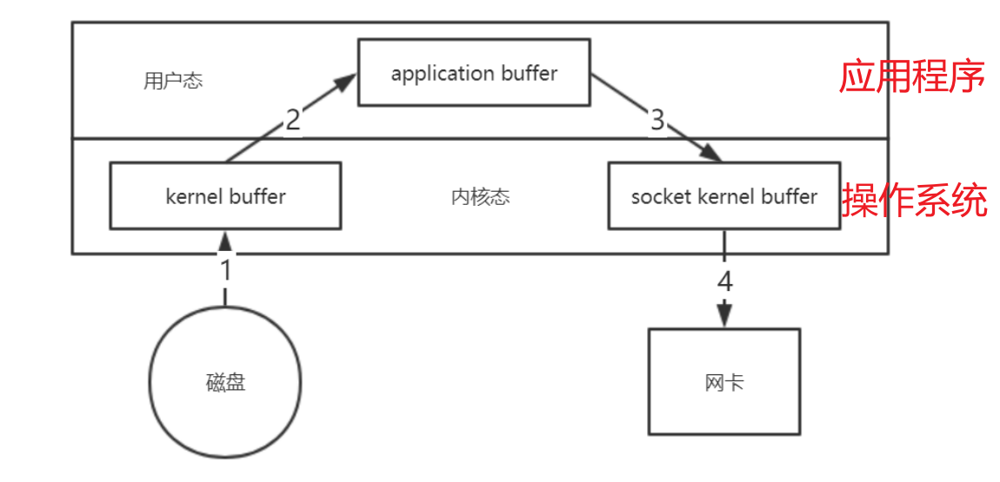
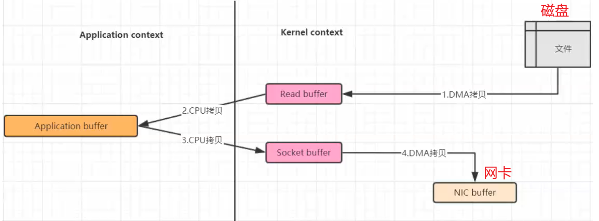
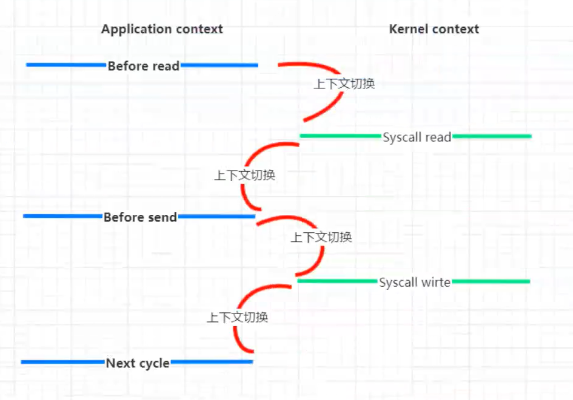
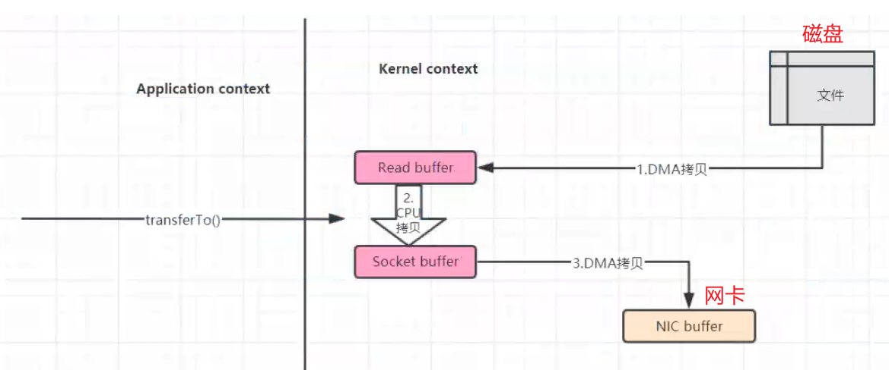
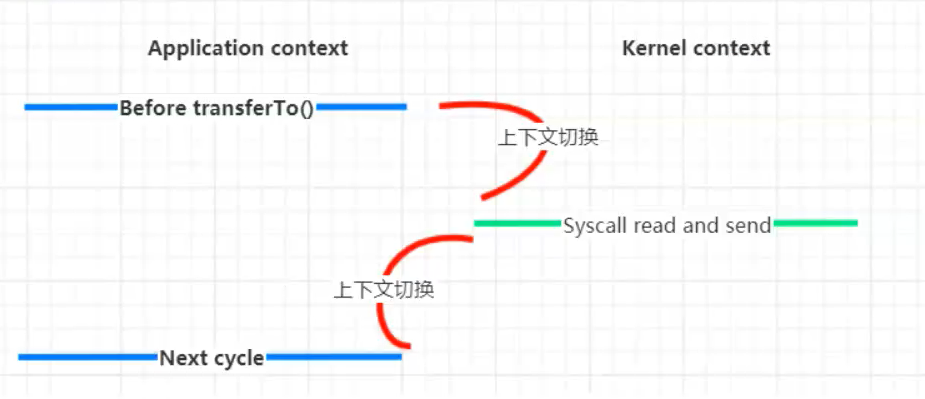
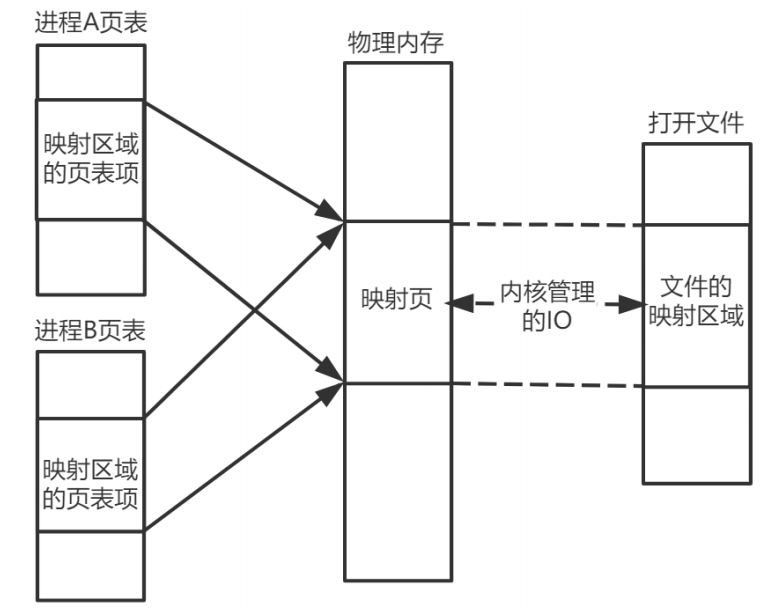
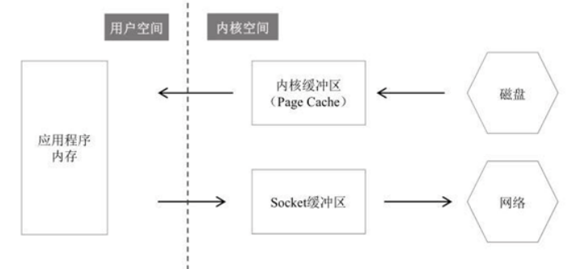
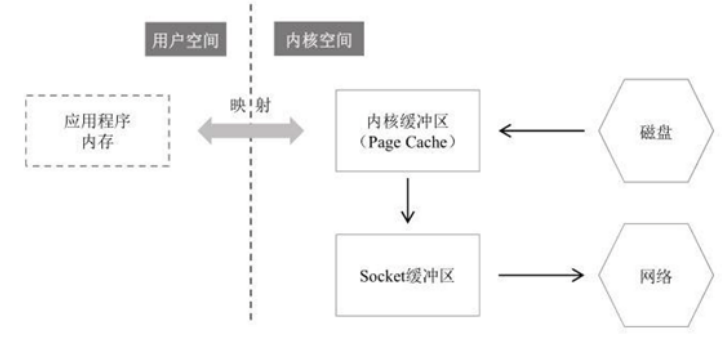
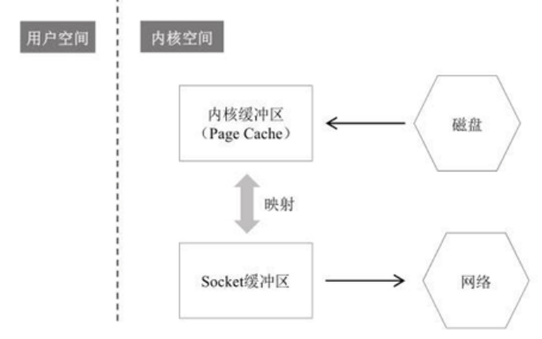

[toc]

## 一、零拷贝技术

### 1. 传统IO拷贝





- 数据需要从**磁盘**拷贝到**内核空间**（DMA拷贝），再从内核空间拷到**用户空间**（JVM）（CPU拷贝）。
- 程序可能进行数据修改等操作
- 再将数据拷贝到**内核空间**（CPU拷贝），内核空间再拷贝到**网卡内存**（DMA拷贝），通过网络发送出去（或拷贝到**磁盘**）。

当然磁盘到内核空间属于DMA拷贝（DMA即直接内存存取，原理是外部设备不通过CPU而直接与系统内存交换数据）。而内核空间到用户空间则需要CPU的参与进行拷贝，既然需要CPU参与，也就涉及到了内核态和用户态的相互切换，如下图：



- 4次上下文切换

- 数据拷贝次数4次（其中只有2次涉及了CPU，另外2次是DMA直接存取）。


### 2. NIO的零拷贝

##### 2.1 零拷贝流程

总结：直接在内核空间完成文件读取并转到磁盘（或发送到网络）



NIO的零拷贝由 `transferTo() ` 方法实现。`transferTo() ` 方法将数据从 **FileChannel** 对象传送到可写的字节通道（如Socket Channel等）。在内部实现中，由native方法 `transferTo0()  `来实现，它**依赖底层操作系统的支持**。在UNIX和Linux系统中，调用这个方法会引起**sendfile() 系统调用**。

- transferTo方法调用触发DMA引擎将文件上下文信息拷贝到内核空间read buffer，接着内核将数据从read buffer拷贝到socket buffer
- DMA引擎将数据从socket buffer传输到协议引擎（第三次数据拷贝），整个过程都在内核空间中完成。


##### 2.2 内核态与用户态切图



- 将上下文切换次数**从4次减少到了2次**
- 将数据**拷贝次数从4次减少到了3次**（其中只有1次涉及了CPU，另外2次是DMA直接存取）


##### 2.3 使用场景

- **文件较大**，读写较慢，**追求速度**
- JVM内存不足，**不能加载太大数据**
- **带宽不够**，即存在其他程序或线程存在大量的IO操作，导致带宽本来就小


### 3. 直接IO（区别于缓存IO/标准IO）

先说说缓存IO：在Linux的缓存I/O机制中，数据先从磁盘DMA拷贝内核空间的缓冲区，然后从内核空间缓冲区CPU拷贝到应用程序的地址空间。

直接IO就是应用程序直接访问磁盘数据，而不经过内核缓冲区，这样做的目的是减少一次从内核缓冲区到用户程序缓存的数据复制。比如说数据库管理系统这类应用，它们更倾向于选择它们自己的缓存机制，因为数据库管理系统往往比操作系统更了解数据库中存放的数据，数据库管理系统可以提供一种更加有效的缓存机制来提高数据库中数据的存取性能。

直接IO的缺点：如果**访问的数据不在应用程序缓存中，那么每次数据都会直接从磁盘加载**，这种直接加载会非常缓慢。通常直接IO与异步IO结合使用，会得到比较好的性能。


### 4. 内存映射 - MMap

[见NIO应用](./NIO基础及应用)

在LINUX中我们可以使用mmap用来在进程虚拟内存地址空间中分配地址空间，创建和物理内存的映射关系



linux中的映射关系有四种：

- 私有文件映射 多个进程使用同样的物理内存页进行初始化，但是各个进程对内存文件的修改不会共享，也不会反应到物理文件中
- 私有匿名映射 mmap会创建一个新的映射，各个进程不共享，这种使用主要用于分配内存(malloc分配大内存会调用mmap)。 例如开辟新进程时，会为每个进程分配虚拟的地址空间，这些虚拟地址映射的物理内存空间各个进程间读的时候共享，写的时候会copy-on-write。 
- 共享文件映射 多个进程通过虚拟内存技术共享同样的物理内存空间，对内存文件 的修改会反应到实际物理文中，他也是进程间通信(IPC)的一种机制。
- 共享匿名映射 这种机制在进行fork的时候不会采用写时复制，父子进程完全共享同样的物理内存页，这也就实现了父子进程通信(IPC).

内存映射（**MMap技术**）将内核空间缓冲区、用户空间缓冲区映射到同一个物理地址上，可以减少用户空间与内核空间之间的**数据拷贝**，注意这**并不会减少上下文切换次数**

java中的 **`MappedByteBuffer ` 就使用了OS的MMap机制**。核心即是`map()`方法，该方法把数据映射到内存中，获得内存地址addr，然后通过这个addr构造MappedByteBuffer类，以暴露各种文件操作API。

**`DirectByteBuffer`** 是MappedByteBuffer类的子类，同时它实现了DirectBuffer接口，维护一个Cleaner对象来完成内存回收。因此它既可以通过**Full GC来回收内存**，也可以**调用`clean()`方法来进行回收**。

**直接内存大小**可通过 JVM参数来设置：**-XX:MaxDirectMemorySize**


### 5. 不同零拷贝实现的比较

##### 5.1 直接内存读取并发送文件的过程



##### 5.2 Mmap 读取并发送文件的过程



##### 5.3  Sendfile零拷贝读取并发送文件的过程



##### 5.4 小结

- 虽然叫零拷贝，实际上sendfile有2次数据拷贝的。**第1次是从磁盘拷贝到内核缓冲区**，第**2次是从内核缓冲区拷贝到网卡（协议引擎）**。如果网卡支持 SG-DMA（The Scatter-GatherDirect Memory Access）技术，就无需从PageCache拷贝至 Socket 缓冲区；
- 之所以叫零拷贝，是从内存角度来看的，数据在内存中没有发生过拷贝，只是在内存和I/O设备之间传输。很多时候我们认为**sendfile才是零拷贝**，mmap严格来说不算；
- Linux中的API为sendfile、mmap，对应在 Java中的API分别为 **`FileChanel.transferTo()`**、**`FileChannel.map()`**等；
- Netty、Kafka(sendfile)、Rocketmq（mmap）、Nginx等高性能中间件中，都有大量利用操作系统零拷贝特性。


## 二、代码实现

### 1. 传统IO

Client

```java
import java.io.FileInputStream;
import java.io.IOException;
import java.net.Inet4Address;
import java.net.InetSocketAddress;
import java.net.Socket;

public class BIOFileClientDemo {
    public static void main(String[] args) {
        try {
            // 1. 客户端连接服务器
            Socket socket = new Socket();
            InetSocketAddress inetSocketAddress = new InetSocketAddress(Inet4Address.getLocalHost(), 8888);
            socket.connect(inetSocketAddress);
            System.out.println("客户端连接服务器成功, 开始传输文件 ...");
            long startTime = System.currentTimeMillis();

            // 2. 从文件中读取数据数据并传给服务器
            InputStream inputStream = new FileInputStream("D:\\wanfeng\\Learning\\test.pdf");
        	int resourceSize = inputStream.available();
            
            long written = 0 ;// 已经读取的内容长度
            int byteSize = 1024; // 计划每次缓冲的长度
            byte[] bytes = new byte[byteSize];

            // 读取内容输出
            while(written < resourceSize) {
                if(written  + byteSize > resourceSize) {  // 说明剩余未读取大小不足一个1024长度，那就按真实长度处理
                    byteSize = (int) (resourceSize - written);  // 剩余的文件内容长度
                    bytes = new byte[byteSize];
                }

                inputStream.read(bytes);
                socket.getOutputStream.write(bytes);

                outputStream.flush();
                written+=byteSize;
            }
            System.out.println("文件传输完毕, 用时 : " + (System.currentTimeMillis() - startTime) + " ms");

            //3. 关闭连接
            socket.close();
            fileInputStream.close();
        } catch (IOException e) {
            e.printStackTrace();
        }
    }
}
```

Server

```java
import java.io.FileOutputStream;
import java.io.IOException;
import java.io.InputStream;
import java.net.ServerSocket;
import java.net.Socket;

public class BIOFileServerDemo {
    public static void main(String[] args) {
        try {
            // 1. 创建服务器套接字, 并等待客户端连接
            ServerSocket serverSocket = new ServerSocket(8888);
            System.out.println("服务器启动,监听 8888 端口");
            //阻塞, 等待客户端连接请求 ( 此处是第一个阻塞点 )
            Socket socket = serverSocket.accept();
            long startTime = System.currentTimeMillis();
            System.out.println("客户端连接成功");

            // 2. 接收客户端传输的数据, 并写出到文件中
            InputStream inputStream = socket.getInputStream();
            int count = 0;
            while(count == 0) {
                count = inputStream.available();
            }
            int resourceSize = inputStream.available();
            
            // 设置输出流
            OutputStream outputStream = new FileOutputStream("D:\\wanfeng\\Learning\\test222.pdf");
            
            
            long written = 0 ;// 已经读取的内容长度
            int byteSize = 1024; // 计划每次缓冲的长度
            byte[] bytes = new byte[byteSize];
            // 读取内容输出
            while(written < resourceSize) {
                if(written  + byteSize > resourceSize) {  // 说明剩余未读取大小不足一个1024长度，那就按真实长度处理
                    byteSize = (int) (resourceSize - written);  // 剩余的文件内容长度
                    bytes = new byte[byteSize];
                }

                inputStream.read(bytes);
                outputStream.write(bytes);

                outputStream.flush();
                written+=byteSize;
            }

            System.out.println("文件传输完毕, 用时 : " + (System.currentTimeMillis() - startTime) + " ms");

            // 3. 关闭流
            socket.close();
            inputStream.close();
            fileOutputStream.close();
        } catch (IOException e) {
            e.printStackTrace();
        }
    }
}
```


### 2. NIO

Client

```java
import java.io.FileInputStream;
import java.io.IOException;
import java.net.InetSocketAddress;
import java.nio.channels.FileChannel;
import java.nio.channels.SocketChannel;

public class NIOFileClientDemo {
    public static void main(String[] args) {
        try {
            // 1. 创建并配置 服务器套接字通道 ServerSocketChannel
            SocketChannel socketChannel = SocketChannel.open();
            socketChannel.connect(new InetSocketAddress("127.0.0.1", 8888));
            //socketChannel.configureBlocking(false);

            // 2. 从文件输入流中获取文件通道 ( FileChannel )
            FileChannel fileChannel = new FileInputStream("D:\\wanfeng\\Learning\\test.pdf").getChannel();
            long startTime = System.currentTimeMillis();

            // 3. 零拷贝传输数据, 注意记录每次拷贝的起始位置
            long transferLen;
            long totalCount = 0;
            // 使用零拷贝将文件数据传到服务器, 循环终止条件是传输结果小于等于 0
            while ((transferLen = fileChannel.transferTo(totalCount, 1024 * 1024 * 32, socketChannel)) > 0) {
                totalCount += transferLen;
            }

            System.out.println("文件传输完毕, 用时 : " + (System.currentTimeMillis() - startTime) + " ms");

            // 4. 关闭连接
            socketChannel.close();
            fileChannel.close();
        } catch (IOException e) {
            e.printStackTrace();
        }
    }
}
```

Server

```java
import java.io.FileOutputStream;
import java.io.IOException;
import java.net.InetSocketAddress;
import java.nio.channels.FileChannel;
import java.nio.channels.ServerSocketChannel;
import java.nio.channels.SocketChannel;

public class NIOFileServerDemo {
    public static void main(String[] args) {
        try {
            // 1. 创建并配置 服务器套接字通道 ServerSocketChannel
            ServerSocketChannel serverSocketChannel = ServerSocketChannel.open();
            serverSocketChannel.socket().bind(new InetSocketAddress(8888));
            // 注意这里使用阻塞模式, 不调用该代码
            //serverSocketChannel.configureBlocking(false);
            // 2. 获取文件通道
            FileChannel fileChannel = new FileOutputStream("D:\\wanfeng\\Learning\\test222.pdf").getChannel();

            // 3. 阻塞等待
            SocketChannel socketChannel = serverSocketChannel.accept();
            long startTime = System.currentTimeMillis();
            System.out.println("客户端连接成功");
            // 4. 零拷贝核心操作
            fileChannel.transferFrom(socketChannel, 0, 1024 * 1024 * 32);
            System.out.println("文件传输完毕, 用时 : " + (System.currentTimeMillis() - startTime) + " ms");

            // 5. 释放资源
            socketChannel.close();
            fileChannel.close();
        } catch (IOException e) {
            e.printStackTrace();
        }
    }
}
```

