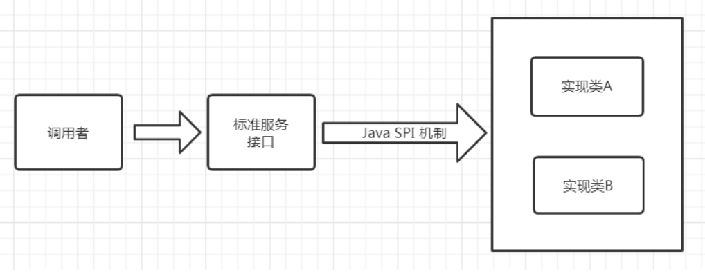

[toc]

## SPI机制(服务发现)

### 1. 简介

SPI 全称为 (Service Provider Interface) ，是**JDK内置的一种服务发现机制**。 目前有不少框架用它来做服务的扩展发现，简单来说，它就是一种动态替换发现的机制。使用SPI机制的优势是实现解耦，使得第三方服务模块的装配控制逻辑与调用者的业务代码分离。

目前流行的框架及应用服务大都有采用SPI服务发现机制，如：jdbc、SpringMVC（基于javaconfig实现tomcat在启动时，初始化springmvc容器，[具体查看springboot源码剖析](../../架构/框架/spring boot/springboot源码剖析)）、Dubbo等

### 2. 使用方式

若想使用SPI功能，先**提供标准服务接口**，然后**再提供相关接口实现和调用者**。这样就可以通过SPI机制中约定好的信息进行查询相应的接口实现。

SPI遵循如下约定：

1. 当服务提供者提供了接口的一种具体实现后，在META-INF/services目录下创建一个以“接口全限定名”为命名的文件，内容为实现类的全限定名；

2. 接口实现类所在的jar包放在主程序的classpath中；

3. 主程序通过==java.util.ServiceLoader动态装载实现模块==，它通过==扫描META-INF/services==目录下的配置文件找到==实现类的全限定名，把类加载到JVM==； 

4. SPI的实现类==必须携带一个无参构造方法==；