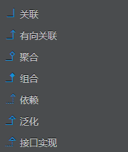

### 关系：

- 泛化（继承）：泛化就是**面向对象**中提到的继承，Java通过 **extense** 关键字
- 实现：类和接口之间的关系，Java通过 **implements** 关键字。
- 依赖：关联关系所涉及的两个类是处在**同一层次**上的。在Java语言中，体现为**局部变量、方法的形参，或者对静态方法的调用**，例如**人和汽车**。
- 关联（单向、双向）：关联关系所涉及的两个类是处在**同一层次**上的。在Java语言中，**通过成员变量来实现的调用**，例如**人和汽车**。
- 聚合（强关联）：聚合关系涉及的两个类是处在**不平等层次**上的，是**整体和个体之间的关系**。在Java语言中，**通过成员变量来实现的调用**，例如**汽车和轮胎**
- 组合（超强关联）：比聚合更强的关联关系，它要求普通的聚合关系中代表**整体的对象负责个体的对象的生命周期**。在Java语言中，**通过成员变量来实现的调用**。

