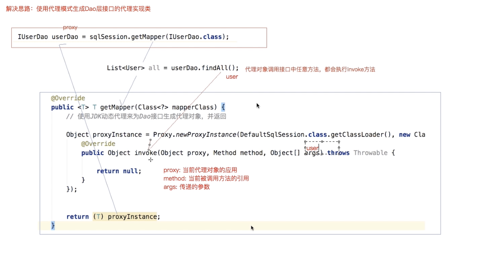

```java
// 租房接口
public interface RentingHouse{
    void rentHouse();
}

// 委托类
public class IRentingHouseImpl implements RentingHouse{
    @Override
    public void rentHouse(){
        System.out.print("我要租一室一厅");
    }
}


public class Test {
    public static void main(String[] args){
        IRentingHouse iRentingHouse = new IRentingHouseImpl();  // 委托类
        
        // 生成代理对象
        Object o = Proxy.newInstanceProxy(iRentingHouse.getClass().getClassLoader,iRentingHouse.getClass().getInterfaces(),new InvocationHandler(){
            @Overrid
            public Object invoke(Proxy p,Method method,Object[] args){
                ...
                Object o =m.invok(iRentingHouse,args);
                ...
                return null;
            }
        });//代理类
        iRentingHouseProxy.rentHouse();
    }
}
```

newInstanceProxy()方法中的入参：

	1. ClassLoader类加载器
	2. 需被代理类的接口类型
 3. 代理增强功能的逻辑

       1. Proxy代理本身

       2. method被代理类的方法

       3. args被代理类的方法入参

1和2使用反射机制，在底层动态的生成了一个代理对象


Mybatis中应用jdk动态代理如下：

```java
public class MapperProxyHandler implements InvocationHandler {

    private Configuration configuration;
    private Executor executor;

    public MapperProxyHandler(Configuration configuration, Executor executor) {
        this.configuration = configuration;
        this.executor = executor;
    }

    @Override
    public Object invoke(Object proxy, Method method, Object[] args) throws Throwable {
        Class<?> aClass = method.getDeclaringClass();
        String spacename = aClass.getName();
        String id = method.getName();
        String key = spacename + "." + id;
        MappedStatement mappedStatement = configuration.getMappedStatements().get(key);
        String sqlType = mappedStatement.getSqlType();
        if ("select".equalsIgnoreCase(sqlType)){
            Type genericReturnType = method.getGenericReturnType();
            if (genericReturnType instanceof ParameterizedType){
                return executor.query(mappedStatement, "list",args);
            }
            return executor.query(mappedStatement, "one",args);
        } else {
            return executor.update(mappedStatement, args);
        }
    }
}
```

将客户端加载配置文件，创建sqlSessionFactory和生产sqlSession的重复代码放入DAO接口的代理实现内中，实现只用调用DAO接口就完成数据库操作

使用jdk自带的动态代理：
Proxy.newProxyInstance(ClassLoader，Class[]，InvocationHandler)

1. ClassLoader:当前类的类加载器
2. Class[]:需被代理类的Class数组
3. InvocationHandler:代理类的实现
4. 
