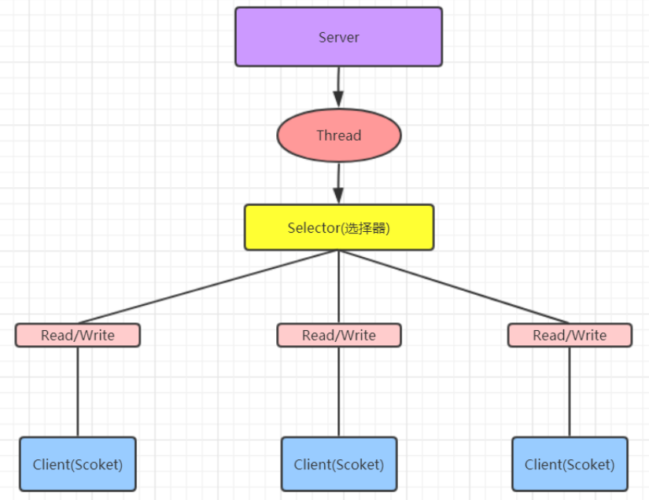

[toc]

## 一、Socket网络编程

#### 1. 简介

Socket是由ip和port组成的唯一标识一个通信端点，即套接字，是两台主机之间逻辑连接的端点。

TCP/IP协议是传输层协议，主要解决数据如何在网络中传输，HTTP是应用层协议，主要解决如何包装数据。

Socket是通信的基石，是支持TCP/IP协议的网络通信的基本操作单元。它是网络通信过程中端点的抽象表示，Socket包含进行网络通信必须的五种信息：

**连接使用的协议、本地主机的IP地址、本地进程的协议端口、远程主机的IP地址、远程进程的协议端口。**

#### 2. 使用的端口

端口号的**范围是0到65536**，但是**0到1024是为特权服务保留的端口号**，可以选择任意一个当前没有被其他进程使用的端口。

**常用协议端口如下**


#### 3.应用

 Socket编程主要涉及到客户端和服务端两个方面，网络通信数据通过流传输

具体代码查看[BIO代码案例](#三、Java中的BIO(同步并阻塞))

- 服务端创建一个带port入参的服务器套接字（ServerSocket），然后监听（accept）这个端口的连接
- 客户端创建一个带目标ip和port的客户端套接字（Socket），即请求服务器建立TCP连接
- 服务器和客户端之间的通信就像输入输出流一样进行操作。

## 二、Java中的IO模型划分

 Java 共支持 3 种网络编程模型/IO 模式：BIO(同步并阻塞)、NIO(同步非阻塞)、AIO(异步非阻塞)

#### 1. 分为阻塞/非阻塞


主要指的是访问IO的线程是否会阻塞（或处于等待），如：

- 服务端线程等待客户端建立连接；
- 服务端线程读操作的阻塞，等待客户端写操作

#### 2. 分为同步与异步


主要是指访问数据的一种机制，同步还是异步

## 三、Java中的BIO(同步并阻塞)

### 1. Java BIO就是传统的 socket编程

BIO(blocking I/O) ： 同步阻塞，服务器实现模式为一个连接一个线程，即客户端有连接请求时服务器端就需要启动一个线程进行处理，如果这个连接不做任何事情会造成不必要的线程开销，可以通过线程池机制改善(实现多个客户连接服务器)。

### 2. 工作机制

**工作原理**


**生活中的例子**


### 3. 阻塞点

#### 3.1（连接阻塞）服务端监听端口，并等待客户端的连接

```java
ServerSockt serverSockt = new ServerSockt (port);

// 此时阻塞状态，直到有客户端通过new Socket(host,port)建立与服务端的连接
Sockt socket = serverSockt.accept();
```

客户端建立与服务端的连接，通过TCP三次握手建立连接

```java
Sockt  sockt  = new  Sockt (host,port);
```


#### 3.2 （读写阻塞）服务端获取InputStream，并执行read读取数据

```java
InputStream inputStream = socket.getInputStream()
byte[] bytes = new byte[1024];
// read读取数据阻塞，直到客户端的OutputStream执行write写数据
inputStream.read(bytes)
```

客户端建立连接后，通过InputStream和OutputStream与服务端交互数据

```java
OutputStream outputStream = socket.getOutputStream()
outputStream.write("今天这么晚呀");

InputStream inputStream = socket.getInputStream();
byte[] bytes = new byte[1024];
inputStream.read(bytes)
```


### 4. BIO问题分析

- **每个请求进来，都由线程池分配一个线程来处理连接及IO操作的read和write，当并发量大时，需要创建大量线程来处理，系统资源占用很大**
- **与客户端建立连接后，分配线程去处理连接，当客户端没有OS的write操作，则当前线程IS的read操作会一直阻塞，浪费系统资源**
- **有多少个请求同时过来，就需要分配多少个线程取处理**

### 5. BIO应用代码

#### 5.1 Client

```java
import java.io.InputStream;
import java.io.OutputStream;
import java.net.Socket;
import java.util.Scanner;

public class ClientDemo {
    public static void main(String[] args) throws Exception {
        while (true) {
            //1.创建 Socket 对象
            Socket s = new Socket("127.0.0.1", 9999);
            //2.从连接中取出输出流并发消息
            OutputStream os = s.getOutputStream();
            System.out.println("请输入:");
            Scanner sc = new Scanner(System.in);
            String msg = sc.nextLine();
            os.write(msg.getBytes());
            //3.从连接中取出输入流并接收回话
            InputStream is = s.getInputStream();
            byte[] b = new byte[1024];
            int read = is.read(b);
            System.out.println("老板说:" + new String(b, 0, read).trim());
            //4.关闭
            s.close();
        }
    }
}
```

#### 5.2 Server

```java
import java.io.IOException;
import java.io.InputStream;
import java.io.OutputStream;
import java.net.ServerSocket;
import java.net.Socket;
import java.util.concurrent.ExecutorService;
import java.util.concurrent.Executors;

public class ServerDemo {

    public static void main(String[] args) throws Exception {
        //1.创建一个线程池,如果有客户端连接就创建一个线程, 与之通信
        ExecutorService executorService = Executors.newCachedThreadPool();
        //2.创建 ServerSocket 对象
        ServerSocket serverSocket = new ServerSocket(9999);
        System.out.println("服务器已启动");
        while (true) {
            //3.监听客户端
            final Socket socket = serverSocket.accept();
            System.out.println("有客户端连接");
            //4.开启新的线程处理
            executorService.execute(new Runnable() {
                @Override
                public void run() {
                    handle(socket);
                }
            });
        }
    }

    public static void handle(Socket socket) {
        try {
            System.out.println("线程ID:" + Thread.currentThread().getId()
                    + "   线程名称:" + Thread.currentThread().getName());
            //从连接中取出输入流来接收消息
            InputStream is = socket.getInputStream();
            byte[] b = new byte[1024];
            int read = is.read(b);
            System.out.println("客户端:" + new String(b, 0, read));
            //连接中取出输出流并回话
            OutputStream os = socket.getOutputStream();
            os.write("没钱".getBytes());
        } catch (Exception e) {
            e.printStackTrace();
        } finally {
            try {
                //关闭连接
                socket.close();
            } catch (IOException e) {
                e.printStackTrace();
            }
        }
    }
}
```


## 四、Java中的NIO(同步非阻塞)

### 1. [详情查看NIO基础及应用](NIO基础及应用)

### 2. Java中的NIO通过多路复用器实现

同步非阻塞，服务器实现模式为一个线程处理多个请求(连接)，即客户端发送的连接请求都会注册到多路复用器上，多路复用器轮询到连接有 I/O 请求就进行处理

### 3. 工作机制

**工作原理**



**生活中的例子**


### 4. 优点：

- **一千个请求同时过来，可能只需十几个线程就能完成处理**
- **通过selector监听连接事件和读写事件，只有发生读写事件时，才会交给线程处理，大大节省了系统资源**

## 五、Java中的AIO(同步非阻塞)

 AIO 引入异步通道的概念，采用了 Proactor 模式，简化了程序编写，有效的请求才启动线程，它的特点是先由操作系统完成后才通知服务端程序启动线程去处理，一般适用于连接数较多且连接时间较长的应用

Proactor 模式是一个消息异步通知的设计模式，Proactor 通知的不是就绪事件，而是操作完成事件，这也就是操作系统异步 IO 的主要模型。

### 1. 工作机制


## 六、BIO、NIO、AIO 适用场景分析

#### 1. BIO(同步并阻塞) 方式适用于连接数目比较小且固定的架构，这种方式对服务器资源要求比较高，并发局限于应用中，JDK1.4以前的唯一选择，但程序简单易理解

#### 2. NIO(同步非阻塞) 方式适用于连接数目多且连接比较短（轻操作）的架构，比如聊天服务器，弹幕系统，服务器间通讯等。编程比较复杂，JDK1.4 开始支持

#### 3. AIO(异步非阻塞) 方式使用于连接数目多且连接比较长（重操作）的架构，比如相册服务器，充分调用 OS 参与并发操作， 编程比较复杂，JDK7 开始支持。
