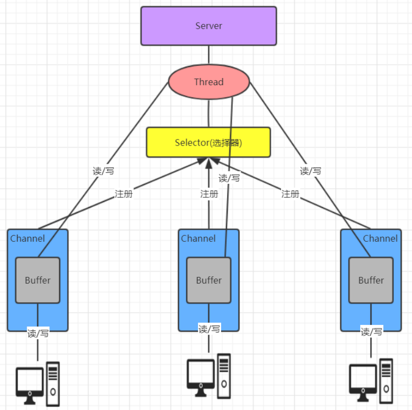
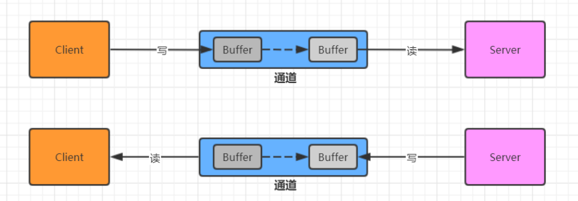
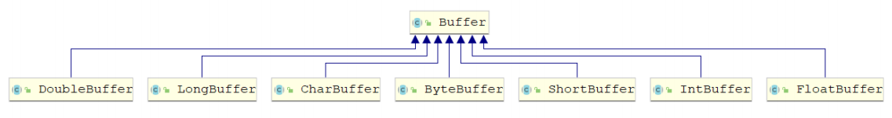
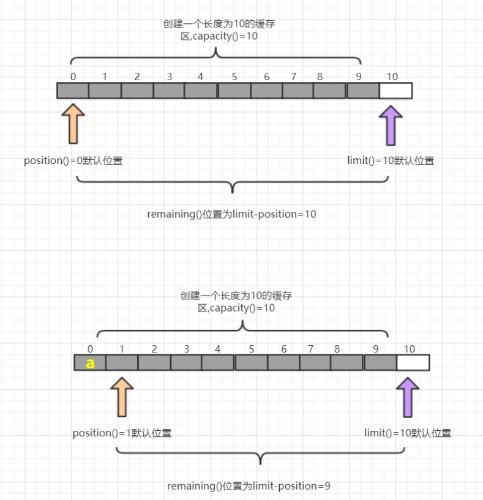
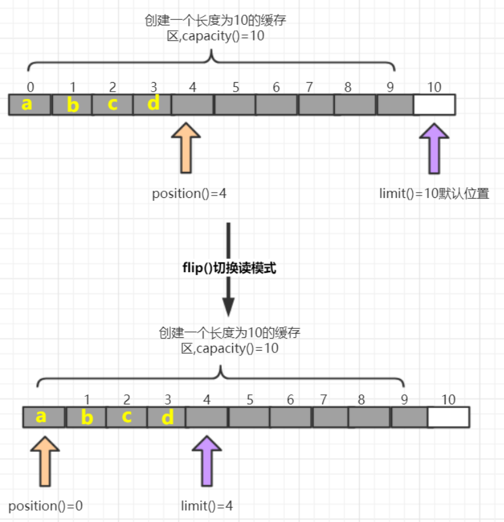
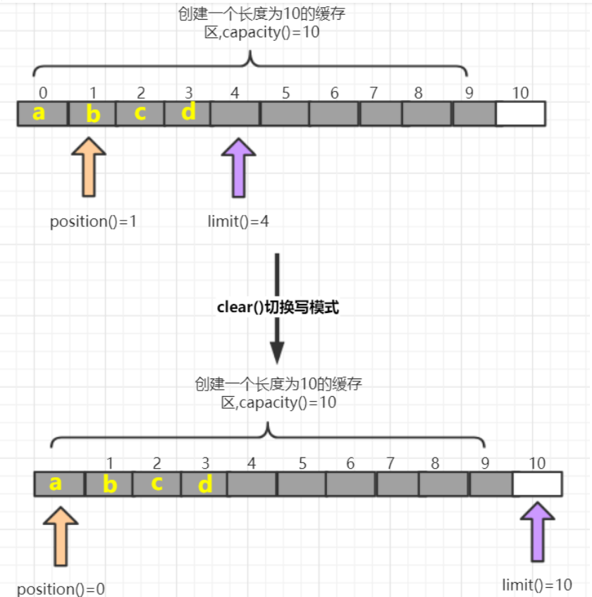

[toc]

## 一、NIO概述

Java NIO 全称**java non-blocking IO** ，是指 JDK 提供的新 API。**从 JDK1.4 开始，Java 提供了一系列改进的输入/输出的新特性，被统称为 NIO(即 New IO)，是同步非阻塞的**

NIO 有三大核心部分：**Channel(通道)，Buffer(缓冲区), Selector(选择器)** 

NIO是 面向缓冲区编程的。数据读取到一个缓冲区中，需要时可在缓冲区中前后移动，这就增加了处理过程中的灵活性，使用它可以提供非阻塞式的高伸缩性网络

Java NIO 的非阻塞模式，使一个线程从某通道发送请求或者读取数据，但是它仅能得到目前可用的数据，如果目前没有数据可用时，就什么都不会获取，而不是保持线程阻塞，所以直至数据变的可以读取之前，该线程可以继续做其他的事情。 非阻塞写也是如此，一个线程请求写入一些数据到某通道，但不需要等待它完全写入， 这个线程同时可以去做别的事情。

**通俗理解**：NIO 是可以做到用一个线程来处理多个操作的。假设有 10000 个请求过来,根据实际情况，可以分配50 或者 100 个线程来处理。不像之前的阻塞 IO 那样，非得分配 10000 个


## 二、NIO与BIO的比较

##### 2.1 BIO 以流的方式处理数据，而 NIO 以缓冲区的方式处理数据,缓冲区 I/O 的效率比流 I/O 高很多

##### 2.2 BIO 是阻塞的，NIO则是非阻塞的

##### 2.3 BIO 基于字节流和字符流进行操作，而 NIO 基于 Channel(通道)和 Buffer(缓冲区)进行操作，数据总是从通道读取到缓冲区中，或者从缓冲区写入到通道中。Selector(选择器)用于监听多个通道的事件（比如：连接请求， 数据到达等），因此使用单个线程就可以监听多个客户端通道


## 三、NIO三大核心组件原理

NIO三大核心组件 `Selector `、 `Channel `和 `Buffer `的关系大致如下，略有不全，详细可查看后面核心组件部分




1. **每个 channel 都会对应一个 Buffer**

2. **Selector 对应一个线程， 一个线程对应多个 channel(连接)** 

3. **每个 channel 都注册到 Selector选择器上**

4. **Selector不断轮询查看Channel上的事件, 事件是通道Channel非常重要的概念**

5. **Selector 会根据不同的事件，完成不同的处理操作**

6. **Buffer 就是一个内存块 ， 底层是有一个数组**

7. **数据的读取写入是通过 Buffer, 这个和 BIO , BIO 中要么是输入流，或者是输出流, 不能双向，但是NIO 的 Buffer 是可以读也可以写 , channel 是双向的.**

## 四、缓冲区(Buffer)

### 4.1 基本介绍

缓冲区（Buffer）：缓冲区本质上是一个可以读写数据的内存块，可以理解成是一个数组，该对象提供了一组方法，可以更轻松地使用内存块，，缓冲区对象内置了一些机制，能够跟踪和记录缓冲区的状态变化情况。Channel 提供从网络读取数据的渠道，但是读取或写入的数据都必须经由 Buffer



### 4.2 Buffer常用API介绍

#### 4.2.1 Buffer 类及其子类



在 NIO 中，Buffer是一个顶层父类，它是一个抽象类, 类的层级关系图,常用的缓冲区分别对应byte,short, int, long,float,double,char 7种

#### 4.2.2 缓冲区对象创建

| 方法名                               | 说明                           |
| ------------------------------------ | ------------------------------ |
| static ByteBuffer allocate(长度)     | 创建byte类型的指定长度的缓冲区 |
| static ByteBuffer wrap(byte[] array) | 创建一个有内容的byte类型缓冲区 |

##### 示例代码

```java
import java.nio.ByteBuffer;

/**
 * Buffer的创建
 */
public class CreateBufferDemo {
    public static void main(String[] args) {
        //1.创建指定长度的缓冲区  ByteBuffer为例
        ByteBuffer allocate = ByteBuffer.allocate(5);
        for (int i = 0; i < 5; i++) {
            System.out.println(allocate.get());//从缓冲区当中拿去数据
        }
        // 超出部分会报错，因为下标，后续讲解
        //System.out.println(allocate.get());

        //2.创建一个有内容的缓冲区
        ByteBuffer wrap = ByteBuffer.wrap("lagou".getBytes());
        for (int i = 0; i < 5; i++) {
            System.out.println(wrap.get());
        }
    }
}
```


#### 4.2.3 缓冲区对象添加数据

| 方法名                                   | 说明                                          |
| ---------------------------------------- | --------------------------------------------- |
| int position()/position(int newPosition) | 获得当前要操作的索引/修改当前要操作的索引位置 |
| int limit()/limit(int newLimit)          | 最多能操作到哪个索引/修改最多能操作的索引位置 |
| int capacity()                           | 返回缓冲区的总长度                            |
| int remaining()/boolean hasRemaining     | 还有多少能操作索引个数/是否还有能操作         |
| put(byte b)/put(byte[] src)              | 添加一个字节/添加字节数组                     |

##### 图解




##### 示例代码

```java
import java.nio.ByteBuffer;

/**
 * 向缓冲区中添加数据
 */
public class PutBufferDemo {
    public static void main(String[] args) {
        //1.创建一个缓冲区
        ByteBuffer allocate = ByteBuffer.allocate(10);
        System.out.println(allocate.position());//0 获取当前索引所在位置
        System.out.println(allocate.limit());//10 最多能操作到哪个索引位置
        System.out.println(allocate.capacity());//10 返回缓冲区总长度
        System.out.println(allocate.remaining());//10 还有多少个可以操作的个数

        System.out.println("----------------");
        // 修改当前索引所在位置
        //allocate.position(1);
        // 修改最多能操作到哪个索引的位置
        //allocate.limit(9);
        // System.out.println(allocate.position());//1 获取当前索引所在位置
        //System.out.println(allocate.limit());//9 最多能操作到哪个索引位置
        //System.out.println(allocate.capacity());//10 返回缓冲区总长度
        //System.out.println(allocate.remaining());//8 还有多少个可以操作的个数

        // 添加一个字节
        allocate.put((byte) 97);
        System.out.println(allocate.position());//1 获取当前索引所在位置
        System.out.println(allocate.limit());//10 最多能操作到哪个索引位置
        System.out.println(allocate.capacity());//10 返回缓冲区总长度
        System.out.println(allocate.remaining());//9 还有多少个可以操作的个数

        System.out.println("----------------");
        // 添加一个数组
        allocate.put("abc".getBytes());
        System.out.println(allocate.position());//4 获取当前索引所在位置
        System.out.println(allocate.limit());//10 最多能操作到哪个索引位置
        System.out.println(allocate.capacity());//10 返回缓冲区总长度
        System.out.println(allocate.remaining());//6 还有多少个可以操作的个数
        System.out.println("----------------");
        // 添加一个数组
        allocate.put("123456".getBytes());
        System.out.println(allocate.position());//10 获取当前索引所在位置
        System.out.println(allocate.limit());//10 最多能操作到哪个索引位置
        System.out.println(allocate.capacity());//10 返回缓冲区总长度
        System.out.println(allocate.remaining());//0 还有多少个可以操作的个数
        System.out.println(allocate.hasRemaining());//false 是否还能操作
        System.out.println("----------------");
        //如果缓冲区满了. 可以调整position位置, 就可以重复写. 会覆盖之前存入索引位置的值
        allocate.position(0);
        allocate.put("123456".getBytes());
        System.out.println(allocate.position());//6 获取当前索引所在位置
        System.out.println(allocate.limit());//10 最多能操作到哪个索引位置
        System.out.println(allocate.capacity());//10 返回缓冲区总长度
        System.out.println(allocate.remaining());//4 还有多少个可以操作的个数
        System.out.println(allocate.hasRemaining());//true 是否还能操作

    }
}
```


#### 4.2.4 缓冲区对象读取数据

| **方法名**      | 介绍                                               |
| --------------- | -------------------------------------------------- |
| flip()          | 写切换读模式 limit设置position位置, position设置0  |
| get()           | 读一个字节                                         |
| get(byte[] dst) | 读多个字节                                         |
| get(int index)  | 读指定索引的字节                                   |
| rewind()        | 将position设置为0，可以重复读                      |
| clear()         | 切换写模式 position设置为0 , limit 设置为 capacity |
| array()         | 将缓冲区转换成字节数组返回                         |

##### 图解:flip()方法



##### 图解:clear()方法



##### 示例代码

```java
import java.nio.ByteBuffer;

/**
 * 从缓冲区中读取数据
 */
public class GetBufferDemo {
    public static void main(String[] args) {
        //1.创建一个指定长度的缓冲区
        ByteBuffer allocate = ByteBuffer.allocate(10);
        allocate.put("0123".getBytes());
        System.out.println("position:" + allocate.position());//4
        System.out.println("limit:" + allocate.limit());//10
        System.out.println("capacity:" + allocate.capacity());//10
        System.out.println("remaining:" + allocate.remaining());//6

        //切换读模式
        System.out.println("读取数据--------------");
        allocate.flip();
        System.out.println("position:" + allocate.position());//4
        System.out.println("limit:" + allocate.limit());//10
        System.out.println("capacity:" + allocate.capacity());//10
        System.out.println("remaining:" + allocate.remaining());//6
        for (int i = 0; i < allocate.limit(); i++) {
            System.out.println(allocate.get());
        }
        //读取完毕后.继续读取会报错,超过limit值
        //System.out.println(allocate.get());
        //读取指定索引字节
        System.out.println("读取指定索引字节--------------");
        System.out.println(allocate.get(1));

        System.out.println("读取多个字节--------------");
        // 重复读取
        allocate.rewind();
        byte[] bytes = new byte[4];
        allocate.get(bytes);
        System.out.println(new String(bytes));

        // 将缓冲区转化字节数组返回
        System.out.println("将缓冲区转化字节数组返回--------------");
        byte[] array = allocate.array();
        System.out.println(new String(array));

        // 切换写模式,覆盖之前索引所在位置的值
        System.out.println("写模式--------------");
        allocate.clear();
        allocate.put("abc".getBytes());
        System.out.println(new String(allocate.array()));

    }
}
```


##### 注意事项

1. capacity：容量（长度）limit： 界限（最多能读/写到哪里）posotion：位置（读/写哪个索引）

2. 获取缓冲区里面数据之前，需要调用flip方法

3. 再次写数据之前，需要调用clear方法，但是数据还未消失，等再次写入数据，被覆盖了才会消失。

## 五、通道(Channel)


## 六、选择器/多路复用器(Selector)