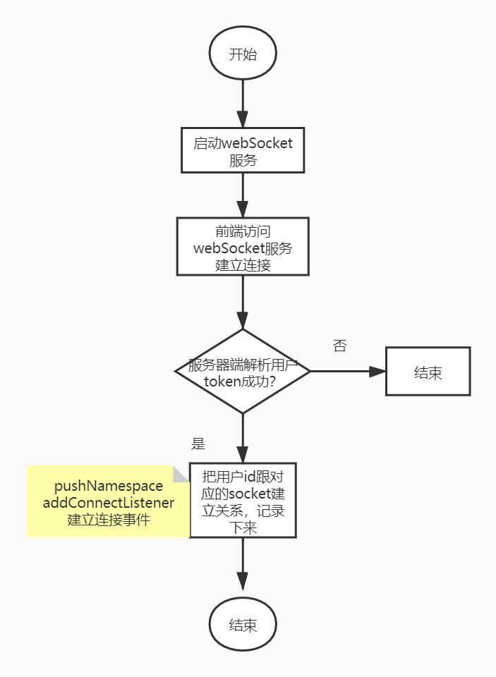
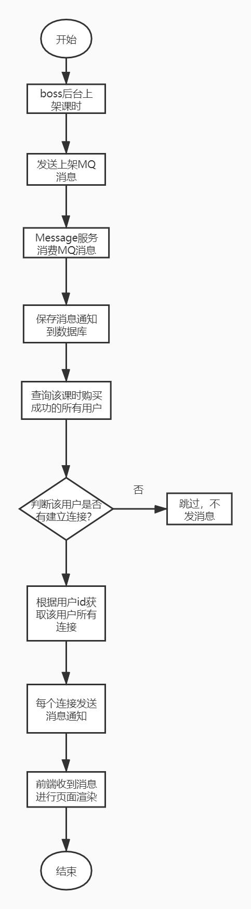
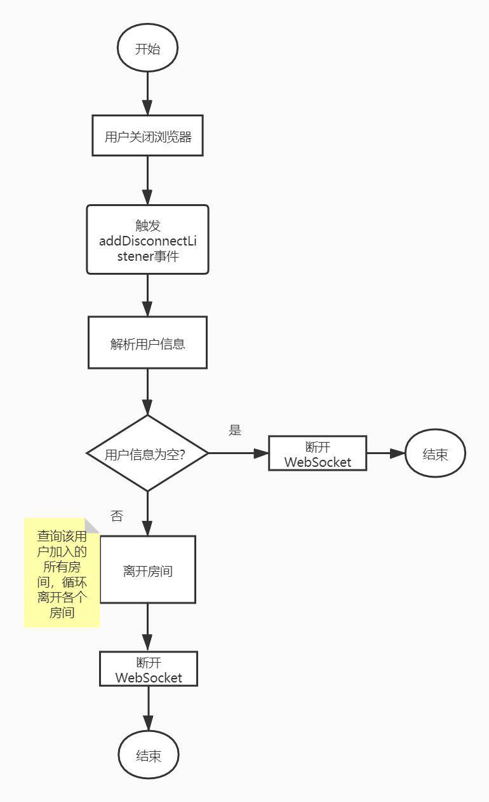

##### 1. 消息推送实现

技术选型：

- netty-socketio 的作用是建立socket 连接

- redisson 的作用是利用redis 在服务器集群时共享socket 连接

##### 2. 实现方案

- 建立webSocket 连接

  注：如果同一个用户开了多个客户端，同时建立多个连接，为了保证可以给多个客户端都能推送消息，对于这种情况会引入Room 的概念，简单理解也就是把同一个用户建立的多个不同连接，放到一个集合中，当需要给该用户推送消息的时候，根据用户ID 获取到集合列表，然后循环发送，从而保证可以给多个客户端分别推送消息。

  

- 推送消息

  

- 断开连接

  当用户关闭浏览器的时候，服务器端会监听到该操作，必须把该连接从对应的Room 中移除掉，并且断开连接。防止连接跟缓存占用太多，导致服务器出问题。

  

