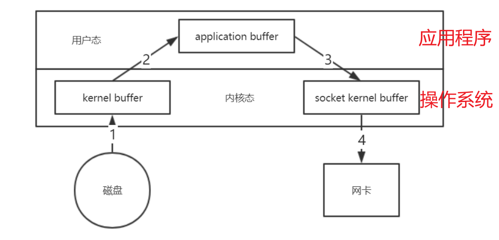
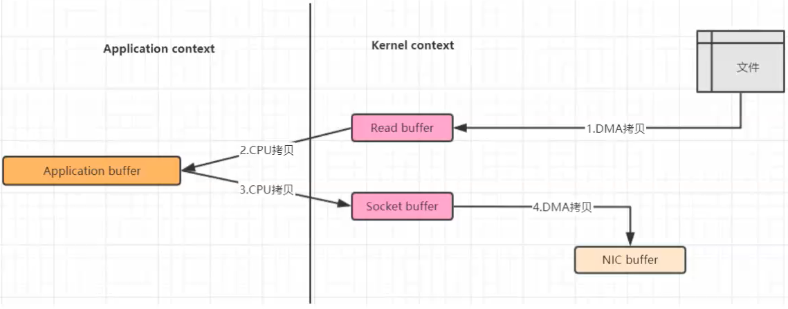
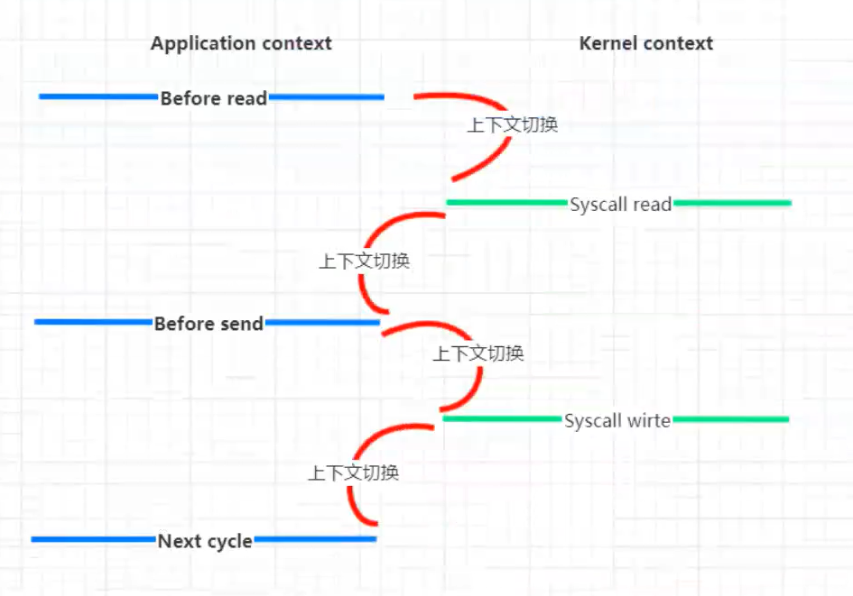
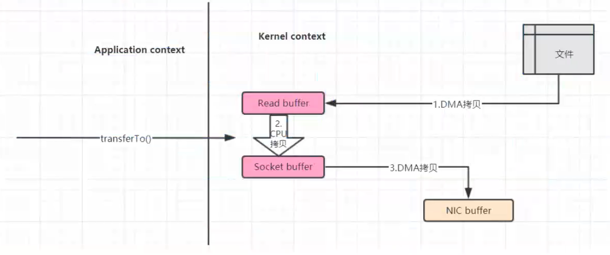
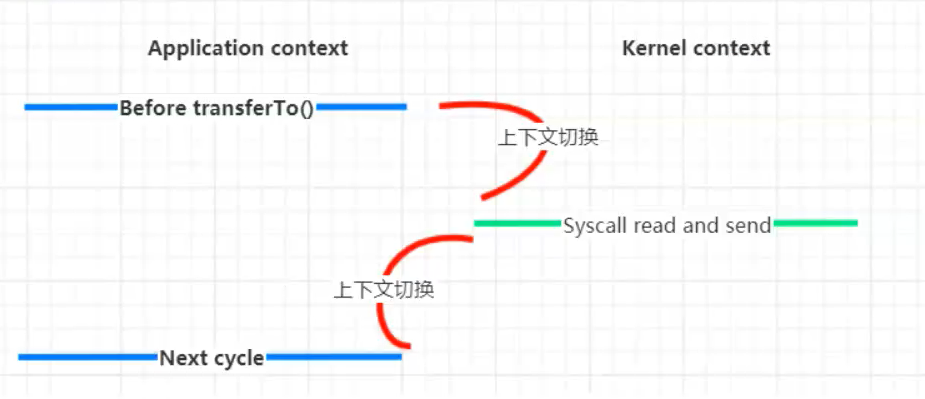

[toc]

## 一、零拷贝技术

#### 1. 传统IO拷贝





- 数据需要从**磁盘**拷贝到**内核空间**（DMA拷贝），再从内核空间拷到**用户空间**（JVM）（CPU拷贝）。
- 程序可能进行数据修改等操作
- 再将数据拷贝到**内核空间**（CPU拷贝），内核空间再拷贝到**网卡内存**（DMA拷贝），通过网络发送出去（或拷贝到**磁盘**）。

当然磁盘到内核空间属于DMA拷贝（DMA即直接内存存取，原理是外部设备不通过CPU而直接与系统内存交换数据）。而内核空间到用户空间则需要CPU的参与进行拷贝，既然需要CPU参与，也就涉及到了内核态和用户态的相互切换，如下图：



- 4次上下文切换

- 将数据拷贝次数4次（其中只有2次涉及了CPU，另外2次是DMA直接存取）。

#### 1. NIO的零拷贝

NIO的零拷贝由transferTo方法实现。transferTo方法将数据从FileChannel对象传送到可写的字节通道（如Socket Channel等）。在transferTo方法内部实现中，由native方法transferTo0来实现，它依赖底层操作系统的支持。在UNIX和Linux系统中，调用这个方法会引起sendfile()系统调用，实现了数据直接从内核的读缓冲区传输到套接字缓冲区，避免了用户态与内核态之间的数据拷贝。




   **使用NIO零拷贝，流程简化为两步：**

      1. transferTo方法调用触发DMA引擎将文件上下文信息拷贝到内核读缓冲区，接着内核将数据从内核缓冲区拷贝到与套接字相关联的缓冲区。
      2. DMA引擎将数据从内核套接字缓冲区传输到协议引擎（第三次数据拷贝）。

   内核态与用户态切换如下图：



   **相比传统IO，使用NIO零拷贝后改进的地方：**

      1. 我们已经将上下文切换次数从4次减少到了2次；
      2. 将数据拷贝次数从4次减少到了3次（其中只有1次涉及了CPU，另外2次是DMA直接存取）。

## 二、代码实现

#### 传统IO

Client

```java
import java.io.FileInputStream;
import java.io.IOException;
import java.net.Inet4Address;
import java.net.InetSocketAddress;
import java.net.Socket;

public class BIOFileClientDemo {
    public static void main(String[] args) {
        try {
            // 1. 客户端连接服务器
            Socket socket = new Socket();
            InetSocketAddress inetSocketAddress = new InetSocketAddress(Inet4Address.getLocalHost(), 8888);
            socket.connect(inetSocketAddress);
            System.out.println("客户端连接服务器成功, 开始传输文件 ...");
            long startTime = System.currentTimeMillis();

            // 2. 从文件中读取数据数据并传给服务器
            InputStream inputStream = new FileInputStream("D:\\wanfeng\\Learning\\test.pdf");
        	int resourceSize = inputStream.available();
            
            long written = 0 ;// 已经读取的内容长度
            int byteSize = 1024; // 计划每次缓冲的长度
            byte[] bytes = new byte[byteSize];

            // 读取内容输出
            while(written < resourceSize) {
                if(written  + byteSize > resourceSize) {  // 说明剩余未读取大小不足一个1024长度，那就按真实长度处理
                    byteSize = (int) (resourceSize - written);  // 剩余的文件内容长度
                    bytes = new byte[byteSize];
                }

                inputStream.read(bytes);
                socket.getOutputStream.write(bytes);

                outputStream.flush();
                written+=byteSize;
            }
            System.out.println("文件传输完毕, 用时 : " + (System.currentTimeMillis() - startTime) + " ms");

            //3. 关闭连接
            socket.close();
            fileInputStream.close();
        } catch (IOException e) {
            e.printStackTrace();
        }
    }
}
```

Server

```java
import java.io.FileOutputStream;
import java.io.IOException;
import java.io.InputStream;
import java.net.ServerSocket;
import java.net.Socket;

public class BIOFileServerDemo {
    public static void main(String[] args) {
        try {
            // 1. 创建服务器套接字, 并等待客户端连接
            ServerSocket serverSocket = new ServerSocket(8888);
            System.out.println("服务器启动,监听 8888 端口");
            //阻塞, 等待客户端连接请求 ( 此处是第一个阻塞点 )
            Socket socket = serverSocket.accept();
            long startTime = System.currentTimeMillis();
            System.out.println("客户端连接成功");

            // 2. 接收客户端传输的数据, 并写出到文件中
            InputStream inputStream = socket.getInputStream();
            int count = 0;
            while(count == 0) {
                count = inputStream.available();
            }
            int resourceSize = inputStream.available();
            
            // 设置输出流
            OutputStream outputStream = new FileOutputStream("D:\\wanfeng\\Learning\\test222.pdf");
            
            
            long written = 0 ;// 已经读取的内容长度
            int byteSize = 1024; // 计划每次缓冲的长度
            byte[] bytes = new byte[byteSize];
            // 读取内容输出
            while(written < resourceSize) {
                if(written  + byteSize > resourceSize) {  // 说明剩余未读取大小不足一个1024长度，那就按真实长度处理
                    byteSize = (int) (resourceSize - written);  // 剩余的文件内容长度
                    bytes = new byte[byteSize];
                }

                inputStream.read(bytes);
                outputStream.write(bytes);

                outputStream.flush();
                written+=byteSize;
            }

            System.out.println("文件传输完毕, 用时 : " + (System.currentTimeMillis() - startTime) + " ms");

            // 3. 关闭流
            socket.close();
            inputStream.close();
            fileOutputStream.close();
        } catch (IOException e) {
            e.printStackTrace();
        }
    }
}
```

#### NIO

Client

```java
import java.io.FileInputStream;
import java.io.IOException;
import java.net.InetSocketAddress;
import java.nio.channels.FileChannel;
import java.nio.channels.SocketChannel;

public class NIOFileClientDemo {
    public static void main(String[] args) {
        try {
            // 1. 创建并配置 服务器套接字通道 ServerSocketChannel
            SocketChannel socketChannel = SocketChannel.open();
            socketChannel.connect(new InetSocketAddress("127.0.0.1", 8888));
            //socketChannel.configureBlocking(false);

            // 2. 从文件输入流中获取文件通道 ( FileChannel )
            FileChannel fileChannel = new FileInputStream("D:\\wanfeng\\Learning\\test.pdf").getChannel();
            long startTime = System.currentTimeMillis();

            // 3. 零拷贝传输数据, 注意记录每次拷贝的起始位置
            long transferLen;
            long totalCount = 0;
            // 使用零拷贝将文件数据传到服务器, 循环终止条件是传输结果小于等于 0
            while ((transferLen = fileChannel.transferTo(totalCount, 1024 * 1024 * 32, socketChannel)) > 0) {
                totalCount += transferLen;
            }

            System.out.println("文件传输完毕, 用时 : " + (System.currentTimeMillis() - startTime) + " ms");

            // 4. 关闭连接
            socketChannel.close();
            fileChannel.close();
        } catch (IOException e) {
            e.printStackTrace();
        }
    }
}
```

Server

```java
import java.io.FileOutputStream;
import java.io.IOException;
import java.net.InetSocketAddress;
import java.nio.channels.FileChannel;
import java.nio.channels.ServerSocketChannel;
import java.nio.channels.SocketChannel;

public class NIOFileServerDemo {
    public static void main(String[] args) {
        try {
            // 1. 创建并配置 服务器套接字通道 ServerSocketChannel
            ServerSocketChannel serverSocketChannel = ServerSocketChannel.open();
            serverSocketChannel.socket().bind(new InetSocketAddress(8888));
            // 注意这里使用阻塞模式, 不调用该代码
            //serverSocketChannel.configureBlocking(false);
            // 2. 获取文件通道
            FileChannel fileChannel = new FileOutputStream("D:\\wanfeng\\Learning\\test222.pdf").getChannel();

            // 3. 阻塞等待
            SocketChannel socketChannel = serverSocketChannel.accept();
            long startTime = System.currentTimeMillis();
            System.out.println("客户端连接成功");
            // 4. 零拷贝核心操作
            fileChannel.transferFrom(socketChannel, 0, 1024 * 1024 * 32);
            System.out.println("文件传输完毕, 用时 : " + (System.currentTimeMillis() - startTime) + " ms");

            // 5. 释放资源
            socketChannel.close();
            fileChannel.close();
        } catch (IOException e) {
            e.printStackTrace();
        }
    }
}
```

