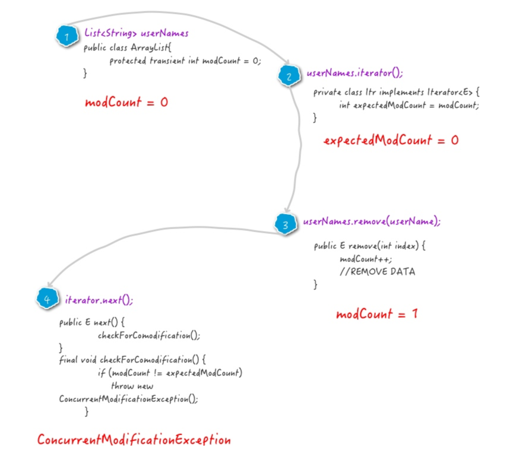

[转自Hollis-Java工程师成神之路](http://hollischuang.gitee.io/tobetopjavaer/#/basics/java-basic/fail-fast-vs-fail-safe?id=%e5%bc%82%e5%b8%b8%e5%8e%9f%e7%90%86)

### fail-fast

我们通常说的Java中的fail-fast机制，默认指的是Java集合的一种错误检测机制。当多个线程对部分集合进行结构上的改变的操作时，有可能会产生fail-fast机制，这个时候就会抛出ConcurrentModificationException

CMException，当方法检测到对象的并发修改，但不允许这种修改时就抛出该异常。

很多时候正是因为代码中抛出了CMException，很多程序员就会很困惑，明明自己的代码并没有在多线程环境中执行，为什么会抛出这种并发有关的异常呢？这种情况在什么情况下才会抛出呢？我们就来深入分析一下。

**以下代码会出现什么异常？**

```java
List<String> userNames = new ArrayList<String>() {{
    add("Hollis");
    add("hollis");
    add("HollisChuang");
    add("H");
}};

for (String userName : userNames) {
    if (userName.equals("Hollis")) {
        userNames.remove(userName);
    }
}

System.out.println(userNames);
```

```java
Exception in thread "main" java.util.ConcurrentModificationException
at java.util.ArrayList$Itr.checkForComodification(ArrayList.java:909)
at java.util.ArrayList$Itr.next(ArrayList.java:859)
at com.hollis.ForEach.main(ForEach.java:22)
```


使用[jad](https://www.hollischuang.com/archives/58)工具，对编译后的class进行反编译，得到以下代码：

foreach其实是依赖了while循环和Iterator实现的。

```java
public static void main(String[] args) {
    // 使用ImmutableList初始化一个List
    List<String> userNames = new ArrayList<String>() {{
        add("Hollis");
        add("hollis");
        add("HollisChuang");
        add("H");
    }};

    Iterator iterator = userNames.iterator();
    do
    {
        if(!iterator.hasNext())
            break;
        String userName = (String)iterator.next();
        if(userName.equals("Hollis"))
            userNames.remove(userName);
    } while(true);
    System.out.println(userNames);
}
```

**异常原理**

通过以上代码的异常堆栈，我们可以跟踪到真正抛出异常的代码是：

```java
java.util.ArrayList$Itr.checkForComodification(ArrayList.java:909)复制ErrorOK!
```

该方法是在iterator.next()方法中调用的。我们看下该方法的实现：

```java
final void checkForComodification() {
    if (modCount != expectedModCount)
        throw new ConcurrentModificationException();
}
```

如上，在该方法中对modCount和expectedModCount进行了比较，如果二者不相等，则抛出CMException。简单流程如下：



简单总结一下，之所以会抛出CMException异常，是因为我们的代码中使用了增强for循环，而在增强for循环中，集合遍历是通过iterator进行的，但是元素的add/remove却是直接使用的集合类自己的方法。这就导致iterator在遍历的时候，会发现有一个元素在自己不知不觉的情况下就被删除/添加了，就会抛出一个异常，用来提示用户，可能发生了并发修改！

所以，在使用Java的集合类的时候，如果发生CMException，优先考虑fail-fast有关的情况，实际上这里并没有真的发生并发，只是Iterator使用了fail-fast的保护机制，只要他发现有某一次修改是未经过自己进行的，那么就会抛出异常。

关于如何解决这种问题，我们在《为什么阿里巴巴禁止在 foreach 循环里进行元素的 remove/add 操作》中介绍过，这里不再赘述了。

### fail-safe

为了避免触发fail-fast机制，导致异常，我们可以使用Java中提供的一些采用了fail-safe机制的集合类。

这样的集合容器在遍历时不是直接在集合内容上访问的，而是先复制原有集合内容，在拷贝的集合上进行遍历。

java.util.concurrent包下的容器都是fail-safe的，可以在多线程下并发使用，并发修改。同时也可以在foreach中进行add/remove 。

我们拿CopyOnWriteArrayList这个fail-safe的集合类来简单分析一下。

```java
public static void main(String[] args) {
    List<String> userNames = new CopyOnWriteArrayList<String>() {{
        add("Hollis");
        add("hollis");
        add("HollisChuang");
        add("H");
    }};

    userNames.iterator();

    for (String userName : userNames) {
        if (userName.equals("Hollis")) {
            userNames.remove(userName);
        }
    }

    System.out.println(userNames);
}
```

以上代码，使用CopyOnWriteArrayList代替了ArrayList，就不会发生异常。

fail-safe集合的所有对集合的修改都是先拷贝一份副本，然后在副本集合上进行的，并不是直接对原集合进行修改。并且这些修改方法，如add/remove都是通过加锁来控制并发的。

所以，CopyOnWriteArrayList中的迭代器在迭代的过程中不需要做fail-fast的并发检测。（因为fail-fast的主要目的就是识别并发，然后通过异常的方式通知用户）

但是，虽然基于拷贝内容的优点是避免了ConcurrentModificationException，但同样地，迭代器并不能访问到修改后的内容。如以下代码：

```java
public static void main(String[] args) {
    List<String> userNames = new CopyOnWriteArrayList<String>() {{
        add("Hollis");
        add("hollis");
        add("HollisChuang");
        add("H");
    }};

    Iterator it = userNames.iterator();

    for (String userName : userNames) {
        if (userName.equals("Hollis")) {
            userNames.remove(userName);
        }
    }

    System.out.println(userNames);

    while(it.hasNext()){
        System.out.println(it.next());
    }
}
```

我们得到CopyOnWriteArrayList的Iterator之后，通过for循环直接删除原数组中的值，最后在结尾处输出Iterator，结果发现内容如下：

```java
[hollis, HollisChuang, H]
Hollis
hollis
HollisChuang
H
```

迭代器遍历的是开始遍历那一刻拿到的集合拷贝，在遍历期间原集合发生的修改迭代器是不知道的。

**Copy-On-Write**

在了解了CopyOnWriteArrayList之后，不知道大家会不会有这样的疑问：他的add/remove等方法都已经加锁了，还要copy一份再修改干嘛？多此一举？同样是线程安全的集合，这玩意和Vector有啥区别呢？

Copy-On-Write简称COW，是一种用于程序设计中的优化策略。其基本思路是，从一开始大家都在共享同一个内容，当某个人想要修改这个内容的时候，才会真正把内容Copy出去形成一个新的内容然后再改，这是一种延时懒惰策略。

CopyOnWrite容器即写时复制的容器。通俗的理解是当我们往一个容器添加元素的时候，不直接往当前容器添加，而是先将当前容器进行Copy，复制出一个新的容器，然后新的容器里添加元素，添加完元素之后，再将原容器的引用指向新的容器。

CopyOnWriteArrayList中add/remove等写方法是需要加锁的，目的是为了避免Copy出N个副本出来，导致并发写。

但是，CopyOnWriteArrayList中的读方法是没有加锁的。

```java
public E get(int index) {
    return get(getArray(), index);
}
```

这样做的好处是我们可以对CopyOnWrite容器进行并发的读，当然，这里读到的数据可能不是最新的。因为写时复制的思想是通过延时更新的策略来实现数据的最终一致性的，并非强一致性。

**所以CopyOnWrite容器是一种读写分离的思想，读和写不同的容器。**而Vector在读写的时候使用同一个容器，读写互斥，同时只能做一件事儿。