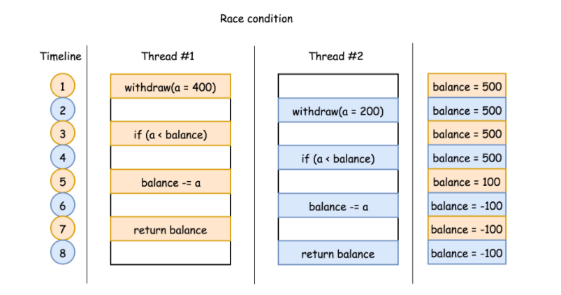

[toc]

## 一、线程安全

定义：保证多线程环境下共享的、可修改的状态（数据）的正确性

前提：多线程环境，共享的、可修改的数据的正确性

#### 并发问题

**注意：**即程序在==多线程（或多进程）环境下同时 执行==，同时进行并不是完全指进程或线程在不同的物理 CPU 上独立运行，更多情况下，是==在一个物理 CPU 上交替执行多个线程或进程==。并发既可在线程中，也可在进程中。

假设有一个方法 `deductInventory(num)`，如果订单商品数量小于当前库存，则从当前库存中减去订单商品数量，然后返回剩余库存。方法定义如下

```java
// 库存
int Inventory = 500;
// 扣减商品数量
int withdraw(int num) {
  if (num < Inventory) {
    Inventory -= num;
  }
  return Inventory;
}
```

有可能出现竞争情况，使得余额变为负数。假设两个线程同时使用不同的参数执行该方法。例如：线程 1 执行 `withdraw(num=400)`，线程 2 执行 `withdraw(num=200)`。这两个线程的执行顺序如下图所示。在每个时刻只执行一条语句。



上述流程执行结束后，余额变成负数，这并不是期望的输出。


#### 解决线程安全问题（将线程安全问题变为不存在线程安全的问题）

- **不共享：**封装数据，成为每个线程独有的属性
- **不可变：**不可变的数据，也就不存在线程安全问题


#### 保证线程安全

- **原子性：**程序块的执行不被其他线程影响到，通过==同步机制实现==

- **可见性：**修改了共享变量后，其他线程能立马从主内存中读取最新的数据（线程本地数据直接更新到主内存上），通过==volatile实现可见性==

- **有序性：**保证线程执行程序语句顺序，防止指令重排，通过==volatile实现有序性==


## 二、同步机制

#### 1. Synchronized

java内建的同步机制，**代码实现在JVM的代码中**

##### java 6之前

通过一对monitorenter/monitorexit指令实现同步机制，monitor底层调用的是==操作系统内部的互斥锁来实现==，由于==用户态和内核态的转换==，所以是一个无差别的==重量级锁==

##### java 6之后：	

通过三种不同的monitor指令实现同步机制，也就是说三种不同的锁实现：==偏斜锁(BiasedLocking)、轻量锁、重量锁==。

Synchronized==默认使用偏斜锁实现==，JVM 会利用 CAS 操作（compare and swap），==在对象头上的 Mark Word 部分设置线程 ID==，以表示这个对象==偏向于当前线程==，所以并不涉及真正的互斥锁，从而大大降低了无竞争时的开销，*当出现竞争的情况，撤销（revoke）偏斜锁，并利用CAS 操作 Mark Word 来试图获取锁并升级至轻量锁，失败则升级至重量锁*（==锁膨胀==）

**锁的升/降级：**Synchronized优化锁的机制，JVM检测不同的竞争状况，切换合适的锁实现

**性能分析：**==撤销偏斜锁是一个比较重操作==，只有当存在较多无竞争的 synchronized 块时，才能明显改善开销。==若存在大量竞争的 synchronized 块，则应该通过JVM关闭偏斜锁==。偏斜锁还会==延缓 JIT 预热的进程==，所以很多性能测试中会显式地==关闭偏斜锁== ：**`-XX:-UseBiasedLocking`**


#### 2. ReentrantLock（再入锁）

定义：当一个线程试图获取一个它已经获取的锁时，这个获取动作就自动成功，这是对锁获取粒度的一个概念

##### java 5才出现

通过对象实现锁的操作，并提供了很多Synchronized无法实现的细节

- **公平性fairness：**减少线程饥饿的现象 **`ReentrantLock fairLock = new ReentrantLock(true);`**

- **条件变量Condition：**设置独立的队列，提供针对性的阻塞和唤醒的功能await/signal ，对应wait/notify

  **`Condition notEmpty = lock.newCondition();`**

- 带超时的获取锁


#### 3. ReadWriteLock（读写锁）

ReentrantReadWriteLock 是Java标准类库提供的再入锁版本实现的读写锁，对应行为的语义与ReentrantLock相似。

读操作之间不需要互斥，可以并发执行。而写操作则会影响一致性，所以需要互斥逻辑

```java
public class RWSample {
    private final Map<String, String> m = new TreeMap<>();
	private final ReentrantReadWriteLock rwl = new ReentrantReadWriteLock();
	private final Lock r = rwl.readLock();
	private final Lock w = rwl.writeLock();
    
	public String get(String key) {
    	r.lock();
    	System.out.println(" 读锁锁定！");
    	try {
        	return m.get(key);
    	} finally {
        	r.unlock();
    	}
	}
 
	public String put(String key, String entry) {
    	w.lock();
		System.out.println(" 写锁锁定！");
        try {
            return m.put(key, entry);
        } finally {
            w.unlock();
        }
    }
	// …
}
```

==如果读锁试图锁定时==，==写锁==是被某个线程==持有==，读锁将无法获得，而只好==等待对方操作结束==，这样就可以自动保证不会读取到有争议的数据。

==读写锁==看起来比 synchronized 的粒度似乎细一些，但在实际应用中，其==表现也并不尽如人意==，主要还是因为==相对比较大的开销==。


#### 4. StampedLock 

优化了读模式，基于大多数情况下读操作并不会和写操作冲突，其逻辑是==先试着读==，然后通过 validate 方法==确认是否进入了写模式==，如果没有进入，就成功避免了开销；如果==进入==，==则尝试获取读锁==

```java
public class StampedSample {
	private final StampedLock sl = new StampedLock();
 
	void mutate() {
    	long stamp = sl.writeLock();
    	try {
        	write();//伪代码
    	} finally {
        	sl.unlockWrite(stamp);
    	}
	}
 
	Data access() {
    	long stamp = sl.tryOptimisticRead();
    	Data data = read();//伪代码
    	if (!sl.validate(stamp)) {
        	stamp = sl.readLock();
        	try {
            	data = read();//伪代码
        	} finally {
            	sl.unlockRead(stamp);
        	}
    	}
    	return data;
	}
	// …
}
```


#### 3. 性能对比

- 无竞争或者低竞争时，java 6之后的Sychronized更优

- 高竞争时，ReentranLock更优
