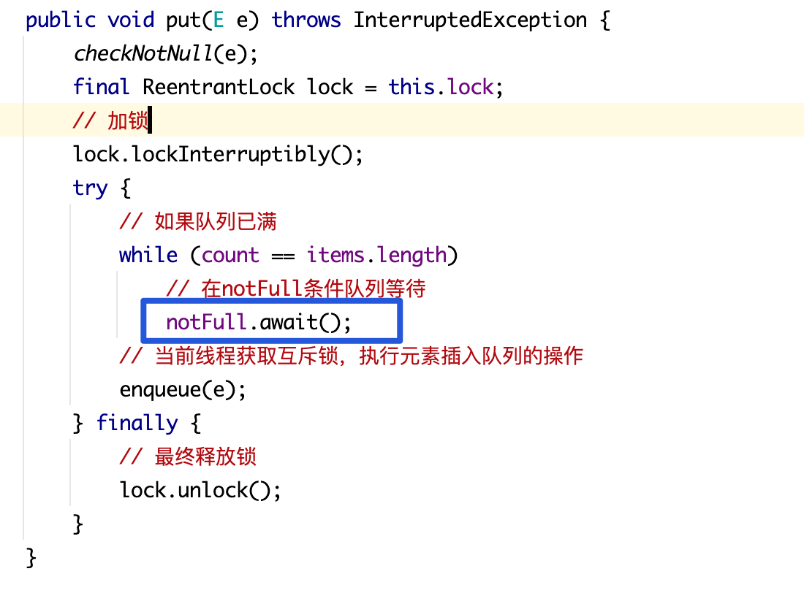
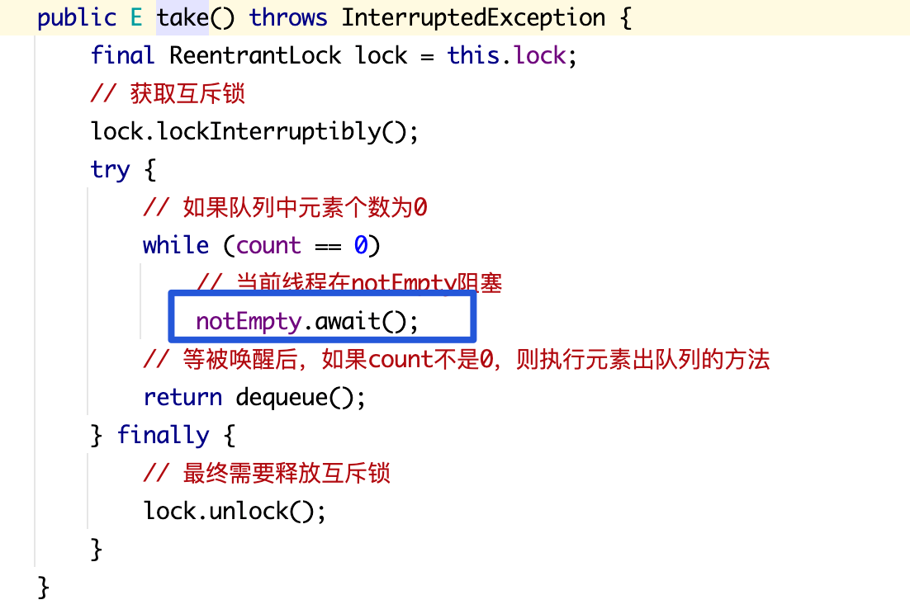
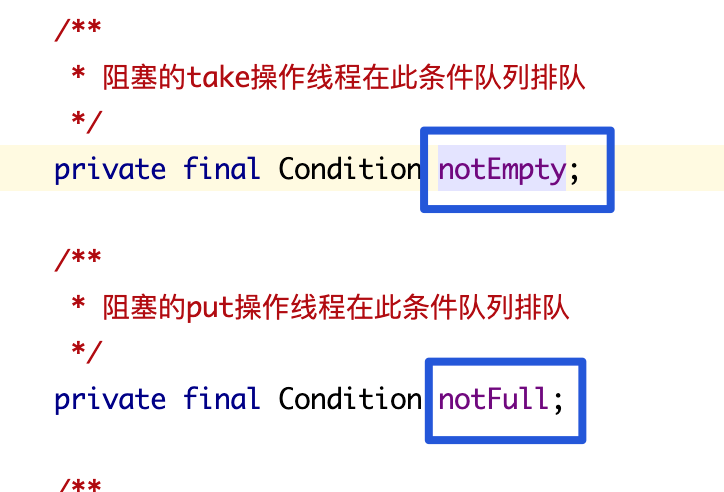
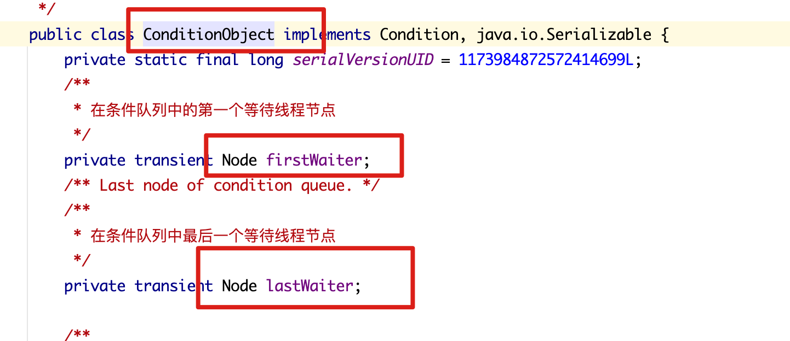

### ABQ中的读流程和写流程？如何避免线程唤醒的”惊群“现象？

BLQ是通过一把锁两个条件来协调读写线程的，但是读线程，写线程是通过条件等待相互唤醒的，不能写线程唤醒读线程的同时把写线程也唤醒了

**这里用的是ReentrantLock来加锁的，这个notFull和notEmpty是怎么实现的？**

**底层是AQS，即条件等待是通过AQS实现的，这是AQS的内部类实现，用的是单向链表。**

**当调用Condition.await的时候，将当前线程封装到Node中，放到单向链表中**

**这个单向链表是条件队列，条件队列中排队的线程节点状态是Condition（waitStatus）。当通过signal唤醒的时候，就将条件队列中的一个头部节点转义到同步队列中（CLH）**

**这样，针对不同的条件唤醒，就将那个条件队列中的头结点转移到同步队列中，排队等待**

**那么我们是不是就可以创建多个Condition条件（一个Condition表示一个条件队列），分组排队，分别唤醒，按照不同的条件将不同条件队列中的线程放到CLH，然后让它执行了呢？**

**换到ArrayBlockingQueue中，是否可以将读线程和写线程放到不同的条件队列中排队等待了呢**

**CLH队列是一个双向链表，进到CLH的节点线程也不是就开始执行了，还要抢锁才可以运行，但是能进到这里来的，搭配条件等待队列，实际上抢锁的可能性还是很大的。**

**但是对于读写锁，就有线程并发了，比如读线程就可以并发，写线程不能并发。读写锁中，写锁是互斥锁，读锁是共享锁。**

**单个jvm实例是不是只维护一个同步队列？不是的，看你new多少个ReentrantLock了**