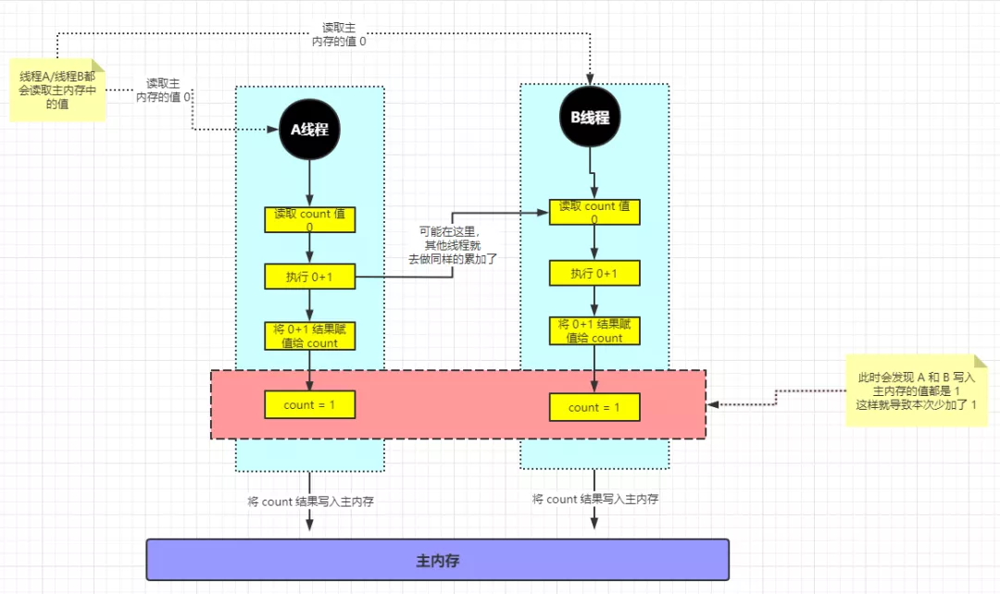
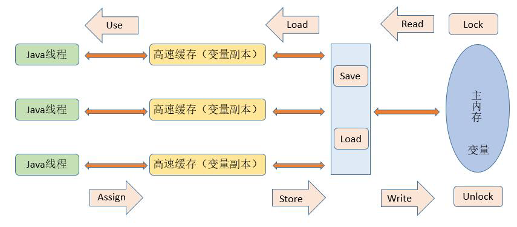
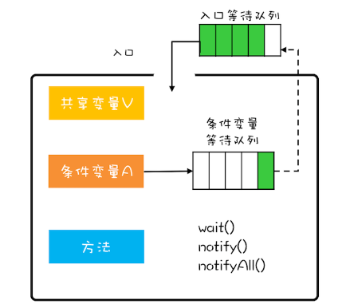

[toc]

## 一、线程基础

### 1. 线程简介

从操作系统的角度，可以简单认为，**线程是系统调度的最小单元**，一个进程可以包含多个线程，线程直接读取的数据位于寄存器中，但是会和进程内其他线程共享文件描述符、虚拟地址空间等。


Thread.States类中定义线程的状态，即线程的生命周期


- **NEW**：线程被创建出来还没真正启动的状态，可以认为它是个 Java 内部状态

- **RUNNABLE（就绪）**：线程已经在 JVM 中执行，当然由于执行需要计算资源，它可能是正在运行，也可能还在等待系统分配给它 CPU 片段，在就绪队列里面排队

- **BLOCKED（阻塞） **：线程在等待 Monitor lock，即尝试获取锁，但由于锁被其他线程独占而处于阻塞状态

- **WAITING（等待）**：正在等待另一个线程的动作，如调用了 `wait()` 、`join()`

- **TIME_WAITING（计时等待）**：正在等待另一个线程的操作，但是有时间限制，如调用了 `wait(long)` 、`sleep(long)` 、`joing(long) `

- **TERMINATED（终止）**：不管是意外退出还是正常执行结束，线程已经完成使命，终止运行，也有人把这个状态叫作死亡


### 2. 优雅关闭线程

使用场景：比如使用多线程循环抢票，一个线程抢到票则其他线程退出循环


#### 2.1 守护线程（后台线程）

不适合于Web应用，因为Web应用大多使用线程池，线程大多是复用的，所以不适合用守护线程。

例子：比如SpringBoot使用守护线程挂起Web容器、JVM垃圾回收器使用守护线程、Redisson的watch dog

```java
public class Main {
    public static void main(String[] args) {
        MyDaemonThread myDaemonThread = new MyDaemonThread();
        // 设置为daemon线程
        myDaemonThread.setDaemon(true);
        myDaemonThread.start();
        // 启动非daemon线程，当非daemon线程结束，不管daemon线程是否结束，都结束JVM进程。
        new MyThread().start();
    }
}
// 守护线程
public class MyDaemonThread extends Thread {
    @Override
    public void run() {
        while (true) {
            System.out.println(Thread.currentThread().getName());
            try {
                Thread.sleep(500);
            } catch (InterruptedException e) {
                e.printStackTrace();
            }
        }
    }
}
//非守护线程
public class MyThread extends Thread {
    @Override
    public void run() {
        for (int i = 0; i < 10; i++) {
            System.out.println("非Daemon线程");
            try {
                Thread.sleep(500);
            } catch (InterruptedException e) {
                e.printStackTrace();
            }
        }
    }
}
```

#### 2.2 线程中断标志

使用**线程通信机制**，来保证循环线程跳出循环。阻塞状态的方法sleep、wait、join会因为中断而抛异常，需要妥善处理。

**注意：**有人会想到设置一个关闭标志位，当被设置位false时退出循环。但是如果在循环内有阻塞方法，那么就无法退出了。

- **interrupt()：**给目前线程打上中断标记
- interrupted()：判断目标线程是否被中断，并清除中断标记。
- **isinterrupted()：**判断目标线程是否被中断，不会清除中断标记。

```java
public class InterruptReadDemo {
    private static class IoWorking extends Thread {
        @Override
        public void run() {
            while (!Thread.currentThread().isInterrupted()) {
                // ioworking
                try {
                    System.out.println(System.in.read());
                } catch (IOException e) {
                    e.printStackTrace();
                }
            }
            System.out.println("exit");
        }
        public void cancel() {
            try {
                System.in.close();
            } catch (IOException e) {
            }
            interrupt();
        }
    }
    public static void main(String[] args) throws InterruptedException {
        IoWorking ioWorking = new IoWorking();
        ioWorking.start();
        Thread.sleep(100);
        ioWorking.cancel();
    }
}
```

#### 2.3 JUC中的关闭方法

比如：

- Future接口定义的cancel 取消任务
- ExecutorService接口定义的 shutdown 方法


## 二、多线程基础

**线程：**CPU任务调度的最小单位，获得CPU派发的时间片，则开始执行任务。当时间分片被派发给别的线程时，通过程序计数器（PC）来记录执行的字节码行号。

**注意：**程序在**多线程（或多进程）环境下同时 执行**，同时进行并不是完全指进程或线程在不同的物理 CPU 上独立运行，更多情况下，**是在一个物理 CPU 上交替执行多个线程或进程**。并发既可在线程中，也可在进程中。

**CPU密集型任务：**需要大量CPU算力的任务，本身耗时短，所以不适合创建大量线程（大量线程上下文切换耗时，得不偿失）

**IO密集型任务：**需要大量磁盘IO的任务，本身阻塞时间长，所以适合创建大量线程执行任务（大量线程上下文切换耗时总比长时间IO阻塞好），比如Tomcat的线程池就是直接将线程创建到设置的最大值。

### 1. 并发编程三大问题

多线程环境下需要保证原子性、可见性、有序性

#### 1.1 原子性

定义：一个或者多个操作**要么全部成功要么全部失败**，并且**不能被其他线程干扰或打断**

如下所示，结果并不是10000，而是9688。


count++ 的执行实际上不是原子性的，在字节码中被拆分为三条指令（这样的步骤不是虚拟的，而是真实情况就是这么执行的）

1. 从主内存中读取 count 的值
2. 计算 +1 的结果
3. 将 +1 的结果赋值给 count变量

如此，便导致线程A还未完成第三步，CPU就切换到线程B执行任务，导致线程B读取到了线程A还未写入的值，最后结果被覆盖




#### 1.2 可见性

定义：一个线程对**共享变量的修改**，**另一个线程需要立即可见**

如下所示，当匿名线程将shutdownRequested改为了true，但是主线程仍然一直dowork阻塞中


CPU写本地缓存速度快、内存写速度中、磁盘写速度慢，导致数据同步延时，引发数据不一致的情况。

所以CPU引入了本地缓存，如果CPU本地缓存不能及时刷到内存，并发时就会导致可见性的问题


#### 1.3 有序性

定义：程序的**执行顺序**按照**代码的先后顺序**执行

重排序在类型如下

- **编译器重排序：**对于**没有先后依赖关系**的语句，**编译器**可以**重新调整语句的执行顺序**。

- **CPU指令重排序：**现代处理器采用了**指令级并行技术**（Instruction-Level Parallelism，ILP）来将多条指令重叠执行，**让没有依赖关系的多条指令并行**，比如：

  指令1把地址A中的值加10，指令2把地址A中的值乘以2，指令3把地址B中的值减去3。此时指令1和指令2由于有依赖所以不能重排（(A+10) * 2 与  A*2+10不相等），但是指令三可以排到指令1和2之间。

- CPU内存重排序：CPU有自己的缓存，指令的执行顺序和写入主内存的顺序不完全一致

##### 重排序引发线程安全问题的经典案例

双重检查锁的单例模式


看似没有问题，但创建对象并不是一个原子操作，而是被拆分成了以下三个步骤：

- 分配对象的内存空间--------->>>初始化对象--------->>>设置instance指向刚分配的内存地址

被重排后，顺序如下：

- 分配对象的内存空间--------->>>设置instance指向刚分配的内存地址--------->>>初始化对象

多线程环境下，可能导致线程B读到了因为重排序而尚未初始化的对象。


### 2. JMM

#### 2.1 背景

在不同的硬件平台和不同的操作系统下，内存的访问逻辑有一定的差异，当你的代码在A操作系统环境下运行良好，并且线程安全，但是换个操作系统就出现各种问题。

为了Java的**移植性**，还需要**屏蔽**不同硬件平台和**不同操作系统访问内存的差异。**


####  2.2 为什么需要JMM？

**JMM（Java Memory Model）**就是Java内存模型，它的**执行引擎**为了**弥补CPU和内存的速度差**，使用**CPU缓存和寄存器**来对数据进行缓存。并且**为了更快的执行效率**，对**编译器和CPU指令并没做重排序的限制**。

`而缓存和指令重排，代表JMM 在多线程环境下必然有可见性、有序性的问题。`

所以，JMM为了保证多线程的安全性，**提供了保证原子性、可见性和有序性的方法**，来“按需禁用”缓存和指令重排。

需不需**保证并发安全，完全由开发者自己决定**，在代码层面的实现为`volatile`、`synchronized`、`final`、`CAS`以及内存访问操作规则（happens-before）


#### 2.3 JMM内存结构

JMM 将内存划分为主内存（Main Memory）和工作内存（Working Memory）

- 主内存（Main Memory）：Java进程内存。**所有的共享变量**都存储**在主内存**中
- 工作内存（Working Memory）：线程的**工作内存是个抽象概念**，实际使用的是**寄存器和高速缓存**。工作内存是每个线程私有的本地内存

就是为了弥补CPU与主内存两者之间的性能差异，从而使用了CPU高速缓存和寄存器作为线程的工作内存。Java线程每次操作数据都从自己的工作内存中进行，先去主内存读取变量的值然后拷贝到工作内存中的变量副本中，使用完后再写入主内存。但是**在多线程环境中，各线程的工作内存互不可见**，会导致线程不安全。

但是，JMM**为了保证多线程的安全性**，**提供了一套内存访问操作规范（happens-before）来保证原子性、可见性和有序性**。需不需**保证并发安全，完全由开发者自己决定**，在代码层面的实现为volatile、synchronized、CAS等。


#### 2.4 JMM内存交互操作

JMM内存交互一共有 8种 原子性操作，基本数据类型（除了dable和long）这 8 个操作都原子性（原子性意为不可再分的），但是**对于double和long**来说，load、store、read和write操作可能是非原子性的（操作系统的区别）



| 操作指令         | 作用域                 | 说明                                                         |
| ---------------- | ---------------------- | ------------------------------------------------------------ |
| lock （锁定）    | 作用于主内存的变量     | 把一个变量标识为线程独占状态，基于CPU的lock指令              |
| unlock （解锁）  | 作用于主内存的变量     | 把一个处于锁定状态的变量释放出来，释放后的变量才可以被其他线程锁定。 |
| read （读取）    | 作用于主内存变量       | 把一个**变量的值**从主内存**传输到线程的工作内存**中，以便随后的load动作使用。 |
| load （载入）    | 作用于工作内存的变量   | 把**read操作的值放入到工作内存的变量副本**中。               |
| use （使用）     | 作用于工作内存中的变量 | 把工作内存中的变量**传输给执行引擎**，每当虚拟机遇到一个需要使用到变量值，就会使用到这个指令。 |
| assign （赋值）  | 作用于工作内存中的变量 | 把一个**从执行引擎中接受到的值放入工作内存的变量副本**中。   |
| store （存储）   | 作用于主内存中的变量   | 把工作内存中一个**变量的值传输到主内存**，以便后续的write使用。 |
| write 　（写入） | 作用于主内存中的变量   | 把store操作**从工作内存得到的变量值放入主内存的变量中**。    |


#### 2.5 JMM内存操作规则

##### 8个交互操作的规则

1. 一个变量同一时间**只有一个线程能对其进行lock**。多次lock后，必须**执行相同次数的unlock才能解锁**。==（互斥、重入锁理论）==
2. 如果一个变量没有被lock，就不能对其进行unlock操作。也不能unlock一个被其他线程锁住的变量。
3. 对一个变量进行unlock操作之前，必须把此变量同步回主内存。==（锁的可见性实现）==
4. 如果对一个**变量进行lock操作**，会**清空所有工作内存中此变量的值**，在执行引擎使用这个变量前，**必须重新load或assign**操作初始化变量的值。==（volatile的可见性实现）==
5. **read和load不能分开**、**store和write不能分开**。
6. **assign操作后的变量数据，必须写入主内存。**
7. **没有assgin操纵的变量数据，不能写入主内存**
8. 一个新的变量必须在主内存中诞生，不允许工作内存直接使用一个未被初始化的变量。就是对变量实施use、store操作之前，必须经过assign和load操作。

##### happens-before原则（先行发生原则）

- **程序顺序规则：**一个线程内，按照代码顺序执行
- **volatile变量规则：**对一个被 **volatile** 修饰的变量**写操作** **先行于** 对该变量的**读操作**

- **传递规则：**如果操作1先行于操作2，操作2先行于操作3，那么操作1肯定先行于操作3


> “x=42” Happens-Before 写变量 “v=true” ，这是程序顺序规则的内容；
>
> 写变量“v=true” Happens-Before 读变量 “v=true”，这是volatile变量规则的内容 。
>
> 再根据这个传递性规则，我们得到结果：“x=42” Happens-Before 读变量“v=true”

- **锁定规则：**一个锁的 **unlock**操作 **先行于** **该锁的Lock**操作（锁后只有unlock后才能Lock），该规则就是管程的规则
- **对象终结规则：**一个对象**构造** **先行于** 它的 **finalize**
- 线程相关规则
  - 线程启动规则：Thread对象的 **start()**方法 **先行于** 此线程的**其他动作**
  - 线程中断规则：线程**interrupt()**方法 **先行于** 对该**中断异常的捕获**
  - 线程终结原则：线程的**终止检测**（Thread.join()、Thread.isAlive()） **后行于** 线程中的**其他所有操作**


### 3. 线程安全

定义：**多线程环境下**，保证**共享的、可修改的状态（数据）的正确性**

- 原子性

  使用**synchronized**关键字、**AQS同步锁**（ReentratLock）、具有**原子性的类**（底层由CAS实现）

  ```java
  x = 10; 		//语句1 原子操作
  y = x; 			//语句2 非原子操作
  x++; 			//语句3 非原子操作
  x = x + 1; 		//语句4 非原子操作
  ```

- 可见性

  - **synchronized**关键字：通过happens-before原则规定的必须工作内存的值**write写入到主内存的变量后，才能unlock锁**。
  - **Lock**：同上。
  - final：无法被修改，也就保证了可见性
  - **volatile**关键字：volatile变量的修改对其他处理器立即可见。

- 有序性

  - **synchronized**关键字：保证只有单线程执行指令，所以不存在多线程指令乱序的情况。

  - **Lock**：同上。

  - **volatile**关键字：voloatile变量指令底层使用lock，属于一种内存屏障。

  - final关键字：在 1.5 以后 Java 内存模型对 final 类型变量的重排进行了约束。（前提是提供正确构造函数没有“逸出”）

    ```java
    final int x;
    // 错误的构造函数
    public FinalFieldExample() { 
      x = 3;
      y = 4;
      // 此处就是讲 this 逸出
      // global.obj是全局变量，线程通过 global.obj 读取 x 是有可能读到 0 的
      global.obj = this;
    }
    ```


### 4. 并发问题及如何保证安全性

##### 并发问题概述

并发在计算机领域里，指的是多个事件在一个时间间隔内发生。例如**多个线程并发的访问共享变量**，并对其**进行修改**，导致不可预估的结果。具体可能出现的问题，再复习[并发编程三大问题](#1. 并发编程三大问题)。

##### 如何保证并发安全

在操作系统中的处理方案是，通过[进程同步或线程同步](../../../操作系统/进程管理)以互斥的方式访问临界资源。[Java中保证多线程安全的同步机制如上所述](#3. 线程安全)

当然除了同步机制外，`解决并发问题`，并且能`提高程序并发性能`的方案还有：[线程封闭](../../../操作系统/OS简介)、不变模式。线程封闭在Java中的应用有：通过局部变量、ThreadLocal（Spring事务管理、数据库连接池）等避免并发问题。不变模式在Java中的应用有：final关键字（例如String类型）。


## 三、关键字

### 1. volatile

`volatile`可以保证可见性和有序性，底层依赖的是CPU级别的指令，也就是lock。`volatile` 关键字并不是 Java 语言的特产，古老的 C 语言里也有，它最原始的意义就是**禁用 CPU缓存**。

#### 1.1 底层原理

[请自行百度或参考《深入理解Java虚拟机》第三版的第12.3.3章节]()

现在有以下DCL代码

```java
public class Singleton {
    private volatile static Singleton instance;
    public static Singleton getInstance() {
        if (instance == null) {
            synchronized (Singleton.class) {
                if (instance == null) {
                    instance = new Singleton();
                }
            }
        }
        return instance;
    }
    public static void main(String[] args) {
        Singleton.getInstance();
    }
}
```

我们观察加入**volatile关键字**时所生成的**汇编代码**，使用[HSDIS：即时编译器的反汇编插件](../JVM/JVM插件)


使用 `instance = new Singleton()` 赋值后（ `mov %eax,0x150(%esi)`  这句便是赋值操作）多执行了一个 ` lock addl $0x0,(%esp)`  操作

- “ **addl $0x0，(%esp)** ”，把ESP寄存器的值加0，是一个空操作。而前面的**lock前缀**，查询IA32手册可知，它的**作用是将本处理器的缓存写入了主内存，该写入动作也会引起别的处理器或者别的内核无效化（Invalidate）其缓存**。

  通过这样一个空操作，可让前面volatile变量的修改对其他处理器立即可见

- 通过lock将缓存写入主内存后，意味着所有之前的操作都已经执行完成，这样便形成了“**指令重排序无法越过内存屏障**”的效果（重排序时不能把后面的指令重排序到内存屏障之前的位置）

volatile变量读操作的性能消耗与普通变量几乎没有什么差别，但是**写操作**则可能会慢上一些，因为它需要在本地代码中插入许多内存屏障指令来保证处理器不发生乱序执行。不过即便如此，大多数场景下volatile的总开销仍然要比锁来得更低。我们在**volatile与锁中选择的唯一判断依据据仅仅是volatile的语义能否满足使用场景的需求**

#### 1.2 可见性

可见性原理：volatile修饰的变量 在主内存中更新后，会**将CPU寄存器中该变量副本的值设置为无效**，所以其他 读取到更新前的变量值的线程，因为当前工作内存中的变量失效，  **不得不去主内存重新读取该变量值。**

**注意：**volatile虽然保证可见性，但是**不适合运算结果依赖当前值的操作**，请看下面的例子

- **volatile错误的并发控制**

  该例子中保证并发安全的正确方法，应该是使用锁。**因为在运算中**，虽然可见性保证了变量的立即可见，但**无法挽回已经使用旧值运算得到的结果**。
  
  
  
  volatile虽然保证所有线程对该变量都能立即可见，但是根据过期值已经计算好的结果，是无能为力的。比如有这样一个过程：主内存中volatile A=1，线程1 进行B = A + 1，线程2进行A = 5，并发执行，虽然A的修改对线程1立即可见，但是结果B还是2。如果能保证原子性，B应该是6才对
  
  线程1的视角如下：
  
  read load：volatile变量A值为1 --->  use assign：B = A + 1  --->  因为A被更新所以重新读取A最新值为5，但是B的assign结果已经为2了  --->  最终写入主内存B为2

- **可见性保证线程安全  的正确使用场景**

  以下循环判断的场景很适合使用volatile变量来控制并发，当shutdown()方法被调用时，能保证所有线程中执行的doWork()方法都立即停下来
  
  


#### 1.3 禁止指令重排-内存屏障

禁止指令重排原理：volatile修饰的变量，经过编译后会在volatile变量写操作时加上lock前缀（CPU指令，互斥性、使寄存器中的缓存失效），达到**指令重排序无法越过内存屏障**的目的 

- **硬件层面的屏障如下：**
  - **sfence（写屏障）**：在写指令之后插入写屏障，能让写入缓存的最新数据写回到主内存，以保证写入的数据立刻对其他线程可见
  - **lfence（读屏障）**：在读指令前插入读屏障，可以让高速缓存中的数据失效，重新从主内存加载数据，以保证读取的是最新的数据。
  - **mfence（全能屏障）**：兼具sfence和lfence的功能
  - **lock 前缀**：lock不是内存屏障，而是一种锁。执行时会锁住内存子系统来确保执行顺序，甚至跨多个CPU。

- **JVM 层面的内存屏障如下：**
  - **LoadLoad屏障**： 对于这样的语句Load1; LoadLoad; Load2，在Load2及后续读取操作要读取的数据被访问前，保证Load1要读取的数据被读取完毕。
  - **StoreStore屏障**：对于这样的语句Store1; StoreStore; Store2，在Store2及后续写入操作执行前，保证Store1的写入操作对其它处理器可见。
  - **LoadStore屏障**：对于这样的语句Load1; LoadStore; Store2，在Store2及后续写入操作被刷出前，保证Load1要读取的数据被读取完毕。
  - **StoreLoad屏障**： 对于这样的语句Store1; StoreLoad; Load2，在Load2及后续所有读取操作执行前，保证Store1的写入对所有处理器可见。

JVM的实现会在volatile读写前后均加上内存屏障，在一定程度上保证有序性。如下所示：

> LoadLoadBarrier
>
> volatile 读操作
>
> LoadStoreBarrier

- 在volatile读指令之前，插入LoadLoad屏障保证之前的读操作已经完成
- 在volatile读指令之后，插入LoadStore屏障保证之后的写操作完成前，volatile已经读取完数据

> StoreStoreBarrier
>
> volatile 写操作
>
> StoreLoadBarrier

- 在volatile写指令之前，插入StoreStor屏障保证之前的写操作已经将最新的数据写入主内存
- 在volatile写指令之后，插入StoreLoad屏障保证之后的读操作可以读到最新的数据


### 2. synchronized

synchronized在并发编程中，可以保证原子性、可见性、有序性。其原理就是通过操作系统的mutext lock实现互斥性，保证同一时间只有一个线程去访问内存，并且只有在lock释放后，才能唤醒其他竞争的线程。当然这是synchronized重量级锁的实现，在JVM内置锁中进行很多优化，其中偏向锁和轻量级锁两种状态并没有用操作系统的互斥锁实现，所以线程不会切入内核态。在没有并发竞争或者竞争不激烈情况下，偏向锁和轻量级锁通过CAS操作Mark Word中的信息，CAS成功的才算获得锁，CAS线程不会切入内核态。

不过说到底，无论是重量级锁状态还是偏向锁和轻量级锁状态依赖的CAS，底层都是依赖CPU的lock指令。

**[synchronized锁相关知识](./常见锁)**


### 3. volatile 和 synchronized区别

区别很大

volatile是 **CPU和编译器层面**提供的 **可见性** 和 **禁止指令重排**的代码实现，和synchronized关键字实现可见性和有序性有着本质上的区别。只能修饰变量

synchronized 是JVM提供的一个同步锁，可以修饰方法、代码块。通过锁机制解决多线程下可见性、有序性、原子性的并发问题。


## 四、CAS

### 1. 什么是CAS？

CAS（Compare And Swap）翻译过来就是比较并交换，**判断内存中的某个值是否为预期值**（Compare），**是就更新**（Swap），这个过程是**原子性的**。

名词解释：CAS有三个操作数，内存值V，旧预期值A，要更新的值B。仅当预期值A=内存值V时，才将内存值V修改为B，否则什么都不做。

底层原理：CAS是CPU级别的提供的一个原子指令--`cmpxchg`  ，**当在多核CPU中该指令会追加一个 `lock`** ，将lock指令作为前缀是什么作用呢？就是**CPU对缓存行或者在总线上锁**，以保证后续 ”比较并交换“ 操作的原子性。而且用户态有权限执行该指令，**无需切换到内核态**。


### 2. JVM CAS的实现及使用案例

**实现：**JVM CAS 操作依赖 Unsafe类（由C++编写），JVM根据对应的操作系统（如图为linux_x86架构），去**调用汇编**去执行 **`lock cmpxchg`** 指令以及后续CAS的操作


**使用案例：** **CAS**（原子性） 配合   **volatile**（可见性），是**原子操作类（如AtomicInteger）、AQS、synchronized的底层实现**

以AtomicInteger的自增加一来说明：

- java.util.concurrent.atomic.AtomicInteger#getAndIncrement

  - 底层调用Unsafe的 **cas 方法** 比较 **当前主内存的值 与 工作内存中的期望值  是否相等**

  - value使用volatile修饰，内存中该变量值被立即可见（vlalue更新后可见，才能保证cas自旋成功）。

  ```java
  static {
      try {
          valueOffset = unsafe.objectFieldOffset
              (AtomicInteger.class.getDeclaredField("value"));
      } catch (Exception ex) { throw new Error(ex); }
  }
  
  private volatile int value;
  
  
  /**
  * 参数说明：
  * this: atomicInteger对象
  * valueOffset：对象的内存地址
  * unsafe：sun.misc.Unsafe类
  * AtomicInteger中变量value使用volatile修饰，保证内存可见。
  * 结论：底层依赖CAS操作/Unsafe类
  */
  public final int getAndIncrement() {
      return unsafe.getAndAddInt(this, valueOffset, 1);
  }
  ```

- sun.misc.Unsafe

  Unsafe类的getAndAddInt()方法**调用cas，若失败则一直自旋**，尝试修改主内存，Unsafe的cas是个本地方法，由C++编写 调用汇编去执行CPU cmpxchg指令。
  
  ```java
  public final class Unsafe {
  
      // ...
      
      public final native boolean compareAndSwapInt(Object var1, long var2, int var4, int var5);
  
      /**
  * compareAndSwapInt：即CAS
  * while: 如果修改失败，会一直尝试修改，直到成功。
  */
      public final int getAndAddInt(Object var1, long var2, int var4) {
          int var5;
          do {
              var5 = this.getIntVolatile(var1, var2);
          } while(!this.compareAndSwapInt(var1, var2, var5, var5 + var4));
  
          return var5;
      }
      
      // ...
  }
  ```


### 3. Java CAS存在的问题

- 循环时间长，开销大

  如果cas失败，就一直do while尝试。如果长时间不成功，可能给CPU带来很大开销。

- **存在ABA问题：线程1读取到值并正在运算，此时线程2也读取了值并做了修改，但是又改回去了。最后线程1计算完，去更新时，发现值还是原来的，那线程1也更新成功了。**

  - 线程1从内存位置V中取出A，此时线程2也取出A
  - 线程2做了一次cas将值改为了B，然后又做了一次cas将值改回了A
  - 线程1做cas发现内存中还是A，则线程1也操作成功
  - 这个时候实际上A值已经被其他线程改变过，这与设计思想是不符合的

  如果不在乎B那就没关系，如果B存在会造成影响，那就有问题。

  


### 4. 如何解决ABA问题

解决思路：为变量追加版本号stamp，每次**变量更新的时**，把**变量的版本号stamp加一**，这样只要变量被某一个线程修改过，该变量**版本号就会发生递增**操作，从而解决了ABA变化

在Java中，有**AtomicStampedReference<E>**和**AtomicMarkableReference<E>**都可以解决ABA问题

例如下面的代码分别用**AtomicInteger**和**AtomicStampedReference**来对初始值为100的原子整型变量进行更新

AtomicInteger会成功执行CAS操作，而加上版本戳的AtomicStampedReference对于ABA问题会执行CAS失败


```java
import java.util.concurrent.TimeUnit;
import java.util.concurrent.atomic.AtomicInteger;
import java.util.concurrent.atomic.AtomicStampedReference;

public class ABA {

    private static AtomicInteger atomicInt = new AtomicInteger(100);
    private static AtomicStampedReference<Integer> atomicStampedRef = new AtomicStampedReference<Integer>(100, 0);

    public static void main(String[] args) throws InterruptedException {
        Thread intT1 = new Thread(new Runnable() {
            @Override
            public void run() {
                atomicInt.compareAndSet(100, 101);
                atomicInt.compareAndSet(101, 100);
            }
        });

        Thread intT2 = new Thread(new Runnable() {
            @Override
            public void run() {
                try {
                    TimeUnit.SECONDS.sleep(1);
                } catch (InterruptedException e) {
                    e.printStackTrace();
                }
                boolean c3 = atomicInt.compareAndSet(100, 101);
                System.out.println(c3);        //true
            }
        });

        intT1.start();
        intT2.start();
        intT1.join();
        intT2.join();

        Thread refT1 = new Thread(new Runnable() {
            @Override
            public void run() {
                try {
                    TimeUnit.SECONDS.sleep(1);
                } catch (InterruptedException e) {
                    e.printStackTrace();
                }
                atomicStampedRef.compareAndSet(100, 101, 
                                               atomicStampedRef.getStamp(), atomicStampedRef.getStamp()+1);
                atomicStampedRef.compareAndSet(101, 100, 
                                               atomicStampedRef.getStamp(), atomicStampedRef.getStamp()+1);
            }
        });

        Thread refT2 = new Thread(new Runnable() {
            @Override
            public void run() {
                int stamp = atomicStampedRef.getStamp();
                System.out.println("before sleep : stamp = " + stamp);    // stamp = 0
                try {
                    TimeUnit.SECONDS.sleep(2);
                } catch (InterruptedException e) {
                    e.printStackTrace();
                }
                System.out.println("after sleep : stamp = " + atomicStampedRef.getStamp());//stamp = 2
                boolean c3 = atomicStampedRef.compareAndSet(100, 101, stamp, stamp+1);
                System.out.println(c3);        //false
            }
        });

        refT1.start();
        refT2.start();
    }

}
```


## 五、常见锁机制

[常见锁相关原理](./常见锁)


## 六、JUC

[JUC相关知识](./JUC)


## 七、Java中的管程

[管程（详见操作系统）](../../../操作系统/进程管理)在Java领域，可理解为管理类的成员变量和成员方法，使之线程安全。Java的并发工具类，都是基于管程来解决互斥和同步的。如JUC包中的各种锁、信号量、并发容器，还有Java内置的synchronized。大概是因为管程与Java面向对象思想 相契合的原因吧。

Java语言内置的锁-synchronized，是一种简化的MESA管程，Java的实现是ObjectMonitor类，内部只有一个条件变量及条件等待队列。并且该关键字会在编译期会自动生成lock和unlock代码。



学过操作系统的都知道，信号量和管程都能解决所有的并发问题（互斥、同步），信号量和管程是天然的并发原语，信号量通过PV实现同步，管程通过条件变量实现同步。然后，java内置的管程却有着诸多缺陷，详细请见[AQS衍生锁对比synchronized的优势](./常见锁)


## 八、线程池

### 1. 为什么使用多线程？

如果只有单线程的话，**遇到IO阻塞**，那么**该线程就会被CPU挂起**。没有其他线程的话，**CPU强大的算力资源**就会处于长时间的**空闲状态**，并且系统处于长时间阻塞状态。**为了提高CPU利用率**，所以需要使用多线程。


### 2. 为什么要用线程池？

##### 2.1 时间开销

JVM线程 与 OS的线程一一对应，当JVM需要**创建和销毁线程**时，**必须通过 OS对应的API 去调用CPU资源**。由于OS调用就涉及到用户态和内核态**上下文切换**。并且还需要**分配空间**、**列入调度**等操作

##### 2.2 内存开销

JVM 给**每一个线程都分配一个默认大小为 1MB 栈**空间，如果创建成百上千的线程，**很容易就占用1GB的内存**，所以必须控制号线程的数量

##### 2.3 池化设计

综上所述，**创建和销毁线程**带来的**时间开销**和**内存开销**，**是不可被忽略的**。因此我们要考虑**如何复用这些线程、以及如何限制线程数量**，线程池也由此诞生。


### 3. 怎么理解线程池技术

线程池对于我们开发者而言就是一个**黑盒**，我们**只需要往里面提交任务**，而**无需关心其内部线程运作的细节**。那么线程池内部的构造是怎么样的呢？

- 首先，线程池是经典的**生产者-消费者模式**，内部维护了一个**队列存储我们提交的任务**，

- 然后，维护一个有一定数量线程的列表，不断地去队列获取任务执行。
- 提供个性化的配置，比如：队列使用何种阻塞队列、核心线程数，非核心线程存活时间、最大线程数、任务的执行策略（先放入队列还是先创建最大线程数）、线程池监控埋点（可以用开源组建metric检控埋点数据），等等。。


```java
public class YesThreadPool {
    
    BlockingQueue<Runnable> taskQueue; //存放任务的阻塞队列
    List<YesThread> threads; //线程列表
    
    YesThreadPool(BlockingQueue<Runnable> taskQueue,int threadSize) {
        this.taskQueue = taskQueue;
        threads = new ArrayList<>(threadSize);
        // 初始化线程，并定义名称
        IntStream.rangeClosed(1,threadSize).forEach((i) -> {
            YesThread thread = new YesThread("yes-taskthread-"+ i);
            thread.start();
            threads.add(thread);
        });
    }
    
    // 提交任务将任务存放到阻塞队列中
    public void execute(Runnable task) throws InterruptedException {
        taskQueue.put(task);
    }
    
    // 自定义线程,不断循环的去阻塞队列获取任务
    class YesThread extends Thread { 
        
        public YesThread(String name) {
            super(name);
        }
        
        @Override
        public void run() {
            while (true) {
                Runnable task = null;
                try {
                    task = taskQueue.take(); //不断从任务队列获取任务
                } catch (InterruptedException e) {
                    logger.error("记录点东西.....", e);
                }
                task.run(); //执行
            }
        }
    }
}
```


### 4. ThreadPoolExcecutor

##### 4.1 ThreadPoolExcutor工作原理

ThreadPoolExcutor中的线程并不是随线程池创建而创建，而是使用**懒加载**的方式，只有在**提交任务时才创建线程**。一旦有任务提交，**为了满足日常任务的需求**，**每次提交任务都会创建线程**，直到**达到核心线程数**为止，属于**懒中带急**的方式。


1. 提交任务到线程池，判断 **当前线程数是否**  <  **核心线程数**。若小于核心数，则创建新线程来处理任务。

2. 若当前线程数大于或等于核心线程数，则判断阻塞队列是否已满。若没满，则放入阻塞队列。

3. 若阻塞队列已满，则判断 **当前线程数是否**  <  **最大线程数**。若小于最大数，则创建新线程来处理任务。
4. 若队列也满，当前线程数也达到了最大线程数，则采用拒绝策略


##### 4.2 ThreadPoolExecutor内部构造

```java
public ThreadPoolExecutor(int corePoolSize,
                          int maximumPoolSize,
                          long keepAliveTime,
                          TimeUnit unit,
                          BlockingQueue<Runnable> workQueue) {
    this(corePoolSize, maximumPoolSize,
         keepAliveTime, unit, workQueue,
         Executors.defaultThreadFactory(),
         defaultHandler);
}
```

- 核心线程：相当于公司核心员工，满足日常任务所必须的中坚力量。
- 最大线程数：相当于公司临时工，应付突发情况。在完成任务后，达到设定的时间后会被销毁。
- KeepAliveTime：当有线程空闲时间超过存活时间，并且当前的线程数超过核心线程数，则销毁此线程。
- WorkQueue：起到一个缓冲、削峰的作用。大小**取决于任务执行时长**、线程数、业务对于等待时间的容忍度。**不能太大会占用很多内存**。


##### 4.3 ThreadPoolExcecutor生命周期


##### 4.4 为什么要把任务先放在任务队列里面，而不是把线程先拉满到最大线程数？

我认为ThreadPoolExcecutor线程池设计的最初目的是，**偏向CPU密集型的任务**。因为CPU密集型的任务本来就依赖CPU算力，不涉及大量的耗时，所以优先考虑堆积任务。如果先创建大量的线程，就会导致CPU频繁切换线程造成大量耗时，反而得不偿失了。


### 5. 线程数应该设置多少合适？

线程池的线程多少合适呢？

其实取决于你执行的任务类型。如果是**CPU密集型的**，线程数应该少点，**减少线程上下文的切换**，**如CPU核数的两倍**。如果是**IO密集型**，线程数可以适量多谢，充分利用CPU资源。

具体多少呢？这就需要进行压测查看执行效率和性能。

但总的来说，线程不能太多

- 因为每个线程被JVM**分配 1MB内存 的虚拟机栈**，分配太**多可能会内存溢出**。
- CPU的核数决定了并行执行线程的数量，如果数量太多，会导致线程不停的切换，大量的线程上下文切换影响系统性能。

线程也不能太少

- 线程太少，可能无法充分利用CPU资源，造成CPU资源浪费。

