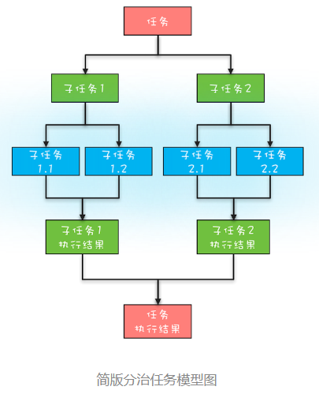
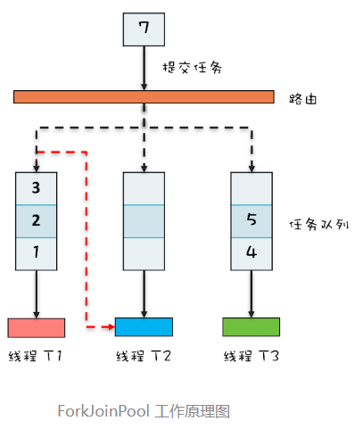

## 分治任务模型

**分治**，顾名思义，即分而治之，是一种解决复杂问题的思维方法和模式；具体来讲，指的是**把一个复杂的问题分解成多个相似的子问题，然后再把子问题分解成更小的子问题，直到子问题简单到可以直接求解**。理论上来讲，解决每一个问题都对应着一个任务，所以对于问题的分治，实际上就是对于任务的分治。

分治思想在很多领域都有广泛的应用，例如：

- 算法领域有分治算法（归并排序、快速排序都属于分治算法，二分法查找也是一种分治算法）；
- 大数据领域知名的计算框架 MapReduce 背后的思想也是分治。

既然分治这种任务模型如此普遍，那 Java 显然也需要支持，Java 并发包里提供了一种叫做 Fork/Join 的并行计算框架，就是用来**支持分治这种任务模型**的。

分治任务模型可分为两个阶段：一个阶段是**任务分解**，也就是将任务迭代地分解为子任务，直至子任务可以直接计算出结果；另一个阶段是**结果合并**，即逐层合并子任务的执行结果，直至获得最终结果。下图是一个简化的分治任务模型图，你可以对照着理解。




## Fork/Join 的使用

Fork/Join 是一个并行计算的框架，主要就是用来支持**分治任务模型**的，这个计算框架里的**Fork 对应的是分治任务模型里的任务分解，Join 对应的是结果合并**。

Fork/Join 计算框架主要包含两部分，一个是**分治任务的线程池 ForkJoinPool**，另一个是**分治任务 ForkJoinTask**。这两部分的关系类似于 ThreadPoolExecutor 和 Runnable 的关系，都可以理解为提交任务到线程池，只不过分治任务有自己独特类型 ForkJoinTask。

#### ForkJoinTask

ForkJoinTask 是一个抽象类，它的方法有很多，最核心的是 fork() 方法和 join() 方法。

- fork() 方法会异步地执行一个子任务。
- join() 方法则会阻塞当前线程来等待子任务的执行结果。

ForkJoinTask 有两个抽象子类——RecursiveAction 和 RecursiveTask，通过名字你就应该能知道，它们都是用递归的方式来处理分治任务的。这两个子类都定义了抽象方法 compute()。

- RecursiveAction：compute() 没有返回值。
- RecursiveTask：compute() 有返回值。

接下来我们就来实现一下，看看如何用 Fork/Join 这个并行计算框架计算斐波那契数列（下面的代码源自 Java 官方示例）。首先我们需要创建一个分治任务线程池以及计算斐波那契数列的分治任务，之后通过调用分治任务线程池的 invoke() 方法来启动分治任务。由于计算斐波那契数列需要有返回值，所以 Fibonacci 继承自 RecursiveTask。分治任务 Fibonacci 需要实现 compute() 方法，这个方法里面的逻辑和普通计算斐波那契数列非常类似，区别之处在于计算 `Fibonacci(n - 1)` 使用了异步子任务，这是通过 `f1.fork()` 这条语句实现的。

```java
public static void main(String[] args) {
    // 创建分治任务线程池  
    ForkJoinPool fjp = new ForkJoinPool(4);
    // 创建分治任务
    Fibonacci fib = new Fibonacci(30);
    // 启动分治任务  
    Integer result = fjp.invoke(fib);
    // 输出结果  
    System.out.println(result);
}

// 递归任务
static class Fibonacci extends RecursiveTask<Integer> {
    final int n;

    Fibonacci(int n) {
        this.n = n;
    }

    protected Integer compute() {
        if (n <= 1) return n;
        Fibonacci f1 = new Fibonacci(n - 1);
        // 创建子任务  
        f1.fork();
        Fibonacci f2 = new Fibonacci(n - 2);
        // 等待子任务结果，并合并结果  
        return f2.compute() + f1.join();
    }
}
```

```java
public class ForkJoinCalculate extends RecursiveTask<Long> {

    private int low;// 开始计算的下标
    private int high;// 结束计算的下标
    private long[] arr;// 计算的实际数组

    private static final long SEQUENTIAL_THRESHOLD = 10000;

    public ForkJoinCalculate(long[] arr,int low, int high) {
        this.low = low;
        this.high= high;
        this.arr = arr;
    }

    @Override
    protected Long compute() {
        // 当任务拆分到小于等于阀值时开始求和
        if (high - low <= SEQUENTIAL_THRESHOLD) {
            long sum = 0;
            for (int i = low; i < high; i++) {
                sum += arr[i];
            }
            return sum;
        }
        // 任务过大继续拆分
        else {
            int mid = low + (high - low) / 2;

            ForkJoinCalculate left = new ForkJoinCalculate(arr, low, mid);
            ForkJoinCalculate right = new ForkJoinCalculate(arr, mid, high);
            //拆分子任务 压入线程队列
            left.fork();
            right.fork();

            return left.join() + right.join();
        }
    }

    /**
     * ForkJoin 框架
     */
    public static void test01(){
        Instant start = Instant.now();// start
        int size = 100000000;

        ForkJoinPool pool = new ForkJoinPool();
        long[] numbers = LongStream.rangeClosed(1, size).toArray();
        ForkJoinCalculate task = new ForkJoinCalculate(numbers,0,size-1);

        //ForkJoinTask<Long> task =  pool.submit(task);
        //System.out.println(task.get());

        Long sum = pool.invoke(task);
        System.out.println(sum);

        Instant end = Instant.now();
        System.out.println("test1----> "+Duration.between(start, end).getNano());
        pool.shutdown();//关闭forkJoinPool池
    }

    /**
     * 普通 for循环
     */
    public static void test02(){
        Instant start = Instant.now();

        Long sum = 0L;
        for (long i = 0; i < 100000000L; i++) {
            sum += i;
        }

        Instant end = Instant.now();
        System.out.println(sum);
        System.out.println("test2----> "+Duration.between(start, end).getNano());
    }

    public static void main(String[] args) {
        test01();
        test02();
    }
}
```


## ForkJoinPool 工作原理

#### ForkJoinPool

Fork/Join 并行计算框架的核心组件是 ForkJoinPool，所以下面我们就来简单介绍一下 ForkJoinPool 的工作原理。

Fork / Join 框架与传统线程池的区别：

通过专栏前面文章的学习，你应该已经知道 ThreadPoolExecutor 本质上是一个生产者 - 消费者模式的实现，内部有一个任务队列，这个任务队列是生产者和消费者通信的媒介；ThreadPoolExecutor 可以有多个工作线程，但是这些工作线程都共享一个任务队列。

ForkJoinPool 本质上也是一个生产者 - 消费者的实现，但是更加智能，你可以参考下面的 ForkJoinPool 工作原理图来理解其原理。**ThreadPoolExecutor 内部只有一个任务队列**，而 **ForkJoinPool 内部有多个任务队列**，当我们通过 ForkJoinPool 的 invoke() 或者 submit() 方法提交任务时，**ForkJoinPool 根据一定的路由规则把任务提交到一个任务队列**中，如果任务在执行过程中会创建出子任务，那么子任务会提交到工作线程对应的任务队列中。

如果工作线程对应的任务队列空了，是不是就没活儿干了呢？不是的，ForkJoinPool 支持一种叫做“**任务窃取**”的机制，这个机制**大大提高了线程的利用率**。如果工作线程空闲了，那它可以“窃取”其他工作任务队列里的任务，例如下图中，线程 T2 对应的任务队列已经空了，它可以“窃取”线程 T1 对应的任务队列的任务。如此一来，所有的工作线程都不会闲下来了。

ForkJoinPool 中的任务队列采用的是双端队列，**工作线程正常获取任务和“窃取任务”分别是从任务队列不同的端消费**，这样能避免很多不必要的数据竞争。我们这里介绍的仅仅是简化后的原理，ForkJoinPool 的实现远比我们这里介绍的复杂，如果你感兴趣，建议去看它的源码。




## 模拟 MapReduce 统计单词数量

学习 MapReduce 有一个入门程序，统计一个文件里面每个单词的数量，下面我们来看看如何用 Fork/Join 并行计算框架来实现。

我们可以先用二分法递归地将一个文件拆分成更小的文件，直到文件里只有一行数据，然后统计这一行数据里单词的数量，最后再逐级汇总结果，你可以对照前面的简版分治任务模型图来理解这个过程。

思路有了，我们马上来实现。下面的示例程序用一个字符串数组 `String[] fc` 来模拟文件内容，fc 里面的元素与文件里面的行数据一一对应。关键的代码在 `compute()` 这个方法里面，这是一个递归方法，前半部分数据 fork 一个递归任务去处理（关键代码 mr1.fork()），后半部分数据则在当前任务中递归处理（mr2.compute()）。

```java
static void main(String[] args) {
    String[] fc = {"hello world",
                   "hello me",
                   "hello fork",
                   "hello join",
                   "fork join in world"};
    // 创建 ForkJoin 线程池    
    ForkJoinPool fjp = new ForkJoinPool(3);
    // 创建任务    
    MR mr = new MR(fc, 0, fc.length);
    // 启动任务    
    Map<String, Long> result = fjp.invoke(mr);
    // 输出结果    
    result.forEach((k, v) -> System.out.println(k + ":" + v));
}

//MR 模拟类
static class MR extends RecursiveTask<Map<String, Long>> {
    private String[] fc;
    private int start, end;

    // 构造函数
    MR(String[] fc, int fr, int to) {
        this.fc = fc;
        this.start = fr;
        this.end = to;
    }

    @Override
    protected Map<String, Long> compute() {
        if (end - start == 1) {
            return calc(fc[start]);
        } else {
            int mid = (start + end) / 2;
            MR mr1 = new MR(fc, start, mid);
            mr1.fork();
            MR mr2 = new MR(fc, mid, end);
            // 计算子任务，并返回合并的结果    
            return merge(mr2.compute(),mr1.join());
        }
    }

    // 合并结果
    private Map<String, Long> merge(Map<String, Long> r1, Map<String, Long> r2) {
        Map<String, Long> result = new HashMap<>();
        result.putAll(r1);
        // 合并结果
        r2.forEach((k, v) -> {
            Long c = result.get(k);
            if (c != null)
                result.put(k, c + v);
            else
                result.put(k, v);
        });
        return result;
    }

    // 统计单词数量
    private Map<String, Long> calc(String line) {
        Map<String, Long> result = new HashMap<>();
        // 分割单词    
        String[] words = line.split("\\s+");
        // 统计单词数量    
        for (String w : words) {
            Long v = result.get(w);
            if (v != null)
                result.put(w, v + 1);
            else
                result.put(w, 1L);
        }
        return result;
    }
}
```

## 总结

Fork/Join 并行计算框架主要解决的是分治任务。分治的核心思想是“分而治之”：将一个大的任务拆分成小的子任务去解决，然后再把子任务的结果聚合起来从而得到最终结果。这个过程非常类似于大数据处理中的 MapReduce，所以你可以把 Fork/Join 看作单机版的 MapReduce。

Fork/Join 并行计算框架的核心组件是 ForkJoinPool。ForkJoinPool 支持任务窃取机制，能够让所有线程的工作量基本均衡，不会出现有的线程很忙，而有的线程很闲的状况，所以性能很好。

Java 1.8 提供的 Stream 并行流、CompletableFuture 等，都是以 ForkJoinPool 为基础的。不过需要你注意的是，默认情况下并行流 和 CompletableFuture 都共享一个 ForkJoinPool.commonPool 通用线程池，这个默认池的线程数是 CPU 的核数；如果所有的并行流计算都是 CPU 密集型计算的话，完全没有问题，但是如果存在 I/O 密集型的并行流计算，那么很可能会因为一个很慢的 I/O 计算而拖慢整个系统的性能。所以**建议用不同的 ForkJoinPool 执行不同类型的计算任务**。

如果你对 ForkJoinPool 详细的实现细节感兴趣，也可以参考[Doug Lea 的论文](http://gee.cs.oswego.edu/dl/papers/fj.pdf)。