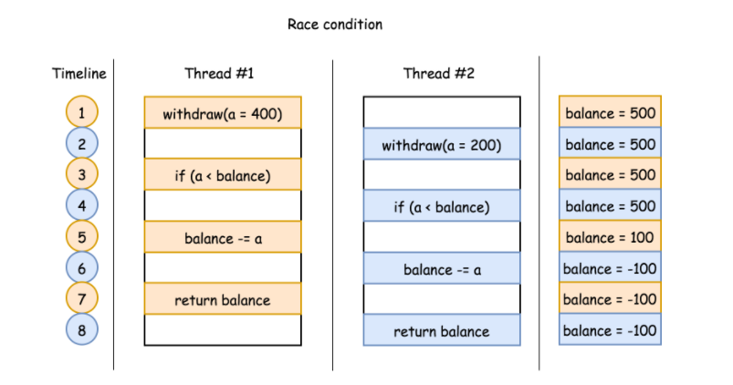
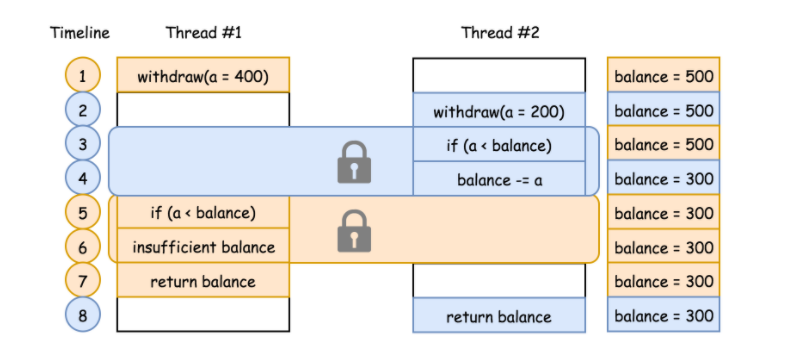

首先，我们需要理解什么是线程安全。

我建议阅读 Brain Goetz 等专家撰写的《Java 并发编程实战》（Java Concurrency in Practice），虽然可能稍显学究，但不可否认这是一本非常系统和全面的 Java 并发编程书籍。按照其中的定义，线程安全是一个多线程环境下正确性的概念，也就是保证多线程环境下**共享的**、**可修改的**状态的正确性，这里的状态反映在程序中其实可以看作是数据。

换个角度来看，如果状态不是共享的，或者不是可修改的，也就不存在线程安全问题，进而可以推理出保证线程安全的两个办法：

- 封装：通过封装，我们可以将对象内部状态隐藏、保护起来。
- 不可变：还记得我们在[专栏第 3 讲](http://time.geekbang.org/column/article/6906)强调的 final 和 immutable 吗，就是这个道理，Java 语言目前还没有真正意义上的原生不可变，但是未来也许会引入。

线程安全需要保证几个基本特性：

- **原子性**，简单说就是相关操作不会中途被其他线程干扰，一般通过同步机制实现。
- **可见性**，是一个线程修改了某个共享变量，其状态能够立即被其他线程知晓，通常被解释为将线程本地状态反映到主内存上，volatile 就是负责保证可见性的。
- **有序性**，是保证线程内串行语义，避免指令重排等。


### 并发问题

> 并发问题来自并发计算的场景，该场景下，程序在多线程（或多进程）中 同时 执行。

同时进行并不是完全指进程或线程在不同的物理 CPU 上独立运行，更多情况下，是在一个物理 CPU 上交替执行多个线程或进程。并发既可在线程中，也可在进程中。

并发主要为多任务情况设计。但如果应用不当，可能会引发一些漏洞。按照情况不同，可以分为三种：

- 竞态条件：由于多进程之间的竞争执行，导致程序未按照期望的顺序输出。

- 死锁：并发程序等待一些必要资源，导致没有程序可以执行。

- 资源不足：进程被永久剥夺了运行所需的资源。

此题中存在竞态条件。下面展示一个竞态条件的例子。

假设有一个方法 `deductInventory(num)`，如果订单商品数量小于当前库存，则从当前库存中减去订单商品数量，然后返回剩余库存。方法定义如下：

```java
int Inventory = 500;
int withdraw(int Inventory) {
  if (num < Inventory) {
    Inventory -= num;
  }
  return Inventory;
}
```

我们 期望 该方法执行后库存永远不会为负。

但是有可能出现竞态条件，使得余额变为负数。假设两个线程同时使用不同的参数执行该方法。例如：线程 1 执行 `deductInventory(num=400)`，线程 2 执行 `deductInventory(num=200)`。这两个线程的执行顺序如下图所示。在每个时刻只执行一条语句。




上述流程执行结束后，余额变成负数，这并不是期望的输出。

### 无竞争并发

并发问题有一个共同特征：多个线程/进程之间共享一些资源（例如：余额）。由于无法消除资源共享的约束，防止并发问题就变成了 *资源共享的协调* 问题。

根据这个思路，如果可以确保程序中 **关键部分代码的独占性**（例如：检查和减少余额），就可以防止程序进入不一致的状态。

> 竞争条件的解决方案为：需要某些关键部分代码具有排他性，即在给定的时间内，只有一个线程可以进入关键部分代码。

可以将这种机制看做限制关键部分代码访问的锁。在前面示例的关键部分代码加锁，即检查余额和减少余额的语句。然后重新运行两个线程，会有下图的执行顺序：



在该机制下，一旦一个线程进入关键部分，它就可以阻止其他线程进入该关键部分。例如，在时间点 3，`线程 2` 进入关键部分，那么在时间点 4，如果没有锁保护，`线程 1` 就可能进入关键部分。最后两个线程同时运行，保证系统的一致性，并确保余额正确。

如果该线程未被授权进入关键代码，可以认为该线程被阻塞或进入睡眠状态。例如，`线程 1` 在时间点 4 被阻塞，之后关键部分被释放，可以通知其他等待线程。`线程 2` 在时间点 5 释放了关键部分，就可以通知 `线程 1 `进入。

> 这种机制还具有唤醒其他等待线程的功能。

总之，为了防止出现并发竞争状态，需要一种具有两种功能的机制：1）关键部分的访问控制；2）通知阻塞线程。
