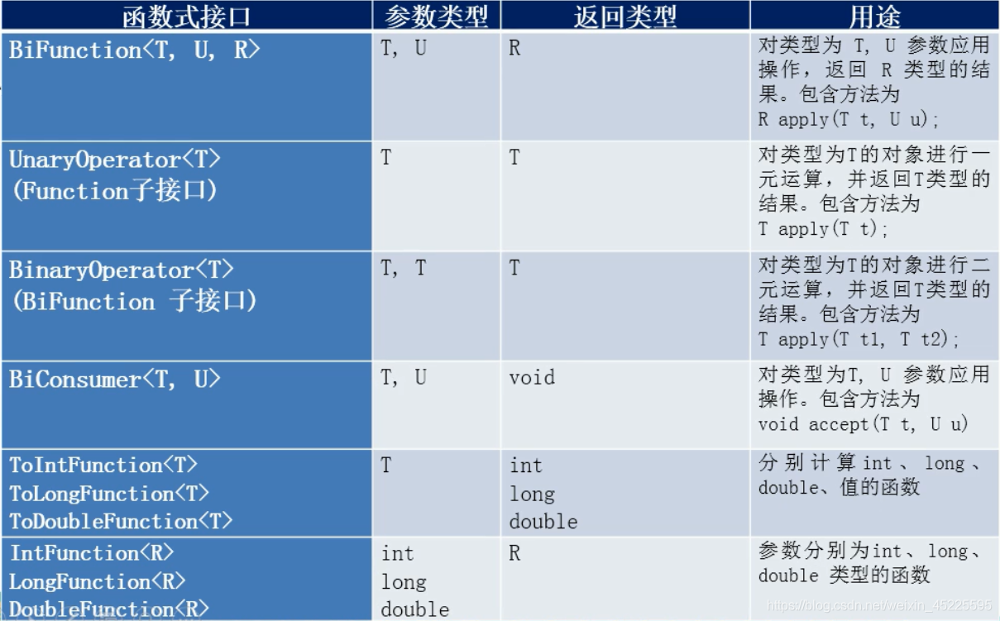
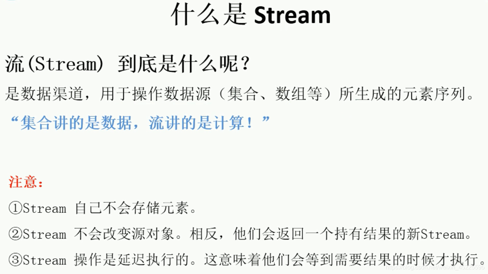
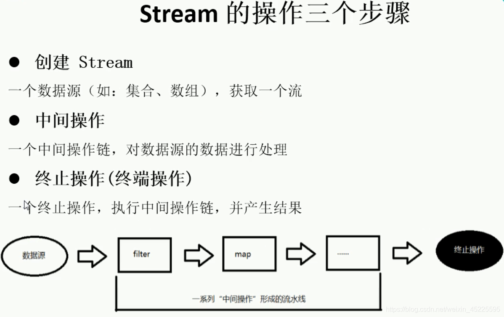
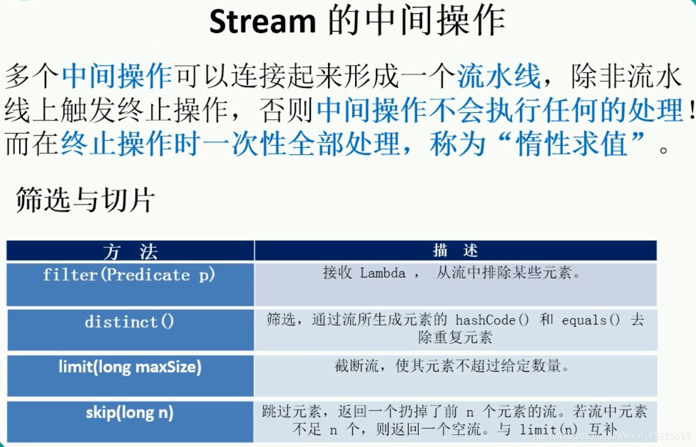
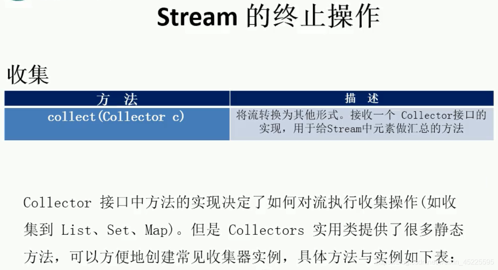
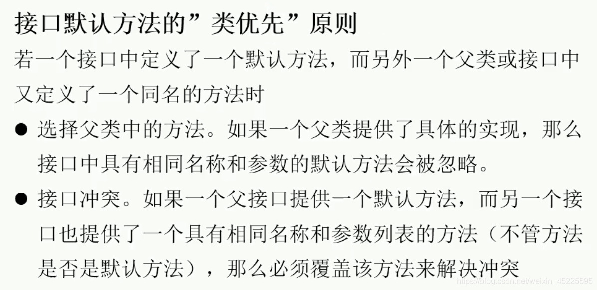
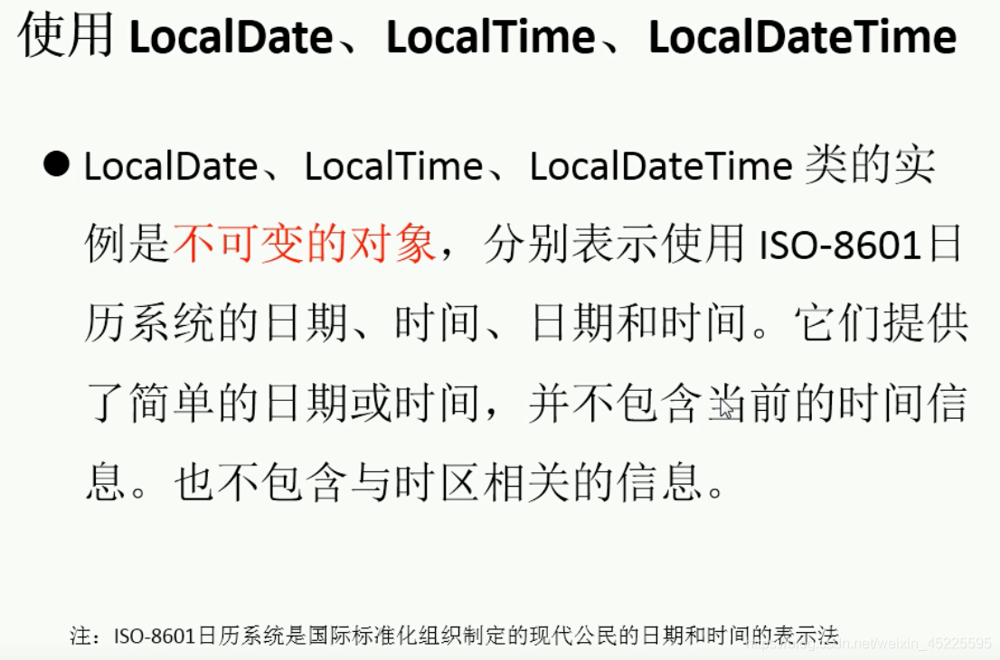
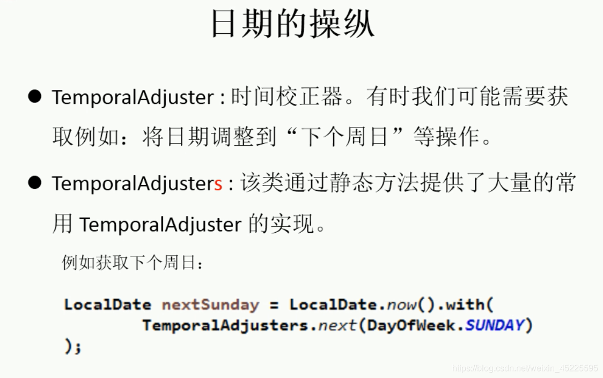

[toc]

# 1.概述

### 1.1 生态
* Lambda 表达式
* 函数式接口
* 方法引用 / 构造器引用
* Stream API
* 接口中的默认方法 / 静态方法
* 新时间日期 API
* 其他新特性

### 1.2 新特性
* 速度更快
* 代码更少
* 强大的 Stream API
* 便于并行
* 最大化减少空指针异常 Optional (Kotlin ?)

### 1.3 温故而知新
* Hashmap 底层结构/原理 老话题不再阐述 …
* 并发hashmap …
* Java虚拟机 …
* Java内存模型 …

# 2. Lambda
### 2.1 匿名函数
>Lambda是一个匿名函数，可以理解为一段可以传递的代码（将代码像数据一样传递）；可以写出更简洁、更灵活的代码；作为一种更紧凑的代码风格，是Java语言表达能力得到提升。

### 2.2 匿名内部类
```JAVA
@Test
public void test01(){
    //匿名内部类
    Comparator<Integer> comparator = new Comparator<Integer>() {
        @Override
        public int compare(Integer o1, Integer o2) {
            return Integer.compare(o1,o2);
        }

        @Override
        public boolean equals(Object obj) {
            return false;
        }
    };
    //调用
    TreeSet<Integer> set = new TreeSet<>(comparator);
}
```
### 2.3 Lambda
```JAVA
@Test
public void test02(){
    // Lambda 表达式
    Comparator<Integer> comparator = (a, b) -> Integer.compare(a, b);

    TreeSet<Integer> set = new TreeSet<>(comparator);
}
```
演变过程：

- 垃圾代码 --> 策略模式 --> 匿名内部类 --> Lambda表达式

基础语法：

- 操作符：->
- 左侧：参数列表
- 右侧：执行代码块 / Lambda 体

口诀：

* 写死小括号，拷贝右箭头，落地大括号
* 左右遇一括号省
* 左侧推断类型省

语法格式：

无参数，无返回值：() -> sout

例如 Runnable接口：

```JAVA
public class Test02 {
	int num = 10; //jdk 1.7以前 必须final修饰
    
    @Test
    public void test01(){
        //匿名内部类
        new Runnable() {
            @Override
            public void run() {
                //在局部类中引用同级局部变量
                //只读
                System.out.println("Hello World" + num);
            }
        };
    }

    @Test
    public void test02(){
        //语法糖
     	Runnable runnable = () -> {
         	System.out.println("Hello Lambda");
     	};
    }
}
```

有一个参数，无返回值

```JAVA
@Test
public void test03(){
    Consumer<String> consumer = (a) -> System.out.println(a);
    consumer.accept("我觉得还行！");
}
```
有一个参数，无返回值 （小括号可以省略不写）

```JAVA
@Test
public void test03(){
    Consumer<String> consumer = a -> System.out.println(a);
    consumer.accept("我觉得还行！");
}
```

有两个及以上的参数，有返回值，并且 Lambda 体中有多条语句
```JAVA
@Test
public void test04(){
    Comparator<Integer> comparator = (a, b) -> {
        System.out.println("比较接口");
        return Integer.compare(a, b);
    };
}

```

有两个及以上的参数，有返回值，并且 Lambda 体中只有1条语句 （大括号 与 return 都可以省略不写）

```JAVA
@Test
public void test04(){
    Comparator<Integer> comparator = (a, b) -> Integer.compare(a, b);
}
```

* Lambda 表达式 参数的数据类型可以省略不写 Jvm可以自动进行 “类型推断”
函数式接口：

* 接口中只有一个抽象方法的接口 @FunctionalIterface
测试：

* 定义一个函数式接口：

```JAVA
@FunctionalInterface
public interface MyFun {

    Integer count(Integer a, Integer b);
}
```
用一下：

```JAVA
@Test
public void test05(){
    MyFun myFun1 = (a, b) -> a + b;
    MyFun myFun2 = (a, b) -> a - b;
    MyFun myFun3 = (a, b) -> a * b;
    MyFun myFun4 = (a, b) -> a / b;
}
```

再用一下：

```JAVA
public Integer operation(Integer a, Integer b, MyFun myFun){
    return myFun.count(a, b);
}

@Test
public void test06(){
    Integer result = operation(1, 2, (x, y) -> x + y);
    System.out.println(result);
}
```
### 2.4 案例
**案例一：**调用 Collections.sort() 方法，通过定制排序 比较两个 Employee (先按照年龄比，年龄相同按照姓名比)，使用 Lambda 表达式作为参数传递

* 定义实体类
```JAVA
@Data
@NoArgsConstructor
@AllArgsConstructor
public class Employee {
    private Integer id;
    private String name;
    private Integer age;
    private Double salary;
}
```
* 定义 List 传入数据
```JAVA
List<Employee> emps = Arrays.asList(
    new Employee(101, "Z3", 19, 9999.99),
    new Employee(102, "L4", 20, 7777.77),
    new Employee(103, "W5", 35, 6666.66),
    new Employee(104, "Tom", 44, 1111.11),
    new Employee(105, "Jerry", 60, 4444.44)
);
```
* @Test
```JAVA
@Test
public void test01(){
    Collections.sort(emps, (e1, e2) -> {
        if (e1.getAge() == e2.getAge()){
            return e1.getName().compareTo(e2.getName());
        } else {
            return Integer.compare(e1.getAge(), e2.getAge());
        }
    });

    for (Employee emp : emps) {
        System.out.println(emp);
    }
}
```

**案例二：**声明函数式接口，接口中声明抽象方法，String getValue(String str); 声明类 TestLambda，类中编写方法使用接口作为参数，将一个字符串转换成大写，并作为方法的返回值；再将一个字符串的第二个和第四个索引位置进行截取字串<br>

**案例三：**声明一个带两个泛型的函数式接口，泛型类型为<T, R> T 为参数，R 为返回值；接口中声明对应的抽象方法；在 TestLambda 类中声明方法，使用接口作为参数，计算两个 Long 类型参数的和；在计算两个 Long 类型参数的乘积

# 3. 函数式接口
Java内置四大核心函数式接口：
<table><thead><tr><th align="center">函数式接口</th><th align="center">参数类型</th><th align="center">返回类型</th><th align="center">用途</th></tr></thead><tbody><tr><td align="center">Consumer<br>消费型接口</td><td align="center">T</td><td align="center">void</td><td align="center">对类型为T的对象应用操作：void accept(T t)</td></tr><tr><td align="center">Supplier<br>提供型接口</td><td align="center">无</td><td align="center">T</td><td align="center">返回类型为T的对象：T get()</td></tr><tr><td align="center">Function&lt;T, R&gt;<br>函数型接口</td><td align="center">T</td><td align="center">R</td><td align="center">对类型为T的对象应用操作，并返回结果为R类型的对象：R apply(T t)</td></tr><tr><td align="center">Predicate<br>断言型接口</td><td align="center">T</td><td align="center">boolean</td><td align="center">确定类型为T的对象是否满足某约束，并返回boolean值：boolean test(T t)</td></tr></tbody></table>

### 3.1 消费型接口
```
@Test
public void test01(){
    //Consumer
    Consumer<Integer> consumer = (x) -> System.out.println("消费型接口" + x);
    //test
    consumer.accept(100);
}
```

### 3.2 提供型接口
```
@Test
public void test02(){
    List<Integer> list = new ArrayList<>();
    List<Integer> integers = Arrays.asList(1,2,3); 
    list.addAll(integers);
    //Supplier<T>
    Supplier<Integer> supplier = () -> (int)(Math.random() * 10);
    list.add(supplier.get());
    System.out.println(supplier);
    for (Integer integer : list) {
        System.out.println(integer);
    }
}
```
### 3.3 函数型接口
```
@Test
public void test03(){
    //Function<T, R>
    String oldStr = "abc123456xyz";
    Function<String, String> function = (s) -> s.substring(1, s.length()-1);
    //test
    System.out.println(function.apply(oldStr));
}
```
### 3.4 断言型接口
```
@Test
public void test04(){
    //Predicate<T>
    Integer age = 35;
    Predicate<Integer> predicate = (i) -> i >= 35;
    if (predicate.test(age)){
        System.out.println("你该退休了");
    } else {
        System.out.println("我觉得还OK啦");
    }
}
```

### 3.5 其他接口
  

# 4.引用
### 4.1 方法引用
**定义：**若 Lambda 表达式体中的内容已有方法实现，则我们可以使用“方法引用”

语法格式：

* 对象 :: 实例方法
* 类 :: 静态方法
* 类 :: 实例方法

对象::实例方法
```
@Test
public void test01(){
    PrintStream ps = System.out;
    Consumer<String> con1 = (s) -> ps.println(s);
    con1.accept("aaa");

    Consumer<String> con2 = ps::println;
    con2.accept("bbb");
}
```
**注意：**Lambda 表达实体中调用方法的参数列表、返回类型必须和函数式接口中抽象方法保持一致

类::静态方法
```
@Test
public void test02(){
    Comparator<Integer> com1 = (x, y) -> Integer.compare(x, y);
    System.out.println(com1.compare(1, 2));

    Comparator<Integer> com2 = Integer::compare;
    System.out.println(com2.compare(2, 1));
}
```

类::实例方法

```
@Test
public void test03(){
    BiPredicate<String, String> bp1 = (x, y) -> x.equals(y);
    System.out.println(bp1.test("a","b"));

    BiPredicate<String, String> bp2 = String::equals;
    System.out.println(bp2.test("c","c"));
}
```
**条件：**Lambda 参数列表中的第一个参数是方法的调用者，第二个参数是方法的参数时，才能使用 ClassName :: Method

### 4.2 构造器引用
格式：

* ClassName :: new
```
@Test
public void test04(){
    Supplier<List> sup1 = () -> new ArrayList();

    Supplier<List> sup2 = ArrayList::new;
}
```

**注意：**需要调用的构造器的参数列表要与函数时接口中抽象方法的参数列表保持一致

### 4.3 数组引用
语法：

Type :: new;

# 5. Stream API
### 5.1 创建
什么是 Stream?

  

  

  创建流：（的几种方法如下）

```JAVA
  /**
* 创建流
*/
@Test
public void test01(){
    /**
    * 集合流
    *  - Collection.stream() 穿行流
    *  - Collection.parallelStream() 并行流
    */
    List<String> list = new ArrayList<>();
    Stream<String> stream1 = list.stream();

    //数组流
    //Arrays.stream(array)
    String[] strings = new String[10];
    Stream<String> stream2 = Arrays.stream(strings);

    //Stream 静态方法
    //Stream.of(...)
    Stream<Integer> stream3 = Stream.of(1, 2, 3);

    //无限流
    //迭代
    Stream<Integer> stream4 = Stream.iterate(0, (i) -> ++i+i++);
    stream4.forEach(System.out::println);

    //生成
    Stream.generate(() -> Math.random())
        .limit(5)
        .forEach(System.out::println);
}
```

### 5.2 筛选 / 切片
中间操作：

* filter：接收 Lambda ，从流中排除某些元素
* limit：截断流，使其元素不超过给定数量
* skip(n)：跳过元素，返回一个舍弃了前n个元素的流；若流中元素不足n个，则返回一个空流；与 limit(n) 互补
* distinct：筛选，通过流所生成的 hashCode() 与 equals() 取除重复元素

```JAVA
List<Employee> emps = Arrays.asList(
    new Employee(101, "Z3", 19, 9999.99),
    new Employee(102, "L4", 20, 7777.77),
    new Employee(103, "W5", 35, 6666.66),
    new Employee(104, "Tom", 44, 1111.11),
    new Employee(105, "Jerry", 60, 4444.44)
);

@Test
public void test01(){
    emps.stream()
        .filter((x) -> x.getAge() > 35)
        .limit(3) //短路？达到满足不再内部迭代
        .distinct()
        .skip(1)
        .forEach(System.out::println);

}
```

Stream的中间操作：

  

* 内部迭代：迭代操作由 Stream API 完成
* 部迭代：我们通过迭代器完成

### 5.3 映射
* map：接收 Lambda ，将元素转换为其他形式或提取信息；接受一个函数作为参数，该函数会被应用到每个元素上，并将其映射成一个新的元素
* flatMap：接收一个函数作为参数，将流中每一个值都换成另一个流，然后把所有流重新连接成一个流

map：

```JAVA
@Test
public void test02(){
    List<String> list = Arrays.asList("a", "b", "c");
    list.stream()
        .map((str) -> str.toUpperCase())
        .forEach(System.out::println);
}
```

flatMap：

```java
public Stream<Character> filterCharacter(String str){
    List<Character> list = new ArrayList<>();
    for (char c : str.toCharArray()) {
        list.add(c);
    }

    return list.stream();
}

@Test
public void test03(){
    List<String> list = Arrays.asList("a", "b", "c");
    Test02 test02 = new Test02();
    list.stream()
        .flatMap(test02::filterCharacter)
        .forEach(System.out::println);
}

```

### 5.4 排序
* sorted()：自然排序
* sorted(Comparator c)：定制排序

Comparable：自然排序

```java
@Test
public void test04(){
    List<Integer> list = Arrays.asList(1,2,3,4,5);
    list.stream()
        .sorted() //comparaTo()
        .forEach(System.out::println);
}
```

Comparator：定制排序

```java
@Test
public void test05(){
    emps.stream()
        .sorted((e1, e2) -> { //compara()
            if (e1.getAge().equals(e2.getAge())){
                return e1.getName().compareTo(e2.getName());
            } else {
                return e1.getAge().compareTo(e2.getAge());
            }
        })
        .forEach(System.out::println);
}

```

### 5.5 查找 / 匹配
终止操作：

* allMatch：检查是否匹配所有元素
* anyMatch：检查是否至少匹配一个元素
* noneMatch：检查是否没有匹配所有元素
* findFirst：返回第一个元素
* findAny：返回当前流中的任意元素
* count：返回流中元素的总个数
* max：返回流中最大值
* min：返回流中最小值

```java
public enum Status {
    FREE, BUSY, VOCATION;
}

@Test
public void test01(){
    List<Status> list = Arrays.asList(Status.FREE, Status.BUSY, Status.VOCATION);

    boolean flag1 = list.stream()
        .allMatch((s) -> s.equals(Status.BUSY));
    System.out.println(flag1);

    boolean flag2 = list.stream()
        .anyMatch((s) -> s.equals(Status.BUSY));
    System.out.println(flag2);

    boolean flag3 = list.stream()
        .noneMatch((s) -> s.equals(Status.BUSY));
    System.out.println(flag3);

    // 避免空指针异常
    Optional<Status> op1 = list.stream()
        .findFirst();
    // 如果Optional为空 找一个替代的对象
    Status s1 = op1.orElse(Status.BUSY);
    System.out.println(s1);

    Optional<Status> op2 = list.stream()
        .findAny();
    System.out.println(op2);

    long count = list.stream()
        .count();
    System.out.println(count);
}
```
### 5.6 归约 / 收集
* 归约：reduce(T identity, BinaryOperator) / reduce(BinaryOperator) 可以将流中的数据反复结合起来，得到一个值
* 收集：collect 将流转换成其他形式；接收一个 Collector 接口的实现，用于给流中元素做汇总的方法

reduce：

```java
/**
* Java：
*  - reduce：需提供默认值（初始值）
* Kotlin：
*  - fold：不需要默认值（初始值）
*  - reduce：需提供默认值（初始值）
*/
@Test
public void test01(){
    List<Integer> list = Arrays.asList(1, 2, 3, 4, 5, 6, 7, 8, 9);
    Integer integer = list.stream()
        .reduce(0, (x, y) -> x + y);
    System.out.println(integer);
}
```

collect：

  

  ```java
  List<Employee> emps = Arrays.asList(
    new Employee(101, "Z3", 19, 9999.99),
    new Employee(102, "L4", 20, 7777.77),
    new Employee(103, "W5", 35, 6666.66),
    new Employee(104, "Tom", 44, 1111.11),
    new Employee(105, "Jerry", 60, 4444.44)
);

@Test
public void test02(){
    //放入List
    List<String> list = emps.stream()
        .map(Employee::getName)
        .collect(Collectors.toList()); 
    list.forEach(System.out::println);
    
	//放入Set
    Set<String> set = emps.stream()
        .map(Employee::getName)
        .collect(Collectors.toSet());
    set.forEach(System.out::println);

    //放入LinkedHashSet
    LinkedHashSet<String> linkedHashSet = emps.stream()
        .map(Employee::getName)
        .collect(Collectors.toCollection(LinkedHashSet::new));
    linkedHashSet.forEach(System.out::println);
}

@Test
public void test03(){
    //总数
    Long count = emps.stream()
        .collect(Collectors.counting());
    System.out.println(count);

    //平均值
    Double avg = emps.stream()
        .collect(Collectors.averagingDouble(Employee::getSalary));
    System.out.println(avg);

    //总和
    Double sum = emps.stream()
        .collect(Collectors.summingDouble(Employee::getSalary));
    System.out.println(sum);

    //最大值
    Optional<Employee> max = emps.stream()
        .collect(Collectors.maxBy((e1, e2) -> Double.compare(e1.getSalary(), e2.getSalary())));
    System.out.println(max.get());

    //最小值
    Optional<Double> min = emps.stream()
        .map(Employee::getSalary)
        .collect(Collectors.minBy(Double::compare));
    System.out.println(min.get());
}

@Test
public void test04(){
    //分组
    Map<Integer, List<Employee>> map = emps.stream()
        .collect(Collectors.groupingBy(Employee::getId));
    System.out.println(map);

    //多级分组
    Map<Integer, Map<String, List<Employee>>> mapMap = emps.stream()
        .collect(Collectors.groupingBy(Employee::getId, Collectors.groupingBy((e) -> {
            if (e.getAge() > 35) {
                return "开除";
            } else {
                return "继续加班";
            }
        })));
    System.out.println(mapMap);
    
    //分区
    Map<Boolean, List<Employee>> listMap = emps.stream()
        .collect(Collectors.partitioningBy((e) -> e.getSalary() > 4321));
    System.out.println(listMap);
}

@Test
public void test05(){
    //总结
    DoubleSummaryStatistics dss = emps.stream()
        .collect(Collectors.summarizingDouble(Employee::getSalary));
    System.out.println(dss.getMax());
    System.out.println(dss.getMin());
    System.out.println(dss.getSum());
    System.out.println(dss.getCount());
    System.out.println(dss.getAverage());
    
    //连接
    String str = emps.stream()
        .map(Employee::getName)
        .collect(Collectors.joining("-")); //可传入分隔符
    System.out.println(str);
}
  ```

### 5.7 案例
**案例一：**给定一个数字列表，如何返回一个由每个数的平方构成的列表呢？(如：给定【1，2，3，4，5】，返回【1，4，9，16，25】)

```java
@Test
public void test01(){
    List<Integer> list = Arrays.asList(1, 2, 3, 4, 5);
    list.stream()
        .map((x) -> x * x)
        .forEach(System.out::println);
}

```
**案例二：**怎样使用 map 和 reduce 数一数流中有多少个 Employee 呢？

```java
List<Employee> emps = Arrays.asList(
    new Employee(101, "Z3", 19, 9999.99),
    new Employee(102, "L4", 20, 7777.77),
    new Employee(103, "W5", 35, 6666.66),
    new Employee(104, "Tom", 44, 1111.11),
    new Employee(105, "Jerry", 60, 4444.44)
);

@Test
public void test02(){
    Optional<Integer> result = emps.stream()
        .map((e) -> 1)
        .reduce(Integer::sum);
    System.out.println(result.get());
```
### 5.8 并行流

* 并行流：就是把一个内容分成几个数据块，并用不同的线程分别处理每个数据块的流
* Java 8 中将并行进行了优化，我们可以很容易的对数据进行操作；Stream API 可以声明性地通过 parallel() 与 sequential() 在并行流与串行流之间切换

Fork / Join 框架：

  

Fork / Join 框架与传统线程池的区别：

  

  Fork / Join 实现：

- 两个子类任务，一个是RecoursiveTask，他的职责相当于callable，用来执行有返回值任务

- 另一个是recursiveaction。他的职责相当于runnable,用来执行无返回值任务。

  ```java
  public class ForkJoinCalculate extends RecursiveTask<Long> {

    private static final long serialVersionUID = 1234567890L;

    private long low;// 开始计算的下标
    private long high;// 结束计算的下标
    private long[] arr;// 计算的实际数组

    private static final long THRESHPLD = 10000;

    public ForkJoinCalculate(long[] arr,long low, long high) {
        this.low = low;
        this.high= high;
        this.arr = arr;
    }

    @Override
    protected Long compute() {
        // 当任务拆分到小于等于阀值时开始求和
        if (high - low <= SEQUENTIAL_THRESHOLD) {
            long sum = 0;
            for (long i = low; i < high; i++) {
                sum += array[i];
            }
        } 
        // 任务过大继续拆分
        else {
            long mid = low + (high - low) / 2;

            ForkJoinCalculate left = new ForkJoinCalculate(arr, low, mid-);
            ForkJoinCalculate right = new ForkJoinCalculate(arr, mid, end);
            //拆分子任务 压入线程队列
            left.fork(); 
            right.fork();

            return left.join() + right.join();
        }

        return null;
    }
}

public class TestForkJoin {

    /**
     * ForkJoin 框架
     */
    @Test
    public void test01(){
        Instant start = Instant.now();// start
        long size = 100000000L;
        
        ForkJoinPool pool = new ForkJoinPool();
        long[] numbers = LongStream.rangeClosed(1, size).toArray();
        ForkJoinCalculate task = new ForkJoinCalculate(numbers,0,size-1);

        //ForkJoinTask<Long> task =  pool.submit(task);
        //System.out.println(task.get());
        
        Long sum = pool.invoke(task);
        System.out.println(sum);

        Instant end = Instant.now();
        System.out.println(Duration.between(start, end).getNano());
        forkJoinPool.shutdown();//关闭forkJoinPool池
    }

    /**
     * 普通 for循环
     */
    @Test
    public void test02(){
        Instant start = Instant.now();

        Long sum = 0L;
        for (long i = 0; i < 100000000L; i++) {
            sum += i;
        }

        Instant end = Instant.now();
        System.out.println(Duration.between(start, end).getNano());
    }
}
  ```

  Java 8 并行流 / 串行流：

  ```java
  @Test
public void test03(){
    //串行流(单线程)：切换为并行流 parallel()
    //并行流：切换为串行流 sequential()
    LongStream.rangeClosed(0, 100000000L)
        .parallel() //底层：ForkJoin
        .reduce(0, Long::sum);

}
  ```

  # 6. Optional
  **定义：**Optional 类 (java.util.Optional) 是一个容器类，代表一个值存在或不存在，原来用 null 表示一个值不存在，现在用 Optional 可以更好的表达这个概念；并且可以避免空指针异常

常用方法：

* Optional.of(T t)：创建一个 Optional 实例
* Optional.empty(T t)：创建一个空的 Optional 实例
* Optional.ofNullable(T t)：若 t 不为 null，创建 Optional 实例，否则空实例
* isPresent()：判断是否包含某值
* orElse(T t)：如果调用对象包含值，返回该值，否则返回 t
* orElseGet(Supplier s)：如果调用对象包含值，返回该值，否则返回 s 获取的值
* map(Function f)：如果有值对其处理，并返回处理后的 Optional，否则返回 Optional.empty()
* flatmap(Function mapper)：与 map 相似，要求返回值必须是 Optional

Optional.of(T t)：

```java
@Test
public void test01(){
    Optional<Employee> op = Optional.of(new Employee());
    Employee employee = op.get();
}
```
Optional.empty(T t)：

```java
@Test
public void test02(){
    Optional<Employee> op = Optional.empty();
    Employee employee = op.get();
}

```
Optional.ofNullable(T t)：

```java
@Test
public void test03(){
    Optional<Employee> op = Optional.ofNullable(new Employee());
    Employee employee = op.get();
}

```
isPresent()：

```java
@Test
public void test03(){
    Optional<Employee> op = Optional.ofNullable(new Employee());
    if (op.isPresent()) {
        Employee employee = op.get();
    }
}
```

不再一一例举…

# 7. 接口
### 7.1 默认方法
```java
public interface MyFun {

    default String getName(){
        return "libo";
    }

    default Integer getAge(){
        return 22;
    }
}
```

类优先原则：

  

### 7.2 静态方法
```
public interface MyFun {

    static void getAddr(){
        System.out.println("addr");
    }

    static String Hello(){
        return "Hello World";
    }
}

```

# 8. Date / Time API

### 8.1 安全问题
传统的日期格式化：

```java
@Test
public void test01(){
    SimpleDateFormat sdf = new SimpleDateFormat("yyyy-MM-dd HH:mm:ss");

    Callable<Date> task = () -> sdf.parse("20200517");

    ExecutorService pool = Executors.newFixedThreadPool(10);

    ArrayList<Future<Date>> result = new ArrayList<>();
    for (int i = 0; i < 10; i++) {
        result.add(pool.submit(task));
    }

    for (Future<Date> future : result) {
        try {
            System.out.println(future.get());
        } catch (InterruptedException | ExecutionException e) {
            e.printStackTrace();
        }
    }
    
    pool.shutdown();
}
```

加锁：

```java
public class DateFormatThreadLocal {
    private static final ThreadLocal<DateFormat> df = ThreadLocal.withInitial(() -> new SimpleDateFormat("yyyy-MM-dd HH:mm:ss"));

    public static Date convert(String source) throws ParseException{
        return df.get().parse(source);
    }
}

@Test
public void test02(){
    Callable<Date> task = () -> DateFormatThreadLocal.convert("20200517");

    ExecutorService pool = Executors.newFixedThreadPool(10);

    ArrayList<Future<Date>> result = new ArrayList<>();
    for (int i = 0; i < 10; i++) {
        result.add(pool.submit(task));
    }

    for (Future<Date> future : result) {
        try {
            System.out.println(future.get());
        } catch (InterruptedException | ExecutionException e) {
            e.printStackTrace();
        }
    }

    pool.shutdown();
}
```

DateTimeFormatter：

```java
@Test
public void test03(){
    DateTimeFormatter dtf = DateTimeFormatter.ISO_LOCAL_DATE;

    Callable<LocalDate> task = () -> LocalDate.parse("20200517",dtf);

    ExecutorService pool = Executors.newFixedThreadPool(10);

    ArrayList<Future<LocalDate>> result = new ArrayList<>();
    for (int i = 0; i < 10; i++) {
        result.add(pool.submit(task));
    }

    for (Future<LocalDate> future : result) {
        try {
            System.out.println(future.get());
        } catch (InterruptedException | ExecutionException e) {
            e.printStackTrace();
        }
    }

    pool.shutdown();
}
```

### 8.2 本地时间 / 日期

ISO 标准：

  

  常用方法：

  <table><thead><tr><th>方法名</th><th>返回值类型</th><th>解释</th></tr></thead><tbody><tr><td>now( )</td><td>static LocalDateTime</td><td>从默认时区的系统时钟获取当前日期</td></tr><tr><td>of(int year, int month, int dayOfMonth, int hour, int minute, int second)</td><td>static LocalDateTime</td><td>从年，月，日，小时，分钟和秒获得 LocalDateTime的实例，将纳秒设置为零</td></tr><tr><td>plus(long amountToAdd, TemporalUnit unit)</td><td>LocalDateTime</td><td>返回此日期时间的副本，并添加指定的数量</td></tr><tr><td>get(TemporalField field)</td><td>int</td><td>从此日期时间获取指定字段的值为 int</td></tr></tbody></table>

  @Test：

  ```java
  @Test
public void test01(){
    //获取当前时间日期 now
    LocalDateTime ldt1 = LocalDateTime.now();
    System.out.println(ldt1);

    //指定时间日期 of
    LocalDateTime ldt2 = LocalDateTime.of(2020, 05, 17, 16, 24, 33);
    System.out.println(ldt2);

    //加 plus
    LocalDateTime ldt3 = ldt2.plusYears(2);
    System.out.println(ldt3);

    //减 minus
    LocalDateTime ldt4 = ldt2.minusMonths(3);
    System.out.println(ldt4);

    //获取指定的你年月日时分秒... get
    System.out.println(ldt2.getDayOfYear());
    System.out.println(ldt2.getHour());
    System.out.println(ldt2.getSecond());
}
  ```

  LocalDate / LocalTime 不再一一例举…

  ### 8.3 时间戳
Instant：以 Unix 元年 1970-01-01 00:00:00 到某个时间之间的毫秒值

  @Test：

```java
@Test
public void test02(){
    // 默认获取 UTC 时区 (UTC：世界协调时间)
    Instant ins1 = Instant.now();
    System.out.println(ins1);

    //带偏移量的时间日期 (如：UTC + 8)
    OffsetDateTime odt1 = ins1.atOffset(ZoneOffset.ofHours(8));
    System.out.println(odt1);

    //转换成对应的毫秒值
    long milli1 = ins1.toEpochMilli();
    System.out.println(milli1);

    //构建时间戳
    Instant ins2 = Instant.ofEpochSecond(60);
    System.out.println(ins2);
}
```

### 8.4 时间 / 日期 差
* Duration：计算两个时间之间的间隔
* Period：计算两个日期之间的间隔

@Test：

```java
@Test
public void test03(){
    //计算两个时间之间的间隔 between
    Instant ins1 = Instant.now();
    try {
        Thread.sleep(1000);
    } catch (InterruptedException e) {
        e.printStackTrace();
    }
    Instant ins2 = Instant.now();
    Duration dura1 = Duration.between(ins1, ins2);
    System.out.println(dura1.getSeconds());
    System.out.println(dura1.toMillis());
}

@Test
public void test04(){
    LocalDate ld1 = LocalDate.of(2016, 9, 1);
    LocalDate ld2 = LocalDate.now();
    Period period = Period.between(ld1, ld2);  // ISO 标准
    System.out.println(period.getYears());
    System.out.println(period.toTotalMonths());
}
```

### 8.5 时间校正器
操纵日期：

  

@Test：

```java
@Test
public void test01(){
    //TemporalAdjusters：时间校正器
    LocalDateTime ldt1 = LocalDateTime.now();
    System.out.println(ldt1);

    //指定日期时间中的 年 月 日 ...
    LocalDateTime ldt2 = ldt1.withDayOfMonth(10);
    System.out.println(ldt2);

    //指定时间校正器
    LocalDateTime ldt3 = ldt1.with(TemporalAdjusters.next(DayOfWeek.SUNDAY));
    System.out.println(ldt3);

    //自定义时间校正器
    LocalDateTime ldt5 = ldt1.with((ta) -> {
        LocalDateTime ldt4 = (LocalDateTime) ta;
        DayOfWeek dow1 = ldt4.getDayOfWeek();
        if (dow1.equals(DayOfWeek.FRIDAY)) {
            return ldt4.plusDays(3);
        } else if (dow1.equals(DayOfWeek.SATURDAY)) {
            return ldt4.plusDays(2);
        } else {
            return ldt4.plusDays(1);
        }
    });
    System.out.println(ldt5);
}
```

### 8.6 格式化
 * DateTimeFormatter：格式化时间 / 日期

 ```java
 @Test
public void test01(){
    //默认格式化
    DateTimeFormatter dtf1 = DateTimeFormatter.ISO_DATE_TIME;
    LocalDateTime ldt1 = LocalDateTime.now();
    String str1 = ldt1.format(dtf1);
    System.out.println(str1);

    //自定义格式化 ofPattern
    DateTimeFormatter dtf2 = DateTimeFormatter.ofPattern("yyyy-MM-dd HH:mm:ss");
    LocalDateTime ldt2 = LocalDateTime.now();
    String str2 = ldt2.format(dtf2);
    System.out.println(str2);

    //解析
    LocalDateTime newDate = ldt1.parse(str1, dtf1);
    System.out.println(newDate);
}
 ```

 ### 8.7 时区
* ZonedDate
* ZonedTime
* ZonedDateTime
@Test：

```java
@Test
public void test02(){
    //查看支持的时区
    Set<String> set = ZoneId.getAvailableZoneIds();
    set.forEach(System.out::println);

    //指定时区
    LocalDateTime ldt1 = LocalDateTime.now(ZoneId.of("Europe/Tallinn"));
    System.out.println(ldt1);

    //在已构建好的日期时间上指定时区
    LocalDateTime ldt2 = LocalDateTime.now(ZoneId.of("Europe/Tallinn"));
    ZonedDateTime zdt1 = ldt2.atZone(ZoneId.of("Europe/Tallinn"));
    System.out.println(zdt1);
}
```

一些转换：

```java
@Test
public void test03(){
	// Date 转 LocalDateTime 
	Date date = new Date();
    Instant instant = date.toInstant();
    ZoneId zoneId = ZoneId.systemDefault();
    LocalDateTime localDateTime = instant.atZone(zoneId).toLocalDateTime();

	// LocalDateTime 转 Date
	LocalDateTime localDateTime = LocalDateTime.now();
	ZoneId zoneId = ZoneId.systemDefault();
    ZonedDateTime zdt = localDateTime.atZone(zoneId);
    Date date = Date.from(zdt.toInstant());
	
	// 原则：利用 时间戳Instant
}
```

# 9. 注解
### 9.1 重复注解
定义注解：

```java
@Repeatable(MyAnnotations.class) //指定容器类
@Target({ElementType.TYPE, ElementType.METHOD,  ElementType.FIELD})
@Retention(RetentionPolicy.RUNTIME)
public @interface MyAnnotation {

    String value() default "Java 8";
}
```

定义容器：

```java
@Target({ElementType.TYPE, ElementType.METHOD,  ElementType.FIELD})
@Retention(RetentionPolicy.RUNTIME)
public @interface MyAnnotations {

    MyAnnotation[] value();
}
```

@Test：

```java
public class Test01 {

    //重复注解
    @Test
    @MyAnnotation("Hello")
    @MyAnnotation("World")
    public void test01() throws NoSuchMethodException {
        Class<Test01> clazz = Test01.class;
        Method test01 = clazz.getMethod("test01");
        MyAnnotation[] mas = test01.getAnnotationsByType(MyAnnotation.class);
        for (MyAnnotation ma : mas) {
            System.out.println(ma.value());
        }
    }
}
```

### 9.2 类型注解
Java 8 新增注解：新增ElementType.TYPE_USE 和ElementType.TYPE_PARAMETER（在Target上）