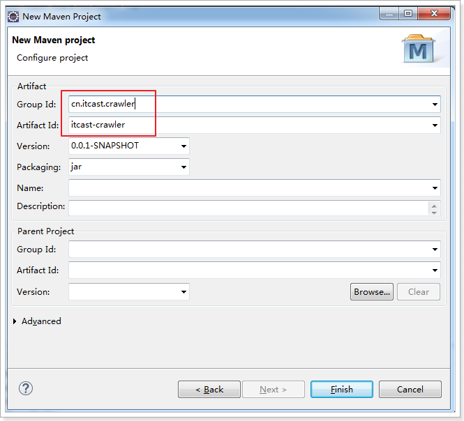

[toc]

# 1.爬虫基础概念
## 1.1爬虫是什么
  

  
  爬虫又叫网络爬虫，网络蜘蛛，一种运行在互联网上用来获取数据的的自动程序。
* 互联网的数据，有很多，一般都是根据业务需求来的。
	* 网页（文字、图片、视频）
	* 商品数据
* 怎么获取数据？	
	* HTTP协议
	* 人的操是通过浏览器的，程序是利用网络请求的相关协议获取数据。
* 自动化，尽可能减少人工的干预。
	* 爬虫开发的技术，没有限制的。
		* python做网络爬虫是非常流行的。
		* Java 编写爬虫框架。

思考题：某公司要获取京东的数据，也要获取淘宝的数据，又要获取豆瓣上的数据，请问开发一个爬虫程序好？还是多个程序好？
## 1.2 爬虫解决了什么问题
  

### 1.2.2 数据分为内部数据和外部数据
在互联网公司，不管内部数据还是外部数据，其实都是为了获取用户相关的数据。
拿到用户的行为数据之后，会分析用户。
比如说电商类网站就是为推荐商品，搜索类的网站为了精准营销(家具类) 广告联盟。


#### 1.2.2.1 公司内部数据
**业务数据**，公司使用BI（Business Intelligence）、CRM系统、ERP系统、邮件系统等产生的数据；
**财务数据**，其中包括公司的支出、采购、收入等多项与公司日常运作有关的数据；
**用户数据**，无论是网站、APP还是游戏，用户注册都会填写邮箱、电话、身份证号码等数据，这些数据其实非常有价值，此外还要加上用户使用公司产品留下的行为数据。
**历史数据**，公司沉淀下来的其他各种数据。

#### 1.2.2.2 外部数据
**社交网站数据**，包括微信、微博、人人网、Twitter、Facebook、LinkedIn等社交媒体上的数据。
说明：社交数据部分是可以爬取的，另外一部分是需要运营方授权的。
**线下采集数据**，包括Wifi热点数据、地图数据等。
说明：这一块目前做的公司比较少，但同时也比较有价值。
**政府开放数据**，包括企业征信数据、企业注册数据、法院公示数据、公共交通数据等。
说明：如果你想要找的话，可到对应政府网站下载。
**智能设备数据**，包括智能设备、传感器数据。
说明：你知道吗？一部智能手机，至少拥有8个传感设备。
**网络爬虫数据**，包括互联网上所有可以爬回的数据，文字、视频、图片其实也是数据，而且是非结构化数据。
**企业交易数据**，包括商家流水数据、支付宝交易数据、信用卡消费数据等等。
说明：目前这一部分数据是最难获取的，因为数据就是宝贵的资产。
**企业开放数据**，比如微博开放了商业数据API，腾讯开放了腾讯云分析SDK上报的应用数据，高德地图开放了LBS数据等等。
说明：如果想找更多的数据API，我推荐你去数据堂、聚合数据这两家网站上看一下，上面有大量的API接口。
**其它数据**，比如天气数据、交通数据、人口流动数据、位置数据等等。
说明：只有想不到没有弄不到。


#### 1.2.2.3 额外扩展
大数据就是整合完公司内部外部数据，进行大数据存储，然后通过清洗，标注、去重、去噪、关联等过程可以将数据进行结构化，也可以进行大数据挖掘和数据分析，再以数据可视化呈现结果，打通数据孤岛形成数据闭环，将数据转换成“石油”和“生产资料”，最后应用到我们日常的生活、学习和工作中去。

## 1.3 爬虫与搜索系统的关系


搜索系统的数据是爬虫爬取过来？不一定。

搜索系统可以简单的分为两类，`通用搜索，站内搜索`。

通用搜索：像百度，谷歌会爬取互联网上所有的数据
站内搜索：只需要业务系统的数据。
垂直搜索：行业数据和自己的数据。

总结：搜索一定会包含爬虫（除站内搜索外），爬虫爬取的数据不一定是为搜索服务。除了搜索功能以外，爬虫爬取的数据主要用来做数据分析。
## 1.4 爬虫的简单分类
网络爬虫按照系统结构和实现技术，大致可以分为以下几种类型：
* 通用网络爬虫（General Purpose Web Crawler）
* 聚焦网络爬虫（Focused Web Crawler）
* 增量式网络爬虫（Incremental Web Crawler）
* 深层网络爬虫（Deep Web Crawler）
实际的网络爬虫系统通常是几种爬虫技术相结合实现的。

### 1.4.1通用网络爬虫
通用网络爬虫又称全网爬虫（Scalable Web Crawler），爬行对象从一些种子 URL 扩充到整个 Web，主要为门户站点搜索引擎和大型 Web 服务提供商采集数据。 
由于商业原因，它们的技术细节很少公布出来。 
这类网络爬虫的爬行范围和数量巨大，对于爬行速度和存储空间要求较高，对于爬行页面的顺序要求相对较低，同时由于待刷新的页面太多，通常采用并行工作方式，但需要较长时间才能刷新一次页面。 虽然存在一定缺陷，通用网络爬虫适用于为搜索引擎搜索广泛的主题，有较强的应用价值。


### 1.4.2聚焦网络爬虫
聚焦网络爬虫（Focused Crawler），又称主题网络爬虫（Topical Crawler），是指选择性地爬行那些与预先定义好的主题相关页面的网络爬虫。 
和通用网络爬虫相比，聚焦爬虫只需要爬行与主题相关的页面，极大地节省了硬件和网络资源，保存的页面也由于数量少而更新快，还可以很好地满足一些特定人群对特定领域信息的需求。


## 1.5 爬虫的运行原理
模拟浏览器进行网络请求
模拟浏览器渲染（解析）html文档


### 1.5.1 爬虫开发本质是HTTP请求
使用HTTP GET协议获取数据，使用HTTP POST协议提交数据。


客户端向服务器发送一个请求，请求头包含请求的方法、URL、协议版本、以及包含请求修饰符、客户信息和内容的类似于MIME的消息结构。

服务器以一个状态行作为响应，响应的内容包括消息协议的版本，成功或者错误编码加上包含服务器信息、实体元信息以及可能的实体内容。

通常HTTP消息包括客户机向服务器的请求消息和服务器向客户机的响应消息。这两种类型的消息由一个起始行，一个或者多个头域，一个指示头域结束的空行和可选的消息体组成。

### 1.5.2 HTTP常见状态码
 所有的状态码:百度百科

* 1xx:信息响应类，表示接收到请求并且继续处理
* 2xx:处理成功响应类，表示动作被成功接收、理解和接受
* 3xx:重定向响应类，为了完成指定的动作，必须接受进一步处理
* 4xx:客户端错误，客户请求包含语法错误或者是不能正确执行
* 5xx:服务端错误，服务器不能正确执行一个正确的请求

### 1.5.3 爬虫运行的原理


* ① 指定一个种子url放入到队列中
* ② 从队列中获取某个URL
* ③ 使用HTTP协议发起网络请求
* ④ 在发起网络请求的过程中，需要将域名转化成IP地址，也就是域名解析
* ⑤ 得到服务器的响应，此时是二进制的输入流
* ⑥ 将二进制的输入流转换成HTML文档，并解析内容（我们要抓取的内容，比如标题）。
* ⑦ 将解除出来的内容保持到数据库
* ⑧ 记录当前URL，并标记为已爬取，避免下次重复爬取。
* ⑨ 从当前的HTML文档中，解析出页面中包含的其它URL，以供下次爬取
* ⑩ 判断解析出来的URL是否已经爬取过了，如果已经爬取就丢弃掉
* ⑪ 将还没爬取过的URL，存放到等待爬取的URL队列中。
* ⑫ 重复以上的步骤，指导等待爬取的URL队列中没有数据

如何存储等待爬取的url？
如何存储已经爬取过的url？

### 1.5.4 DNS域名解析了解
DNS（Domain Name System，域名系统），因特网上作为域名和IP地址相互映射的一个分布式数据库，能够使用户更方便的访问互联网，而不用去记住能够被机器直接读取的IP数串。
通过主机名，最终得到该主机名对应的IP地址的过程叫做域名解析（或主机名解析）。
DNS协议运行在UDP协议之上，使用端口号53。


更多信息请访问百度百科，DNS


在实际的开发过程中，我们一般会通过修改wind/Linux 上的一个hosts文件，来改变域名指定的地址。
Shop.itcast.cn  127.0.0.1
Order.itcast.cn  127.0.0.1

# 2.网络爬虫小demo
### 1.2.1 爬虫是为获取数据而存在的
一般会用来做数据分析，先通过对数据的清洗，抽取，转换，将数据做成标准化的数据，然后进行数据分析和挖掘，得到数据的商业价值。

>网络爬虫（Web crawler），是一种按照一定的规则，自动地抓取万维网信息的程序或者脚本
## 2.1.第一个爬虫程序
### 2.1.1.环境准备
* JDK1.8
* Eclipse Mars2  64位
* Eclipse自带的Maven
* 课程资料提供的本地仓库

### 2.1.2.创建工程

创建Maven工程itcast-crawler

  
### 2.1.3.加入依赖
给pom.xml加入依赖
```xml
	<dependencies>
		<!-- HttpClient -->
		<dependency>
			<groupId>org.apache.httpcomponents</groupId>
			<artifactId>httpclient</artifactId>
			<version>4.5.3</version>
		</dependency>

		<!-- 日志 -->
		<dependency>
			<groupId>org.slf4j</groupId>
			<artifactId>slf4j-log4j12</artifactId>
			<version>1.7.25</version>
		</dependency>
	</dependencies>
```
### 2.1.4.加入log4j.properties

```yml
log4j.rootLogger=DEBUG,A1
log4j.logger.cn.itcast = DEBUG

log4j.appender.A1=org.apache.log4j.ConsoleAppender
log4j.appender.A1.layout=org.apache.log4j.PatternLayout
log4j.appender.A1.layout.ConversionPattern=%-d{yyyy-MM-dd HH:mm:ss,SSS} [%t] [%c]-[%p] %m%n
```
### 2.1.5.编写代码
编写最简单的爬虫，抓取汽车之家车辆评测数据  https://www.autohome.com.cn/bestauto/
```java
public class AutohomeCrawlerTest {

	public static void main(String[] args) throws Exception {
		// 创建HttpClient对象
		CloseableHttpClient httpClient = HttpClients.createDefault();

		// 声明访问地址
		HttpGet httpGet = new HttpGet("https://www.autohome.com.cn/bestauto/");

		// 发起请求
		CloseableHttpResponse response = httpClient.execute(httpGet);

		// 判断状态码是否是200
		if (response.getStatusLine().getStatusCode() == 200) {
			// 解析数据
			String content = EntityUtils.toString(response.getEntity(), "UTF-8");
			System.out.println(content);
		}
	}
}
```

测试结果，可以抓取到汽车之家的汽车评价数据

# 3.网络爬虫
## 3.1.网络爬虫介绍
>在大数据时代，信息的采集是一项重要的工作，而互联网中的数据是海量的，如果单纯靠人力进行信息采集，不仅低效繁琐，搜集的成本也会提高。如何自动高效地获取互联网中我们感兴趣的信息并为我们所用是一个重要的问题，而爬虫技术就是为了解决这些问题而生的。

>网络爬虫（Web crawler）也叫做网络机器人，可以代替人们自动地在互联网中进行数据信息的采集与整理。它是一种按照一定的规则，自动地抓取万维网信息的程序或者脚本，可以自动采集所有其能够访问到的页面内容，以获取或更新这些网站的内容和检索方式。

>从功能上来讲，爬虫一般分为数据采集，处理，储存三个部分。爬虫从一个或若干初始网页的URL开始，获得初始网页上的URL，在抓取网页的过程中，不断从当前页面上抽取新的URL放入队列,直到满足系统的一定停止条件。


## 3.2.为什么学网络爬虫
>我们初步认识了网络爬虫，但是为什么要学习网络爬虫呢？只有清晰地知道我们的学习目的，才能够更好地学习这一项知识。在此，总结了4种常见的学习爬虫的原因：

* 1.可以实现搜索引擎我们学会了爬虫编写之后，就可以利用爬虫自动地采集互联网中的信息，采集回来后进行相应的存储或处理，在需要检索某些信息的时候，只需在采集回来的信息中进行检索，即实现了私人的搜索引擎。

* 2.大数据时代，可以让我们获取更多的数据源。在进行大数据分析或者进行数据挖掘的时候，需要有数据源进行分析。我们可以从某些提供数据统计的网站获得，也可以从某些文献或内部资料中获得，但是这些获得数据的方式，有时很难满足我们对数据的需求，而手动从互联网中去寻找这些数据，则耗费的精力过大。此时就可以利用爬虫技术，自动地从互联网中获取我们感兴趣的数据内容，并将这些数据内容爬取回来，作为我们的数据源，再进行更深层次的数据分析，并获得更多有价值的信息。

* 3.可以更好地进行搜索引擎优化（SEO）。对于很多SEO从业者来说，为了更好的完成工作，那么就必须要对搜索引擎的工作原理非常清楚，同时也需要掌握搜索引擎爬虫的工作原理。
而学习爬虫，可以更深层次地理解搜索引擎爬虫的工作原理，这样在进行搜索引擎优化时，才能知己知彼，百战不殆。

* 4.有利于就业。从就业来说，爬虫工程师方向是不错的选择之一，因为目前爬虫工程师的需求越来越大，而能够胜任这方面岗位的人员较少，所以属于一个比较紧缺的职业方向，并且随着大数据时代和人工智能的来临，爬虫技术的应用将越来越广泛，在未来会拥有很好的发展空间。


# 4.HttpClient
>网络爬虫就是用程序帮助我们访问网络上的资源，我们一直以来都是使用HTTP协议访问互联网的网页，网络爬虫需要编写程序，在这里使用同样的HTTP协议访问网页。
这里我们使用Java的HTTP协议客户端 HttpClient这个技术，来实现抓取网页数据。

## 4.1.GET请求
```java
public static void main(String[] args) throws Exception {
	// 创建HttpClient对象
	CloseableHttpClient httpClient = HttpClients.createDefault();

	// 声明访问地址
	HttpGet httpGet = new HttpGet("https://www.autohome.com.cn/bestauto/");

	CloseableHttpResponse response = null;
	try {
		// 发起请求
		response = httpClient.execute(httpGet);

		// 判断状态码是否是200
		if (response.getStatusLine().getStatusCode() == 200) {
			// 解析数据
			String content = EntityUtils.toString(response.getEntity(), "UTF-8");
			System.out.println(content.length());
		}
	} catch (Exception e) {
		// TODO Auto-generated catch block
		e.printStackTrace();
	} finally {
		// 释放连接
		if (response != null) {
			try {
				response.close();
			} catch (IOException e) {
				e.printStackTrace();
			}
			httpClient.close();
		}
	}
}
```
### 4.2.带参数的GET请求
```java
public static void main(String[] args) throws Exception {
	// 创建HttpClient对象
	CloseableHttpClient httpClient = HttpClients.createDefault();

	// 声明访问地址
	// https://www.baidu.com/s?wd=汽车之家
	URI uri = new URIBuilder("https://www.baidu.com/s").setParameter("wd", "汽车之家").build();

	// 创建HttpGet请求对象
	HttpGet httpGet = new HttpGet(uri);

	CloseableHttpResponse response = null;
	try {
		// 发起请求
		response = httpClient.execute(httpGet);

		// 判断状态码是否是200
		if (response.getStatusLine().getStatusCode() == 200) {
			// 解析数据
			String content = EntityUtils.toString(response.getEntity(), "UTF-8");
			System.out.println(content.length());
		}
	} catch (Exception e) {
		// TODO Auto-generated catch block
		e.printStackTrace();
	} finally {
		// 释放连接
		if (response != null) {
			try {
				response.close();
			} catch (IOException e) {
				e.printStackTrace();
			}
			httpClient.close();
		}
	}
}
```
## 4.3.POST请求
```java
public static void main(String[] args) throws Exception {
	// 创建HttpClient对象
	CloseableHttpClient httpClient = HttpClients.createDefault();

	// 声明访问地址
	HttpPost httpPost = new HttpPost("https://www.oschina.net");

	// 设置User-Agent属性，解决开源中国限制的问题
	httpPost.setHeader("User-Agent", "");

	CloseableHttpResponse response = null;
	try {
		// 发起请求
		response = httpClient.execute(httpPost);

		// 判断状态码是否是200
		if (response.getStatusLine().getStatusCode() == 200) {
			// 解析数据
			String content = EntityUtils.toString(response.getEntity(), "UTF-8");
			System.out.println(content.length());
		}
	} catch (Exception e) {
		// TODO Auto-generated catch block
		e.printStackTrace();
	} finally {
		// 释放连接
		if (response != null) {
			try {
				response.close();
			} catch (IOException e) {
				e.printStackTrace();
			}
			httpClient.close();
		}
	}
}
```
#### 4.4.带参数的POST请求
```java
public static void main(String[] args) throws Exception {
	// 创建HttpClient对象
	CloseableHttpClient httpClient = HttpClients.createDefault();

	// 声明访问地址
	HttpPost httpPost = new HttpPost("https://www.oschina.net");

	// 设置User-Agent属性，解决开源中国限制的问题
	httpPost.setHeader("User-Agent", "");

	// 设置请求参数 https://www.oschina.net/search?scope=project&q=HttpClient
	List<NameValuePair> params = new ArrayList<NameValuePair>();
	params.add(new BasicNameValuePair("scope", "project"));
	params.add(new BasicNameValuePair("q", "HttpClient"));

	// 创建form表单实体
	UrlEncodedFormEntity formEntity = new UrlEncodedFormEntity(params, "UTF-8");

	// 设置表单到httpPost中
	httpPost.setEntity(formEntity);

	CloseableHttpResponse response = null;
	try {
		// 发起请求
		response = httpClient.execute(httpPost);

		// 判断状态码是否是200
		if (response.getStatusLine().getStatusCode() == 200) {
			// 解析数据
			String content = EntityUtils.toString(response.getEntity(), "UTF-8");
			System.out.println(content);
		}
	} catch (Exception e) {
		// TODO Auto-generated catch block
		e.printStackTrace();
	} finally {
		// 释放连接
		if (response != null) {
			try {
				response.close();
			} catch (IOException e) {
				e.printStackTrace();
			}
			httpClient.close();
		}
	}
}
```
### 4.5.连接池
```java
public static void main(String[] args) throws Exception {
	// 创建连接池管理器
	PoolingHttpClientConnectionManager cm = new PoolingHttpClientConnectionManager();

	// 设置最大连接数
	cm.setMaxTotal(200);
	// 设置每个主机的并发数
	cm.setDefaultMaxPerRoute(20);

	doGet(cm);
	doGet(cm);
}

private static void doGet(PoolingHttpClientConnectionManager cm) throws Exception {
	// 获取连接
	CloseableHttpClient httpClient = HttpClients.custom().setConnectionManager(cm).build();

	// 声明访问地址
	HttpGet httpGet = new HttpGet("https://www.autohome.com.cn/bestauto/");

	CloseableHttpResponse response = null;
	try {
		// 发起请求
		response = httpClient.execute(httpGet);

		// 判断状态码是否是200
		if (response.getStatusLine().getStatusCode() == 200) {
			// 解析数据
			String content = EntityUtils.toString(response.getEntity(), "UTF-8");
			System.out.println(content.length());
		}
	} catch (Exception e) {
		// TODO Auto-generated catch block
		e.printStackTrace();
	} finally {
		// 释放连接
		if (response != null) {
			try {
				response.close();
			} catch (IOException e) {
				e.printStackTrace();
			}
			// 不能关闭HttpClient
			// httpClient.close();
		}
	}
}
```
### 4.6.请求参数
```java
public static void main(String[] args) {
	// 创建HttpClient对象
	CloseableHttpClient httpClient = HttpClients.createDefault();

	// 声明访问地址
	HttpGet httpGet = new HttpGet("https://www.autohome.com.cn/bestauto/");

	// 构建请求配置信息
	RequestConfig config = RequestConfig.custom().setConnectTimeout(1000) // 创建连接的最长时间
			.setConnectionRequestTimeout(500) // 从连接池中获取到连接的最长时间
			.setSocketTimeout(10 * 1000) // 数据传输的最长时间
			.build();
	// 设置请求配置信息
	httpGet.setConfig(config);

	CloseableHttpResponse response = null;
	try {
		// 发起请求
		response = httpClient.execute(httpGet);

		// 判断状态码是否是200
		if (response.getStatusLine().getStatusCode() == 200) {
			// 解析数据
			String content = EntityUtils.toString(response.getEntity(), "UTF-8");
			System.out.println(content.length());
		}
	} catch (Exception e) {
		// TODO Auto-generated catch block
		e.printStackTrace();
	} finally {
		// 释放连接
		if (response != null) {
			try {
				response.close();
			} catch (IOException e) {
				e.printStackTrace();
			}
		}
	}
}
```

# 5.Jsoup
>我们抓取到页面之后，还需要对页面进行解析。可以使用字符串处理工具解析页面，也可以使用正则表达式，但是这些方法都会带来很大的开发成本，所以我们需要使用一款专门解析html页面的技术。

>这里我们使用jsoup来解析页面
## 5.1.jsoup介绍
>jsoup 是一款Java 的HTML解析器，可直接解析某个URL地址、HTML文本内容。它提供了一套非常省力的API，可通过DOM，CSS以及类似于jQuery的操作方法来取出和操作数据。

jsoup的主要功能如下：
* 1.从一个URL，文件或字符串中解析HTML；
* 2.使用DOM或CSS选择器来查找、取出数据；
* 3.可操作HTML元素、属性、文本；

先加入Jsoup依赖：
```xml
		<!-- jsoup -->
		<dependency>
			<groupId>org.jsoup</groupId>
			<artifactId>jsoup</artifactId>
			<version>1.10.3</version>
		</dependency>	

<!-- 加入处理文字和处理文件的工具类依赖：-->
		<!-- 工具类 -->
		<dependency>
			<groupId>org.apache.commons</groupId>
			<artifactId>commons-lang3</artifactId>
			<version>3.3.2</version>
		</dependency>
		<dependency>
			<groupId>commons-io</groupId>
			<artifactId>commons-io</artifactId>
			<version>2.6</version>
		</dependency>
```
## 5.2.jsoup输入
#### 5.2.1.输入url
Jsoup可以直接输入url，它会发起请求并获取数据，封装为Document对象
```java
public static void main(String[] args) throws Exception {
	// 使用jsoup解析url
	Document doc = Jsoup.parse(new URL("https://www.autohome.com.cn/bestauto/"), 10000);

	// 把获取的内容输出为文件
	FileUtils.writeStringToFile(new File("D:/test.html"), doc.toString(), "UTF-8");

	// 获取title
	Element element = doc.getElementsByTag("title").first();

// 打印title内容
	System.out.println(element.text());

}
```
PS：虽然使用Jsoup可以替代HttpClient直接发起请求解析数据，但是往往不会这样用，因为实际的开发过程中，需要使用到多线程，连接池，代理等等技术，而jsoup对这些技术的支持并不是很好，所以jsoup一般仅仅作为Html解析工具使用

### 5.2.2.输入字符串
Jsoup可以直接输入字符串，并封装为Document对象
```java
public static void main(String[] args) throws Exception {
	// 读取文件，获取字符串
	String html = FileUtils.readFileToString(new File("D:/test.html"), "UTF-8");

	// 解析字符串
	Document doc = Jsoup.parse(html);

	// 获取title标签
	Element element = doc.getElementsByTag("title").first();

	// 打印title内容
	System.out.println(element.text());
}
```
### 5.2.3.输入文件
Jsoup可以直接输入文件，并封装为Document对象
```java
public static void main(String[] args) throws Exception {
	// 使用jsoup解析文件
	Document doc = Jsoup.parse(new File("D:/test.html"), "UTF-8");

	// 获取title标签
	Element element = doc.getElementsByTag("title").first();

	// 打印title内容
	System.out.println(element.text());
}
```
## 5.3.Jsoup解析
### 5.3.1.使用dom方式遍历文档

对象集合
* all[] 提供对文档中所有 HTML 元素的访问。
* anchors[] 返回对文档中所有 Anchor 对象的引用。
* applets 返回对文档中所有 Applet 对象的引用。
* forms[] 返回对文档中所有 Form 对象引用。
* images[] 返回对文档中所有 Image 对象引用。
* links[] 返回对文档中所有 Area 和 Link 对象引用。

对象属性
* body 提供对 元素的直接访问。 对于定义了框架集的文档，该属性引用最外层的 。
* cookie 设置或返回与当前文档有关的所有 cookie。
* domain 返回当前文档的域名。
* lastModified 返回文档被最后修改的日期和时间。
* referrer 返回载入当前文档的文档的 URL。
* title 返回当前文档的标题。
* URL 返回当前文档的 URL。

元素获取
* 1.根据id查询元素getElementById
* 2.根据标签获取元素getElementsByTag
* 3.根据class获取元素getElementsByClass
* 4.根据属性获取元素getElementsByAttribute
* 5.getElementsByName() 返回带有指定名称的对象集合。
* 6.close() 关闭用 document.open() 方法打开的输出流，并显示选定的数据。
* 7.getElementsByTagName() 返回带有指定标签名的对象集合。
* 8.open() 打开一个流，以收集来自任何 document.write() 或 document.writeln() 方法的输出。
* 9.write() 向文档写 HTML 表达式 或 JavaScript 代码。
* 10.writeln() 等同于 write() 方法，不同的是在每个表达式之后写一个换行符。

```java
// 1. 根据id查询元素getElementById
str = doc.getElementById("auto-header-fenzhan").text();

// 2. 根据标签获取元素getElementsByTag
str = doc.getElementsByTag("li").first().text();

// 3. 根据class获取元素getElementsByClass
str = doc.getElementsByClass("mini-main").first().text();

// 4. 根据属性获取元素getElementsByAttribute
str = doc.getElementsByAttribute("abc").first().text();
str = doc.getElementsByAttributeValue("abc", "123").first().text();
```

元数据获取
* 1.从元素中获取id
* 2.从元素中获取className和classNames
* 3.从元素中获取属性的值attr
* 4.从元素中获取所有属性attributes
* 5.从元素中获取文本内容text
* 6.从获取元素中的html

```java
// 元数据操作
Element e = doc.getElementsByTag("a").first();
// 1. 从元素中获取id
str = e.id();

// 2. 从元素中获取className和classNames
str = e.className();
for (String s : e.classNames()) {
	System.out.println(s);
}

// 3. 从元素中获取属性的值attr
str = e.attr("abc");

// 4. 从元素中获取所有属性attributes
str = e.attributes().toString();

// 5. 从元素中获取文本内容text
str = e.text();

// 6. 从获取元素中的html
str = e.html();
```

### 5.3.2.使用选择器语法查找元素
jsoup elements对象支持类似于CSS (或jquery)的选择器语法，来实现非常强大和灵活的查找功能。这个select 方法在Document, Element,或Elements对象中都可以使用。且是上下文相关的，因此可实现指定元素的过滤，或者链式选择访问。

Select方法将返回一个Elements集合，并提供一组方法来抽取和处理结果。

### 5.3.3.Selector选择器概述
* tagname: 通过标签查找元素，比如：a
* ns|tag: 通过标签在命名空间查找元素，比如：可以用 fb|name 语法来查找 <fb:name> 元素
* #id: 通过ID查找元素，比如：#logo
* .class: 通过class名称查找元素，比如：.masthead
* [attribute]: 利用属性查找元素，比如：href
* [attr=value]: 利用属性值来查找元素，比如：width=500

```java
// 使用选择器
// tagname: 通过标签查找元素，比如：a
str = doc.select("a").first().text();

// ns|tag: 通过标签在命名空间查找元素，比如：可以用 fb|name 语法来查找 <fb:name> 元素
str = doc.select("jsoup|li").first().text();

// #id: 通过ID查找元素，比如：#logo
str = doc.select("#auto-header-fenzhan").first().text();

// .class: 通过class名称查找元素，比如：.masthead
str = doc.select(".orangelink").first().text();

// [attribute]: 利用属性查找元素，比如：[href]
str = doc.select("[abc]").first().text();

// [attr=value]: 利用属性值来查找元素，比如：[width=500]
str = doc.select("[class=vlli]").first().text();
```
#### 5.3.3.1.Selector选择器组合使用
* el#id: 元素+ID，比如： div#logo
* el.class: 元素+class，比如： div.masthead
* el[attr]: 元素+属性名，比如： a[href]
* 任意组合，比如：a[href].highlight
* ancestor child: 查找某个元素下子元素，比如：.body p 查找"body"下的所有 p
* parent > child: 查找某个父元素下的直接子元素，比如：div.content > p 查找 p
* parent > * 查找某个父元素下所有直接子元素
* siblingA + siblingB: 查找在A元素之前第一个同级元素B，比如：div.head + div
* siblingA ~ siblingX: 查找A元素之前的同级X元素，比如：h1 ~ p
* :lt(n): 查找哪些元素的同级索引值（它的位置在DOM树中是相对于它的父节点）小于n，比如：td:lt(3) 表示小于三列的元素
* :gt(n):查找哪些元素的同级索引值大于n，比如： div p:gt(2)表示哪些div中有包含2个以上的p元素
* :eq(n): 查找哪些元素的同级索引值与n相等，比如：form input:eq(1)表示包含一个input标签的Form元素
* :has(seletor): 查找匹配选择器包含元素的元素，比如：div:has(p)表示哪些div包含了p元素
* :not(selector): 查找与选择器不匹配的元素，比如： div:not(.logo) 表示不包含 class=logo 元素的所有 div 列表
* :contains(text): 查找包含给定文本的元素，搜索不区分大不写，比如： p:contains(jsoup)
* :containsOwn(text): 查找直接包含给定文本的元素
* :matches(regex): 查找哪些元素的文本匹配指定的正则表达式，比如：div:matches((?i)login)
* :matchesOwn(regex): 查找自身包含文本匹配指定正则表达式的元素
* 注意：上述伪选择器索引是从0开始的，也就是说第一个元素索引值为0，第二个元素index为1等

```java
// 组合选择器
// el#id: 元素+ID，比如： div#logo
str = doc.select("li#auto-header-fenzhan").first().text();

// el.class: 元素+class，比如： div.masthead
str = doc.select("a.greylink").first().text();

// el[attr]: 元素+属性，比如： a[href]
str = doc.select("a[href]").first().attr("href");

// 任意组合，比如：a[href].highlight
str = doc.select("a[href].greylink").first().attr("href");

// ancestor child: 查找某个元素下子元素，比如：可以用.body p 查找"body"下的所有 p
str = doc.select("div.mini-left a").text();

// parent > child: 查找某个父元素下的直接子元素，比如：div.content > p 查找 p
str = doc.select("div.mini-left ul > li").text();

// parent > * 查找某个父元素下所有直接子元素
Elements elements = doc.select("div.mini-left > *");
for (Element ele : elements) {
	System.out.println(ele.tagName());
}
```


# 6.爬虫分类
网络爬虫按照系统结构和实现技术，大致可以分为以下几种类型：通用网络爬虫、聚焦网络爬虫、增量式网络爬虫、深层网络爬虫。 实际的网络爬虫系统通常是几种爬虫技术相结合实现的
## 6.1.通用网络爬虫
通用网络爬虫又称全网爬虫（Scalable Web Crawler），爬行对象从一些种子 URL 扩充到整个 Web，主要为门户站点搜索引擎和大型 Web 服务提供商采集数据。 
这类网络爬虫的爬行范围和数量巨大，对于爬行速度和存储空间要求较高，对于爬行页面的顺序要求相对较低，同时由于待刷新的页面太多，通常采用并行工作方式，但需要较长时间才能刷新一次页面。 
简单的说就是互联网上抓取所有数据。

## 6.2.聚焦网络爬虫
聚焦网络爬虫（Focused Crawler），又称主题网络爬虫（Topical Crawler），是指选择性地爬行那些与预先定义好的主题相关页面的网络爬虫。
和通用网络爬虫相比，聚焦爬虫只需要爬行与主题相关的页面，极大地节省了硬件和网络资源，保存的页面也由于数量少而更新快，还可以很好地满足一些特定人群对特定领域信息的需求 。
简单的说就是互联网上只抓取某一种数据。

## 6.3.增量式网络爬虫
增量式网络爬虫（Incremental Web Crawler）是 指 对 已 下 载 网 页 采 取 增量式更新和只爬行新产生的或者已经发生变化网页的爬虫，它能够在一定程度上保证所爬行的页面是尽可能新的页面。
和周期性爬行和刷新页面的网络爬虫相比，增量式爬虫只会在需要的时候爬行新产生或发生更新的页面 ，并不重新下载没有发生变化的页面，可有效减少数据下载量，及时更新已爬行的网页，减小时间和空间上的耗费，但是增加了爬行算法的复杂度和实现难度。
简单的说就是互联网上只抓取刚刚更新的数据。

## 6.4.Deep Web 爬虫
Web 页面按存在方式可以分为表层网页（Surface Web）和深层网页（Deep Web，也称 Invisible Web Pages 或 Hidden Web）。 
表层网页是指传统搜索引擎可以索引的页面，以超链接可以到达的静态网页为主构成的 Web 页面。
Deep Web 是那些大部分内容不能通过静态链接获取的、隐藏在搜索表单后的，只有用户提交一些关键词才能获得的 Web 页面。


# 7.案例需求
前面介绍了几种爬虫的分类，这里我们使用聚焦网络爬虫，抓取汽车之家上的汽车评测数据。https://www.autohome.com.cn/bestauto/


  
我们需要抓取汽车之家上面所有的汽车评测数据

需求分析

在页面上我们分析，需要抓取以下部分的数据
  

* 1.车型信息

`品牌 车型 款式`

`吉利汽车 远景X3 2017款 1.5L 手动尊贵型`

* 2.评测信息
测试项目  测试结果

`加速(0-100公里/小时)		13.65秒`

`刹车(100-0公里/小时)		39.50米`

`实测油耗(升/100公里)		7.7升`

排名是动态生成的，我们这里不做抓取，可以后期单独处理排名

* 3.编辑点评

`评测编辑		编辑点评`

`于晗 		它和远景X1有不同的风格。。。`

`周宇轩 	除了动力弱点儿。。。`

`李坤 		我比较喜欢它的内外饰设计。。。`

* 4.评测图片

`有5张图片，页面显示的是小图，我们需要打开超链接获取大图的url地址，再单独下载图片`


# 8.环境准备
使用技术：
jdk8+SpringBoot1.5.8+SpringMVC4+MyBatis3.4+HttpClient4.5.3+Jsoup2.10+Quartz2.2

## 8.1.搭建工程
创建Maven工程


工程需要继承SpringBoot的parent
```xml
	<parent>
		<groupId>org.springframework.boot</groupId>
		<artifactId>spring-boot-starter-parent</artifactId>
		<version>1.5.8.RELEASE</version>
	</parent>
```
### 8.1.1.加入依赖
设置jdk为1.8，并加入相关依赖
```xml
<properties>
	<java.version>1.8</java.version>
</properties>

<dependencies>
	<!-- spring相关包 -->
	<dependency>
		<groupId>org.springframework.boot</groupId>
		<artifactId>spring-boot-starter-web</artifactId>
	</dependency>

	<!-- 配置测试启动器 -->
	<dependency>
		<groupId>org.springframework.boot</groupId>
		<artifactId>spring-boot-starter-test</artifactId>
		<scope>test</scope>
	</dependency>

	<!-- MyBatis启动器 -->
	<dependency>
		<groupId>org.mybatis.spring.boot</groupId>
		<artifactId>mybatis-spring-boot-starter</artifactId>
		<version>1.1.1</version>
	</dependency>
	<!-- MySQL连接驱动 -->
	<dependency>
		<groupId>mysql</groupId>
		<artifactId>mysql-connector-java</artifactId>
	</dependency>

	<!-- 工具类 -->
	<dependency>
		<groupId>org.apache.commons</groupId>
		<artifactId>commons-lang3</artifactId>
		<version>3.3.2</version>
	</dependency>
		<dependency>
			<groupId>commons-io</groupId>
			<artifactId>commons-io</artifactId>
			<version>2.6</version>
		</dependency>

	<!-- 定时任务Quartz -->
	<dependency>
		<groupId>org.quartz-scheduler</groupId>
		<artifactId>quartz</artifactId>
		<version>2.2.1</version>
	</dependency>
	<dependency>
		<groupId>org.springframework</groupId>
		<artifactId>spring-context-support</artifactId>
	</dependency>

	<!-- HttpClient -->
	<dependency>
		<groupId>org.apache.httpcomponents</groupId>
		<artifactId>httpclient</artifactId>
	</dependency>

	<!-- jsoup -->
	<dependency>
		<groupId>org.jsoup</groupId>
		<artifactId>jsoup</artifactId>
		<version>1.10.3</version>
	</dependency>

</dependencies>
```
### 8.1.2.加入配置
在src/main/resources路径下加入以下两个配置文件

加入application.properties
```yml
#日志
logging.level.org.mybatis=DEBUG
logging.level.cn.itcast=DEBUG

#DBConfiguration:
spring.datasource.driverClassName=com.mysql.jdbc.Driver
spring.datasource.url=jdbc:mysql://127.0.0.1:3306/crawler?useUnicode=true&characterEncoding=utf8
spring.datasource.username=root
spring.datasource.password=root
```
## 8.2.SpringBoot入门
项目使用的是SpringBoot+ssm框架，这里先实现入门程序，用以熟悉SpringBoot的使用。
需求：浏览器访问，获取数据库时间

### 8.2.1.编写引导类
```java
@SpringBootApplication
public class Application {

	public static void main(String[] args) {
		SpringApplication.run(Application.class, args);
	}

}
```
### 8.2.2.编写Mapper
```java
@Mapper
public interface TestMapper {

	/**
	 * 查询数据库时间
	 * 
	 * @return
	 */
	@Select("SELECT NOW()")
	public String queryDate();

}
```
### 8.2.3.编写Service接口
```java
public interface TestService {

	/**
	 * 查询数据库时间
	 * 
	 * @return
	 */
	public String queryDate();

}
```
### 8.2.4.编写Service实现
```java
@Service
public class TestServiceImpl implements TestService {

	@Autowired
	private TestMapper testMapper;

	@Override
	public String queryDate() {
		String date = this.testMapper.queryDate();
		return date;
	}

}
```
### 8.2.5.编写Controller
```java
@RestController
public class TestController {

	@Autowired
	private TestService testService;

	// http://127.0.0.1:8080/date
	/**
	 * 查询数据库时间
	 * 
	 * @return
	 */
	@RequestMapping("date")
	public String queryDate() {
		String date = this.testService.queryDate();
		return date;
	}

}
```

# 9.开发分析
## 9.1.流程分析
分析发现，评测页的url是
https://www.autohome.com.cn/bestauto/1
最后一个参数是页码数，我们只需要按顺序从第一页开始，把所有的页面都抓取下来就可以了。

抓取页面的流程如下


抓取评测数据：
* 1.根据url抓取html页面
* 2.对html页面进行解析，获取该页面所有的评测数据
* 3.遍历所有的评测数据
* 4.判断遍历的评测数据是否已保存，
    * 如果已保存再次遍历下一条评测数据
    * 如果未保存执行下一步
* 5.保存评测数据到数据库中
## 9.2.数据库表设计
根据以上需求，设计数据库表。sql如下
```sql
CREATE TABLE `car_test` (
  `id` bigint(10) NOT NULL AUTO_INCREMENT COMMENT '主键id',
  `title` varchar(100) NOT NULL COMMENT '评测车辆的名字',
  `test_speed` int(150) DEFAULT NULL COMMENT '评测项目-加速(0-100公里/小时),单位毫秒',
  `test_brake` int(150) DEFAULT NULL COMMENT '评测项目-刹车(100-0公里/小时),单位毫米',
  `test_oil` int(150) DEFAULT NULL COMMENT '评测项目-实测油耗(升/100公里)，单位毫升',
  `editor_name1` varchar(10) DEFAULT NULL COMMENT '评测编辑1',
  `editor_remark1` varchar(1000) DEFAULT NULL COMMENT '点评内容1',
  `editor_name2` varchar(10) DEFAULT NULL COMMENT '评测编辑2',
  `editor_remark2` varchar(1000) DEFAULT NULL COMMENT '点评内容2',
  `editor_name3` varchar(10) DEFAULT NULL COMMENT '评测编辑3',
  `editor_remark3` varchar(1000) DEFAULT NULL COMMENT '点评内容3',
  `image` varchar(1000) DEFAULT NULL COMMENT '评测图片，5张图片名，中间用,分隔',
  `created` datetime DEFAULT NULL COMMENT '创建时间',
  `updated` datetime DEFAULT NULL COMMENT '更新时间',
  PRIMARY KEY (`id`)
) ENGINE=InnoDB AUTO_INCREMENT=7 DEFAULT CHARSET=utf8 COMMENT='汽车之家评测表';
```
## 9.3.开发准备
编写Pojo
```java
public class CarTest {

	private Long id;
	private String title;
	private int test_speed;
	private int test_brake;
	private int test_oil; 
	private String editor_name1;
	private String editor_remark1;
	private String editor_name2;
	private String editor_remark2; 
	private String editor_name3;
	private String editor_remark3;
	private String image;
	private Date created;
	private Date updated;
        // get/set。。。 省略
}
```

编写Mapper
```java
@Mapper
public interface CarTestMapper {
}
```
编写Service接口
```java
public interface CarTestService {
}
```
编写Service接口实现
```java
@Service
public class CarTestServiceImpl implements CarTestService {
}
```
# 10.实现爬取数据
## 10.1.实现ApiService
首先需要编写用来抓取页面的ApiService。
### 10.1.1.编写连接池管理器
这里使用连接池管理，而连接池管理器应该交给Spring进行管理，我们这里使用以下两个注解
* @Configuration注解声明配置类。
* @Bean注解声明如何创建这实例
```java
@Configuration
public class HttpClientCMCfg {

	@Bean
	public PoolingHttpClientConnectionManager poolingHttpClientConnectionManager() {
		// 创建连接管理器
		PoolingHttpClientConnectionManager cm = new PoolingHttpClientConnectionManager();

		// 设置最大连接数
		cm.setMaxTotal(200);

		// 设置每个并发连接数
		cm.setDefaultMaxPerRoute(20);

		return cm;
	}
}
```

### 10.1.2.定时关闭失效连接

这里使用Quartz定时任务来处理定时关闭失效连接

#### 10.1.2.1.编写定时任务
```java
//同步执行任务(单线程)
@DisallowConcurrentExecution
public class CloseConnectJob extends QuartzJobBean {

	@Override
	protected void executeInternal(JobExecutionContext context) throws JobExecutionException {
		// 获取spring容器
		ApplicationContext applicationContext = (ApplicationContext) context.getJobDetail().getJobDataMap()
				.get("context");

		// 从容器中获取HttpClient连接管理器
		PoolingHttpClientConnectionManager cm = applicationContext.getBean(PoolingHttpClientConnectionManager.class);

		// 关闭失效连接
		cm.closeExpiredConnections();
		System.out.println("关闭失效连接");
	}

}
```
#### 10.1.2.2.定时执行任务
```java
@Configuration
public class SchedledCfg {

	// 定义关闭无效连接任务
	@Bean("closeConnectJobBean")
	public JobDetailFactoryBean closeConnectJobBean() {
		JobDetailFactoryBean jobDetailFactoryBean = new JobDetailFactoryBean();
		jobDetailFactoryBean.setApplicationContextJobDataKey("context");
		jobDetailFactoryBean.setJobClass(CloseConnectJob.class);
		jobDetailFactoryBean.setDurability(true);

		return jobDetailFactoryBean;
	}

	// 定义关闭无效连接触发器
	@Bean("closeConnectJobTrigger")
	public CronTriggerFactoryBean closeConnectJobTrigger(
			@Qualifier(value = "closeConnectJobBean") JobDetailFactoryBean itemJobBean) {
		CronTriggerFactoryBean tigger = new CronTriggerFactoryBean();
		tigger.setJobDetail(itemJobBean.getObject());
		tigger.setCronExpression("0/5 * * * * ? ");
		return tigger;
	}

	// 定义调度器
	@Bean
	public SchedulerFactoryBean schedulerFactory(CronTrigger[] cronTriggerImpl) {
		SchedulerFactoryBean bean = new SchedulerFactoryBean();
		bean.setTriggers(cronTriggerImpl);
		return bean;
	}
}
```
### 10.1.3.编写ApiService接口
需要实现两个功能的下载：
* 1.Get请求获取页面数据
* 2.Get请求下载图片

```java
public interface ApiService {

	/**
	 * 使用get请求获取页面数据
	 * 
	 * @param url
	 * @return
	 */
	public String getHtml(String url);

	/**
	 * 使用get请求下载图片,返回图片名
	 * @param url
	 * @return
	 */
	public void getImage(String url);

}
```

### 10.1.4.实现ApiService接口
```java
@Service
public class ApiServiceImpl implements ApiService {

	@Autowired
	private PoolingHttpClientConnectionManager cm;

	@Override
	public String getHtml(String url) {
		// 使用连接池管理器获取连接
		CloseableHttpClient httpClient = HttpClients.custom().setConnectionManager(cm).build();

		// 创建httpGet请求
		HttpGet httpGet = new HttpGet(url);

		CloseableHttpResponse response = null;
		try {
			// 发起请求
			response = httpClient.execute(httpGet);

			// 判断请求是否成功
			if (response.getStatusLine().getStatusCode() == 200) {
				// 判断是否有响应体
				if (response.getEntity() != null) {
					// 如果有响应体，则进行解析
					String html = EntityUtils.toString(response.getEntity(), "UTF-8");

					// 返回
					return html;
				}
			}

		} catch (Exception e) {
			e.printStackTrace();
		} finally {
			// 释放连接
			if (response != null) {
				try {
					response.close();
				} catch (Exception e) {
					e.printStackTrace();
				}
			}
		}

		return null;
	}

	@Override
	public String getImage(String url) {
		// 使用连接池管理器获取连接
		CloseableHttpClient httpClient = HttpClients.custom().setConnectionManager(cm).build();

		// 创建httpGet请求
		HttpGet httpGet = new HttpGet(url);

		CloseableHttpResponse response = null;
		try {
			// 发起请求
			response = httpClient.execute(httpGet);

			// 判断请求是否成功
			if (response.getStatusLine().getStatusCode() == 200) {
				// 判断是否有响应体
				if (response.getEntity() != null) {
					// 如果有响应体，则下载
					// 获取文件后缀
					String extName = StringUtils.substringAfterLast(url, ".");
					// 用UUID重新生成文件名
					String image = UUID.randomUUID().toString() + "." + extName;

					// 下载图片
					OutputStream outstream = new FileOutputStream(new File("D:/images/" + image));
					response.getEntity().writeTo(outstream);

					// 返回图片名
					return image;
				}
			}

		} catch (Exception e) {
			e.printStackTrace();
		} finally {
			// 释放连接
			if (response != null) {
				try {
					response.close();
				} catch (Exception e) {
					e.printStackTrace();
				}
			}
		}

		return null;
	}

```
### 10.1.5.测试ApiService接口
这里使用SpringBoot的测试组件，需要添加如下两个注解：

@RunWith(value = SpringJUnit4ClassRunner.class)
让测试运行在spring的环境，这样我们测试的时候就可以和开发的时候一样编写代码，例如使用@Autowired注解直接注入

@SpringBootTest(classes = Application.class)
执行当前的这个类是测试类

测试代码如下
```java
@RunWith(value = SpringJUnit4ClassRunner.class)
@SpringBootTest(classes = Application.class)
public class ApiServiceTest {

	@Autowired
	private ApiService apiService;

	@Test
	public void testGetHtml() throws Exception {
		String html = this.apiService.getHtml("https://www.autohome.com.cn/bestauto/");
		System.out.println(html);
	}

	@Test
	public void testGetImage() throws Exception {
		this.apiService.getImage(
				"https://car2.autoimg.cn/cardfs/product/g24/M09/AE/EB/800x0_1_q87_autohomecar__wKgHIVpxGh6AFSN1AAY8kcz3Aww921.jpg");
	}

}
```
## 10.2.去重过滤器
在使用网络爬虫过程中，去重是一个不可避免的问题，这里需要对抓取的数据内容进行过滤，就是对车辆幸好名称进行去重过滤，避免同样条数据反复保存到数据库中。

传统的去重，可以使用Map或者Set集合、哈希表的方式来实现去重，在数据量较小的情况下，使用这种方式没有问题。可是当我们需要大量爬去数据的时候，这种方式就存在很大问题。因为会极大的占用内存和系统资源，导致爬虫系统崩溃。这里将会使用布隆过滤器

### 10.2.1.Bloom过滤器介绍
布隆过滤器 (Bloom Filter)是由Burton Howard Bloom于1970年提出，它是一种space efficient的概率型数据结构，用于判断一个元素是否在集合中。在垃圾邮件过滤的黑白名单方法、爬虫(Crawler)的网址判重模块中等等经常被用到。
哈希表也能用于判断元素是否在集合中，但是布隆过滤器只需要哈希表的1/8或1/4的空间复杂度就能完成同样的问题。布隆过滤器可以插入元素，但不可以删除已有元素。其中的元素越多，误报率越大，但是漏报是不可能的。

布隆过滤器原理
布隆过滤器需要的是一个位数组(和位图类似)和K个映射函数(和Hash表类似)，在初始状态时，对于长度为m的位数组array，它的所有位被置0。


对于有n个元素的集合S={S1,S2...Sn},通过k个映射函数{f1,f2,......fk}，将集合S中的每个元素Sj(1<=j<=n)映射为K个值{g1,g2...gk}，然后再将位数组array中相对应的array[g1],array[g2]......array[gk]置为1：


如果要查找某个元素item是否在S中，则通过映射函数{f1,f2,...fk}得到k个值{g1,g2...gk}，然后再判断array[g1],array[g2]...array[gk]是否都为1，若全为1，则item在S中，否则item不在S中。

布隆过滤器会造成一定的误判，因为集合中的若干个元素通过映射之后得到的数值恰巧包括g1,g2,...gk，在这种情况下可能会造成误判，但是概率很小。

### 10.2.2.布隆过滤器实现
```java
//去重过滤器，布隆过滤器
public class TitleFilter {

	/* BitSet初始分配2^24个bit */
	private static final int DEFAULT_SIZE = 1 << 24;

	/* 不同哈希函数的种子，一般应取质数 */
	private static final int[] seeds = new int[] { 5, 7, 11, 13, 31, 37 };

	private BitSet bits = new BitSet(DEFAULT_SIZE);

	/* 哈希函数对象 */
	private SimpleHash[] func = new SimpleHash[seeds.length];

	public BloomFilter() {
		for (int i = 0; i < seeds.length; i++) {
			func[i] = new SimpleHash(DEFAULT_SIZE, seeds[i]);
		}
	}

	// 将url标记到bits中
	public void add(String str) {
		for (SimpleHash f : func) {
			bits.set(f.hash(str), true);
		}
	}

	// 判断是否已经被bits标记
	public boolean contains(String str) {
		if (StringUtils.isBlank(str)) {
			return false;
		}

		boolean ret = true;
		for (SimpleHash f : func) {
			ret = ret && bits.get(f.hash(str));
		}

		return ret;
	}

	/* 哈希函数类 */
	public static class SimpleHash {
		private int cap;
		private int seed;

		public SimpleHash(int cap, int seed) {
			this.cap = cap;
			this.seed = seed;
		}

		// hash函数，采用简单的加权和hash
		public int hash(String value) {
			int result = 0;
			int len = value.length();
			for (int i = 0; i < len; i++) {
				result = seed * result + value.charAt(i);
			}
			return (cap - 1) & result;
		}
	}
}
```
### 10.2.3.初始化去重过滤器
项目一启动，就应该创建去重过滤器。
编写以下代码实现过滤器初始化
```java
@Configuration
public class TitleFilterCfg {

	@Autowired
	private CarTestService carTestService;

	@Bean
	public TitleFilter titleFilter() {
		// 创建车辆标题过滤器
		TitleFilter titleFilter = new TitleFilter();

		// 从数据库查询车辆标题，分页查询
		List<String> list = this.carTestService.queryByPage(1, 5000);

		// 遍历查询结果
		for (String str : list) {
			// 把查询到的数据放到过滤器中
			titleFilter.add(str);
		}

		// 返回创建好的过滤器
		return titleFilter;
	}

}
```
编写Service接口
```java
public interface CarTestService {

	/**
	 * 分页查询数据
	 * 
	 * @param page
	 * @param rows
	 * @return
	 */
	List<String> queryByPage(Integer page, Integer rows);

}
```
实现Service接口
```java
@Service
public class CarTestServiceImpl implements CarTestService {

	@Autowired
	private CarTestMapper carTestMapper;

	@Override
	public List<String> queryByPage(Integer page, Integer rows) {
		// 设置从哪一条数据开始查
		Integer start = (page - 1) * rows;

		// 设置参数
		Map<String, Integer> map = new HashMap<String, Integer>();
		map.put("start", start);
		map.put("rows", rows);

		// 分页查询数据
		List<String> list = this.carTestMapper.queryByPage(map);

		// 返回查询结果
		return list;
	}
}
```
编写Mapper接口
```java
@Mapper
public interface CarTestMapper {

	/**
	 * 分页查询数据
	 * 
	 * @param start
	 * @param rows
	 * @return
	 */
	@Select("SELECT title FROM car_test LIMIT #{start},#{rows}")
	List<String> queryByPage(Map<String, Integer> map);

}
```
## 10.3.实现数据爬取
首先实现数据爬取逻辑，先在测试方法中实现

### 10.3.1.实现爬取测试方法
```java
@RunWith(SpringJUnit4ClassRunner.class)
@SpringBootTest(classes = Application.class)
public class CrawlerAutohome {

	@Autowired
	private ApiService apiService;

	@Autowired
	private CarTestService carTestService;

	@Autowired
	private TitleFilter titleFilter;

	@Test
	public void testCrawlerAutohome() throws Exception {
		//遍历所有的url
		for (int i = 1; i < 139; i++) {

			String html = this.apiService.getHtml("https://www.autohome.com.cn/bestauto/" + i);

			Document doc = Jsoup.parse(html);

			// 获取每获取评测信息
			Elements cars = doc.select("#bestautocontent div.uibox");

			// 遍历评测信息
			for (Element car : cars) {
				// 去重判读
				String title = car.getElementsByClass("uibox-title uibox-title-border").text();
				if (this.titleFilter.contains(title)) {
					// 如果包含了，就不保存了，遍历下一个
					continue;
				}

				// 创建评测对象,封装数据
				CarTest carTest = this.copyCarTest(car);

				// 评测图片，下载图片
				String image = this.getImage(car);

				// 设置图片
				carTest.setImage(image);

				// 保存数据
				this.saveCarTest(carTest);
			}
		}
	}

	/**
	 * 保存汽车评测数据
	 * 
	 * @param carTest
	 */
	private void saveCarTest(CarTest carTest) {

		this.titleFilter.add(carTest.getTitle());

		this.carTestService.saveCarTest(carTest);

	}

	/**
	 * 解析数据下载评测图片
	 * 
	 * @param car
	 * @return
	 */
	private String getImage(Element car) {
		List<String> images = new ArrayList<String>();

		Elements elements = car.select(".piclist-box ul.piclist02 a");
		for (Element element : elements) {
			String url = "https:" + element.attr("href");

			String html = this.apiService.getHtml(url);
			Document doc = Jsoup.parse(html);
			String picUrl = "https:" + doc.select("#img").attr("src");

			String image = this.apiService.getImage(picUrl);

			images.add(image);

			break;
		}

		return StringUtils.join(images, ",");
	}

	/**
	 * 解析数据封装成汽车评测对象
	 * 
	 * @param car
	 * @return
	 */
	private CarTest copyCarTest(Element car) {
		CarTest carTest = new CarTest();

		// 评测车辆标题
		String title = car.getElementsByClass("uibox-title uibox-title-border").text();
		carTest.setTitle(title);

		// 评测项目-加速(0-100公里/小时),单位毫秒
		String speed = car.select(".tabbox1 dd:nth-child(2) div.dd-div2").first().text();
		carTest.setTest_speed(this.strToNum(speed));

		// 评测项目-刹车(100-0公里/小时),单位毫米
		String brake = car.select(".tabbox1 dd:nth-child(3) div.dd-div2").first().text();
		carTest.setTest_brake(this.strToNum(brake));

		// 评测项目-实测油耗(升/100公里),单位毫升
		String oil = car.select(".tabbox1 dd:nth-child(4) div.dd-div2").first().text();
		carTest.setTest_oil(this.strToNum(oil));

		// 评测编辑1
		carTest.setEditor_name1(car.select(".tabbox2 dd:nth-child(2) > div.dd-div1").first().text());
		// 点评内容1
		carTest.setEditor_remark1(car.select(".tabbox2 dd:nth-child(2) > div.dd-div3").first().text());

		// 评测编辑2
		carTest.setEditor_name2(car.select(".tabbox2 dd:nth-child(3) > div.dd-div1").first().text());
		// 点评内容2
		carTest.setEditor_remark2(car.select(".tabbox2 dd:nth-child(3) > div.dd-div3").first().text());

		// 评测编辑3
		carTest.setEditor_name3(car.select(".tabbox2 dd:nth-child(4) > div.dd-div1").first().text());
		// 点评内容3
		carTest.setEditor_remark3(car.select(".tabbox2 dd:nth-child(4) > div.dd-div3").first().text());

		// 设置时间
		carTest.setCreated(new Date());
		carTest.setUpdated(carTest.getCreated());

		return carTest;
	}

	/**
	 * 把字符串去掉最后一个数，转为乘以1000的数字
	 * 
	 * @param speed
	 * @return
	 */
	private int strToNum(String str) {
		try {
			// 字符串去掉随后一个数
			str = StringUtils.substring(str, 0, str.length() - 1);

			// 转换为小数并乘以1000
			Number num = Float.valueOf(str) * 1000;

			return num.intValue();
		} catch (Exception e) {
			e.printStackTrace();
			System.out.println(str);
		}
		return 0;
	}

}
```
### 10.3.2.编写CarTestService接口
```java
public interface CarTestService {

	/**
	 * 分页查询数据
	 * 
	 * @param page
	 * @param rows
	 * @return
	 */
	List<String> queryByPage(Integer page, Integer rows);

	/**
	 * 保存数据
	 * 
	 * @param carTest
	 */
	void saveCarTest(CarTest carTest);

}
```
### 10.3.3.编写CarTestService接口实现
```java
@Service
public class CarTestServiceImpl implements CarTestService {

	@Autowired
	private CarTestMapper carTestMapper;

	@Override
	public List<String> queryByPage(Integer page, Integer rows) {
		// 设置从哪一条数据开始查
		Integer start = (page - 1) * rows;

		// 设置参数
		Map<String, Integer> map = new HashMap<String, Integer>();
		map.put("start", start);
		map.put("rows", rows);

		// 分页查询数据
		List<String> list = this.carTestMapper.queryByPage(map);

		// 返回查询结果
		return list;
	}

	@Override
	public void saveCarTest(CarTest carTest) {
		this.carTestMapper.save(carTest);
	}

}
```
### 10.3.4.编写CarTestMapper
```java
@Mapper
public interface CarTestMapper {

	/**
	 * 分页查询数据
	 * 
	 * @param start
	 * @param rows
	 * @return
	 */
	@Select("SELECT title FROM car_test LIMIT #{start},#{rows}")
	List<String> queryByPage(Map<String, Integer> map);

	/**
	 * 保存
	 * 
	 * @param carTest
	 */
	@Insert(
	"INSERT INTO `car_test` (" +
	"	`title`," +
	"	`test_speed`," +
	"	`test_brake`," +
	"	`test_oil`," +
	"	`editor_name1`," +
	"	`editor_remark1`," +
	"	`editor_name2`," +
	"	`editor_remark2`," +
	"	`editor_name3`," +
	"	`editor_remark3`," +
	"	`image`," +
	"	`created`," +
	"	`updated`" +
	")" +
	"VALUES" +
	"	(" +
	"		#{title}," +
	"		#{test_speed}," +
	"		#{test_brake}," +
	"		#{test_oil}," +
	"		#{editor_name1}," +
	"		#{editor_remark1}," +
	"		#{editor_name2}," +
	"		#{editor_remark2}," +
	"		#{editor_name3}," +
	"		#{editor_remark3}," +
	"		#{image}," +
	"		#{created}," +
	"		#{updated}" +
	"	)")
	void save(CarTest carTest);
}
```
## 10.4.整合任务
把测试方法中的爬取数据代码改造为任务，再使用Quartz定时任务定时处理，就可以实现定时抓取汽车评测数据，能够获取最新的数据了

### 10.4.1.改造任务
```java
//同步执行任务(单线程)
@DisallowConcurrentExecution
public class CrawlerAutohomeJob extends QuartzJobBean {

	private ApiService apiService;
	private CarTestService carTestService;
	private TitleFilter titleFilter;

	@Override
	protected void executeInternal(JobExecutionContext context) throws JobExecutionException {
		// 获取spring容器
		ApplicationContext applicationContext = (ApplicationContext) context.getJobDetail().getJobDataMap()
				.get("context");

		// 获取抓取数据服务
		this.apiService = applicationContext.getBean(ApiService.class);
		// 获取汽车评测服务
		this.carTestService = applicationContext.getBean(CarTestService.class);
		// 获取过滤器
		this.titleFilter = applicationContext.getBean(TitleFilter.class);

		// 遍历所有的url
		for (int i = 1; i < 139; i++) {
			// 抓取页面数据
			String html = this.apiService.getHtml("https://www.autohome.com.cn/bestauto/" + i);

			// 使用jsoup解析为Document对象
			Document doc = Jsoup.parse(html);

			// 获取每获取评测信息
			Elements cars = doc.select("#bestautocontent div.uibox");

			// 遍历评测信息
			for (Element car : cars) {
				// 去重判读
				String title = car.getElementsByClass("uibox-title uibox-title-border").text();
				if (this.titleFilter.contains(title)) {
					// 如果包含了，就不保存了，遍历下一个
					continue;
				}

				// 创建评测对象,封装数据
				CarTest carTest = this.copyCarTest(car);

				// 评测图片，下载图片
				String image = this.getImage(car);

				// 设置图片
				carTest.setImage(image);

				// 保存数据
				this.saveCarTest(carTest);
			}
		}

	}

	/**
	 * 保存汽车评测数据
	 * 
	 * @param carTest
	 */
	private void saveCarTest(CarTest carTest) {

		this.titleFilter.add(carTest.getTitle());

		this.carTestService.saveCarTest(carTest);

	}

	/**
	 * 解析数据下载评测图片
	 * 
	 * @param car
	 * @return
	 */
	private String getImage(Element car) {
		List<String> images = new ArrayList<String>();

		Elements elements = car.select(".piclist-box ul.piclist02 a");
		for (Element element : elements) {
			String url = "https:" + element.attr("href");

			String html = this.apiService.getHtml(url);
			Document doc = Jsoup.parse(html);
			String picUrl = "https:" + doc.select("#img").attr("src");

			String image = this.apiService.getImage(picUrl);

			images.add(image);

			break;
		}

		return images.toString();
	}

	/**
	 * 解析数据封装成汽车评测对象
	 * 
	 * @param car
	 * @return
	 */
	private CarTest copyCarTest(Element car) {
		CarTest carTest = new CarTest();

		// 评测车辆标题
		String title = car.getElementsByClass("uibox-title uibox-title-border").text();
		carTest.setTitle(title);

		// 评测项目-加速(0-100公里/小时),单位毫秒
		String speed = car.select(".tabbox1 dd:nth-child(2) div.dd-div2").first().text();
		carTest.setTest_speed(this.strToNum(speed));

		// 评测项目-刹车(100-0公里/小时),单位毫米
		String brake = car.select(".tabbox1 dd:nth-child(3) div.dd-div2").first().text();
		carTest.setTest_brake(this.strToNum(brake));

		// 评测项目-实测油耗(升/100公里),单位毫升
		String oil = car.select(".tabbox1 dd:nth-child(4) div.dd-div2").first().text();
		carTest.setTest_oil(this.strToNum(oil));

		// 评测编辑1
		carTest.setEditor_name1(car.select(".tabbox2 dd:nth-child(2) > div.dd-div1").first().text());
		// 点评内容1
		carTest.setEditor_remark1(car.select(".tabbox2 dd:nth-child(2) > div.dd-div3").first().text());

		// 评测编辑2
		carTest.setEditor_name2(car.select(".tabbox2 dd:nth-child(3) > div.dd-div1").first().text());
		// 点评内容2
		carTest.setEditor_remark2(car.select(".tabbox2 dd:nth-child(3) > div.dd-div3").first().text());

		// 评测编辑3
		carTest.setEditor_name3(car.select(".tabbox2 dd:nth-child(4) > div.dd-div1").first().text());
		// 点评内容3
		carTest.setEditor_remark3(car.select(".tabbox2 dd:nth-child(4) > div.dd-div3").first().text());

		// 设置时间
		carTest.setCreated(new Date());
		carTest.setUpdated(carTest.getCreated());

		return carTest;
	}

	/**
	 * 把字符串去掉最后一个数，转为乘以1000的数字
	 * 
	 * @param speed
	 * @return
	 */
	private int strToNum(String str) {
		try {
			// 字符串去掉随后一个数
			str = StringUtils.substring(str, 0, str.length() - 1);

			// 转换为小数并乘以1000
			Number num = Float.valueOf(str) * 1000;

			return num.intValue();
		} catch (Exception e) {
			e.printStackTrace();
			System.out.println(str);
		}
		return 0;
	}

}
```
### 10.4.2.定时处理任务
```java
@Configuration
public class SchedledCfg {

	// 定义关闭无效连接任务
	@Bean("crawlerAutohomeJobBean")
	public JobDetailFactoryBean crawlerAutohomeJobBean() {
		JobDetailFactoryBean jobDetailFactoryBean = new JobDetailFactoryBean();
		jobDetailFactoryBean.setApplicationContextJobDataKey("context");
		jobDetailFactoryBean.setJobClass(CrawlerAutohomeJob.class);
		jobDetailFactoryBean.setDurability(true);

		return jobDetailFactoryBean;
	}

	// 定义关闭无效连接触发器
	@Bean("crawlerAutohomeJobTrigger")
	public CronTriggerFactoryBean crawlerAutohomeJobTrigger(
			@Qualifier(value = "crawlerAutohomeJobBean") JobDetailFactoryBean itemJobBean) {
		CronTriggerFactoryBean tigger = new CronTriggerFactoryBean();
		tigger.setJobDetail(itemJobBean.getObject());
		tigger.setCronExpression("0/5 * * * * ? ");
		return tigger;
	}
	// 定义关闭无效连接任务
	@Bean("closeConnectJobBean")
	public JobDetailFactoryBean closeConnectJobBean() {
		JobDetailFactoryBean jobDetailFactoryBean = new JobDetailFactoryBean();
		jobDetailFactoryBean.setApplicationContextJobDataKey("context");
		jobDetailFactoryBean.setJobClass(CloseConnectJob.class);
		jobDetailFactoryBean.setDurability(true);
		
		return jobDetailFactoryBean;
	}
	
	// 定义关闭无效连接触发器
	@Bean("closeConnectJobTrigger")
	public CronTriggerFactoryBean closeConnectJobTrigger(
			@Qualifier(value = "closeConnectJobBean") JobDetailFactoryBean itemJobBean) {
		CronTriggerFactoryBean tigger = new CronTriggerFactoryBean();
		tigger.setJobDetail(itemJobBean.getObject());
		tigger.setCronExpression("0/5 * * * * ? ");
		return tigger;
	}

	// 定义调度器
	@Bean
	public SchedulerFactoryBean schedulerFactory(CronTrigger[] cronTriggerImpl) {
		SchedulerFactoryBean bean = new SchedulerFactoryBean();
		bean.setTriggers(cronTriggerImpl);
		return bean;
	}
}
```


# 11.动态网页
我们可以分析静态页面html，但是对js的解析部分还是很薄弱。虽然我们可以读取js的运作机制并且找到相关数据，但是这样会耗费大量时间。

除了人力解析js以外，我们还可以使用工具来模拟浏览器的运行，直接获取解析结果。这里我们使用
## 11.1.phantomJs+selenium
* （1）一个基于webkit内核的无头浏览器，即没有UI界面，即它就是一个浏览器，只是其内的点击、翻页等人为相关操作需要程序设计实现。
* （2）提供javascript API接口，即通过编写js程序可以直接与webkit内核交互，在此之上可以结合java语言等，通过java调用js等相关操作，从而解决了以前c/c++才能比较好的基于webkit开发优质采集器的限制。
* （3）提供windows、linux、mac等不同os的安装使用包，也就是说可以在不同平台上二次开发采集项目或是自动项目测试等工作。

下载phantomJs
在官网上下载
http://phantomjs.org/download.html

selenium官网
http://www.seleniumhq.org/projects/webdriver/

## 11.2.加入依赖
```xml
	<!-- selenium -->
		<dependency>
			<groupId>org.seleniumhq.selenium</groupId>
			<artifactId>selenium-java</artifactId>
			<version>3.4.0</version>
		</dependency>
		<!-- phantomjsdriver -->
		<dependency>
			<groupId>com.codeborne</groupId>
			<artifactId>phantomjsdriver</artifactId>
			<version>1.4.3</version>
		</dependency>
```

## 11.3.测试代码
```java
	public static void main(String[] args) { // 设置必要参数
		DesiredCapabilities dcaps = new DesiredCapabilities();
		// ssl证书支持
		dcaps.setCapability("acceptSslCerts", true);
		// css搜索支持
		dcaps.setCapability("cssSelectorsEnabled", true);
		// js支持
		dcaps.setJavascriptEnabled(true);
		// 驱动支持
		dcaps.setCapability(PhantomJSDriverService.PHANTOMJS_EXECUTABLE_PATH_PROPERTY,
				"E:\\phantomjs-2.1.1-windows\\bin\\phantomjs.exe");
		// // 创建无界面浏览器对象
		WebDriver driver = new PhantomJSDriver(dcaps);

		try {
			// 让浏览器访问空间主页
			driver.manage().timeouts().implicitlyWait(5, TimeUnit.SECONDS);
			driver.get("https://item.jd.com/4391570.html");
			Thread.sleep(5000l);
			String html = driver.getPageSource();
			Writer out = new FileWriter(new File("D:/httpclient.html"));
			out.write(html);
			out.close();

			WebElement element = driver
					.findElement(By.xpath("/html/body/div[5]/div/div[2]/div[4]/div/div[1]/div[2]/span[1]/span[2]"));
			System.out.println(element.getText());

		} catch (Exception e) {
			// TODO Auto-generated catch block
			e.printStackTrace();
		} finally {
			// 关闭并退出浏览器
			driver.close();
			driver.quit();
		}
	}
```


# 12.爬虫攻防技术
## 12.1如何识别爬虫	
## 12.1.1 如何发现爬虫

* 单一IP非常规的访问频次
* 单一IP非常规的数据流量
* 大量重复简单点的网站浏览行为
* 只下载网页，没有后续的JS\CSS请求
* 设置陷阱，使用hidden属性对用户隐藏标签但爬虫可见。
* 判断请求头
* 判断cookie

### 12.1.2 如何避免被发现
* 多主机策略，分布式爬取。
* 调整爬取速度
* 通过变换IP地址或者使用代理服务器来演示
* 频繁修改自己的User-Agent
* Header中的Cache-Control修改为no-cache
* 当返回状态码是403（服务器资源禁止访问），改变Header和IP。不断改变。

### 12.1.3 使用代理IP绕过爬虫策略


* 从网站上爬取代理IP地址（一般不可用）
* 从淘宝上购买便宜的IP地址（2000条2块）
* 购买正规的代理服务（昂贵）
* 使用阿里云试试

## 12.2 如何使用代理IP绕过网站监测
* ① 购买代理IP
* ② 每次请求使用一个代理IP
* ③ 配置代理

```java
HttpHost proxy = new HttpHost(ip, port);
ConnectionConfig connectionConfig = ConnectionConfig.custom().setBufferSize(4128).build();
DefaultProxyRoutePlanner routePlanner = new DefaultProxyRoutePlanner(proxy);
CloseableHttpClient hc = HttpClients.custom().setDefaultConnectionConfig(connectionConfig).setRoutePlanner(routePlanner).build();
```
* ④ 发起请求
```java
package doVote4FenDou;

import java.io.FileNotFoundException;
import java.io.IOException;
import java.nio.charset.Charset;
import java.util.ArrayList;
import java.util.HashMap;
import java.util.List;
import java.util.Map;
import java.util.concurrent.ArrayBlockingQueue;
import java.util.concurrent.ExecutorService;
import java.util.concurrent.Executors;

import org.apache.http.Header;
import org.apache.http.HttpHost;
import org.apache.http.client.ClientProtocolException;
import org.apache.http.client.methods.CloseableHttpResponse;
import org.apache.http.client.methods.HttpGet;
import org.apache.http.client.methods.HttpPost;
import org.apache.http.config.ConnectionConfig;
import org.apache.http.impl.client.CloseableHttpClient;
import org.apache.http.impl.client.HttpClients;
import org.apache.http.impl.conn.DefaultProxyRoutePlanner;
import org.apache.http.util.EntityUtils;

public class DoVote {
   public static void main(String[] args) throws Exception {
       multiThread();
   }
   
   /**
    * 使用多线程进行爬取
    **/
   private static void multiThread() throws FileNotFoundException, IOException, InterruptedException {
      //1.创建阻塞队列用来存放代理IP地址
      final ArrayBlockingQueue<String> arrayBlockingQueue = new ArrayBlockingQueue<String>(10000);
      //2.读取文件，该文件中保存着代理ip和端口号。如 103.29.186.189:3128
      String ips = FileUtil.readFileToString("C:/workspace/eclipse/mars/doVote4FenDou/src/main/resources/ips.txt");
      String[] ipkv = ips.split(" ");
      System.out.println("total ips:"+ipkv.length);
      for (String ip : ipkv) {
         System.out.println(ip);
         arrayBlockingQueue.put(ip);
      }
      int size = 10;
      //3.开启多线程进行投票
      ExecutorService pool = Executors.newFixedThreadPool(size);
      for (int i = 0; i < size; i++) {
         pool.submit(new Thread(new Runnable() {
            public void run() {
               while (true) {
                  try {
                     String ipkv = arrayBlockingQueue.take();
                     System.out.println(ipkv);
                     String[] kv = ipkv.split(":");
                     dovote(kv[0], Integer.parseInt(kv[1]));
                  } catch (Exception e) {
                     System.out.println("请求失败!" + e);
                  }
               }
            }
         }));
      }
   }

     private static void dovote(String ip, int port) throws IOException, ClientProtocolException {
      //1.投票的请求接口
      String url = "http://fendou.itcast.cn/article/updatevote";
      //2.准备请求头的信息
      Map<String, String> headers = getHeader();
      //3.创建POST请求对象
      HttpPost httpPost = new HttpPost(url);
      //4.准备请求头的信息
      for (Map.Entry<String, String> header : headers.entrySet()) {
         httpPost.addHeader(header.getKey(), header.getValue());
      }
      //5.创建代理HTTP请求
      HttpHost proxy = new HttpHost(ip, port);
      ConnectionConfig connectionConfig = ConnectionConfig.custom().setBufferSize(4128).build();
      DefaultProxyRoutePlanner routePlanner = new DefaultProxyRoutePlanner(proxy);
      CloseableHttpClient hc = HttpClients.custom().setDefaultConnectionConfig(connectionConfig)
            .setRoutePlanner(routePlanner).build();
      //6.使用代理HttpClient发起投票请求
      CloseableHttpResponse res = hc.execute(httpPost);
      //7.打印http请求状态码
      System.out.println("statusCode:" + res.getStatusLine().getStatusCode());
      for (Header header : res.getAllHeaders()) {
         //8.打印所有的response header信息，发现有set-cookie的信息就成功了。
         System.out.println(header);
      }
      //9.打印html信息 如果返回为空字符串 就是投票成功。有返回值的基本就是失败了。
      String html = EntityUtils.toString(res.getEntity(), Charset.forName("utf-8"));
      System.out.println("返回值:" + html);
   }

   private static String getPS(CloseableHttpClient hc) throws IOException, ClientProtocolException {
      HttpGet httpGet = new
             HttpGet("http://fendou.itcast.cn/article/look/aid/193?qq-pf-to=pcqq.c2c");
       CloseableHttpResponse res1 = hc.execute(httpGet);
       String ps = res1.getHeaders("set-cookie")[0].getValue();
      return ps;
   }

   private static Map<String, String> getHeader() {
      HashMap<String, String> headers = new HashMap<String, String>();
      headers.put("Referer", "http://fendou.itcast.cn/article/look/aid/193?qq-pf-to=pcqq.c2c");
      headers.put("host", "fendou.itcast.cn");
      headers.put("Origin", "http://fendou.itcast.cn");
      headers.put("User-Agent",
            "Mozilla/5.0 (Windows NT 6.1; WOW64) AppleWebKit/537.36 (KHTML, like Gecko) Chrome/50.0.2661.102 Safari/537.36");
      headers.put("X-Requested-With", "XMLHttpRequest");
      headers.put("cookie", "PHPSESSID=8bj2oolgfq23idj1n3qofmm893; UM_distinctid=15e0d154d8a617-095bb15b8b50fd-414a0229-100200-15e0d154d8b4b3");
      
      headers.put("Accept", "*/*");
      headers.put("Accept-Encoding", "gzip, deflate");
      headers.put("Accept-Language", "zh-CN,zh;q=0.8");
      headers.put("Connection", "keep-alive");
      
      return headers;
   }
}
```

## 12.4	如何绕过网站验证码

### 12.4.1一些经验

* 1、绕过验证码。跳过验证码直接访问需要的页面内容。
* 2、请求头中自带验证码。有些网站的验证码会在前台js校验。服务器生成的验证码会在请求头中。可以获取请求头，并把验证码解析出来。
* 3、session不刷新。国内很多网站存在一个通病：验证码验证成功后，直接获取请求资源。（忘记了刷新cookie对应的验证码）可以预先设定一个cookie和验证码。利用这个漏洞访问网站。对于多线程无法控制以及有些网站验证码定期不访问失效问题。可以添加一个定时访问程序来解决
* 4、利用第三方插件。对于有些网站验证码比较简单。只含阿拉伯数字和英文字母。可以用第三方的插件来识别。例如：tess4j、tesseract
* 5、有些网站的验证码是从库中随机取出一个来的。对于这类静态的验证码。可以自己建立一个验证码静态库。自己建立好图片和验证码答案的链接。采用map的映射方法就可以进行识别参见。
* 6、自己定制写验证码的程序

# 12.其他信息提取
## 12.1.图像的OCR识别
### 12.1.1.OCR介绍
抓取过程中，如果碰到需要获取的数据是图片的格式，那么我们还需要把图片转换成文字。

从图片中识别出字符叫做光学字符识别（Optical Character Recognition）简称OCR。是指电子设备（例如扫描仪或数码相机）检查纸上打印的字符，通过检测暗、亮的模式确定其形状，然后用字符识别方法将形状翻译成计算机文字的过程。即，针对印刷体字符，采用光学的方式将纸质文档中的文字转换成为黑白点阵的图像文件，并通过识别软件将图像中的文字转换成文本格式。

文字识别包括以下几个步骤： 
 * (1)图文输入
      是指通过输入图片到计算机中，也就是获取图片。

 * (2)预处理 扫描一幅简单的印刷文档的图像，将每一个文字图像分检出来交给识别模块识别，这一过程称为图像预处理。预处理是指在进行文字识别之前的一些准备工作，包括图像净化处理，去掉原始图像中的显见噪声(干扰)， 

 * (3)单字识别
      单字识别是体现OCR文字识别的核心技术。从扫描文本中分检出的文字图像，由计算机将其图形，图像转变成文字的标准代码.，是让计算机“认字”的关键，也就是所谓的识别技术。
      识别技术就是特征比较技术，通过和识别特征库的比较，找到特征最相似的字，提取该文字的标准代码，即为识别结果。

* (4)后处理
      后处理是指对识别出的文字或多个识别结果采用词组方式进行上下匹配，即将单字识别的结果进行分词，与词库中的词组进行比较，以提高系统的识别率，减少误识率。 汉字字符识别是文字识别领域最为困难的问题，它涉及模式识别，图像处理，数字信号处理，自然语言理解，人工智能，模糊数学，信息论，计算机，中文信息处理等学科，是一门综合性技术。

### 12.1.2.Tess4j
Tess4J是一个OCR图片识别技术，我们这里使用的是Tess4J-3.4.2。在windows使用前必须安装Visual C++ 2015 Redistributable Packages，下载地址：
https://www.microsoft.com/zh-CN/download/details.aspx?id=48145）

首先需要在pom.xml中添加以下依赖
```xml
		<dependency>
			<groupId>net.sourceforge.tess4j</groupId>
			<artifactId>tess4j</artifactId>
			<version>3.4.2</version>
		</dependency>
		<dependency>
			<groupId>org.slf4j</groupId>
			<artifactId>slf4j-log4j12</artifactId>
			<version>1.7.25</version>
		</dependency>
```
在项目的根路径下复制tessdata文件夹


Tess4j对多种语言都提供相关的语言包，可以在以下地址下载
https://github.com/tesseract-ocr/tessdata

我们这里实现的是识别图片中的数字。编写测试代码
```java
public static void main(String[] args) throws Exception {
	CloseableHttpClient httpClient = HttpClients.createDefault();
	String url = "https://proxy.mimvp.com/common/ygrandimg.php?id=17&port=MmDiZmtvapW12cDMxMjgO0O";
	HttpGet httpGet = new HttpGet(url);
	CloseableHttpResponse response = httpClient.execute(httpGet);
	HttpEntity httpEntity = response.getEntity();
	InputStream inputStream = httpEntity.getContent();
	BufferedImage image = ImageIO.read(inputStream);
	// BufferedImage image = ImageIO.read(new
	// File("C:/Users/tree/Desktop/53281.png"));

	image = image.getSubimage(4, 8, 42, 17);
	Image scaledInstance = image.getScaledInstance(46, 25, image.SCALE_SMOOTH);// 设置缩放目标图片模板

	AffineTransformOp ato = new AffineTransformOp(AffineTransform.getScaleInstance(2.5, 2.5), null);
	scaledInstance = ato.filter(image, null);

	File file = new File("tessdata/temp.jpg");
	ImageIO.write((BufferedImage) scaledInstance, "jpg", file);

	ITesseract instance = new Tesseract();
	instance.setLanguage("eng");
	long startTime = System.currentTimeMillis();
	String ocrResult = instance.doOCR(file);
	// 输出识别结果
	System.out.println("OCR Result: \n" + ocrResult + "耗时：" + (System.currentTimeMillis() - startTime) + "ms");
}
```
### 12.1.3 使用第三方服务识别验证码
最好的方式是买买买。
http://www.dama2.com/


## 12.2.从非html提取文本

### 12.2.1.PDF文件
PDF 是 Adobe公司开发的电子文件格式。这种文件格式与操作系统的平台无关，可以在多数操作系统上通用。

	我们经常会遇到这种情况，就是想把PDF文件中的文字复制下来，却发现不能复制，因为PDF文件的内容可能加密了，那么把PDF文件中的内容提取出来就是我们要解决的问题。
	
	现在已经有很多工具可以帮助完成这个任务。例如PDFBox（https://pdfbox.apache.org/）就是专门用来解析PDF文件的Java项目。


### 2.2.2.Word、Excel文件
Word是微软公司开发的字处理文件格式，以“doc”或者“docx”作为文件后缀名。Apache的POI（http://poi.apache.org/）可以用来读取Word文档。
Excel也是微软公司开发的字处理文件格式，是由工作簿（Workbook）组成，工作簿由一个或多个工作表（Sheet）组成，每个工作表都有自己的名称，每个工作表又包含多个单元格（Cell）。除了POI项目，还有开源的jxl可以用来读写Excel。


## 12.3.提取地域信息
### 2.3.1.ip地址
网上有很多的服务商可以提供ip和地址的对应，可以通过这些服务商，根据ip获取到对应的地址。
有些服务商提供免费的ip库下载，例如纯真ip（http://www.cz88.net/），我们也可以用其作为离线ip库，并加以维护

### 2.3.2.电话号码
我们也可以通过手机电话号码的前七位确定其地址，或者通过其连接互联网使用的ip来进行查询

