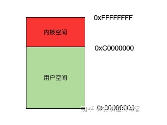
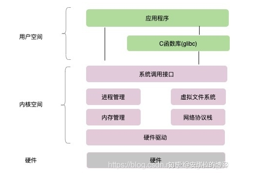

#### 内核空间和用户空间

我们知道操作系统采用的是虚拟地址空间，以32位操作系统举例，它的寻址空间为4G(2的32次方)，这里解释二个概念:

1. 寻址: 是指操作系统能找到的地址范围，32位指的是地址总线的位数，你就想象32位的二进制数，每一位可以是0，可以是1，是不是有2的32次方种可能，2^32次方就是可以访问到的最大内存空间，也就是4G。
2. 虚拟地址空间：为什么叫虚拟，因为我们内存一共就4G，但操作系统为每一个进程都分配了4G的内存空间，这个内存空间实际是虚拟的，虚拟内存到真实内存有个映射关系。例如X86 cpu采用的段页式地址映射模型。

**操作系统**将这4G可访问的**内存空间分为二部分**，一部分是**内核空间**，一部分是**用户空间**。

内核空间是操作系统内核访问的区域，独立于普通的应用程序，是受保护的内存空间。

用户空间是普通应用程序可访问的内存区域。

以linux操作系统为例，将最高的1G字节（从虚拟地址0xC0000000到0xFFFFFFFF），供内核使用，称为内核空间，而将较低的3G字节（从虚拟地址0x00000000到0xBFFFFFFF），供各个进程使用，称为用户空间。空间分配如下图所示：

每个**进程可以通过系统调用进入内核**，因此，Linux内核由系统内的所有进程共享。于是，从具体进程的角度来看，每个进程可以拥有4G字节的虚拟空间。

#### 区分内核空间和用户空间原因

其实早期操作系统是不区分内核空间和用户空间的，但是应用程序能访问任意内存空间，如果程序不稳定常常把系统搞崩溃，比如清除操作系统的内存数据。

后来觉得让应用程序随便访问内存太危险了，就**按照CPU 指令的重要程度对指令进行了分级**，指令分为四个级别**Ring0~Ring3** (和电影分级有点像)，linux 只使用了 Ring0 和 Ring3 两个运行级别，进程运行在 **Ring3 级别时运行在用户态**，**指令只访问用户空间**，而运行在**Ring0 级别时运行在内核态**，可以**访问任意内存空间**。

用户态的程序不能随意操作内核地址空间，这样对操作系统具有一定的**安全保护作用**。

#### 内核态和用户态

其实很清晰：**当进程/线程运行在内核空间时就处于内核态，而进程/线程运行在用户空间时则处于用户态。**

在内核态下，进程运行在内核地址空间中，此时 CPU 可以执行任何指令。运行的代码也不受任何的限制，可以自由地访问任何有效地址，也可以直接进行端口的访问。

在用户态下，进程运行在用户地址空间中，被执行的代码要受到 CPU 的很多检查，比如：进程只能访问映射其地址空间的页表项中规定的在用户态下可访问页面的虚拟地址。

我们来看下linux系统的整体结构：

#### 用户态到内核态的切换

如上图所示，所有系统资源的管理都是在内存空间进行的，也就是在内核态去做的，那我们应用程序需要访问磁盘，读取网卡的数据，新建一个线程都需要通过系统调用接口，完成从用户态到内存态的切换。

比如我们 Java 中需要新建一个线程，`new Thread( Runnable ...)` 之后调用 `start()` 方法时, 看Hotspot Linux 的JVM 源码实现，最终是调`pthread_create` 系统方法来创建的线程，这里会从用户态切换到内核态完成系统资源的分配，线程的创建。

**当一个任务（进程）执行系统调用而陷入内核代码中执行时，称进程处于内核运行态（内核态）**

除了系统调用可以实现用户态到内核态的切换，还有别的方式吗？ 有，软中断和硬中断。

软中断是指进程发生了异常事件；硬中断就有很多种，例如时钟周期、IO等。