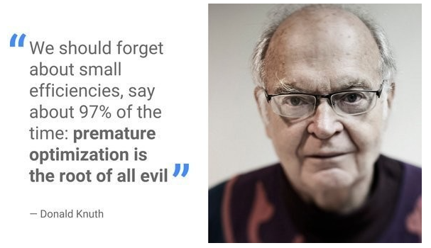

就像我小时候穿的衣服，我妈总给我买大一号的，可我的生长速度没那么快，每次都是穿烂了都还大。现在轮到我女儿了，姥姥奶奶再给买衣服，我都是让她们直接买正好的就行。

我在研究生阶段接手一个师兄的项目，做一个通过WIFI连接网络，然后用传感器定位起重机位置。用Java开发的，里面用了一大堆的设计模式，有10万行代码。当时还和导师聊，感觉完全没必要。

后来我2007年入职百度。刚入职就接手了一个模块，是做百度知道的问题排序的，一个三万多行的模块。我发现里面用了各种排序算法，堆排序、快速排序、插入排序、归并排序，反正排序那章的方法全部都用了。我后来测试后，发现对于几十个元素的情况，插入排序性价比最高，数据量大的再考虑其他排序方法。前段时间我还和他开玩笑说过这个事情，我说你这就是为了练习排序算法吗。

这种复杂设计会给模块埋雷，追查问题的时候不好查。我接手的时候，发现这个模块性能不行，qps达到100时，就狂耗CPU，上不去了。后来花了好几天都没查出问题来，花了大量时间测试网络交互情况及排序逻辑，当时我的mentor给我的意见是怀疑排序耗了大量CPU。结果在我都要放弃的时候，发现是每次初始化一个请求时，memset一个10MB的数组，直接废了。我把那行初始化改掉之后，直接变成了qps达到1300。当时刚入职，还被总监群发到部门里让大家检查有没有类似的问题。

刚入职的时候，我们被要求在设计上考虑扩展性，后来发现做的许多抽象，到模块下线都没用上。后来就干脆不过度考虑了，互联网迭代太快，有时候功能本身都大变样了。

当时内部的过度设计有两个结果：**一些设计根本不可能用上**，另一些等到**用上的时候，发现当初设计的时候考虑不全，还不能用**，正所谓半吊子。

不要预测未来，能满足现在的需求并且**做好应对未来变化的准备就够了**。刚开始学习编程的时候也是力求设计完美后再开工，后来发现非常痛苦，过于复杂的设计带来了高额的成本，实际上却很难用到。最近看一本介绍Ruby语言OOP的书，提到一个概念：“不要预测未来”，深以为然。

以上来自知乎回答https://www.zhihu.com/question/24282796/answer/139789668

在软件工程领域，有个词叫做**「过早优化」**。指的是写代码的过程中，还没完成功能，就开始搞优化，例如写到一半，就去想刚才那个函数换个写法是不是效率更高或者兼容性更好。

举个具体的例子。例如某个老板看到旅行青蛙游戏的小游戏很火，想开发个旅行猫咪的小游戏，找来一个做过大型游戏的程序员进行开发。这位程序员可能一拿到策划方案，就开始规划各种资源管理器，配置管理器等等，开始计划扩容等等，以「兼容」后面一些意想不到的功能，防止因为没设计好架构，后面大幅度改动。但事实上，等这个程序员做好这些配置，这类游戏的热度早已过去。即使热度还在，做出来的游戏可能臃肿，比起其他同类游戏毫无优势。

著名的计算机科学家，经典巨著《计算机程序设计的艺术》的作者Donald Knuth说过一句话：**「过早优化是万恶之源」**（Premature optimization is the root of all evil)

但**我们说不要过早优化，并不是从不优化，而是让优化伴随整个软件生命周期**；在软件领域，又有一个词，叫做**「屎山」**，指的是代码因为长期缺乏维护和优化，变得难以阅读，难以修改，甚至稍微一改动就会奔溃。人生也是这样，长期缺乏规划，也会让我们人生变成「屎山」。例如有的人每天得过且过，陷入职场困境；或者从不管理花销，从而陷入财务困境。

**换到人生来说，不是说不做任何计划，而是不要做那种大而全的计划。**你可以有很远大的理想，但你不能规划好每一步再行动，你需要的是，迅速制定最小可行计划，马上行动，根据遇到的情况去调整计划，毕竟「绝知此事要躬行」。就好像你开车去某个地方，你并无法通过计划方向盘怎么摆动来到达那个地方，你只能根据实际路况操纵方向盘。

在《精益创业》一书中，有一个词叫做MVP（Minimum Viable Product,最小化可行产品）。通过低成本试验，找到合适的路。如果我们的人生是一场或多场创业，那么我们也可以通过找到MVP，来打磨产品——更好的自己。例如通过无器械健身，确定自己热爱运动，再去办健身卡；通过在电脑机房写代码，确定自己热爱编程，再去配自己的工作站；通过去不同类型的公司实习，确定自己热爱的工作，再去择业。

记住，过早优化是万恶之源，无论是编程，还是人生。

以上来自知乎专栏https://zhuanlan.zhihu.com/p/392433573

Bob大叔在《代码整洁之道：程序员的职业修养》书中说过，为了保证代码结构的灵活性、扩展性，我们应该时常对代码进行`无情重构`，尽可能避免代码僵化从而无法维护与扩展。