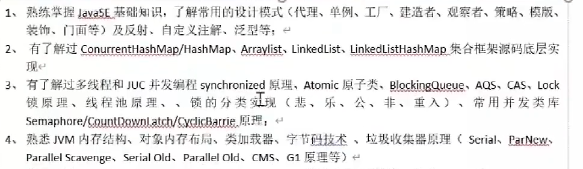
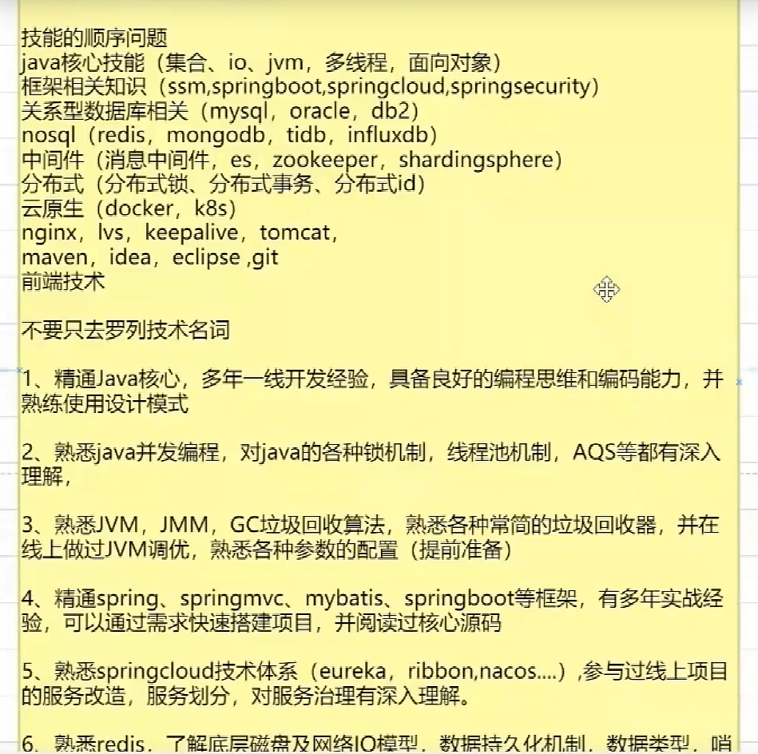
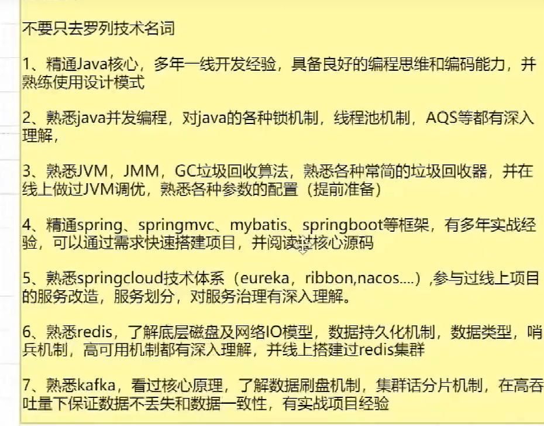
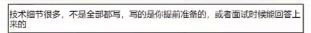

比如：
1. 精通JVM的原理,调优过公司的JVM程序并制定了模板。
2. 精通volatile硬件级别的原理,CAS和synchronized底层原理,及并发下的AQS原理。
3. 熟练使用SpringCloud，Dubbo等框架。
4. 深入理解Zookeeper、Redis分布式锁原理。
5. 精通RocketMQ高可用架构,并在实际项目中结合可靠消息最终一致性方案解决消息丢失、消息重复消费问题。
6. 精通MySQL sql查询和更新底层原理，事务MVCC机制，并能通过explain对sql进行调优。
7. 优化过kettle数据同步工具异常关闭的问题，定位及解决OOM内存溢出问题

### 深入理解Java虚拟机：JVM高级特性与最佳实践（第3版）周志明

### JAVA核心技术精讲

### Mysql数据库实战及高并发架构

### Redis原理（暂无找到教材）

### 计算机网络原理（教材/面试题）

### RPC原理及实战（极客）

### kafka、Rocktmq（极客）

### Spring/Spring boot（面试题）

### 学东西，一定要分层次学习，一定一定要先抓主脉络，不要先揪细节