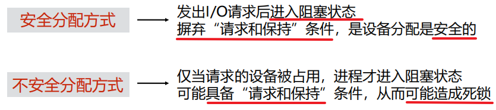
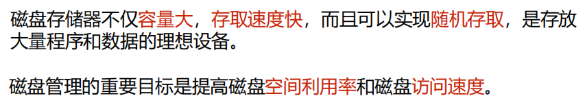

[toc]

## I/O设备管理

I/O设备即输入/输出设备，是用于计算机系统与人通信或与其他机器通信的所有设备，以及所有外存设备

### 1. I/O系统的组成

I/O系统不仅包括各种I/O设备，还包括与设备相连的设备控制器，有些系统还配备了专门用于输入/输出控制的专用计算机，即通道。此外，I/O系统要通过总线与CPU、内存相连。

#### 1.1 I/O系统的结构

##### 微机I/O系统（总线型I/O系统）

在DMA出现以前，必须通过CPU申请总线权限后才能访问内存。

##### 主机I/O系统

#### 1.2 I/O设备的分类

#### 1.3 设备控制器

##### 简介

控制器是可编址的设备，因为CPU是根据地址去访问资源的，所以发送的就是一个设备的地址。

##### 功能

控制器是可编址的设备，因为CPU是根据地址去访问资源的，所以发送的就是一个设备的地址。

##### 组成

#### 1.4 I/O通道

##### 简介

​			

### 2. I/O控制方式

I/O控制方式的发展，经历了以下四种方式。

#### 2.1 轮询控制

#### 2.2 中断控制

##### 原理

#### 2.3 DMA控制（直接存储控制）

在DMA出现以前，必须通过CPU申请总线权限后才能访问内存。现在外围设备可以通过  DMA技术  来访问内存。

##### DMA控制器结构

##### DMA控制器中的寄存器

为了实现主机与设备控制器之间成块数据的传送，在DMA控制器中设计了4类寄存器：

##### DMA工作原理

### 3. 缓冲管理

#### 3.1 缓冲区

缓冲区是用来 保存 **两个设备之间** 或 **设备与应用程序之间** 传输 数据的内存区域

由于 **CPU** 的速度**远远高于I/O设备**，为了 **尽可能使CPU与设备并行工作**，**提高系统的性能**，通常需要操作系统在设备管理软件中提供缓冲区管理功能

#### 3.2 引入缓冲的原因

**在数据到达速率与数据离去速率不同的地方，都可以引入缓冲区**

- 处理数据流的 生产者与消费者之间的速度差异
- 协调传输 数据大小不一致 的设备

#### 3.3 引入缓冲的主要作用

引入缓冲区除了可以  缓和CPU与I/O设备之间速度不匹配  的矛盾，还能 提高CPU和I/O设备之间的并行性。

#### 3.4 缓冲池

#### 3.5 单缓冲

#### 3.6 双缓冲（缓冲交换）

#### 3.7 循环缓冲

**在数据到达和数据离去的速度差别很大的情况下，需要增加缓冲区的数量**

##### 工作原理

### 4. 设备分配

#### 4.1 支持设备分配的数据结构

##### 设备控制表DCT

##### 控制器控制表COCT

##### 通道控制表CHCT

##### 系统设备表SDT

#### 4.2 设备分配的因素

##### 设备固有属性

独占性、共享性、可虚拟性

##### 分配算法

##### 分配方式

#### 4.3 设备独立性

##### 含义

##### 设备独立性的好处

##### 提供设备独立性的功能

##### 独立设备分配

- 分配设备
- 分配控制器
- 分配通道

#### 4.4 SPOOLing技术

##### 含义

##### 组成

##### 利用SPOOLing技术实现共享打印机

##### 特点

### 5. I/O软件原理（管理设备的软件）

##### 用户层I/O软件的功能

- 实现I/O设备的独立性
- 错误处理
- 异步传输
- 缓冲管理
- 设备的分配和释放
- 实现I/O控制方式

##### 与设备无关的I/O软件的功能

- 设备命名
- 设备保护
- 提供独立于设备的块大小
- 为块设备和字符设备提供必要的缓冲技术
- 块设备的存储分配
- 分配和释放独立设备
- 错误处理

##### 设备驱动程序

##### 中断处理程序

I/O中断处理程序的作用是 将发出I/O请求而被阻塞的进程唤醒。

### 6. 磁盘管理

#### 6.1结构

##### 磁盘类型

##### 磁盘访问时间

#### 6.2 调度算法

磁盘调度的一个重要目标是  **使磁盘的平均寻道时间最少**。

##### 先来先服务FCFS

​		

##### 最短寻道时间优先SSTF

​		

##### 扫描算法SCAN（电梯调度算法）

​		

##### 循环扫描算法CSCAN

​		

##### NStepSCAN和FSCAN算法

​		

##### FCFS和SSTF习题

​	

##### SCAN和CSCAN习题

#### 6.3 提高磁盘I/O速度的方法

​	