[toc]

## 一、什么是操作系统

操作系统（Operating System, OS）是一种复杂的系统软件，是不同程序代码、数据结构、数据初始化文件的集合，可执行。

### 1. 操作系统的功能概览

##### 1.1 承上启下的接口

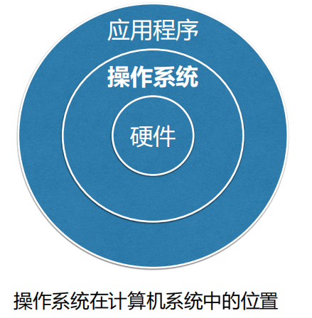

操作系统屏蔽了对硬件操作的细节，提供了计算机**用户与计算机硬件之间的接口**，并且通过这个接口使**应用程序**的开发变的简单、高效

- 命令接口
- 图形用户接口
- 程序接口

**承上启下的作用**：操作系统与硬件交互，并以接口形式提供给外部调用，为应用程序提供可执行的环境

##### 1.2 资源管理

- 进程管理

- 内存管理

- 设备管理

- 文件管理

## 二、操作系统发展

#### 1. 单道批处理系统

由单道批处理系统可知，程序作业需要运行**必须先加载到内存，然后再由CPU调度执行**

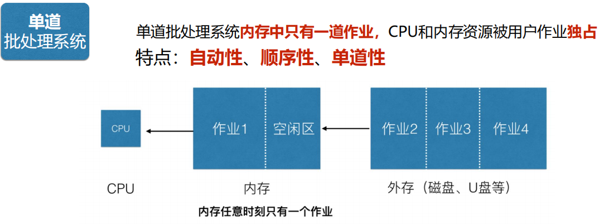

- 优点：减少等待人工操作时间
- 缺点：CPU利用率低下

#### 2. 多道程序系统

提高CPU利用率，其中分时操作系统具有交互性

##### 2.1 多道批处理系统

由操作系统的作业调度程序**按一定策略**从后备作业队列中**选择**若干个**作业调入内存**，使它们**共享CPU和系统中的各种资源**。

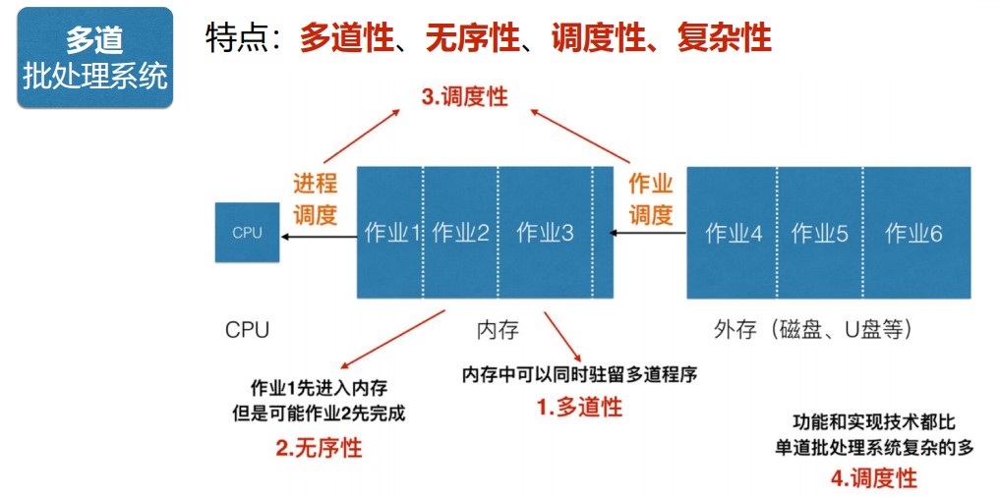

- 优点：提高CPU、内存利用率，提供系统吞吐量
- 缺点：缺乏交互能力、系统平均运行时间长

##### 2.2 分时操作系统

允许**多个用户**通过终端机同时**使用计算机**，每个用户通过终端与主机**交互时都能得到快速响应**。

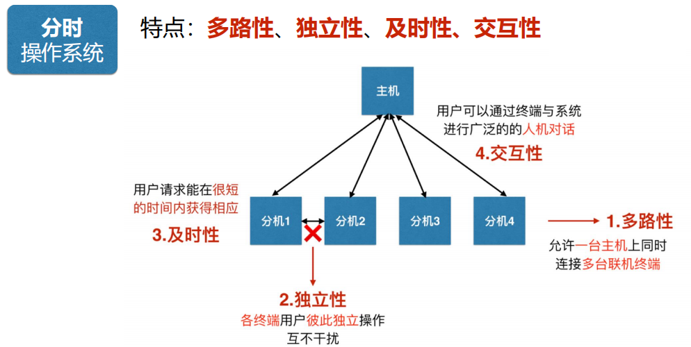

- 优点：提供了人机交互的方便性，使多个用户可以通过不同的终端共享主机

#### 3. 实时操作系统

实时系统必须**及时响应外部事件的请求**，**在规定时间内完成对该事件的处理**。主要用于实时控制和实时信息处理领域。

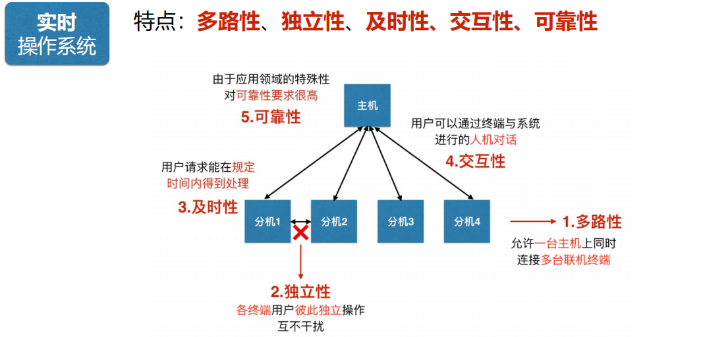

#### 4. 操作系统产品现状

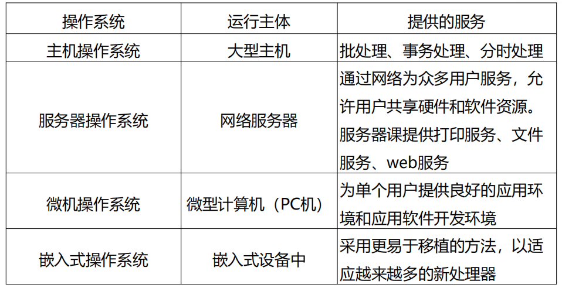

## 三、操作系统特征、功能

### 1. 操作系统特征

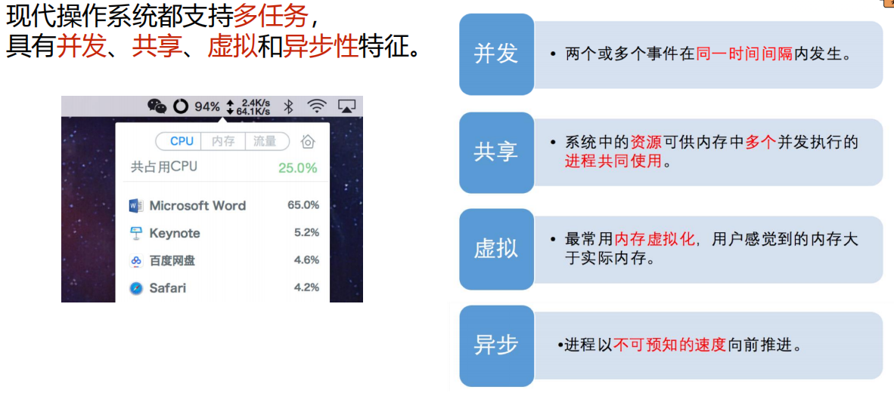

现代操作系统都支持多任务处理，并且具有并发、共享、虚拟、异步特征

- **并发：**多个事件在一个时间间隔内发生。区别于并行：多个事件在同一时间点发生
- **共享：**系统的资源可供内存中多个并发执行的程序共享使用。**共享与并发是相互依赖的。**
  - 互斥共享：同一时刻资源只能被一个进程访问
  - 同时共享：同一时刻资源能被多个进程访问
- **虚拟：**内存虚拟，将一个物理实体拆分成多个逻辑体。用户感觉到自己在独占空间
- **异步：**进程已不可预知的速度向前推进

### 2. 操作系统功能综述

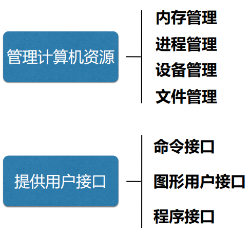

#### 资源管理

##### 1. 内存管理

为多道程序的运行提供良好的环境，提高内存利用率。以及**从逻辑上扩充内存以实现虚拟存储**。分别管理以下内容

- 内存分配

  **前面提到作业被执行，需要先加载进内存，然后被CPU调度执行**。

  任务：所以内存分配就是**为计算机中每个程序分配内存空间的**。支持如下，并且分配方式包含静态和动态。

  - 用于内存分配数据结构。

  - 内存分配功能 。

  - 内存回收功能。

  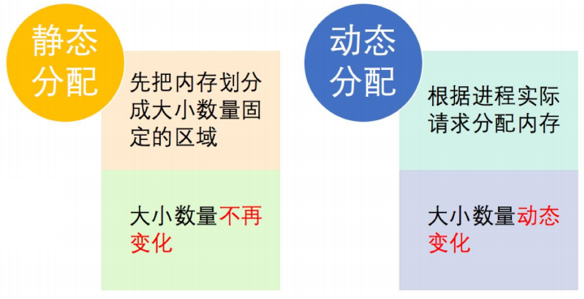

- 内存保护

  **计算机的内存分为两个区域：内核（系统）空间/区、用户空间/区**

  **内核空间保护：**我们都知道操作系统**属于系统软件**，也需要被**加载到内存中**，该内存为操作系统的内核空间。需要保证内核空间**不被随意访问**，以保护操作内核安全。

  **用户空间保护：**保证用户空间中每个用户程序互不干扰

  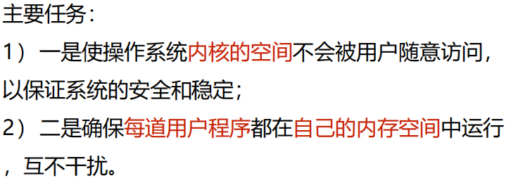

  实现方式：操作系统通过**采用界限寄存器**存放允许程序访问的地址区间的**上限和下限**值，来**防止内存溢出**，来帮助用户空间实现内存保护

  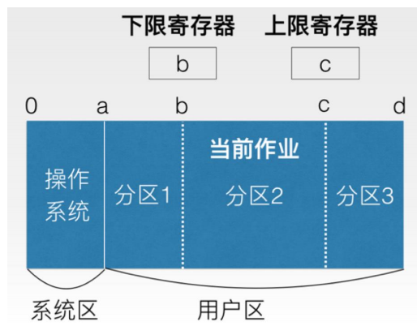

- 地址映射

  CPU 执行程序过程中访问内存时，需要把程序的**逻辑地址转变为物理地址**，这个**转换的过程**称为地址映射。

​	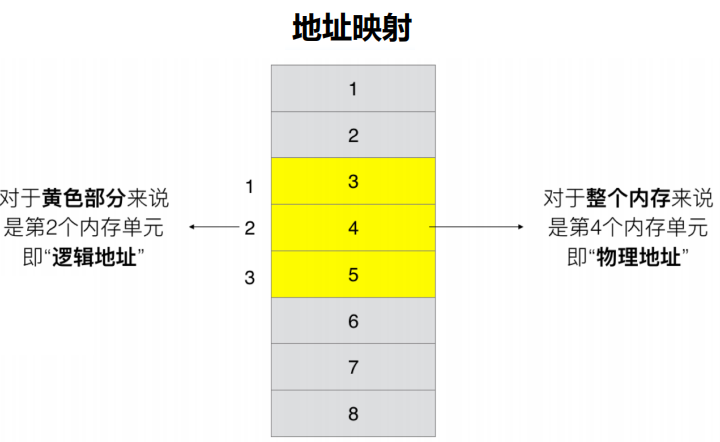

- 内存扩充（PS：憨憨以为就是加内存条。。其实加内存条是物理扩容。。）

  使用**虚拟技术**从**逻辑上扩充内存容量**，使系统能够向用户提供比物理内存大的存储容量。

  虚拟技术分为以下两种实现

  - 请求调入：操作系统允许先加载部分程序到内存并运行，在运行过程中访问的数据未加载进内存，则再从外存调入内存。

    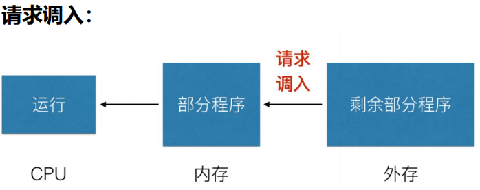

  - 置换功能：**请求调入过程中内存不足时**，则将内存中暂不需要的数据**置换到外存**，然后再重新**调入需要的数据**。

    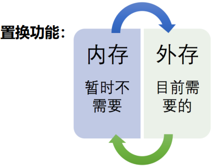

##### 2. 进程管理

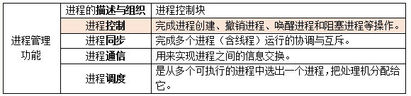

- 进程描述与组织
- 进程控制：创建、唤醒、阻塞、终止
- 进程同步：多个进程的协调与互斥
- 进程通信：进程间的信息交换
- 进程调度：多个可执行的进程中选出一个进程，把CPU分配给它

##### 3. 设备管理

完成用户的**I/O请求**、为用户**分配I/O设备**

- 缓冲管理：CPU、内存、外存、I/O设备速度都有差异，所以I/O设备需要有缓冲
- 设备分配
- 设备处理
- 设备独立性和虚拟设备

##### 4. 文件管理

- 文件存储空间的管理

  为每个文件分配必要的**外存空间**，**提高外存利用率**，并能有助于**提高访问文件的速度**

- 目录管理

  为每个文件建立**目录项**并对众多目录项进行有效组织。目录项包括文件名、文件属性及文件的地址等信息

  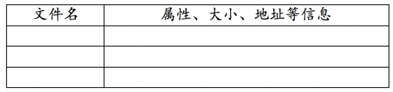

- 文件的读、写管理和存取控制

  根据用户的请求，**从外存中读取数据**或**将数据写入外存**。防止未经审核的用户存取文件，**防止冒名顶替存取文件**，防止以不正确的方式使用文件

#### 提供用户接口

##### 1. 命令接口（提供最终用户）

方便用户与计算机交互

- 联机用户接口（**实时**）：常命令接口由一组**键盘操作命令**和**命令解释程序**组成
- 脱机用户接口（**批处理**）：为批处理作业的用户提供，也称为**批处理用户接口**

##### 2. 图形用户接口（提供最终用户）

用户可以轻松地通过**选择窗口、菜单、对话框、滚动条、图标**等简单的操作来完成对作业和任务的提交与控制

##### 3. 程序接口（系统调用）

向**程序员**提供应用程序与操作系统之间的接口，就是**系统调用**。系统调用是一组预先定义好的模块，它们提供一条管道让应用程序或用户能由此得到核心程序的服务

## 四、操作系统体系结构、指令执行

### 1. 体系结构

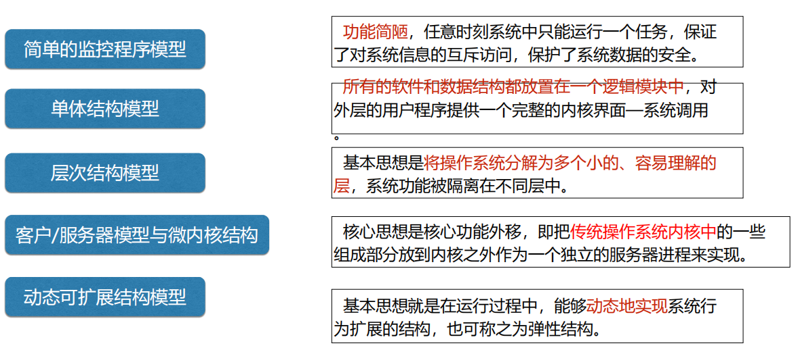

- 简单的监控程序：FMS和IB-SYS。

- 单体结构：UNIX系统、MS-DOS、Linux、Mac OS X和BSD等系统

- 分层结构：THE系统

- 微内核结构：除去文件系统、网络和驱动程序，保留CPU调度、存储管理和消息通信。windows NT、COS-IX V2.3、Vxworks

  微内核设计有一个严重的**缺点就是效率不高**：微内核采用消息传递机制来实现组件间的通信，**消息收发的代价远比传统操作系统直接使用系统调用要大**，因为任何消息传递潜在地都有可能跨越机器边界，那么参数就需要被复制而不是从发送者的堆栈进行引用。

- 动态可扩展结构：Exokernel 和 VINO操作系统

除了以上5中结构模型，**DOWNLOAD技术（核心扩展技术）**是当前操作系统扩展性研究的主要方向。

### 2. 指令执行（硬件角度）

**程序是指令的集合**，程序的执行就是按照某种控制流执行指令的过程。

##### 2.1 指令周期

一个单一指令需要处理的周期，划分为**取指周期和执行周期**。

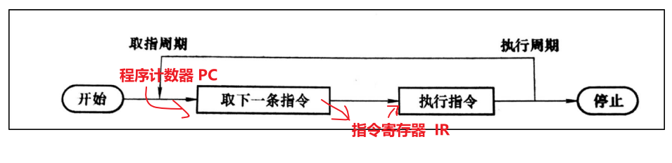

**程序计数器（PC）**保存有下一条要执行的指令的地址，CPU 取到指令后存储到CPU的 **指令寄存器（IR）**中。

在没有其他指示的情况下，CPU 在每次完成取指令操作后总是对 PC 递增，使它位于下一个高端存储器地址的指令（简单理解就是说使 CPU 能够按顺序取得下一条指令）。

##### 2.2 指令的组成

在典型的固定长度指令的 CPU 中，指令包含了能执行的多位二进制，CPU解释指令并执行要求的动作，下面以16位 为例。

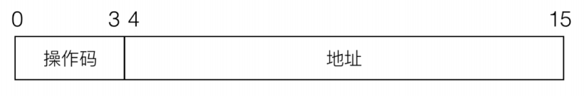

一条16位的指令由两部分组成：操作码、地址码。

- 操作码

  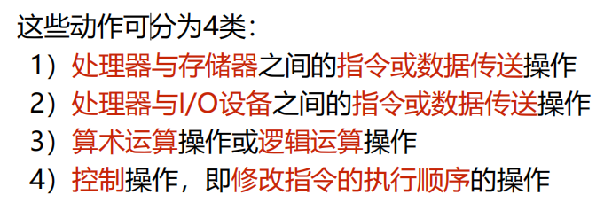

- 地址码

  地址码代表数据地址
