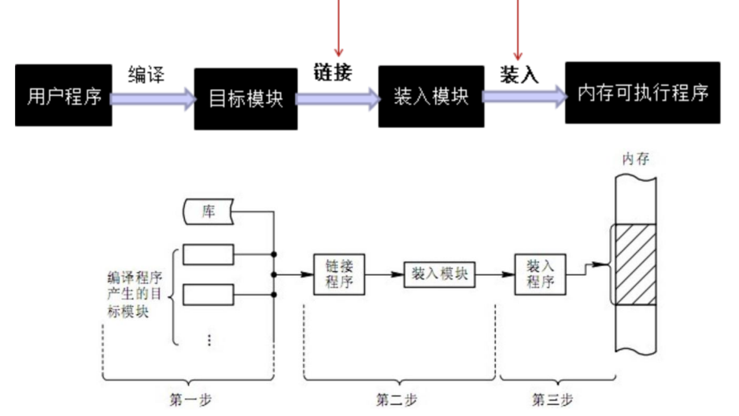

[toc]

## 一、内存管理及存储器层次

内存在计算机存储器中，称之为主存储器。

外存比如磁盘，则称之为本地二级存储器或者辅助存储器。

如下图所示，越靠近金字塔尖存储器越小越快越贵，离CPU越近。

缓存是一种用于硬件数据交换的缓冲区，缓存和寄存器，都是为弥补CPU和内存之间的速度差异而设计的。

内存分为RAM和ROM，其管理的目标，有如下几点：

- 实现内存分配和回收
- 提高**内存空间利用率**和**内存访问速度**

**内存局部性原理**

## 二、程序的编译、链接和装入

高级语言程序必须经过编译、链接才能成为可执行程序，操作系统需要为程序的执行分配内存空间。

### 1. 链接

链接：将编译后的目标模块装配成一个可执行程序。

#### 1.1 静态链接

程序运行前，用链接程序将目标模块链接成一个完整的装入模块。

- 对逻辑地址进行修改
- 变换外部调用符号

静态链接特点

- 程序运行前完成

- 优：运行速度快

- 缺：系统开销大

#### 1.2 动态链接

可将某些目标模块的链接推迟到这些模块中的函数被调用执行时才进行。

动态链接特点

- 程序执行时进行

- 优：节省了空间
- 缺：运行速度略慢

### 2. 装入/加载

- 绝对装入：按照装入模块的物理地址将程序和数据装入内存。

  

- 重定位/地址映射：对目标程序中的指令和数据地址（逻辑地址）的修改过程（转为物理地址）

  

  - 静态重定位：装入时，对目标程序的逻辑地址进行重定位/地址映射到物理地址

  

  - 动态重定位：程序执行时，再通过重定位/地址映射转换为物理地址

## 三、存储管理方式

### 1. 连续分配存储管理方式

什么叫连续分配？

**定义：**分配内存的时候分配一块连续的空间给进程。

#### 1.1 单一连续分配

适用于单道系统

#### 1.2 固定分区分配

划分几个大小不变的分区，且每个分区只能装入一个作业。因为是固定的，所以由上下限寄存器来决定每个分区的大小。

有一个固定分区说明表，来说明各分区的地址、状态

#### 1.3 动态分区分配

根据装入作业的大小，来动态分配内存给作业

空闲分区表，来说明用户空间空闲的地址和大小

**空闲分区链**，来说明用户空间空闲的地址和大小，每个结点都有开始地址和占用空间大小。空闲分区链分配算法如下

当前空闲链如下图，p1先申请大小为30KB，p2再申请大小为20KB。分别适用三种算法来实现内存分配

##### 1.3.1 首次适应算法

每次都链表头开始找，缺点是容易产生空间碎片。

##### 1.3.2 循环首次适应算法

每次都从上次分配的分区的下个分区开始找。优点是空闲区分配均匀，坏处是缺乏大块的空闲区，且容易产生碎片。

##### 1.3.3 最佳适应算法

将分区按空间大小排序，然后按首次适应算法分配分区，优点是可以提高利用率，缺点是容易产生碎片。

##### 1.3.4 分配流程

1. 检索空闲分区链
2. 分配空闲分区（小就直接分，太大就割一块分） 
3. 将分配给进程的分区起始地址，返回给内存分配程序的调用者
4. 修改空闲分区链表

##### 1.3.5 回收流程

1. 释放一块连续的内存空间
2. 如有**相邻的空闲空间**，则**合并**
3. **修改空闲分区链的起始地址和大小**

### 2. 离散分配存储管理方式

#### 2.1 分页存储管理

##### 2.1.1 分页基本概念

逻辑地址不是实际存在的，只是程序的代码行数，理论上应该占据的空间

**页：**将一个进程的**逻辑地址空间**分成若干个大小相等的**片**

**页框：**将**物理内存空间**分成与页大小相同的若干个**存储块**

**分页存储：**将进程中的若干**页**分别装入多个**可以不相邻**的**页框**中

**页内碎片：**进程**最后一页**一般装不满一个页框，形成**页内碎片**

**页表：**实现页号到页框号的映射表，存储在物理内存。分别存储页号，页框号（块号）

###### 页的逻辑地址结构

**计算地址位数：**

逻辑地址的位 = 页的位 + 页内偏移量的位

- 页的位 = log~2~n （n表示有n页）
- 页内偏移量的位 = log~2~m （m表示每个页m字节组成）

物理地址的位 = 块的位 + 块内偏移量的位

- 块的位 = log~2~n （n表示有n个物理块）
- 块内偏移量的位 = 页内偏移量的位

例如：m = 20位 ， n = 12 位。  页数 = 2^20^页 ， 页内大小 = 2^12^ 字节

**计算页号和页内偏移量：**

###### 页地址变换机构

1. 进程执行，将PCB中的页表起始地址和页表长度送CPU的页表寄存器
2. CPU访问某个逻辑单元A 
3. 由分页地址变换硬件自动将A分成 页号和页内偏移两部分
4. 硬件根据页号检索**页表**，得到A所在的页对应的**页框号**
5. 页框号和**页内偏移地址**送物理地址寄存器，计算**物理地址**。

**计算物理地址：**

物理地址=页框大小✖️页框号+页内偏移量

###### 页大小选择

- 页太小，页表过大，占用内存
- 页太大，空间碎片多，空间利用率低

##### 2.1.2 快表 TLB

快表也称 “转换后援缓冲”，用来存放最近被访问过的页表项。是为了提高CPU访存速度而采用的专用缓存。存储在缓冲区（不在内存）

###### 引入快表后的地址变换

1. CPU产生分页的逻辑地址页号和页内偏移地址后，**将页号提交给快表**
2. **查找快表**，如果找到页号，得到该页所对应的页框号；
3. 否则，继续查找**内存页表**，得到页框号
4. 如果查找的页表项不在快表中，访问完内存页表后，把**该页表项写到快表中**

有快表就只访问一次内存，就是直接去访问内存拿物理地址

去内存访问一次页表，拿到块号后，在访问一次内存去拿物理地址

###### TLB性能分析

$有效访存时间 = (T_{访快表} + T_{访内存}) * 命中率 + (T_{访快表} + T_{访内存} * 2) * (1 - 命中率)$

##### 2.1.3 两级页表

将页表再分页，形成两级或多级页表（每个页表分页的大小与内存页框的大小相同），将页表离散地存放在物理内存中。

**页目录表：**为离散存储的页表建立一个`页目录表`，亦称之为`外层页表`，页目录表的表项中存放了每一个页表在物理内存中所在的页框号。的目的是为了能在地址映射时得到页表在物理内存中的地址。

**两级页表寻址**

1. 逻辑地址A 通过分页地址变换机构得到 页目录号P1、页号P2、页内偏移d。
2. 由页表寄存器和P1，找到页表所在的页框号Q1（Q1地址 = 页目录起始地址N + P1 * 页表项长度）
3. 由页表所在页框号Q1，找到页表，由页号P2找到逻辑地址A对应的页框号Q2（Q2地址 = 页表起始地址 + P2 * 页长度）。页表起始地址 = Q1 * 页框大小
4. A物理地址 = 页框号Q2 * 页框大小 + 页内偏移d。

#### 2.2 分段存储管理

在分段存储管理的系统中，程序员使用**二维**的逻辑地址，一个数用来表示**段**，另一个数用来表示**段内偏移**。引入分段机制是主要目的是**易于实现信息共享**。

##### 定义

##### 段的逻辑地址结构

##### 段表

​	

##### 分段系统的地址变换

##### 分页和分段的主要区别

#### 2.3 段页式存储管理

##### 定义

​			

##### 地址变换过程 

## 四、虚拟存储系统

### 1. 优点和特征

虚拟存储器是指具有**请求调入功能**和**置换功能**，能**从逻辑上对内存进行扩充**的一种存储器系统，在OS简介中有介绍过。

#### 1.1 优点

- 提高内存利用率
- 提高程序并发度
- 逻辑地址空间和物理地址空间区分开 - 物理大小与逻辑大小不对应

#### 1.2 特征

- 离散性：实现虚拟存储管理的**基础**

- 多次性

- 对换性

- 虚拟性：实现虚拟存储系统的**最重要目标**

### 2. 请求分页系统

**请求分页系统**是最基本、最常用的虚拟存储系统的实现方式

#### 2.1 硬件支持

特殊的页表、缺页异常机构、支持请求分页的地址变换机构

#### 2.2 页分配策略

#### 2.3 页置换算法

页置换算法是，从内存页中选择换出页的算法。

- ORA：置换掉，未来最久或永远不再被访问的页
- FIFO：按先进先出置换
- LRU：置换掉，过去最久没访问的页
- 简单Clock置换算法：选择最近没有被访问的淘汰
- 改进型Clock算法：选择既没有被访问过又没有被修改过的淘汰
- 最少使用置换算法：选择最近时期内使用次数最少的淘汰

##### FIFO算法

##### LRU算法

##### ORA算法

#### 2.4 请求分页系统的性能

性能通常指，缺页率对有效访问时间的影响。

P为缺页率，有效访问时间 = 0.1 + 24999.9*P，所以有效访问时间 与 缺页率成正比。

引入工作集降低缺页率，提高访问内存效率。含义：某段时间内，进程实际要访问的页的集合。

抖动：进程的大部分时间都用于页的换入换出几乎不能完成任何有效果工作的状态。

## 七、Linux的伙伴系统

