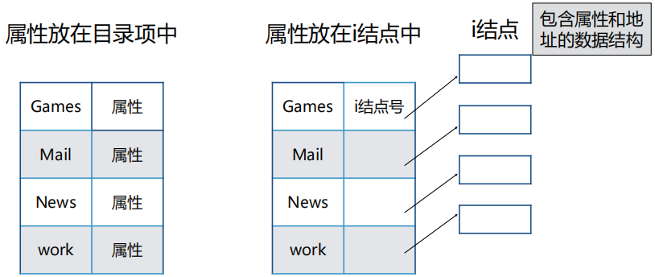
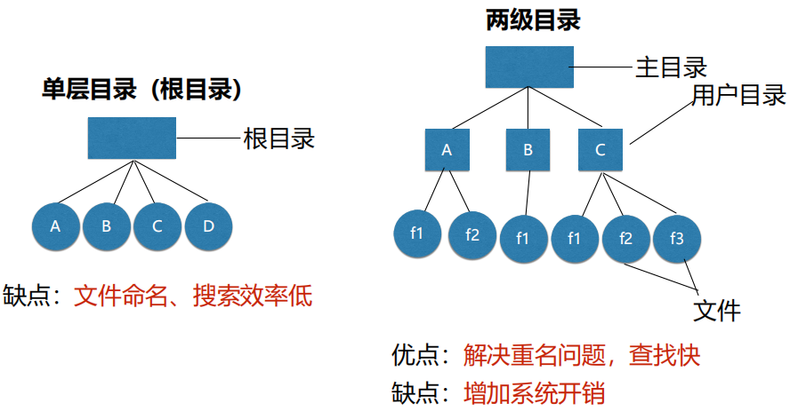
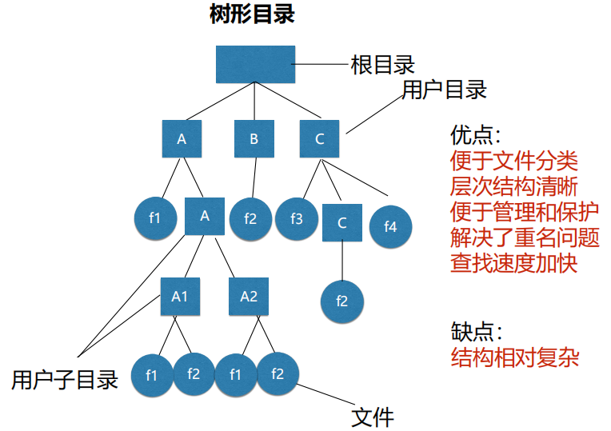

[toc]

## 文件

命名

属性

类型

- 正规文件
  - ASCII
  - 二进制

- 目录文件
- I/O设备文件
- 磁盘块设备文件

结构

- 无结构字节序列（流式文件）

- 固定长度记录序列
- 树形结构（B树）

存取

- 顺序存取
- 随机存取

## 目录

目录是文件系统中实现按名访问的重要数据结构。

目录文件结构：属性放在**目录项**中和放在**i结点**中

目录结构：单层结构、两级结构、树结构

## 实现

磁盘簇  =  磁盘块

### 实现文件

- 连续分配

  - 优点
    - 实现简单：只需记录第一块的地址和文件的块数
    - 顺序读性能好
  - 缺点：空闲的连续簇形成碎片

- 磁盘链接表（链表）

  - 优点：充分利用磁盘空间

  - 缺点：

    - 随机存取相当缓慢，要获得文件的第 n 块，每一次都要从头开始读取前面的 n-1 

      块。

- 内存的链接分配表

  使用内存链接表的分配方式

  - 缺点：磁盘容量很大时，占用内存比较大

- i-结点