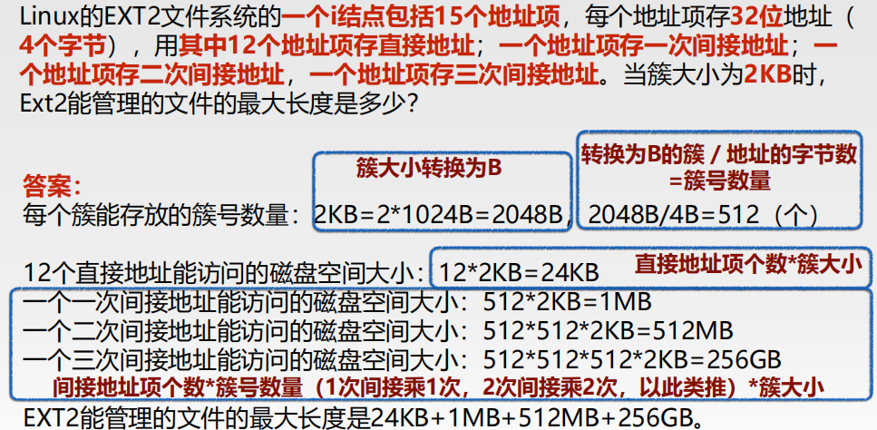

[toc]

## 文件系统

定义：能够为用户提供在计算机系统中对数据信息进行**长期**、大量**存储**和**访问**的功能**文件系统**。包含了文件及管理文件的软件集合

### 1. 文件

文件系统的用户接口包括文件的命名、类型、属性和对文件的操作。

- 命名：所有操作系统都允许用**1～8个字母组成**的字符串。多数操作系统都支持文件名用**圆点隔开**分为两部分，圆点后面的部分称为**文件扩展名**
- 属性：除了文件名和文件数据外，其他与文件相关的信息，如创建日期、文件大小、修改时间等
- 存取
  - 顺序存取：早期，从文件开始处读取信息，不能跳过
  - 随机存取：又称直接存取，可以以任意顺序读取文件信息

#### 1.1 类型

​		

#### 1.2 文件结构

- 无结构字节序列（流式文件）

- 固定长度记录序列

- 树形结构（B树）

#### 1.3 文件操作

​			

### 2. 目录

目录是文件系统中实现按名访问的重要数据结构。

#### 2.1 目录文件结构

目录文件结构分为两种，分别是一下两种：

#### 2.2 目录结构

单层结构、两级结构、树结构

#### 2.3 路径名

采用树形目录时，需要有某种方法指明文件

- **绝对路径名**：从根目录到文件

- **相对路径名**：从当前工作目录到文件

#### 2.4 目录操作

​							

### 3. 文件系统的实现

#### 3.1 实现文件

##### 连续分配

- 优点
  - 实现简单：每个簇只需记录第一块的地址和文件的块数
  - 顺序读性能好
- 缺点：磁盘变得零碎，空闲的连续簇形成“空洞”。

##### 磁盘链接表（链表）

- 优点：充分利用每个簇，不会因为磁盘碎片而浪费空间。
- 缺点：随机存取相当缓慢，要获得文件的第 n 块，每一次都要从链表头开始读取前面的 n-1 块。

##### 内存链接分配表

- 缺点：必须将整个分配表存放在内存，磁盘文件容量很大时，占用内存比较大

##### i-结点

例题1

例题2

#### 3.2 实现目录

#### 3.3 磁盘管理

##### 记录空闲块

​				