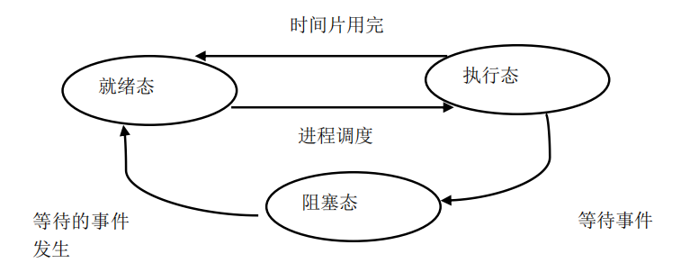

[toc]

## 一. 进程描述

### 1. 程序的执行

#### 1.1 顺序执行

#### 1.2 并发执行

### 2. 进程的概念

进程定义：一个并发执行的程序**在数据集合上的运行过程**

进程的结构：正文段（机器指令）  +  用户数据段（操作系统的用户数据）  +  **进程控制块（PCB）**（运行环境）

### 3. 进程的特征

- 并发性：多个进程实体能**在一段时间间隔内同时运行**，是**进程和现代操作系统的重要特征**
- 动态性：进程是程序的**执行过程** （执行程序—>创建进程、获得CPU—>执行指令、运行中止—>被撤销）
- 异步性：进程的执行时断时续，何时执行、何时暂停都**无法预知**
- 独立性：独立运行和资源**调度的基本单位**（在没有引入线程概念的操作系统中）
- 结构特征：进程实体包括用户**正文段**、**用户数据段** 和 **[进程控制块](#1.5 进程控制块-PCB)** 

### 4. 进程和程序的比较

#### 4.1 区别

#### 4.2 联系

​								

### 5. 进程控制块-PCB

在进程概念中提到，进程的结构特征将进程实体分为 **正文段、用户数据段、进程控制块PCB**。

进程控制块：是**进程实体的一部分**，是操作系统中**最重要的数据结构**。它记录了用于描述进程及控制进程运行所需的全部信息，包含以下四个部分：

- **进程标识符信息**：用于唯一标识一个进程。

- **CPU 状态信息**：包括通用寄存器（即 IR）、指令计数器（即 PC）、**程序状态字PSW**（两种状态） 和用户栈指针（进程栈的指针）。

- **进程调度信息**：**进程状态**信息、进程**优先级**和进程**调度**所需的其他信息。

- **进程控制信息**：程序和数据的地址、**进程同步**和**通信机制**、资源清单，以及链接指针。

### 6. 进程的状态

**进程的三种状态：执行态、就绪态、阻塞态**

### 7. 进程的组织

**进程的组织方式：链接方式、索引方式、进程队列**。

​	

## 二. 进程的控制

**进程的控制：创建、阻塞、唤醒、终止，进程经历的整个生命周期**

### 1. 创建进程

#### 1.1 创建时机

- 用户登陆

- 作业调度（外存调度到内存然后执行作业）

- 提供服务（系统服务）

- 应用请求（打开QQ、微信）

#### 1.2 创建步骤

1. **申请空白 PCB**
2. **为 新进程分配资源**
3. **初始化 PCB（赋值）**
4. **将新进程/PCB插入 就绪队列**

### 2. 阻塞进程

#### 2.1 阻塞时机

- 请求系统服务
- 启动某种操作
- 新数据尚未到达（I/O等待）
- 无新工作可做

#### 2.2 阻塞步骤

1. **将进程的状态改为阻塞态**
2. **将新进程/PCB插入 阻塞队列**
3. **转到进程调度程序，从就绪队列选择进程为其分配 CPU**

### 3. 唤醒进程

#### 3.1 唤醒步骤

1. **将进程从阻塞队列中移出**

2. **将进程状态由阻塞态改为就绪态**

3. **将进程插入就绪队列**

### 4. 终止进程

#### 4.1 终止时机

进程正常执行完毕

#### 4.2 终止步骤

1. **从进程PCB读取进程状态**
2. **若进程正在执行，则终止执行**
3. **释放资源**
4. **将终止进程的PCB从进程队列中移除**

## 三. 操作系统内核

操作系统是一种系统软件，所以操作系统内核是该系统软件的**底层核心的代码**。

操作系统内核：是计算机硬件的第一次扩充，内核执行操作系统**与硬件关系密切**，**执行频率高**的模块，**常驻内存**。

操作系统内核功能：**支撑功能**（中断处理、时钟管理、原语操作）、**资源管理功能**（进程管理、存储管理、设备管理）。

### 1. 支撑功能

#### 1.1 中断

定义：中断是 改变 CPU 执行指令顺序 的一种事件。

出现中断时，计算机停止现在程序的运行，转向对这些中断事件的处理，处理结束后再返回到现行程序的间断处

##### 为什么需要中断呢？

因为操作系统引入中断机制后，CPU可以与其他设备并行工作，能有效提高CPU的利用率，改善系统性能，支持系统的异步操作。

##### 中断分类与原因

中断分为  内部中断  和  外部中断（外部又分：外部可屏蔽中断  和  外部不可屏蔽中断）

##### 中断处理

#### 1.2 时钟管理

定义：时钟是计算机系统的脉搏，计算机的很多活动都是由定时测量来驱动的。

##### 计算机系统中的时钟

- **实时时钟（RTC**）：计算机开机加电后，操作系统通过 BIOS 获取 当前RTC时钟为初始时间。
- **OS时钟**：产生于PC主板上的定时/计数芯片，在开机时有效，由操作系统控制

##### 操作系统的时钟机制

- 保存当前的日期和时间，由时钟硬件支持

  

-  维持定时器（时间间隔）：由时钟驱动程序支持

  

#### 1.3 原语操作

### 2. 资源管理功能

#### 2.1 进程管理

#### 2.2 存储管理

#### 2.3 设备管理

## 四. 进程同步

## 五. 进程通信

## 六. 线程

